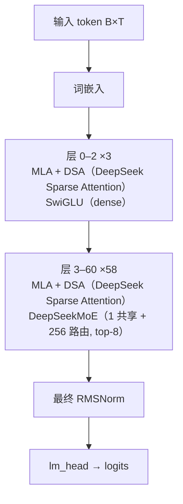

# DeepSeek-V3.2 · 架构说明（逐层）

> DeepSeek-AI · 发布 2025-09 · deepseek-ai/DeepSeek-V3.2-Exp（GitHub README + `inference/model.py` + `inference/config_671B_v3.2.json`）；HF `deepseek-ai/DeepSeek-V3.2-Exp` 与 `hf_transformers/modeling_deepseek_v32.py`；MLA / DeepSeekMoE 底座沿用 `reference/DeepSeek-V3/inference/model.py`

> ⚠️ 实验版本（-Exp）：在 V3.1-Terminus 之上引入 DeepSeek Sparse Attention，主干与 V3 对齐；2025-11 修复了 indexer 中 RoPE 需用非交错布局的实现差异。

**技术定位**：在 V3 主干（61 层、671B/37B、MLA + DeepSeekMoE）上叠加 DeepSeek Sparse Attention (DSA)：一个轻量 lightning indexer（64 头、head_dim 128、index_topk 2048）为每个 query 选出最相关的 top-2048 个 key，只对这些 key 做注意力，把长上下文注意力从 O(n²) 压到 O(n·topk)，效果与 V3.1-Terminus 持平。

## 1. 参数与配置

| 项 | 值 |
|---|---|
| 总参数 | 671B |
| 激活参数 | 37B |
| 层数 | 61 |
| hidden | 7168 |
| Q 头 | 128（主 MLA）+ 64（indexer） |
| KV 头 | 128（MLA latent 512 + rope 64；indexer 另存 FP8 的 k_cache） |
| head_dim | 主 192（128 nope + 64 rope）/ v 128；indexer 128 |
| FFN/MoE 中间维 | dense 18432；MoE 每专家 2048 |
| 词表 | 129280 |
| 上下文 | 131072（128K；DSA 降低长文成本） |
| 权重共享 | False |

**完整配置**：

| 字段 | 值 |
|---|---|
| num_hidden_layers | 61 |
| n_dense_layers | 3（第 0–2 层 dense FFN） |
| hidden_size (dim) | 7168 |
| num_attention_heads | 128 |
| q_lora_rank | 1536 |
| kv_lora_rank | 512 |
| qk_nope_head_dim | 128 |
| qk_rope_head_dim | 64 |
| v_head_dim | 128 |
| intermediate_size | 18432（dense 层） |
| moe_intermediate_size | 2048（每专家） |
| n_routed_experts | 256 |
| n_shared_experts | 1 |
| n_activated_experts (top-k) | 8 |
| n_expert_groups / n_limited_groups | 8 / 4 |
| route_scale | 2.5 |
| score_func | sigmoid |
| index_n_heads | 64 |
| index_head_dim | 128 |
| index_topk | 2048 |
| hidden_act | silu（SwiGLU） |
| rms_norm_eps | 1e-6 |
| rope_theta | 10000 |
| rope_scaling | YaRN，factor 40，original_seq_len 4096 |
| scale_fmt | ue8m0（FP8 缩放因子格式） |
| max_position_embeddings | 131072（128K） |
| num_nextn_predict_layers | 1（HF config；参考实现未实现 MTP） |
| tie_word_embeddings | false |
| vocab_size | 129280 |
| dtype / quantization | fp8 + ue8m0；indexer 打分走 fp8_index 核，Hadamard 旋转后量化 |

## 2. 技术方案与关键创新

**1. DeepSeek Sparse Attention (DSA)**　在 MLA 之外加一个轻量 Indexer：它用自己的一套 q/k（64 头、head_dim 128）给每个 query 打分，选出 top-2048 个最相关的 key，只对这些 key 做注意力。长文下注意力开销从 O(n²) 降为 O(n·topk)，且质量与 V3.1-Terminus 基本一致。

**2. Lightning Indexer + fp8_index**　Indexer 打分：q、k 先做 Hadamard 旋转（rotate_activation，正交变换利于量化），再 act_quant 到 FP8，用 fp8_index 核得到 64 头加权 ReLU 内积打分；k 以 FP8 存进独立的 k_cache，另存 FP8 缩放。

**3. 非交错（non-interleaved）indexer RoPE**　主 MLA 的 RoPE 用交错布局，而 indexer 的 q/k RoPE 必须用非交错布局（按前后半拆分再旋转）。README 记录曾因此有实现差异并已修复（`model.py:405-425,463-470`）。

**4. 融合 RMSNorm + 残差（fused residual）**　Block 把残差与 RMSNorm 融合：RMSNorm.forward 接受 residual 参数，若传入则先做 x+residual 再做归一化并返回新的 residual，减少一次读写。注意力权重用 float32、expert 也做 float 精度提升。

**5. 其余沿用 V3**　MLA ranks（1536/512/128/64/128）、256+1 专家 top-8、前 3 层 dense、aux-loss-free 选择偏置、route_scale 2.5、128K 全部不变；仅缩放因子格式从 e4m3 改为 ue8m0。

## 3. 层级结构（可视化）



## 4. 逐层清单（共 61 层）

| 层 | Attention | FFN/MoE | 说明 |
|---|---|---|---|
| 0 | MLA + DSA（DeepSeek Sparse Attention） | SwiGLU（dense） | 第 0–2 层：dense SwiGLU FFN（n_dense_layers=3），注意力为 MLA + DSA indexer |
| 1 | MLA + DSA（DeepSeek Sparse Attention） | SwiGLU（dense） | 第 0–2 层：dense SwiGLU FFN（n_dense_layers=3），注意力为 MLA + DSA indexer |
| 2 | MLA + DSA（DeepSeek Sparse Attention） | SwiGLU（dense） | 第 0–2 层：dense SwiGLU FFN（n_dense_layers=3），注意力为 MLA + DSA indexer |
| 3 | MLA + DSA（DeepSeek Sparse Attention） | DeepSeekMoE（1 共享 + 256 路由, top-8） | 第 3–60 层：MLA + DSA + DeepSeekMoE（1 共享 + 256 路由，top-8） |
| 4 | MLA + DSA（DeepSeek Sparse Attention） | DeepSeekMoE（1 共享 + 256 路由, top-8） | 第 3–60 层：MLA + DSA + DeepSeekMoE（1 共享 + 256 路由，top-8） |
| 5 | MLA + DSA（DeepSeek Sparse Attention） | DeepSeekMoE（1 共享 + 256 路由, top-8） | 第 3–60 层：MLA + DSA + DeepSeekMoE（1 共享 + 256 路由，top-8） |
| 6 | MLA + DSA（DeepSeek Sparse Attention） | DeepSeekMoE（1 共享 + 256 路由, top-8） | 第 3–60 层：MLA + DSA + DeepSeekMoE（1 共享 + 256 路由，top-8） |
| 7 | MLA + DSA（DeepSeek Sparse Attention） | DeepSeekMoE（1 共享 + 256 路由, top-8） | 第 3–60 层：MLA + DSA + DeepSeekMoE（1 共享 + 256 路由，top-8） |
| 8 | MLA + DSA（DeepSeek Sparse Attention） | DeepSeekMoE（1 共享 + 256 路由, top-8） | 第 3–60 层：MLA + DSA + DeepSeekMoE（1 共享 + 256 路由，top-8） |
| 9 | MLA + DSA（DeepSeek Sparse Attention） | DeepSeekMoE（1 共享 + 256 路由, top-8） | 第 3–60 层：MLA + DSA + DeepSeekMoE（1 共享 + 256 路由，top-8） |
| 10 | MLA + DSA（DeepSeek Sparse Attention） | DeepSeekMoE（1 共享 + 256 路由, top-8） | 第 3–60 层：MLA + DSA + DeepSeekMoE（1 共享 + 256 路由，top-8） |
| 11 | MLA + DSA（DeepSeek Sparse Attention） | DeepSeekMoE（1 共享 + 256 路由, top-8） | 第 3–60 层：MLA + DSA + DeepSeekMoE（1 共享 + 256 路由，top-8） |
| 12 | MLA + DSA（DeepSeek Sparse Attention） | DeepSeekMoE（1 共享 + 256 路由, top-8） | 第 3–60 层：MLA + DSA + DeepSeekMoE（1 共享 + 256 路由，top-8） |
| 13 | MLA + DSA（DeepSeek Sparse Attention） | DeepSeekMoE（1 共享 + 256 路由, top-8） | 第 3–60 层：MLA + DSA + DeepSeekMoE（1 共享 + 256 路由，top-8） |
| 14 | MLA + DSA（DeepSeek Sparse Attention） | DeepSeekMoE（1 共享 + 256 路由, top-8） | 第 3–60 层：MLA + DSA + DeepSeekMoE（1 共享 + 256 路由，top-8） |
| 15 | MLA + DSA（DeepSeek Sparse Attention） | DeepSeekMoE（1 共享 + 256 路由, top-8） | 第 3–60 层：MLA + DSA + DeepSeekMoE（1 共享 + 256 路由，top-8） |
| 16 | MLA + DSA（DeepSeek Sparse Attention） | DeepSeekMoE（1 共享 + 256 路由, top-8） | 第 3–60 层：MLA + DSA + DeepSeekMoE（1 共享 + 256 路由，top-8） |
| 17 | MLA + DSA（DeepSeek Sparse Attention） | DeepSeekMoE（1 共享 + 256 路由, top-8） | 第 3–60 层：MLA + DSA + DeepSeekMoE（1 共享 + 256 路由，top-8） |
| 18 | MLA + DSA（DeepSeek Sparse Attention） | DeepSeekMoE（1 共享 + 256 路由, top-8） | 第 3–60 层：MLA + DSA + DeepSeekMoE（1 共享 + 256 路由，top-8） |
| 19 | MLA + DSA（DeepSeek Sparse Attention） | DeepSeekMoE（1 共享 + 256 路由, top-8） | 第 3–60 层：MLA + DSA + DeepSeekMoE（1 共享 + 256 路由，top-8） |
| 20 | MLA + DSA（DeepSeek Sparse Attention） | DeepSeekMoE（1 共享 + 256 路由, top-8） | 第 3–60 层：MLA + DSA + DeepSeekMoE（1 共享 + 256 路由，top-8） |
| 21 | MLA + DSA（DeepSeek Sparse Attention） | DeepSeekMoE（1 共享 + 256 路由, top-8） | 第 3–60 层：MLA + DSA + DeepSeekMoE（1 共享 + 256 路由，top-8） |
| 22 | MLA + DSA（DeepSeek Sparse Attention） | DeepSeekMoE（1 共享 + 256 路由, top-8） | 第 3–60 层：MLA + DSA + DeepSeekMoE（1 共享 + 256 路由，top-8） |
| 23 | MLA + DSA（DeepSeek Sparse Attention） | DeepSeekMoE（1 共享 + 256 路由, top-8） | 第 3–60 层：MLA + DSA + DeepSeekMoE（1 共享 + 256 路由，top-8） |
| 24 | MLA + DSA（DeepSeek Sparse Attention） | DeepSeekMoE（1 共享 + 256 路由, top-8） | 第 3–60 层：MLA + DSA + DeepSeekMoE（1 共享 + 256 路由，top-8） |
| 25 | MLA + DSA（DeepSeek Sparse Attention） | DeepSeekMoE（1 共享 + 256 路由, top-8） | 第 3–60 层：MLA + DSA + DeepSeekMoE（1 共享 + 256 路由，top-8） |
| 26 | MLA + DSA（DeepSeek Sparse Attention） | DeepSeekMoE（1 共享 + 256 路由, top-8） | 第 3–60 层：MLA + DSA + DeepSeekMoE（1 共享 + 256 路由，top-8） |
| 27 | MLA + DSA（DeepSeek Sparse Attention） | DeepSeekMoE（1 共享 + 256 路由, top-8） | 第 3–60 层：MLA + DSA + DeepSeekMoE（1 共享 + 256 路由，top-8） |
| 28 | MLA + DSA（DeepSeek Sparse Attention） | DeepSeekMoE（1 共享 + 256 路由, top-8） | 第 3–60 层：MLA + DSA + DeepSeekMoE（1 共享 + 256 路由，top-8） |
| 29 | MLA + DSA（DeepSeek Sparse Attention） | DeepSeekMoE（1 共享 + 256 路由, top-8） | 第 3–60 层：MLA + DSA + DeepSeekMoE（1 共享 + 256 路由，top-8） |
| 30 | MLA + DSA（DeepSeek Sparse Attention） | DeepSeekMoE（1 共享 + 256 路由, top-8） | 第 3–60 层：MLA + DSA + DeepSeekMoE（1 共享 + 256 路由，top-8） |
| 31 | MLA + DSA（DeepSeek Sparse Attention） | DeepSeekMoE（1 共享 + 256 路由, top-8） | 第 3–60 层：MLA + DSA + DeepSeekMoE（1 共享 + 256 路由，top-8） |
| 32 | MLA + DSA（DeepSeek Sparse Attention） | DeepSeekMoE（1 共享 + 256 路由, top-8） | 第 3–60 层：MLA + DSA + DeepSeekMoE（1 共享 + 256 路由，top-8） |
| 33 | MLA + DSA（DeepSeek Sparse Attention） | DeepSeekMoE（1 共享 + 256 路由, top-8） | 第 3–60 层：MLA + DSA + DeepSeekMoE（1 共享 + 256 路由，top-8） |
| 34 | MLA + DSA（DeepSeek Sparse Attention） | DeepSeekMoE（1 共享 + 256 路由, top-8） | 第 3–60 层：MLA + DSA + DeepSeekMoE（1 共享 + 256 路由，top-8） |
| 35 | MLA + DSA（DeepSeek Sparse Attention） | DeepSeekMoE（1 共享 + 256 路由, top-8） | 第 3–60 层：MLA + DSA + DeepSeekMoE（1 共享 + 256 路由，top-8） |
| 36 | MLA + DSA（DeepSeek Sparse Attention） | DeepSeekMoE（1 共享 + 256 路由, top-8） | 第 3–60 层：MLA + DSA + DeepSeekMoE（1 共享 + 256 路由，top-8） |
| 37 | MLA + DSA（DeepSeek Sparse Attention） | DeepSeekMoE（1 共享 + 256 路由, top-8） | 第 3–60 层：MLA + DSA + DeepSeekMoE（1 共享 + 256 路由，top-8） |
| 38 | MLA + DSA（DeepSeek Sparse Attention） | DeepSeekMoE（1 共享 + 256 路由, top-8） | 第 3–60 层：MLA + DSA + DeepSeekMoE（1 共享 + 256 路由，top-8） |
| 39 | MLA + DSA（DeepSeek Sparse Attention） | DeepSeekMoE（1 共享 + 256 路由, top-8） | 第 3–60 层：MLA + DSA + DeepSeekMoE（1 共享 + 256 路由，top-8） |
| 40 | MLA + DSA（DeepSeek Sparse Attention） | DeepSeekMoE（1 共享 + 256 路由, top-8） | 第 3–60 层：MLA + DSA + DeepSeekMoE（1 共享 + 256 路由，top-8） |
| 41 | MLA + DSA（DeepSeek Sparse Attention） | DeepSeekMoE（1 共享 + 256 路由, top-8） | 第 3–60 层：MLA + DSA + DeepSeekMoE（1 共享 + 256 路由，top-8） |
| 42 | MLA + DSA（DeepSeek Sparse Attention） | DeepSeekMoE（1 共享 + 256 路由, top-8） | 第 3–60 层：MLA + DSA + DeepSeekMoE（1 共享 + 256 路由，top-8） |
| 43 | MLA + DSA（DeepSeek Sparse Attention） | DeepSeekMoE（1 共享 + 256 路由, top-8） | 第 3–60 层：MLA + DSA + DeepSeekMoE（1 共享 + 256 路由，top-8） |
| 44 | MLA + DSA（DeepSeek Sparse Attention） | DeepSeekMoE（1 共享 + 256 路由, top-8） | 第 3–60 层：MLA + DSA + DeepSeekMoE（1 共享 + 256 路由，top-8） |
| 45 | MLA + DSA（DeepSeek Sparse Attention） | DeepSeekMoE（1 共享 + 256 路由, top-8） | 第 3–60 层：MLA + DSA + DeepSeekMoE（1 共享 + 256 路由，top-8） |
| 46 | MLA + DSA（DeepSeek Sparse Attention） | DeepSeekMoE（1 共享 + 256 路由, top-8） | 第 3–60 层：MLA + DSA + DeepSeekMoE（1 共享 + 256 路由，top-8） |
| 47 | MLA + DSA（DeepSeek Sparse Attention） | DeepSeekMoE（1 共享 + 256 路由, top-8） | 第 3–60 层：MLA + DSA + DeepSeekMoE（1 共享 + 256 路由，top-8） |
| 48 | MLA + DSA（DeepSeek Sparse Attention） | DeepSeekMoE（1 共享 + 256 路由, top-8） | 第 3–60 层：MLA + DSA + DeepSeekMoE（1 共享 + 256 路由，top-8） |
| 49 | MLA + DSA（DeepSeek Sparse Attention） | DeepSeekMoE（1 共享 + 256 路由, top-8） | 第 3–60 层：MLA + DSA + DeepSeekMoE（1 共享 + 256 路由，top-8） |
| 50 | MLA + DSA（DeepSeek Sparse Attention） | DeepSeekMoE（1 共享 + 256 路由, top-8） | 第 3–60 层：MLA + DSA + DeepSeekMoE（1 共享 + 256 路由，top-8） |
| 51 | MLA + DSA（DeepSeek Sparse Attention） | DeepSeekMoE（1 共享 + 256 路由, top-8） | 第 3–60 层：MLA + DSA + DeepSeekMoE（1 共享 + 256 路由，top-8） |
| 52 | MLA + DSA（DeepSeek Sparse Attention） | DeepSeekMoE（1 共享 + 256 路由, top-8） | 第 3–60 层：MLA + DSA + DeepSeekMoE（1 共享 + 256 路由，top-8） |
| 53 | MLA + DSA（DeepSeek Sparse Attention） | DeepSeekMoE（1 共享 + 256 路由, top-8） | 第 3–60 层：MLA + DSA + DeepSeekMoE（1 共享 + 256 路由，top-8） |
| 54 | MLA + DSA（DeepSeek Sparse Attention） | DeepSeekMoE（1 共享 + 256 路由, top-8） | 第 3–60 层：MLA + DSA + DeepSeekMoE（1 共享 + 256 路由，top-8） |
| 55 | MLA + DSA（DeepSeek Sparse Attention） | DeepSeekMoE（1 共享 + 256 路由, top-8） | 第 3–60 层：MLA + DSA + DeepSeekMoE（1 共享 + 256 路由，top-8） |
| 56 | MLA + DSA（DeepSeek Sparse Attention） | DeepSeekMoE（1 共享 + 256 路由, top-8） | 第 3–60 层：MLA + DSA + DeepSeekMoE（1 共享 + 256 路由，top-8） |
| 57 | MLA + DSA（DeepSeek Sparse Attention） | DeepSeekMoE（1 共享 + 256 路由, top-8） | 第 3–60 层：MLA + DSA + DeepSeekMoE（1 共享 + 256 路由，top-8） |
| 58 | MLA + DSA（DeepSeek Sparse Attention） | DeepSeekMoE（1 共享 + 256 路由, top-8） | 第 3–60 层：MLA + DSA + DeepSeekMoE（1 共享 + 256 路由，top-8） |
| 59 | MLA + DSA（DeepSeek Sparse Attention） | DeepSeekMoE（1 共享 + 256 路由, top-8） | 第 3–60 层：MLA + DSA + DeepSeekMoE（1 共享 + 256 路由，top-8） |
| 60 | MLA + DSA（DeepSeek Sparse Attention） | DeepSeekMoE（1 共享 + 256 路由, top-8） | 第 3–60 层：MLA + DSA + DeepSeekMoE（1 共享 + 256 路由，top-8） |

## 5. 关键模块：数学公式与代码

### 注意力 · MLA + DSA（DeepSeek Sparse Attention）

主分支仍是 V3 的 MLA（低秩 Q、KV latent 512 + decoupled rope 64、absorb 推理）。额外挂一个 lightning indexer：q 由 q_lora 残差（qr）经 wq_b 得到（64 头 ×128），k 由 wk 得到并过 LayerNorm；q/k 先做 Hadamard 旋转再 act_quant 到 FP8，用 fp8_index 计算 64 头加权 ReLU 内积，top-2048 作为稀疏掩码，只让主注意力看这些 key。indexer 的 RoPE 为非交错布局。FP8 KV 为部署模拟。

$$
\mathbf{c}_{kv}=\mathrm{RMSNorm}(W_{kva}\mathbf{x})\in\mathbb{R}^{512},\quad \mathbf{k}_{pe}=W_{kr}\mathbf{x}\in\mathbb{R}^{64}
$$

$$
\mathbf{q}^I=W^{I}_{qb}\,\mathbf{q}_r,\quad \mathbf{k}^I=\mathrm{LN}(W^{I}_{k}\mathbf{x}),\quad \tilde{\mathbf{q}}^I=\mathrm{Hadamard}(\mathbf{q}^I),\;\tilde{\mathbf{k}}^I=\mathrm{Hadamard}(\mathbf{k}^I)
$$

$$
\mathbf{I}_t=\mathrm{TopK}_{2048}\Big(\sum_h w_{t,h}\,\mathrm{ReLU}\big(\tilde{\mathbf{q}}^I_{t,h}\cdot(\tilde{\mathbf{k}}^I_s)^{\top}\big)\Big)
$$

$$
\mathrm{attn}(t)=\mathrm{softmax}\!\Big(\frac{[\mathbf{q}_{nope};\mathbf{q}_{pe}]_t\,[\mathbf{k}_{nope};\mathbf{k}_{pe}]^{\top}}{\sqrt{192}}+M+\tilde{M}_t\Big)\mathbf{v},\qquad \tilde{M}_t[j]=0\iff j\in\mathbf{I}_t
$$

```python
# reference/DeepSeek-V3.2-Exp/inference/model.py:435-487（Indexer）
self.wq_b = Linear(self.q_lora_rank, self.n_heads * self.head_dim)  # index q
self.wk = Linear(self.dim, self.head_dim)                           # index k
self.k_norm = LayerNorm(self.head_dim)
self.weights_proj = Linear(self.dim, self.n_heads, dtype=torch.float32)
# forward:
q_pe = apply_rotary_emb(q_pe, freqs_cis, False)   # 非交错
k_pe = apply_rotary_emb(k_pe.unsqueeze(2), freqs_cis, False).squeeze(2)
q, k = rotate_activation(q), rotate_activation(k)  # Hadamard 旋转
q_fp8, q_scale = act_quant(q, block_size, self.scale_fmt)
k_fp8, k_scale = act_quant(k, block_size, self.scale_fmt)
index_score = fp8_index(q_fp8, weights, self.k_cache[:bsz, :end_pos], self.k_scale_cache[:bsz, :end_pos])
topk_indices = index_score.topk(min(self.index_topk, end_pos), dim=-1)[1]
```

### 前馈/MoE · SwiGLU（dense）

第 0–2 层的普通门控前馈（inter_dim=18432）。与 mini-llm-lab 的 SwiGLU 一致；V3.2 的 MLP 前向在 float 精度上做 SiLU 后再回 bf16。

$$
\mathrm{SwiGLU}(\mathbf{x})=W_{down}\big(\mathrm{SiLU}(W_{gate}\mathbf{x})\odot W_{up}\mathbf{x}\big)
$$

```python
# reference/DeepSeek-V3.2-Exp/inference/model.py:620-643
self.w1 = ColumnParallelLinear(dim, inter_dim)
self.w2 = RowParallelLinear(inter_dim, dim, reduce_output=reduce_output)
self.w3 = ColumnParallelLinear(dim, inter_dim)
# forward:
return self.w2((F.silu(self.w1(x).float()) * self.w3(x).float()).type_as(x))
```

### 前馈/MoE · DeepSeekMoE（1 共享 + 256 路由, top-8）

与 V3 相同：sigmoid 打分选 top-8（8 组选 4 组），top-k 归一化后乘 route_scale=2.5，另一个恒激活的共享专家；选择用 noaux_tc 的 float32 偏置，只影响选谁。V3.2 中路由与专家计算在 float 精度上做。

$$
\{e_1,\dots,e_8\}=\mathrm{TopK}_8\big(\mathrm{sigmoid}(W_g\mathbf{x})+\mathbf{b}\big),\quad \tilde{s}_i=\mathrm{sigmoid}(W_g\mathbf{x})_{e_i}
$$

$$
\mathrm{MoE}(\mathbf{x})=\sum_{i=1}^{8}\frac{\tilde{s}_i}{\sum_j\tilde{s}_j}\,\mathrm{Expert}_{e_i}(\mathbf{x})\cdot 2.5\;+\;\mathrm{SharedMLP}(\mathbf{x})
$$

```python
# reference/DeepSeek-V3.2-Exp/inference/model.py:660-709（Gate）, 747-804（MoE）
scores = linear(x.float(), self.weight.float())
scores = scores.sigmoid()
original_scores = scores
if self.bias is not None:
    scores = scores + self.bias
indices = scores.topk(self.topk, dim=-1)[1]
weights = original_scores.gather(1, indices)
weights /= weights.sum(dim=-1, keepdim=True)
weights *= self.route_scale
y += self.shared_experts(x)
```

### 融合 RMSNorm + 残差

RMSNorm.forward 可选传入 residual：传入时先算 x+residual 再归一化，并把新的 residual 一并返回；不传时退化为普通 RMSNorm。这样每层少一次对 hidden 的重复读写。权重以 float32 存储。

$$
\mathrm{RMSNorm}(\mathbf{x})=\frac{\mathbf{x}}{\sqrt{\frac{1}{d}\sum_i x_i^2+\epsilon}}\odot\boldsymbol{\gamma},\qquad \mathbf{r}'=\mathbf{x}+\mathbf{r}
$$

```python
# reference/DeepSeek-V3.2-Exp/inference/model.py:286-306
if residual is None:
    x = x.float(); var = x.pow(2).mean(-1, keepdim=True)
    return (self.weight * x * torch.rsqrt(var + self.eps)).to(dtype)
else:
    x = residual = x.float() + residual.float()
    var = x.pow(2).mean(-1, keepdim=True)
    return (self.weight * x * torch.rsqrt(var + self.eps)).to(dtype), residual.to(dtype)
```

### Hadamard 旋转（rotate_activation）

Indexer 打分前对 q/k 做正交的 Hadamard 变换（scale = 1/√d），使内积在旋转后保持不变，同时把激活分布变得更利于 FP8 量化。依赖 fast_hadamard_transform。

$$
\mathrm{Hadamard}(\mathbf{x})=H_d\,\mathbf{x},\qquad H_d^{\top}H_d=I_d,\qquad \langle H\mathbf{q},H\mathbf{k}\rangle=\langle\mathbf{q},\mathbf{k}\rangle
$$

```python
# reference/DeepSeek-V3.2-Exp/inference/model.py:428-432
def rotate_activation(x: torch.Tensor) -> torch.Tensor:
    assert x.dtype == torch.bfloat16
    from fast_hadamard_transform import hadamard_transform
    hidden_size = x.size(-1)
    return hadamard_transform(x, scale=hidden_size ** -0.5)
```

### fp8_index / FP8 KV（ue8m0 缩放）

Indexer 的 k 以 FP8(e4m3) 存进独立缓存，另存每 block 的缩放；打分调用 fp8_index 核。主 MLA 的 kv 也模拟 FP8 KV：量化后再反量化，再写入 kv_cache。整个权重缩放格式为 ue8m0。

$$
\text{score}_{t,s}=\mathrm{fp8\_index}\big(\mathrm{act\_quant}(\tilde{\mathbf{q}}^I_t),\;\mathrm{act\_quant}(\tilde{\mathbf{k}}^I_s)\big)
$$

```python
# reference/DeepSeek-V3.2-Exp/inference/model.py:474-480,569-571
q_fp8, q_scale = act_quant(q, block_size, self.scale_fmt)
k_fp8, k_scale = act_quant(k, block_size, self.scale_fmt)
self.k_cache[:bsz, start_pos:end_pos] = k_fp8
self.k_scale_cache[:bsz, start_pos:end_pos] = k_scale
index_score = fp8_index(q_fp8.contiguous(), weights, self.k_cache[:bsz, :end_pos].contiguous(), self.k_scale_cache[:bsz, :end_pos].contiguous())
# 主 MLA 的 FP8 KV 模拟
kv_fp8, kv_scale = act_quant(kv, block_size, self.scale_fmt)
kv = (kv_fp8.view(-1, block_size).float() * kv_scale.view(-1, 1)).to(kv.dtype).view_as(kv)
```

### Partial / Decoupled RoPE（主 MLA）

主 MLA 的 RoPE 与 V3 一致：θ=10000，只旋转 64 维 rope 切片，128 维 nope 不旋转；YaRN factor 40 外推。Indexer 分支复用同一 freqs，但以非交错布局应用。

$$
\mathbf{q}_{pe}=\mathrm{RoPE}(\mathbf{q}_{pe};\theta),\qquad \mathbf{k}_{pe}=\mathrm{RoPE}(\mathbf{k}_{pe};\theta),\qquad \theta=10000
$$

```python
# reference/DeepSeek-V3.2-Exp/inference/model.py:563-568
q_nope, q_pe = torch.split(q, [self.qk_nope_head_dim, self.qk_rope_head_dim], dim=-1)
q_pe = apply_rotary_emb(q_pe, freqs_cis)
kv, k_pe = torch.split(kv, [self.kv_lora_rank, self.qk_rope_head_dim], dim=-1)
k_pe = apply_rotary_emb(k_pe.unsqueeze(2), freqs_cis)
```

### MTP（多 token 预测，1 层）— 参考实现未含

与 V3 一致 num_nextn_predict_layers=1；但本地 `inference/model.py` 未实现 MTP，仅 HF config 暴露该字段。

$$
n_{\text{nextn}}=1
$$

## 6. 张量形状流

| 阶段 | 形状 | 说明 |
|---|---|---|
| 输入 token id | `[B, T]` | B=batch, T=序列长（≤128K） |
| 词嵌入 tok_emb | `[B, T, 7168]` |  |
| 层 0–2：MLA + DSA + dense SwiGLU | `[B, T, 7168]` | n_dense_layers=3 |
| 层 3–60：MLA + DSA + DeepSeekMoE(1+256, top-8) | `[B, T, 7168]` | indexer 每 query 选 top-2048 key |
| 最终融合 RMSNorm | `[B, T, 7168]` | 与残差一起归一化 |
| lm_head（不共享，fp32 参数） | `[B, T, 129280]` | 输出 logits |

## 7. 关键源码（引自 reference/）

**DSA Indexer：定义与打分**　`reference/DeepSeek-V3.2-Exp/inference/model.py:435-487`

```python
class Indexer(torch.nn.Module):
    def __init__(self, args: ModelArgs):
        self.n_heads = args.index_n_heads          # 64
        self.head_dim = args.index_head_dim        # 128
        self.index_topk = args.index_topk          # 2048
        self.wq_b = Linear(self.q_lora_rank, self.n_heads * self.head_dim)
        self.wk = Linear(self.dim, self.head_dim)
        self.k_norm = LayerNorm(self.head_dim)
        self.weights_proj = Linear(self.dim, self.n_heads, dtype=torch.float32)
        self.register_buffer("k_cache", torch.zeros(..., self.head_dim, dtype=torch.float8_e4m3fn), persistent=False)
        self.register_buffer("k_scale_cache", torch.zeros(..., self.head_dim // block_size, dtype=torch.float32), persistent=False)
    def forward(self, x, qr, start_pos, freqs_cis, mask):
        q = self.wq_b(qr).view(bsz, seqlen, self.n_heads, self.head_dim)
        q_pe, q_nope = torch.split(q, [self.rope_head_dim, self.head_dim - self.rope_head_dim], dim=-1)
        q_pe = apply_rotary_emb(q_pe, freqs_cis, False)   # non-interleaved
        k = self.k_norm(self.wk(x))
        k_pe, k_nope = torch.split(k, [self.rope_head_dim, self.head_dim - self.rope_head_dim], dim=-1)
        k_pe = apply_rotary_emb(k_pe.unsqueeze(2), freqs_cis, False).squeeze(2)
        q, k = rotate_activation(q), rotate_activation(k)
        q_fp8, q_scale = act_quant(q, block_size, self.scale_fmt)
        k_fp8, k_scale = act_quant(k, block_size, self.scale_fmt)
        self.k_cache[:bsz, start_pos:end_pos] = k_fp8
        self.k_scale_cache[:bsz, start_pos:end_pos] = k_scale
        weights = self.weights_proj(x.float()) * self.n_heads ** -0.5
        weights = weights.unsqueeze(-1) * q_scale * self.softmax_scale
        index_score = fp8_index(q_fp8.contiguous(), weights, self.k_cache[:bsz, :end_pos].contiguous(), self.k_scale_cache[:bsz, :end_pos].contiguous())
        topk_indices = index_score.topk(min(self.index_topk, end_pos), dim=-1)[1]
        return topk_indices
```

**Hadamard 旋转（rotate_activation）**　`reference/DeepSeek-V3.2-Exp/inference/model.py:428-432`

```python
def rotate_activation(x: torch.Tensor) -> torch.Tensor:
    assert x.dtype == torch.bfloat16
    from fast_hadamard_transform import hadamard_transform
    hidden_size = x.size(-1)
    return hadamard_transform(x, scale=hidden_size ** -0.5)
```

**MLA 前向：indexer 掩码折叠进注意力**　`reference/DeepSeek-V3.2-Exp/inference/model.py:545-608`

```python
qr = self.q_norm(self.wq_a(x))
q = self.wq_b(qr).view(bsz, seqlen, self.n_local_heads, self.qk_head_dim)
q_nope, q_pe = torch.split(q, [self.qk_nope_head_dim, self.qk_rope_head_dim], dim=-1)
q_pe = apply_rotary_emb(q_pe, freqs_cis)
kv = self.wkv_a(x)
kv, k_pe = torch.split(kv, [self.kv_lora_rank, self.qk_rope_head_dim], dim=-1)
kv = self.kv_norm(kv)
k_pe = apply_rotary_emb(k_pe.unsqueeze(2), freqs_cis)
# ... prefill 分支：
topk_indices = self.indexer(x, qr, start_pos, freqs_cis, mask)
index_mask = torch.full((bsz, seqlen, seqlen), float("-inf"), device=x.device).scatter_(-1, topk_indices, 0)
index_mask += mask
scores += index_mask.unsqueeze(2)
scores = scores.softmax(dim=-1)
```

**融合 RMSNorm + 残差**　`reference/DeepSeek-V3.2-Exp/inference/model.py:286-306`

```python
def forward(self, x, residual=None):
    dtype = x.dtype
    if residual is None:
        x = x.float(); var = x.pow(2).mean(-1, keepdim=True)
        x = x * torch.rsqrt(var + self.eps)
        return (self.weight * x).to(dtype)
    else:
        x = residual = x.float() + residual.float()
        var = x.pow(2).mean(-1, keepdim=True)
        x = x * torch.rsqrt(var + self.eps)
        return (self.weight * x).to(dtype), residual.to(dtype)
```

**Block：前置残差 + MLA + MoE**　`reference/DeepSeek-V3.2-Exp/inference/model.py:807-851`

```python
if residual is None:
    x, residual = self.attn_norm(x), x
else:
    x, residual = self.attn_norm(x, residual)
x = self.attn(x, start_pos, freqs_cis, mask)
x, residual = self.ffn_norm(x, residual)
x = self.ffn(x)
return x, residual
```

## 8. 与 mini-llm-lab 的差异

DeepSeek-V3.2 对 mini-llm-lab 的差异，等于 DeepSeek-V3 的全部差异，再加一个『稀疏注意力』维度：

- **注意力：GQA → MLA + DSA**。除了 V3 的 MLA（512 维 latent + 64 维 rope、partial RoPE、YaRN），还多一个 lightning indexer：64 头、head_dim 128，用 Hadamard 旋转 + FP8 的 fp8_index 打分，每 query 只保留 top-2048 个 key。我们连 GQA 的 KV 缓存都按全量存，完全没有稀疏选择。
- **FFN：dense SwiGLU → DeepSeekMoE**（1 共享 + 256 路由、top-8、aux-loss-free 偏置，前 3 层 dense）。
- **残差/归一化**：RMSNorm 与残差融合，省一次读写（我们仍是分离的 `x + f(norm(x))`）。
- **规模/精度**：7168 维 × 61 层、词表 129280、128K，671B / 37B；FP8 ue8m0 + FP8 KV，不共享权重。

一句话：**V3.2 = V3 + DSA 稀疏索引器 —— 主干同源，注意力从 O(n²) 变 O(n·topk)。**

## 9. 3D 可视化

启动可视化网页后，在「架构浏览器」视图选择本模型（id：`deepseek-v3.2`），可三维查看每一层并点开公式/代码：

```powershell
& ".venv\Scripts\python.exe" viz/server.py   # 打开 http://127.0.0.1:7861 → 架构浏览器
```

## 10. 参考资料

- [DeepSeek-V3.2-Exp: Boosting Long-Context Efficiency with DeepSeek Sparse Attention (GitHub)](https://github.com/deepseek-ai/DeepSeek-V3.2-Exp)
- [deepseek-ai/DeepSeek-V3.2-Exp (HF)](https://huggingface.co/deepseek-ai/DeepSeek-V3.2-Exp)
