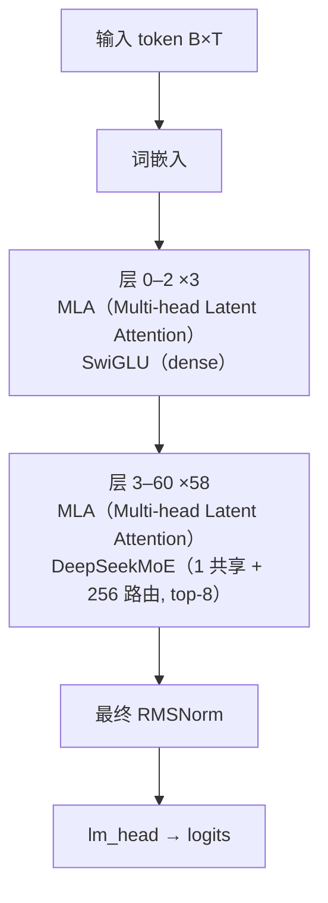

# DeepSeek-V3 · 架构说明（逐层）

> DeepSeek-AI · 发布 2024-12 · deepseek-ai/DeepSeek-V3（GitHub README + `inference/model.py` 参考实现 + `inference/configs/config_671B.json` + `README_WEIGHTS.md`）；HF `deepseek-ai/DeepSeek-V3` 与 `hf_transformers/modeling_deepseek_v3.py`

**技术定位**：671B 总参 / 37B 激活的稀疏 MoE 大模型：61 层，注意力是 MLA（KV 压成 512 维 latent + 64 维 decoupled rope key），FFN 是 DeepSeekMoE（1 共享 + 256 路由专家、每 token 激活 8、前 3 层为 dense），首创 aux-loss-free 无辅助损失负载均衡与 MTP 多 token 预测，FP8 混合精度训练，128K 上下文。

## 1. 参数与配置

| 项 | 值 |
|---|---|
| 总参数 | 671B（+14B MTP 权重） |
| 激活参数 | 37B |
| 层数 | 61 |
| hidden | 7168 |
| Q 头 | 128 |
| KV 头 | 128（MLA：KV 压成 512 维 latent + 64 维 rope key） |
| head_dim | 192（qk = 128 nope + 64 rope）/ v = 128 |
| FFN/MoE 中间维 | dense 18432；MoE 每专家 2048 |
| 词表 | 129280 |
| 上下文 | 131072（128K；YaRN 外推） |
| 权重共享 | False |

**完整配置**：

| 字段 | 值 |
|---|---|
| num_hidden_layers | 61 |
| n_dense_layers | 3（第 0–2 层 dense FFN） |
| hidden_size (dim) | 7168 |
| num_attention_heads | 128 |
| num_key_value_heads | 128（MLA） |
| q_lora_rank | 1536 |
| kv_lora_rank | 512 |
| qk_nope_head_dim | 128 |
| qk_rope_head_dim | 64 |
| v_head_dim | 128 |
| intermediate_size | 18432（dense 层） |
| moe_intermediate_size | 2048（每专家） |
| n_routed_experts | 256 |
| n_shared_experts | 1 |
| n_activated_experts (top-k) | 8 |
| n_expert_groups / n_limited_groups | 8 / 4（分组限制贪心） |
| route_scale | 2.5 |
| score_func | sigmoid（路由打分） |
| topk_method | noaux_tc（aux-loss-free 选择偏置） |
| hidden_act | silu（SwiGLU） |
| rms_norm_eps | 1e-6 |
| rope_theta | 10000 |
| rope_scaling | YaRN，factor 40，original_seq_len 4096 |
| max_position_embeddings | 131072（128K） |
| num_nextn_predict_layers | 1（MTP 模块；HF config 暴露，参考实现未实现） |
| tie_word_embeddings | false |
| vocab_size | 129280 |
| quantization_config | FP8 e4m3，128×128 分块缩放（dynamic 激活量化） |
| dtype | fp8（原生 FP8 训练） |

## 2. 技术方案与关键创新

**1. MLA 多头潜在注意力**　不缓存每头 K/V，而是把 KV 联合低秩压成一个 512 维 latent（c_kv），另加一个 64 维 decoupled rope key（k_pe）。每 token KV 缓存从 128×(192+128) 降到 512+64=576 维（约 71×），再配合低秩 Q（1536）。推理时把 q_nope 吸收进 wkv_b（absorb 写法），pe_cache 只存 64 维。

**2. DeepSeekMoE：256 路由 + 1 共享**　每层 1 个共享专家（所有 token 恒激活）+ 256 个路由专家，每 token 只激活 top-8。路由用 sigmoid 打分，并做分组限制贪心（8 组中先选 4 组）。前 3 层（layer 0–2）仍用 dense SwiGLU。

**3. aux-loss-free 负载均衡**　给每个专家一个 float32 的选择偏置 e_score_correction_bias：它只加在『选 top-k』的打分上，改变选谁；路由权重仍用未加偏置的原始 sigmoid 分数，因此不需要传统辅助损失，避免 aux loss 干扰主任务（`model.py:564,582`）。

**4. MTP 多 token 预测**　额外挂 1 层预测『再下一个 token』（num_nextn_predict_layers=1），用于自推测解码加速，并作为训练目标提升性能。注意：本地 `inference/model.py` 未实现 MTP，MTP 结构仅由 HF config / `README_WEIGHTS.md` 描述。

**5. FP8 混合精度训练**　权重用 FP8(e4m3) + 128×128 分块缩放，激活做 dynamic 量化；配合算法/框架/硬件协同，首次在超大模型上验证 FP8 训练可行。无权重共享（tie_word_embeddings=False）。

## 3. 层级结构（可视化）



## 4. 逐层清单（共 61 层）

| 层 | Attention | FFN/MoE | 说明 |
|---|---|---|---|
| 0 | MLA（Multi-head Latent Attention） | SwiGLU（dense） | 第 0–2 层：dense SwiGLU FFN（n_dense_layers=3），注意力仍为 MLA |
| 1 | MLA（Multi-head Latent Attention） | SwiGLU（dense） | 第 0–2 层：dense SwiGLU FFN（n_dense_layers=3），注意力仍为 MLA |
| 2 | MLA（Multi-head Latent Attention） | SwiGLU（dense） | 第 0–2 层：dense SwiGLU FFN（n_dense_layers=3），注意力仍为 MLA |
| 3 | MLA（Multi-head Latent Attention） | DeepSeekMoE（1 共享 + 256 路由, top-8） | 第 3–60 层：MLA + DeepSeekMoE（1 共享 + 256 路由，top-8，route_scale 2.5） |
| 4 | MLA（Multi-head Latent Attention） | DeepSeekMoE（1 共享 + 256 路由, top-8） | 第 3–60 层：MLA + DeepSeekMoE（1 共享 + 256 路由，top-8，route_scale 2.5） |
| 5 | MLA（Multi-head Latent Attention） | DeepSeekMoE（1 共享 + 256 路由, top-8） | 第 3–60 层：MLA + DeepSeekMoE（1 共享 + 256 路由，top-8，route_scale 2.5） |
| 6 | MLA（Multi-head Latent Attention） | DeepSeekMoE（1 共享 + 256 路由, top-8） | 第 3–60 层：MLA + DeepSeekMoE（1 共享 + 256 路由，top-8，route_scale 2.5） |
| 7 | MLA（Multi-head Latent Attention） | DeepSeekMoE（1 共享 + 256 路由, top-8） | 第 3–60 层：MLA + DeepSeekMoE（1 共享 + 256 路由，top-8，route_scale 2.5） |
| 8 | MLA（Multi-head Latent Attention） | DeepSeekMoE（1 共享 + 256 路由, top-8） | 第 3–60 层：MLA + DeepSeekMoE（1 共享 + 256 路由，top-8，route_scale 2.5） |
| 9 | MLA（Multi-head Latent Attention） | DeepSeekMoE（1 共享 + 256 路由, top-8） | 第 3–60 层：MLA + DeepSeekMoE（1 共享 + 256 路由，top-8，route_scale 2.5） |
| 10 | MLA（Multi-head Latent Attention） | DeepSeekMoE（1 共享 + 256 路由, top-8） | 第 3–60 层：MLA + DeepSeekMoE（1 共享 + 256 路由，top-8，route_scale 2.5） |
| 11 | MLA（Multi-head Latent Attention） | DeepSeekMoE（1 共享 + 256 路由, top-8） | 第 3–60 层：MLA + DeepSeekMoE（1 共享 + 256 路由，top-8，route_scale 2.5） |
| 12 | MLA（Multi-head Latent Attention） | DeepSeekMoE（1 共享 + 256 路由, top-8） | 第 3–60 层：MLA + DeepSeekMoE（1 共享 + 256 路由，top-8，route_scale 2.5） |
| 13 | MLA（Multi-head Latent Attention） | DeepSeekMoE（1 共享 + 256 路由, top-8） | 第 3–60 层：MLA + DeepSeekMoE（1 共享 + 256 路由，top-8，route_scale 2.5） |
| 14 | MLA（Multi-head Latent Attention） | DeepSeekMoE（1 共享 + 256 路由, top-8） | 第 3–60 层：MLA + DeepSeekMoE（1 共享 + 256 路由，top-8，route_scale 2.5） |
| 15 | MLA（Multi-head Latent Attention） | DeepSeekMoE（1 共享 + 256 路由, top-8） | 第 3–60 层：MLA + DeepSeekMoE（1 共享 + 256 路由，top-8，route_scale 2.5） |
| 16 | MLA（Multi-head Latent Attention） | DeepSeekMoE（1 共享 + 256 路由, top-8） | 第 3–60 层：MLA + DeepSeekMoE（1 共享 + 256 路由，top-8，route_scale 2.5） |
| 17 | MLA（Multi-head Latent Attention） | DeepSeekMoE（1 共享 + 256 路由, top-8） | 第 3–60 层：MLA + DeepSeekMoE（1 共享 + 256 路由，top-8，route_scale 2.5） |
| 18 | MLA（Multi-head Latent Attention） | DeepSeekMoE（1 共享 + 256 路由, top-8） | 第 3–60 层：MLA + DeepSeekMoE（1 共享 + 256 路由，top-8，route_scale 2.5） |
| 19 | MLA（Multi-head Latent Attention） | DeepSeekMoE（1 共享 + 256 路由, top-8） | 第 3–60 层：MLA + DeepSeekMoE（1 共享 + 256 路由，top-8，route_scale 2.5） |
| 20 | MLA（Multi-head Latent Attention） | DeepSeekMoE（1 共享 + 256 路由, top-8） | 第 3–60 层：MLA + DeepSeekMoE（1 共享 + 256 路由，top-8，route_scale 2.5） |
| 21 | MLA（Multi-head Latent Attention） | DeepSeekMoE（1 共享 + 256 路由, top-8） | 第 3–60 层：MLA + DeepSeekMoE（1 共享 + 256 路由，top-8，route_scale 2.5） |
| 22 | MLA（Multi-head Latent Attention） | DeepSeekMoE（1 共享 + 256 路由, top-8） | 第 3–60 层：MLA + DeepSeekMoE（1 共享 + 256 路由，top-8，route_scale 2.5） |
| 23 | MLA（Multi-head Latent Attention） | DeepSeekMoE（1 共享 + 256 路由, top-8） | 第 3–60 层：MLA + DeepSeekMoE（1 共享 + 256 路由，top-8，route_scale 2.5） |
| 24 | MLA（Multi-head Latent Attention） | DeepSeekMoE（1 共享 + 256 路由, top-8） | 第 3–60 层：MLA + DeepSeekMoE（1 共享 + 256 路由，top-8，route_scale 2.5） |
| 25 | MLA（Multi-head Latent Attention） | DeepSeekMoE（1 共享 + 256 路由, top-8） | 第 3–60 层：MLA + DeepSeekMoE（1 共享 + 256 路由，top-8，route_scale 2.5） |
| 26 | MLA（Multi-head Latent Attention） | DeepSeekMoE（1 共享 + 256 路由, top-8） | 第 3–60 层：MLA + DeepSeekMoE（1 共享 + 256 路由，top-8，route_scale 2.5） |
| 27 | MLA（Multi-head Latent Attention） | DeepSeekMoE（1 共享 + 256 路由, top-8） | 第 3–60 层：MLA + DeepSeekMoE（1 共享 + 256 路由，top-8，route_scale 2.5） |
| 28 | MLA（Multi-head Latent Attention） | DeepSeekMoE（1 共享 + 256 路由, top-8） | 第 3–60 层：MLA + DeepSeekMoE（1 共享 + 256 路由，top-8，route_scale 2.5） |
| 29 | MLA（Multi-head Latent Attention） | DeepSeekMoE（1 共享 + 256 路由, top-8） | 第 3–60 层：MLA + DeepSeekMoE（1 共享 + 256 路由，top-8，route_scale 2.5） |
| 30 | MLA（Multi-head Latent Attention） | DeepSeekMoE（1 共享 + 256 路由, top-8） | 第 3–60 层：MLA + DeepSeekMoE（1 共享 + 256 路由，top-8，route_scale 2.5） |
| 31 | MLA（Multi-head Latent Attention） | DeepSeekMoE（1 共享 + 256 路由, top-8） | 第 3–60 层：MLA + DeepSeekMoE（1 共享 + 256 路由，top-8，route_scale 2.5） |
| 32 | MLA（Multi-head Latent Attention） | DeepSeekMoE（1 共享 + 256 路由, top-8） | 第 3–60 层：MLA + DeepSeekMoE（1 共享 + 256 路由，top-8，route_scale 2.5） |
| 33 | MLA（Multi-head Latent Attention） | DeepSeekMoE（1 共享 + 256 路由, top-8） | 第 3–60 层：MLA + DeepSeekMoE（1 共享 + 256 路由，top-8，route_scale 2.5） |
| 34 | MLA（Multi-head Latent Attention） | DeepSeekMoE（1 共享 + 256 路由, top-8） | 第 3–60 层：MLA + DeepSeekMoE（1 共享 + 256 路由，top-8，route_scale 2.5） |
| 35 | MLA（Multi-head Latent Attention） | DeepSeekMoE（1 共享 + 256 路由, top-8） | 第 3–60 层：MLA + DeepSeekMoE（1 共享 + 256 路由，top-8，route_scale 2.5） |
| 36 | MLA（Multi-head Latent Attention） | DeepSeekMoE（1 共享 + 256 路由, top-8） | 第 3–60 层：MLA + DeepSeekMoE（1 共享 + 256 路由，top-8，route_scale 2.5） |
| 37 | MLA（Multi-head Latent Attention） | DeepSeekMoE（1 共享 + 256 路由, top-8） | 第 3–60 层：MLA + DeepSeekMoE（1 共享 + 256 路由，top-8，route_scale 2.5） |
| 38 | MLA（Multi-head Latent Attention） | DeepSeekMoE（1 共享 + 256 路由, top-8） | 第 3–60 层：MLA + DeepSeekMoE（1 共享 + 256 路由，top-8，route_scale 2.5） |
| 39 | MLA（Multi-head Latent Attention） | DeepSeekMoE（1 共享 + 256 路由, top-8） | 第 3–60 层：MLA + DeepSeekMoE（1 共享 + 256 路由，top-8，route_scale 2.5） |
| 40 | MLA（Multi-head Latent Attention） | DeepSeekMoE（1 共享 + 256 路由, top-8） | 第 3–60 层：MLA + DeepSeekMoE（1 共享 + 256 路由，top-8，route_scale 2.5） |
| 41 | MLA（Multi-head Latent Attention） | DeepSeekMoE（1 共享 + 256 路由, top-8） | 第 3–60 层：MLA + DeepSeekMoE（1 共享 + 256 路由，top-8，route_scale 2.5） |
| 42 | MLA（Multi-head Latent Attention） | DeepSeekMoE（1 共享 + 256 路由, top-8） | 第 3–60 层：MLA + DeepSeekMoE（1 共享 + 256 路由，top-8，route_scale 2.5） |
| 43 | MLA（Multi-head Latent Attention） | DeepSeekMoE（1 共享 + 256 路由, top-8） | 第 3–60 层：MLA + DeepSeekMoE（1 共享 + 256 路由，top-8，route_scale 2.5） |
| 44 | MLA（Multi-head Latent Attention） | DeepSeekMoE（1 共享 + 256 路由, top-8） | 第 3–60 层：MLA + DeepSeekMoE（1 共享 + 256 路由，top-8，route_scale 2.5） |
| 45 | MLA（Multi-head Latent Attention） | DeepSeekMoE（1 共享 + 256 路由, top-8） | 第 3–60 层：MLA + DeepSeekMoE（1 共享 + 256 路由，top-8，route_scale 2.5） |
| 46 | MLA（Multi-head Latent Attention） | DeepSeekMoE（1 共享 + 256 路由, top-8） | 第 3–60 层：MLA + DeepSeekMoE（1 共享 + 256 路由，top-8，route_scale 2.5） |
| 47 | MLA（Multi-head Latent Attention） | DeepSeekMoE（1 共享 + 256 路由, top-8） | 第 3–60 层：MLA + DeepSeekMoE（1 共享 + 256 路由，top-8，route_scale 2.5） |
| 48 | MLA（Multi-head Latent Attention） | DeepSeekMoE（1 共享 + 256 路由, top-8） | 第 3–60 层：MLA + DeepSeekMoE（1 共享 + 256 路由，top-8，route_scale 2.5） |
| 49 | MLA（Multi-head Latent Attention） | DeepSeekMoE（1 共享 + 256 路由, top-8） | 第 3–60 层：MLA + DeepSeekMoE（1 共享 + 256 路由，top-8，route_scale 2.5） |
| 50 | MLA（Multi-head Latent Attention） | DeepSeekMoE（1 共享 + 256 路由, top-8） | 第 3–60 层：MLA + DeepSeekMoE（1 共享 + 256 路由，top-8，route_scale 2.5） |
| 51 | MLA（Multi-head Latent Attention） | DeepSeekMoE（1 共享 + 256 路由, top-8） | 第 3–60 层：MLA + DeepSeekMoE（1 共享 + 256 路由，top-8，route_scale 2.5） |
| 52 | MLA（Multi-head Latent Attention） | DeepSeekMoE（1 共享 + 256 路由, top-8） | 第 3–60 层：MLA + DeepSeekMoE（1 共享 + 256 路由，top-8，route_scale 2.5） |
| 53 | MLA（Multi-head Latent Attention） | DeepSeekMoE（1 共享 + 256 路由, top-8） | 第 3–60 层：MLA + DeepSeekMoE（1 共享 + 256 路由，top-8，route_scale 2.5） |
| 54 | MLA（Multi-head Latent Attention） | DeepSeekMoE（1 共享 + 256 路由, top-8） | 第 3–60 层：MLA + DeepSeekMoE（1 共享 + 256 路由，top-8，route_scale 2.5） |
| 55 | MLA（Multi-head Latent Attention） | DeepSeekMoE（1 共享 + 256 路由, top-8） | 第 3–60 层：MLA + DeepSeekMoE（1 共享 + 256 路由，top-8，route_scale 2.5） |
| 56 | MLA（Multi-head Latent Attention） | DeepSeekMoE（1 共享 + 256 路由, top-8） | 第 3–60 层：MLA + DeepSeekMoE（1 共享 + 256 路由，top-8，route_scale 2.5） |
| 57 | MLA（Multi-head Latent Attention） | DeepSeekMoE（1 共享 + 256 路由, top-8） | 第 3–60 层：MLA + DeepSeekMoE（1 共享 + 256 路由，top-8，route_scale 2.5） |
| 58 | MLA（Multi-head Latent Attention） | DeepSeekMoE（1 共享 + 256 路由, top-8） | 第 3–60 层：MLA + DeepSeekMoE（1 共享 + 256 路由，top-8，route_scale 2.5） |
| 59 | MLA（Multi-head Latent Attention） | DeepSeekMoE（1 共享 + 256 路由, top-8） | 第 3–60 层：MLA + DeepSeekMoE（1 共享 + 256 路由，top-8，route_scale 2.5） |
| 60 | MLA（Multi-head Latent Attention） | DeepSeekMoE（1 共享 + 256 路由, top-8） | 第 3–60 层：MLA + DeepSeekMoE（1 共享 + 256 路由，top-8，route_scale 2.5） |

## 5. 关键模块：数学公式与代码

### 注意力 · MLA（Multi-head Latent Attention）

低秩 Q 投影 + KV 联合低秩压缩。Q 走 wq_a→q_norm→wq_b；KV 只算 c_kv=wkv_a→kv_norm 与一个 decoupled 的 rope key k_pe，RoPE 只作用在 64 维 rope 切片（partial / decoupled），128 维 nope 不旋转。推理时可把 q_nope 吸收进 wkv_b（absorb 写法），KV 缓存只剩 512+64 维。

$$
\mathbf{c}_q=\mathrm{RMSNorm}\!\big(W_{qa}\mathbf{x}\big),\quad \mathbf{q}=W_{qb}\,\mathbf{c}_q\in\mathbb{R}^{n_h\times(d_{nope}+d_{rope})}
$$

$$
\mathbf{c}_{kv}=\mathrm{RMSNorm}\!\big(W_{kva}\mathbf{x}\big)\in\mathbb{R}^{512},\quad \mathbf{k}_{pe}=W_{kr}\mathbf{x}\in\mathbb{R}^{64}
$$

$$
\mathbf{k}_{nope}=W_{kvb}\,\mathbf{c}_{kv},\quad \mathbf{v}=W_{kvb}\,\mathbf{c}_{kv}
$$

$$
\mathrm{MLA}(\mathbf{x})=\mathrm{softmax}\!\Big(\frac{[\mathbf{q}_{nope};\mathbf{q}_{pe}]\,[\mathbf{k}_{nope};\mathbf{k}_{pe}]^{\top}}{\sqrt{128+64}}+M\Big)\,\mathbf{v}
$$

```python
# reference/DeepSeek-V3/inference/model.py:412-444
self.q_lora_rank = args.q_lora_rank            # 1536
self.kv_lora_rank = args.kv_lora_rank          # 512
self.qk_nope_head_dim = args.qk_nope_head_dim  # 128
self.qk_rope_head_dim = args.qk_rope_head_dim  # 64
self.wq_a = Linear(self.dim, self.q_lora_rank)
self.q_norm = RMSNorm(self.q_lora_rank)
self.wq_b = ColumnParallelLinear(self.q_lora_rank, self.n_heads * self.qk_head_dim)
self.wkv_a = Linear(self.dim, self.kv_lora_rank + self.qk_rope_head_dim)
self.kv_norm = RMSNorm(self.kv_lora_rank)
self.wkv_b = ColumnParallelLinear(self.kv_lora_rank, self.n_heads * (self.qk_nope_head_dim + self.v_head_dim))
# 推理缓存：只存 512 维 latent + 64 维 rope key
self.register_buffer("kv_cache", torch.zeros(..., self.kv_lora_rank), persistent=False)
self.register_buffer("pe_cache", torch.zeros(..., self.qk_rope_head_dim), persistent=False)
```

### 前馈/MoE · SwiGLU（dense）

第 0–2 层的普通门控前馈（inter_dim=18432）。与 mini-llm-lab 的 SwiGLU 一致。

$$
\mathrm{SwiGLU}(\mathbf{x})=W_{down}\big(\mathrm{SiLU}(W_{gate}\mathbf{x})\odot W_{up}\mathbf{x}\big)
$$

```python
# reference/DeepSeek-V3/inference/model.py:500-532
self.w1 = ColumnParallelLinear(dim, inter_dim)
self.w2 = RowParallelLinear(inter_dim, dim)
self.w3 = ColumnParallelLinear(dim, inter_dim)
# forward:
return self.w2(F.silu(self.w1(x)) * self.w3(x))
```

### 前馈/MoE · DeepSeekMoE（1 共享 + 256 路由, top-8）

每 token 用 sigmoid 打分选 top-8 路由专家（先 8 组选 4 组），权重按 top-k 归一化再乘 route_scale=2.5；另有一个对所有 token 恒激活的共享专家（intermediate = 1×2048）。选择用 noaux_tc：加一个 float32 的选择偏置，只改变选谁、不改变权重。

$$
\{e_1,\dots,e_8\}=\mathrm{TopK}_8\big(\mathrm{sigmoid}(W_g\mathbf{x})+\mathbf{b}\big),\quad \tilde{s}_i=\mathrm{sigmoid}(W_g\mathbf{x})_{e_i}
$$

$$
\mathrm{MoE}(\mathbf{x})=\sum_{i=1}^{8}\frac{\tilde{s}_i}{\sum_j\tilde{s}_j}\,\mathrm{Expert}_{e_i}(\mathbf{x})\cdot 2.5\;+\;\mathrm{SharedMLP}(\mathbf{x})
$$

```python
# reference/DeepSeek-V3/inference/model.py:656-693（MoE）
self.gate = Gate(args)
self.experts = nn.ModuleList([Expert(args.dim, args.moe_inter_dim) ... for i in range(self.n_routed_experts)])
self.shared_experts = MLP(args.dim, args.n_shared_experts * args.moe_inter_dim)
# forward:
weights, indices = self.gate(x)
for i in range(self.experts_start_idx, self.experts_end_idx):
    idx, top = torch.where(indices == i)
    y[idx] += expert(x[idx]) * weights[idx, top, None]
z = self.shared_experts(x)
return (y + z).view(shape)
```

### RMSNorm

$$
\mathrm{RMSNorm}(\mathbf{x})=\frac{\mathbf{x}}{\sqrt{\frac{1}{d}\sum_{i=1}^{d}x_i^{2}+\epsilon}}\odot\boldsymbol{\gamma}
$$

```python
# reference/DeepSeek-V3/inference/model.py:270-294
self.attn_norm = RMSNorm(args.dim)
self.ffn_norm = RMSNorm(args.dim)
# F.rms_norm(x, (self.dim,), self.weight, self.eps)
```

### Partial / Decoupled RoPE（θ=10000 + YaRN ×40）

只对 q/k 中 64 维的 rope 切片做旋转，128 维 nope 部分不旋转。原始训练长度 4096，长文用 YaRN（factor 40，beta_fast 32 / beta_slow 1）外推到 128K，并相应放大 softmax scale。

$$
\mathbf{q}_{pe}=\mathrm{RoPE}(\mathbf{q}_{pe};\theta),\qquad \mathbf{k}_{pe}=\mathrm{RoPE}(\mathbf{k}_{pe};\theta),\qquad \theta=10000
$$

$$
\mathrm{RoPE}(x_m,m)=\big(x^{(1)}\cos m\theta_i-x^{(2)}\sin m\theta_i,\; x^{(1)}\sin m\theta_i+x^{(2)}\cos m\theta_i\big)
$$

```python
# reference/DeepSeek-V3/inference/model.py:463-470
q_nope, q_pe = torch.split(q, [self.qk_nope_head_dim, self.qk_rope_head_dim], dim=-1)
q_pe = apply_rotary_emb(q_pe, freqs_cis)
kv, k_pe = torch.split(kv, [self.kv_lora_rank, self.qk_rope_head_dim], dim=-1)
k_pe = apply_rotary_emb(k_pe.unsqueeze(2), freqs_cis)
```

### MoE 路由选择偏置（aux-loss-free）

偏置 b 为 float32，只加在『选 top-k』的打分上，路由权重仍用未加偏置的原始分数，因此不引入辅助损失。V3 的 topk_method=noaux_tc，并按 n_expert_groups=8 / n_limited_groups=4 做分组限制。

$$
e=\mathrm{TopK}_{8}\big(\mathrm{sigmoid}(W_g\mathbf{x})+\mathbf{b}\big),\qquad \mathrm{weight}=\frac{\mathrm{sigmoid}(W_g\mathbf{x})_e}{\sum_{e'}\mathrm{sigmoid}(W_g\mathbf{x})_{e'}}
$$

```python
# reference/DeepSeek-V3/inference/model.py:581-594
original_scores = scores
if self.bias is not None:
    scores = scores + self.bias
indices = torch.topk(scores, self.topk, dim=-1)[1]
weights = original_scores.gather(1, indices)
weights /= weights.sum(dim=-1, keepdim=True)
weights *= self.route_scale
```

### MTP（多 token 预测，1 层）

num_nextn_predict_layers=1：主模型之后追加 1 层（权重里为 layer 61），共享 embed_tokens 与 lm_head，额外有 enorm/hnorm 与 eh_proj。用于自推测解码。注意本地 `inference/model.py` 未实现 MTP，细节出自 `README_WEIGHTS.md`。

$$
n_{\text{nextn}}=1
$$

```python
# reference/DeepSeek-V3/README_WEIGHTS.md:6,33-47
# num_nextn_predict_layers: 1 MTP Module
# MTP 模块共享 embed_tokens / shared_head，含 enorm & hnorm、eh_proj 及一层 Transformer
```

### FP8 分块量化（e4m3，128×128）

权重存 FP8(e4m3)，按 128×128 块配 float32 的 weight_scale_inv；激活做 per-token-per-128-channel 的 dynamic 量化。这是训练/部署的精度方案，不改变计算图结构。

$$
w_{\text{deq}}=\big(w_{\mathrm{fp8}}\odot s_{\text{block}}\big),\qquad \text{block}=128\times128
$$

## 6. 张量形状流

| 阶段 | 形状 | 说明 |
|---|---|---|
| 输入 token id | `[B, T]` | B=batch, T=序列长（≤128K） |
| 词嵌入 tok_emb | `[B, T, 7168]` |  |
| 层 0–2：MLA + dense SwiGLU | `[B, T, 7168]` | n_dense_layers=3 |
| 层 3–60：MLA + DeepSeekMoE(1+256, top-8) | `[B, T, 7168]` | 每层走 1 共享 + 8 路由专家 |
| 最终 RMSNorm | `[B, T, 7168]` |  |
| lm_head（不共享） | `[B, T, 129280]` | 输出 logits |
| MTP 模块（第 61 层） | `[B, T, 129280]` | 共享 embed/head；仅训练/推测解码用 |

## 7. 关键源码（引自 reference/）

**MLA 定义（低秩 Q / KV 压缩）**　`reference/DeepSeek-V3/inference/model.py:412-444`

```python
self.q_lora_rank = args.q_lora_rank            # 1536
self.kv_lora_rank = args.kv_lora_rank          # 512
self.qk_nope_head_dim = args.qk_nope_head_dim  # 128
self.qk_rope_head_dim = args.qk_rope_head_dim  # 64
self.qk_head_dim = args.qk_nope_head_dim + args.qk_rope_head_dim
self.v_head_dim = args.v_head_dim              # 128
self.wq_a = Linear(self.dim, self.q_lora_rank)
self.q_norm = RMSNorm(self.q_lora_rank)
self.wq_b = ColumnParallelLinear(self.q_lora_rank, self.n_heads * self.qk_head_dim)
self.wkv_a = Linear(self.dim, self.kv_lora_rank + self.qk_rope_head_dim)
self.kv_norm = RMSNorm(self.kv_lora_rank)
self.wkv_b = ColumnParallelLinear(self.kv_lora_rank, self.n_heads * (self.qk_nope_head_dim + self.v_head_dim))
self.wo = RowParallelLinear(self.n_heads * self.v_head_dim, self.dim)
self.register_buffer("kv_cache", torch.zeros(args.max_batch_size, args.max_seq_len, self.kv_lora_rank), persistent=False)
self.register_buffer("pe_cache", torch.zeros(args.max_batch_size, args.max_seq_len, self.qk_rope_head_dim), persistent=False)
```

**MLA 前向 + absorb（KV 缓存只剩 latent+rope）**　`reference/DeepSeek-V3/inference/model.py:463-497`

```python
q = self.wq_b(self.q_norm(self.wq_a(x)))
q_nope, q_pe = torch.split(q, [self.qk_nope_head_dim, self.qk_rope_head_dim], dim=-1)
q_pe = apply_rotary_emb(q_pe, freqs_cis)
kv = self.wkv_a(x)
kv, k_pe = torch.split(kv, [self.kv_lora_rank, self.qk_rope_head_dim], dim=-1)
k_pe = apply_rotary_emb(k_pe.unsqueeze(2), freqs_cis)
wkv_b = wkv_b.view(self.n_local_heads, -1, self.kv_lora_rank)
q_nope = torch.einsum("bshd,hdc->bshc", q_nope, wkv_b[:, :self.qk_nope_head_dim])
self.kv_cache[:bsz, start_pos:end_pos] = self.kv_norm(kv)
self.pe_cache[:bsz, start_pos:end_pos] = k_pe.squeeze(2)
scores = (torch.einsum("bshc,btc->bsht", q_nope, self.kv_cache[:bsz, :end_pos]) +
          torch.einsum("bshr,btr->bsht", q_pe, self.pe_cache[:bsz, :end_pos])) * self.softmax_scale
```

**Gate：sigmoid 打分 + aux-loss-free 偏置**　`reference/DeepSeek-V3/inference/model.py:563-598`

```python
self.weight = nn.Parameter(torch.empty(args.n_routed_experts, args.dim))
self.bias = nn.Parameter(torch.empty(args.n_routed_experts, dtype=torch.float32)) if self.dim == 7168 else None
# ...
scores = scores.sigmoid()
original_scores = scores
if self.bias is not None:
    scores = scores + self.bias          # aux-loss-free：只影响选择
indices = torch.topk(scores, self.topk, dim=-1)[1]
weights = original_scores.gather(1, indices)
weights /= weights.sum(dim=-1, keepdim=True)
weights *= self.route_scale
return weights.type_as(x), indices
```

**MoE：共享专家 + 路由专家**　`reference/DeepSeek-V3/inference/model.py:656-693`

```python
self.gate = Gate(args)
self.experts = nn.ModuleList([Expert(args.dim, args.moe_inter_dim) if self.experts_start_idx <= i < self.experts_end_idx else None
                              for i in range(self.n_routed_experts)])
self.shared_experts = MLP(args.dim, args.n_shared_experts * args.moe_inter_dim)
# forward:
weights, indices = self.gate(x)
for i in range(self.experts_start_idx, self.experts_end_idx):
    idx, top = torch.where(indices == i)
    y[idx] += expert(x[idx]) * weights[idx, top, None]
z = self.shared_experts(x)
return (y + z).view(shape)
```

**Block：前 3 层 dense，其余 MoE（注意力始终 MLA）**　`reference/DeepSeek-V3/inference/model.py:706-735`

```python
self.attn = MLA(args)
self.ffn = MLP(args.dim, args.inter_dim) if layer_id < args.n_dense_layers else MoE(args)
self.attn_norm = RMSNorm(args.dim)
self.ffn_norm = RMSNorm(args.dim)
# forward:
x = x + self.attn(self.attn_norm(x), start_pos, freqs_cis, mask)
x = x + self.ffn(self.ffn_norm(x))
return x
```

## 8. 与 mini-llm-lab 的差异

DeepSeek-V3 保留了 mini-llm-lab 的骨架（decoder-only、pre-norm 残差、RMSNorm、SwiGLU、RoPE），但把三个核心部件做了结构性替换：

- **注意力：GQA → MLA**。我们按 `n_kv_head × head_dim` 存 KV；V3 只存 512 维 latent + 64 维 rope key，约省 71× KV 显存；RoPE 从『整段 head_dim 旋转』变成只旋转 64 维的 partial/decoupled 写法，并配 YaRN 外推到 128K。
- **FFN：dense SwiGLU → DeepSeekMoE**。1 共享 + 256 路由、每 token top-8（前 3 层仍 dense），带一个只影响选择、不影响权重的 float32 选择偏置（aux-loss-free）。
- **训练目标 + 精度**：多挂 1 层 MTP 头做多 token 预测/推测解码；用 FP8(e4m3)+128×128 分块训练。
- **规模**：7168 维 × 61 层、词表 129280、上下文 128K，671B 总参 / 37B 激活——比我们的 ~192M 大 3 个数量级；**不共享**输入/输出嵌入（我们共享）。

一句话：**主干同源，V3 = 我们的骨架 + MLA 省 KV + MoE 省参数 + aux-loss-free 路由 + MTP + FP8。**

## 9. 3D 可视化

启动可视化网页后，在「架构浏览器」视图选择本模型（id：`deepseek-v3`），可三维查看每一层并点开公式/代码：

```powershell
& ".venv\Scripts\python.exe" viz/server.py   # 打开 http://127.0.0.1:7861 → 架构浏览器
```

## 10. 参考资料

- [DeepSeek-V3 Technical Report (arXiv:2412.19437)](https://arxiv.org/abs/2412.19437)
- [deepseek-ai/DeepSeek-V3 (GitHub)](https://github.com/deepseek-ai/DeepSeek-V3)
- [deepseek-ai/DeepSeek-V3 (HF)](https://huggingface.co/deepseek-ai/DeepSeek-V3)
