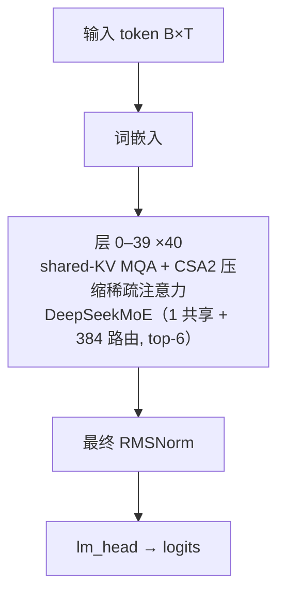

# DeepSeek-V4.1 · 架构说明（逐层）

> DeepSeek-AI · HF `deepseek-ai/DeepSeek-V4.1-Flash`（`hf_config.json` + `hf_README.md`）+ transformers 通用实现 `hf_transformers/modeling_deepseek_v4.py` / `configuration_deepseek_v4.py`；无官方 GitHub 建模仓库，仅 HF 权重 + config + 技术报告

> ⚠️ DeepSeek 官方未发布 V4 / V4.1 的 GitHub 建模仓库；本地 `modeling_deepseek_v4.py` 是 transformers 的**通用 V4** 实现（含 mHC / CSA+HCA / indexer / MoE / hash 路由），但**未实现 V4.1 独有的 CED 编解码拆分、CSA2 三模式（Full/Reindex/Reuse）、分层候选池、Engram、DSpark、DeepSeek-ViT**——这些只见于 HF `hf_config.json` / `hf_README.md`。下文凡 V4.1 专属组件均标注为『配置/README 描述，参考代码未实现』。

**技术定位**：552B 骨架 / 每 token 激活 8B（prefill）–16B（decode）的原生多模态 MoE：采用 Causal Encoder-Decoder（CED，40 层 = 20 encoder + 20 decoder），注意力是 shared-KV MQA（仅 1 个 KV 头、head_dim 512、分组低秩输出）叠加 CSA2 压缩稀疏注意力与分层稀疏索引器，全局 KV 缓存仅约 890 B/token，支持 1M 上下文；另有 mHC 多流残差、Engram 条件记忆、DSpark 推测解码与 DeepSeek-ViT 视觉编码器。

## 1. 参数与配置

| 项 | 值 |
|---|---|
| 总参数 | 552B 骨架（+196B Engram） |
| 激活参数 | 8B（prefill）/ 16B（decode） |
| 层数 | 40（20 encoder + 20 decoder） |
| hidden | 5120 |
| Q 头 | 64（Q）；indexer 32 头 |
| KV 头 | 1（shared-KV MQA，广播到 64 个 Q 头） |
| head_dim | 512（RoPE 只作用于前 64 维） |
| FFN/MoE 中间维 | MoE 每专家 2304（无 dense 层） |
| 词表 | 129280 |
| 上下文 | 1048576（1M；稀疏注意力在 64K 训练后扩到 1M） |
| 权重共享 | False |

**完整配置**：

| 字段 | 值 |
|---|---|
| architectures | DeepseekV41ForCausalLM |
| num_hidden_layers | 40（20 causal encoder + 20 decoder，CED） |
| hidden_size | 5120 |
| num_attention_heads | 64 |
| num_key_value_heads | 1（shared-KV MQA） |
| head_dim | 512 |
| qk_rope_head_dim | 64（partial RoPE） |
| q_lora_rank | 1280 |
| o_lora_rank | 1024 |
| o_groups | 8（分组低秩输出） |
| n_routed_experts | 384 |
| n_shared_experts | 1 |
| num_experts_per_tok | 6 |
| moe_intermediate_size | 2304 |
| scoring_func | sqrtsoftplus |
| topk_method | noaux_tc |
| norm_topk_prob | true |
| routed_scaling_factor | 1.5 |
| swiglu_limit | 10.0 |
| sliding_window | 128 |
| compress_ratios | [0,0,2×18,1×20,0,0,0]（配置中长度 43；CSA2 每层静态模式由配置决定） |
| compress_rope_theta | 160000（压缩分支） |
| rope_theta | 10000（主分支） |
| rope_scaling | YaRN，factor 16，original 65536，beta 32/1 |
| index_n_heads / index_head_dim / index_topk | 32 / 128 / 512 |
| candidate_topk_blocks / candidate_block_size | 2048 / 8（分层索引候选池） |
| kv_source_layer_ids / index_source_layer_ids | [2,8,14,20] / [2,8,14,20,24,28,32,36] |
| candidate_source_layer_id | 20 |
| hc_mult / hc_sinkhorn_iters / hc_eps | 4 / 20 / 1e-6（mHC） |
| engram_layer_ids / engram_max_ngram_size | [1,14] / 4（Engram 条件记忆，196B） |
| num_nextn_predict_layers | 3（MTP） |
| dspark_block_size / dspark_target_layer_ids | 5 / [37,38,39]（DSpark 推测解码） |
| rms_norm_eps | 1e-20 |
| max_position_embeddings | 1048576（1M） |
| tie_word_embeddings | false |
| vocab_size | 129280 |
| quantization_config | FP8 32×32 分块（ue8m0）+ 专家 FP4；KV 约 890 B/token |
| vision_config | DeepSeek-ViT：32 层、hidden 1024、16 头、patch 14、downsample 3；image_token_id 129264 |

**视觉 / 多模态方案**：

DeepSeek-ViT 32 层 / hidden 1024 / 16 头 / patch 14 / downsample 3（3×3 pixel-unshuffle）+ 2 层 MLP 投影；image token 129264

## 2. 技术方案与关键创新

**1. CED：Causal Encoder-Decoder**　40 层被组织成 20 层 causal encoder + 20 层 decoder。decoder 的全局 KV 由 encoder 末层的 hidden state 投影而来，而非逐 decoder 层自算，因此 prefill 每 token 只激活约 8B、decode 约 16B，显著降低输入密集的 agentic 负载成本（README 描述）。

**2. shared-KV MQA + 分组低秩输出**　注意力只有 1 个 KV 头（num_key_value_heads=1）、head_dim 512，KV 广播给全部 64 个 Q 头；Q 走低秩（q_lora_rank=1280）后过 unweighted RMSNorm；输出走分组低秩投影（o_groups=8、每 group o_lora_rank=1024）再合并回 5120。partial RoPE 只旋转前 64 维。

**3. CSA2：压缩稀疏注意力（Full/Reindex/Reuse）**　每一注意力层被静态指定 Full / Reindex / Reuse 三种模式之一，在层间共享主 KV 与 indexer K、复用 top-k 稀疏索引；每层再叠加 sliding_window=128 的局部窗口。压缩把每 m 个来源 token 压成 1 个压缩 KV 条目，query 只在压缩条目 + 窗口上做注意力，全局 KV 降到约 890 B/token（README 描述；通用代码实现的是 V4 的 CSA/HCA，不是 V4.1 的三模式）。

**4. Hierarchical Sparse Indexer（分层稀疏索引器）**　decoder 中较后的索引层被限制在由第一个 Full 模式层构造的候选池内选择（candidate_topk_blocks=2048 块 × block 8），使深层索引成本与上下文长度解耦；indexer 本身 32 头、head_dim 128、index_topk=512。

**5. mHC（Manifold-Constrained Hyper-Connections）**　残差从单路变成 hc_mult=4 条并行流 [B,T,N,D]：进块前用 pre 权重塌缩成 1 路，出块后用 post 权重展开，并与输入流用 comb 权重混合。comb 经 Sinkhorn-Knopp（20 次迭代）约束为双随机矩阵，保证信号传播非扩张。

**6. Engram 条件记忆**　一个 196B 参数的外挂条件记忆：按 token 的 n-gram（engram_max_ngram_size=4）稀疏查表，在指定层 [1,14] 注入记忆向量，与主干互补（README/config 描述，参考代码未实现）。

**7. DSpark 半自回归推测解码**　DSpark 生成半自回归草稿 token（block_size=5），用置信度调度验证；目标层为 37–39（末 3 层）。是 MTP 的进化版，配合 3 层 MTP 头加速 decode（README/config 描述，参考代码未实现）。

**8. 1M 上下文 + 原生多模态**　max_position_embeddings=1048576；DeepSeek-ViT（32 层、hidden 1024、16 头、patch 14、3×3 pixel-unshuffle、downsample 3）经 2 层 MLP 投到 5120 维，图像 token id 129264。文本/图像从预训练早期就联合处理。

## 3. 层级结构（可视化）



## 4. 逐层清单（共 40 层）

| 层 | Attention | FFN/MoE | 说明 |
|---|---|---|---|
| 0 | shared-KV MQA + CSA2 压缩稀疏注意力 | DeepSeekMoE（1 共享 + 384 路由, top-6） | 编码器层 0–19（CED causal encoder）：shared-KV MQA + 滑动窗口 128 + CSA2/压缩；FFN 为 MoE（1 共享 + 384 路由，top-6） |
| 1 | shared-KV MQA + CSA2 压缩稀疏注意力 | DeepSeekMoE（1 共享 + 384 路由, top-6） | 编码器层 0–19（CED causal encoder）：shared-KV MQA + 滑动窗口 128 + CSA2/压缩；FFN 为 MoE（1 共享 + 384 路由，top-6） |
| 2 | shared-KV MQA + CSA2 压缩稀疏注意力 | DeepSeekMoE（1 共享 + 384 路由, top-6） | 编码器层 0–19（CED causal encoder）：shared-KV MQA + 滑动窗口 128 + CSA2/压缩；FFN 为 MoE（1 共享 + 384 路由，top-6） |
| 3 | shared-KV MQA + CSA2 压缩稀疏注意力 | DeepSeekMoE（1 共享 + 384 路由, top-6） | 编码器层 0–19（CED causal encoder）：shared-KV MQA + 滑动窗口 128 + CSA2/压缩；FFN 为 MoE（1 共享 + 384 路由，top-6） |
| 4 | shared-KV MQA + CSA2 压缩稀疏注意力 | DeepSeekMoE（1 共享 + 384 路由, top-6） | 编码器层 0–19（CED causal encoder）：shared-KV MQA + 滑动窗口 128 + CSA2/压缩；FFN 为 MoE（1 共享 + 384 路由，top-6） |
| 5 | shared-KV MQA + CSA2 压缩稀疏注意力 | DeepSeekMoE（1 共享 + 384 路由, top-6） | 编码器层 0–19（CED causal encoder）：shared-KV MQA + 滑动窗口 128 + CSA2/压缩；FFN 为 MoE（1 共享 + 384 路由，top-6） |
| 6 | shared-KV MQA + CSA2 压缩稀疏注意力 | DeepSeekMoE（1 共享 + 384 路由, top-6） | 编码器层 0–19（CED causal encoder）：shared-KV MQA + 滑动窗口 128 + CSA2/压缩；FFN 为 MoE（1 共享 + 384 路由，top-6） |
| 7 | shared-KV MQA + CSA2 压缩稀疏注意力 | DeepSeekMoE（1 共享 + 384 路由, top-6） | 编码器层 0–19（CED causal encoder）：shared-KV MQA + 滑动窗口 128 + CSA2/压缩；FFN 为 MoE（1 共享 + 384 路由，top-6） |
| 8 | shared-KV MQA + CSA2 压缩稀疏注意力 | DeepSeekMoE（1 共享 + 384 路由, top-6） | 编码器层 0–19（CED causal encoder）：shared-KV MQA + 滑动窗口 128 + CSA2/压缩；FFN 为 MoE（1 共享 + 384 路由，top-6） |
| 9 | shared-KV MQA + CSA2 压缩稀疏注意力 | DeepSeekMoE（1 共享 + 384 路由, top-6） | 编码器层 0–19（CED causal encoder）：shared-KV MQA + 滑动窗口 128 + CSA2/压缩；FFN 为 MoE（1 共享 + 384 路由，top-6） |
| 10 | shared-KV MQA + CSA2 压缩稀疏注意力 | DeepSeekMoE（1 共享 + 384 路由, top-6） | 编码器层 0–19（CED causal encoder）：shared-KV MQA + 滑动窗口 128 + CSA2/压缩；FFN 为 MoE（1 共享 + 384 路由，top-6） |
| 11 | shared-KV MQA + CSA2 压缩稀疏注意力 | DeepSeekMoE（1 共享 + 384 路由, top-6） | 编码器层 0–19（CED causal encoder）：shared-KV MQA + 滑动窗口 128 + CSA2/压缩；FFN 为 MoE（1 共享 + 384 路由，top-6） |
| 12 | shared-KV MQA + CSA2 压缩稀疏注意力 | DeepSeekMoE（1 共享 + 384 路由, top-6） | 编码器层 0–19（CED causal encoder）：shared-KV MQA + 滑动窗口 128 + CSA2/压缩；FFN 为 MoE（1 共享 + 384 路由，top-6） |
| 13 | shared-KV MQA + CSA2 压缩稀疏注意力 | DeepSeekMoE（1 共享 + 384 路由, top-6） | 编码器层 0–19（CED causal encoder）：shared-KV MQA + 滑动窗口 128 + CSA2/压缩；FFN 为 MoE（1 共享 + 384 路由，top-6） |
| 14 | shared-KV MQA + CSA2 压缩稀疏注意力 | DeepSeekMoE（1 共享 + 384 路由, top-6） | 编码器层 0–19（CED causal encoder）：shared-KV MQA + 滑动窗口 128 + CSA2/压缩；FFN 为 MoE（1 共享 + 384 路由，top-6） |
| 15 | shared-KV MQA + CSA2 压缩稀疏注意力 | DeepSeekMoE（1 共享 + 384 路由, top-6） | 编码器层 0–19（CED causal encoder）：shared-KV MQA + 滑动窗口 128 + CSA2/压缩；FFN 为 MoE（1 共享 + 384 路由，top-6） |
| 16 | shared-KV MQA + CSA2 压缩稀疏注意力 | DeepSeekMoE（1 共享 + 384 路由, top-6） | 编码器层 0–19（CED causal encoder）：shared-KV MQA + 滑动窗口 128 + CSA2/压缩；FFN 为 MoE（1 共享 + 384 路由，top-6） |
| 17 | shared-KV MQA + CSA2 压缩稀疏注意力 | DeepSeekMoE（1 共享 + 384 路由, top-6） | 编码器层 0–19（CED causal encoder）：shared-KV MQA + 滑动窗口 128 + CSA2/压缩；FFN 为 MoE（1 共享 + 384 路由，top-6） |
| 18 | shared-KV MQA + CSA2 压缩稀疏注意力 | DeepSeekMoE（1 共享 + 384 路由, top-6） | 编码器层 0–19（CED causal encoder）：shared-KV MQA + 滑动窗口 128 + CSA2/压缩；FFN 为 MoE（1 共享 + 384 路由，top-6） |
| 19 | shared-KV MQA + CSA2 压缩稀疏注意力 | DeepSeekMoE（1 共享 + 384 路由, top-6） | 编码器层 0–19（CED causal encoder）：shared-KV MQA + 滑动窗口 128 + CSA2/压缩；FFN 为 MoE（1 共享 + 384 路由，top-6） |
| 20 | shared-KV MQA + CSA2 压缩稀疏注意力 | DeepSeekMoE（1 共享 + 384 路由, top-6） | 解码器层 20–39（CED decoder）：全局 KV 由 encoder 末层投影；分层稀疏索引器限定候选池；FFN 同为 MoE |
| 21 | shared-KV MQA + CSA2 压缩稀疏注意力 | DeepSeekMoE（1 共享 + 384 路由, top-6） | 解码器层 20–39（CED decoder）：全局 KV 由 encoder 末层投影；分层稀疏索引器限定候选池；FFN 同为 MoE |
| 22 | shared-KV MQA + CSA2 压缩稀疏注意力 | DeepSeekMoE（1 共享 + 384 路由, top-6） | 解码器层 20–39（CED decoder）：全局 KV 由 encoder 末层投影；分层稀疏索引器限定候选池；FFN 同为 MoE |
| 23 | shared-KV MQA + CSA2 压缩稀疏注意力 | DeepSeekMoE（1 共享 + 384 路由, top-6） | 解码器层 20–39（CED decoder）：全局 KV 由 encoder 末层投影；分层稀疏索引器限定候选池；FFN 同为 MoE |
| 24 | shared-KV MQA + CSA2 压缩稀疏注意力 | DeepSeekMoE（1 共享 + 384 路由, top-6） | 解码器层 20–39（CED decoder）：全局 KV 由 encoder 末层投影；分层稀疏索引器限定候选池；FFN 同为 MoE |
| 25 | shared-KV MQA + CSA2 压缩稀疏注意力 | DeepSeekMoE（1 共享 + 384 路由, top-6） | 解码器层 20–39（CED decoder）：全局 KV 由 encoder 末层投影；分层稀疏索引器限定候选池；FFN 同为 MoE |
| 26 | shared-KV MQA + CSA2 压缩稀疏注意力 | DeepSeekMoE（1 共享 + 384 路由, top-6） | 解码器层 20–39（CED decoder）：全局 KV 由 encoder 末层投影；分层稀疏索引器限定候选池；FFN 同为 MoE |
| 27 | shared-KV MQA + CSA2 压缩稀疏注意力 | DeepSeekMoE（1 共享 + 384 路由, top-6） | 解码器层 20–39（CED decoder）：全局 KV 由 encoder 末层投影；分层稀疏索引器限定候选池；FFN 同为 MoE |
| 28 | shared-KV MQA + CSA2 压缩稀疏注意力 | DeepSeekMoE（1 共享 + 384 路由, top-6） | 解码器层 20–39（CED decoder）：全局 KV 由 encoder 末层投影；分层稀疏索引器限定候选池；FFN 同为 MoE |
| 29 | shared-KV MQA + CSA2 压缩稀疏注意力 | DeepSeekMoE（1 共享 + 384 路由, top-6） | 解码器层 20–39（CED decoder）：全局 KV 由 encoder 末层投影；分层稀疏索引器限定候选池；FFN 同为 MoE |
| 30 | shared-KV MQA + CSA2 压缩稀疏注意力 | DeepSeekMoE（1 共享 + 384 路由, top-6） | 解码器层 20–39（CED decoder）：全局 KV 由 encoder 末层投影；分层稀疏索引器限定候选池；FFN 同为 MoE |
| 31 | shared-KV MQA + CSA2 压缩稀疏注意力 | DeepSeekMoE（1 共享 + 384 路由, top-6） | 解码器层 20–39（CED decoder）：全局 KV 由 encoder 末层投影；分层稀疏索引器限定候选池；FFN 同为 MoE |
| 32 | shared-KV MQA + CSA2 压缩稀疏注意力 | DeepSeekMoE（1 共享 + 384 路由, top-6） | 解码器层 20–39（CED decoder）：全局 KV 由 encoder 末层投影；分层稀疏索引器限定候选池；FFN 同为 MoE |
| 33 | shared-KV MQA + CSA2 压缩稀疏注意力 | DeepSeekMoE（1 共享 + 384 路由, top-6） | 解码器层 20–39（CED decoder）：全局 KV 由 encoder 末层投影；分层稀疏索引器限定候选池；FFN 同为 MoE |
| 34 | shared-KV MQA + CSA2 压缩稀疏注意力 | DeepSeekMoE（1 共享 + 384 路由, top-6） | 解码器层 20–39（CED decoder）：全局 KV 由 encoder 末层投影；分层稀疏索引器限定候选池；FFN 同为 MoE |
| 35 | shared-KV MQA + CSA2 压缩稀疏注意力 | DeepSeekMoE（1 共享 + 384 路由, top-6） | 解码器层 20–39（CED decoder）：全局 KV 由 encoder 末层投影；分层稀疏索引器限定候选池；FFN 同为 MoE |
| 36 | shared-KV MQA + CSA2 压缩稀疏注意力 | DeepSeekMoE（1 共享 + 384 路由, top-6） | 解码器层 20–39（CED decoder）：全局 KV 由 encoder 末层投影；分层稀疏索引器限定候选池；FFN 同为 MoE |
| 37 | shared-KV MQA + CSA2 压缩稀疏注意力 | DeepSeekMoE（1 共享 + 384 路由, top-6） | 解码器层 20–39（CED decoder）：全局 KV 由 encoder 末层投影；分层稀疏索引器限定候选池；FFN 同为 MoE |
| 38 | shared-KV MQA + CSA2 压缩稀疏注意力 | DeepSeekMoE（1 共享 + 384 路由, top-6） | 解码器层 20–39（CED decoder）：全局 KV 由 encoder 末层投影；分层稀疏索引器限定候选池；FFN 同为 MoE |
| 39 | shared-KV MQA + CSA2 压缩稀疏注意力 | DeepSeekMoE（1 共享 + 384 路由, top-6） | 解码器层 20–39（CED decoder）：全局 KV 由 encoder 末层投影；分层稀疏索引器限定候选池；FFN 同为 MoE |

## 5. 关键模块：数学公式与代码

### 注意力 · shared-KV MQA + CSA2 压缩稀疏注意力

只有 1 个共享 KV 头、head_dim 512，K=V，广播给 64 个 Q 头；Q 走 q_lora_rank=1280 低秩 + unweighted RMSNorm，partial RoPE 只作用于前 64 维（主分支 θ=10000）。每层再叠加 sliding_window=128 的局部窗口与 CSA2 压缩分支：把每 m 个 token 压成 1 个压缩 KV 条目，并由 lightning indexer（32 头 ×128、top-512）选出要看的压缩条目；压缩分支用 compress_rope_theta=160000 + YaRN×16。输出走分组低秩投影（o_groups=8 × o_lora_rank=1024）。注意：CSA2 的 Full/Reindex/Reuse 跨层复用与分层候选池由 HF config/README 描述，通用代码实现的是 V4 的 CSA/HCA。

$$
\mathbf{c}_q=\mathrm{RMSNorm}(W_{qa}\mathbf{x})\in\mathbb{R}^{1280},\quad \mathbf{q}=W_{qb}\mathbf{c}_q\in\mathbb{R}^{64\times512}
$$

$$
\mathbf{k}=\mathbf{v}=\mathrm{RMSNorm}(W_{kv}\mathbf{x})\in\mathbb{R}^{512},\quad \mathbf{o}=\mathrm{softmax}\!\Big(\frac{\mathbf{q}\,\mathbf{k}^{\top}}{\sqrt{512}}+\mathbf{s}+M\Big)\mathbf{v}
$$

$$
\mathbf{C}_w=\sum_{j\in w}\mathrm{softmax}(\mathbf{z}_j+\mathbf{b})_j\odot\mathbf{c}_j,\quad \mathcal{I}_t=\mathrm{TopK}_{512}\Big(\sum_h w_{t,h}\mathrm{ReLU}(\mathbf{q}^I_{t,h}\cdot(\mathbf{K}^{I})^{\top})\Big)
$$

$$
\mathrm{out}=W_{ob}\,\mathrm{Concat}_{g=1}^{8}\big(W_{oa,g}\,\mathbf{o}_g\big),\qquad o_{lora}=1024,\; o_{groups}=8
$$

```python
# reference/DeepSeek-V4.1/hf_transformers/modeling_deepseek_v4.py:758-876（通用 V4 attention）
self.num_key_value_groups = config.num_attention_heads   # 单 KV 头广播到全部 Q 头
self.q_a_proj = nn.Linear(config.hidden_size, config.q_lora_rank, bias=False)
self.q_a_norm = DeepseekV4RMSNorm(config.q_lora_rank, eps=config.rms_norm_eps)
self.q_b_proj = nn.Linear(config.q_lora_rank, self.num_heads * self.head_dim, bias=False)
self.kv_proj = nn.Linear(config.hidden_size, self.head_dim, bias=False)   # 1 个 KV 头
self.kv_norm = DeepseekV4RMSNorm(self.head_dim, eps=config.rms_norm_eps)
self.sinks = nn.Parameter(torch.empty(self.num_heads))                    # per-head learnable sink
self.compressor = COMPRESSOR_CLASSES[self.layer_type](config) if self.layer_type != "sliding_attention" else None
# forward:
q = apply_rotary_pos_emb(q, cos, sin)          # partial RoPE（前 64 维）
kv = apply_rotary_pos_emb(kv, cos, sin); kv = past_key_values.update(kv, kv, self.layer_idx)[0]
if self.compressor is not None:
    compressed_kv, block_bias = self.compressor(hidden_states, q_residual, position_ids, past_key_values, self.layer_idx)
    kv = torch.cat([kv, compressed_kv], dim=2)
```

### 前馈/MoE · DeepSeekMoE（1 共享 + 384 路由, top-6）

V4.1 每一层都是 MoE（无 dense 层）。每 token 用 sqrtsoftplus 打分选 top-6 路由专家（noaux_tc 选择偏置只影响选谁），top-k 权重归一化后乘 routed_scaling_factor=1.5；另有一个对所有 token 恒激活的共享专家（DeepseekV4MLP）。路由专家/共享专家的 gate/up 预激活用 swiglu_limit=10 截断。通用代码里还有 hash_moe 层（前若干层按 token id 固定查表路由）。

$$
\{e_1,\dots,e_6\}=\mathrm{TopK}_6\big(\mathrm{sqrtsoftplus}(W_g\mathbf{x})+\mathbf{b}\big),\quad \tilde{s}_i=\mathrm{sqrtsoftplus}(W_g\mathbf{x})_{e_i}
$$

$$
\mathrm{MoE}(\mathbf{x})=\sum_{i=1}^{6}\frac{\tilde{s}_i}{\sum_j\tilde{s}_j}\,\mathrm{Expert}_{e_i}\!\big(\mathrm{clip}(\mathbf{x})\big)\cdot 1.5\;+\;\mathrm{SharedMLP}(\mathbf{x})
$$

$$
\mathrm{clip}(\mathbf{x})=\mathrm{clamp}(\mathbf{x},-10,10)\quad(\texttt{swiglu\_limit})
$$

```python
# reference/DeepSeek-V4.1/hf_transformers/modeling_deepseek_v4.py:1071-1140（router + MoE）
self.score_fn = ACT2FN[config.scoring_func]          # sqrtsoftplus
self.e_score_correction_bias = nn.Buffer(torch.zeros(self.num_experts))  # aux-loss-free
logits = F.linear(flat, self.weight)
scores = self.score_fn(logits)
indices = torch.topk(scores + self.e_score_correction_bias, self.top_k, dim=-1, sorted=False).indices
weights = scores.gather(1, indices)
weights = weights / (weights.sum(dim=-1, keepdim=True) + 1e-20)
return logits, weights * self.routed_scaling_factor, indices
# shared expert：
return routed + self.shared_experts(residual)
```

### RMSNorm（eps=1e-20）

$$
\mathrm{RMSNorm}(\mathbf{x})=\frac{\mathbf{x}}{\sqrt{\frac{1}{d}\sum_{i=1}^{d}x_i^{2}+\epsilon}}\odot\boldsymbol{\gamma},\qquad \epsilon=10^{-20}
$$

```python
# reference/DeepSeek-V4.1/hf_transformers/modeling_deepseek_v4.py:46-64
class DeepseekV4RMSNorm(nn.Module):
    def __init__(self, hidden_size, eps: float = 1e-6) -> None:
        self.weight = nn.Parameter(torch.ones(hidden_size))
        self.variance_epsilon = eps
    def forward(self, hidden_states):
        input_dtype = hidden_states.dtype
        hidden_states = hidden_states.to(torch.float32)
        variance = hidden_states.pow(2).mean(-1, keepdim=True)
        hidden_states = hidden_states * torch.rsqrt(variance + self.variance_epsilon)
        return self.weight * hidden_states.to(input_dtype)
```

### 双 RoPE：主分支 θ=10000 / 压缩分支 θ=160000 + YaRN×16

主（sliding）分支用 θ=10000 的 partial RoPE（只前 64 维）；CSA/HCA 压缩分支用 compress_rope_theta=160000，并配 YaRN（factor 16、original 65536）。注意力输出还会以 -sin 做一次共轭旋转，使 KV 贡献只依赖相对距离。

$$
\mathbf{q}_t\leftarrow\mathrm{RoPE}(\mathbf{q}_t;\theta_{\text{main}}),\quad \mathbf{k}_s\leftarrow\mathrm{RoPE}(\mathbf{k}_s;\theta_{\text{compress}})
$$

$$
\theta_{\text{main}}=10000,\quad \theta_{\text{compress}}=160000\;(\text{YaRN}\ \times16)
$$

```python
# reference/DeepSeek-V4.1/hf_transformers/modeling_deepseek_v4.py:75-160,822-825,865-871
q = apply_rotary_pos_emb(q, cos, sin)
kv = apply_rotary_pos_emb(kv, cos, sin)
# K=V，输出 rope 切片用 -sin 共轭旋转：
attn_output = apply_rotary_pos_emb(attn_output.transpose(1, 2), cos, -sin).transpose(1, 2)
```

### MoE 路由选择偏置（aux-loss-free, sqrtsoftplus）

e_score_correction_bias 只加在 top-k 选择上，路由权重仍用未加偏置的 sqrtsoftplus 分数；配置 topk_method=noaux_tc、norm_topk_prob=true、routed_scaling_factor=1.5。

$$
e=\mathrm{TopK}_6\big(\mathrm{sqrtsoftplus}(W_g\mathbf{x})+\mathbf{b}\big),\qquad \mathrm{weight}=\frac{\mathrm{sqrtsoftplus}(W_g\mathbf{x})_e}{\sum_{e'}\mathrm{sqrtsoftplus}(W_g\mathbf{x})_{e'}}
$$

```python
# reference/DeepSeek-V4.1/hf_transformers/modeling_deepseek_v4.py:1082-1089
scores = self.score_fn(logits)
indices = torch.topk(scores + self.e_score_correction_bias, self.top_k, dim=-1, sorted=False).indices
weights = scores.gather(1, indices)
weights = weights / (weights.sum(dim=-1, keepdim=True) + 1e-20)
return logits, weights * self.routed_scaling_factor, indices
```

### mHC（Manifold-Constrained Hyper-Connections）

残差变成 hc_mult=4 条流 [B,S,4,D]。进块前 pre 塌缩、出块后 post 展开、comb 混合输入/输出流；comb 用 Sinkhorn-Knopp 迭代（hc_sinkhorn_iters=20）投影为双随机矩阵。代码按『单遍 mHC』实现（一次投影 + 20 次归一化）。

$$
\mathrm{pre}=\sigma(W_p\mathbf{x})+\epsilon,\quad \mathrm{post}=2\,\sigma(W_o\mathbf{x}),\quad \mathrm{comb}=\mathrm{softmax}(W_c\mathbf{x})+\epsilon
$$

$$
\mathrm{comb}\leftarrow\mathrm{Sinkhorn\text{-}Knopp}_{20}(\mathrm{comb})\ \text{（双随机，行/列和}=1\text{）}
$$

$$
\mathbf{H}'=\mathbf{H}\,\mathrm{comb}^{\top}+\mathrm{post}\odot\mathrm{Block}(\mathbf{H}\,\mathrm{pre})
$$

```python
# reference/DeepSeek-V4.1/hf_transformers/modeling_deepseek_v4.py:879-990,1143-1191
pre = torch.sigmoid(pre_w * pre_scale + pre_b) + self.hc_eps
post = 2 * torch.sigmoid(post_w * post_scale + post_b)
comb = torch.softmax(comb_w * comb_scale + comb_b, dim=-1) + self.hc_eps
comb = comb / (comb.sum(dim=-2, keepdim=True) + self.hc_eps)
for _ in range(self.hc_sinkhorn_iters - 1):
    comb = comb / (comb.sum(dim=-1, keepdim=True) + self.hc_eps)
    comb = comb / (comb.sum(dim=-2, keepdim=True) + self.hc_eps)
collapsed = (pre.unsqueeze(-1) * hidden_streams).sum(dim=2).to(hidden_streams.dtype)
# DecoderLayer：
post, comb, collapsed = self.attn_hc(hidden_states)
attn_output, _ = self.self_attn(self.input_layernorm(collapsed), **kwargs)
hidden_states = post.to(dtype).unsqueeze(-1) * attn_output.unsqueeze(-2) + torch.matmul(comb.to(dtype).transpose(-1, -2), hidden_states)
```

### CED：Causal Encoder-Decoder（V4.1 专属，参考代码未实现）

40 层 = 20 层 causal encoder + 20 层 decoder；decoder 的全局 KV 从 encoder 末层 hidden state 投影，而非逐 decoder 层自算，从而 prefill 只激活约 8B、decode 约 16B。通用 `modeling_deepseek_v4.py` 是单一 43 层堆栈，未做编解码拆分。

$$
\mathbf{K}^{\text{dec}},\mathbf{V}^{\text{dec}}=\mathrm{Proj}\!\big(\mathbf{H}^{\text{enc}}_{\text{last}}\big)\ \text{（HF config/README 描述）}
$$

### CSA2 三模式 + 分层候选池（V4.1 专属）

每层静态指定 Full / Reindex / Reuse：跨层共享主 KV 与 indexer K、复用 top-k 索引；decoder 深层只在首个 Full 层构造的候选池（candidate_topk_blocks=2048 × block 8）内索引。通用代码实现的是 V4 的 CSA/HCA 压缩与 Lightning Indexer，不含三模式/候选池。

$$
\mathrm{Mode}(\ell)\in\{\text{Full},\text{Reindex},\text{Reuse}\},\qquad \mathcal{I}^{\text{deep}}_t\subseteq\mathrm{Pool}_{2048}(\text{first Full layer})
$$

### Engram 条件记忆（196B，V4.1 专属）

196B 参数的条件记忆：按 token 的 n-gram（max 4）稀疏查表，在 engram_layer_ids=[1,14] 注入，与主干互补。通用建模代码未实现。

$$
\mathbf{m}=\mathrm{Engram}\!\big(\mathrm{ngram}(\text{tokens})\big),\qquad \mathbf{h}\leftarrow\mathbf{h}+\mathbf{m}
$$

### DSpark 推测解码（V4.1 专属）+ MTP ×3

DSpark 半自回归草稿（block 5）+ 置信度调度验证，目标层 37–39；配 num_nextn_predict_layers=3 的 MTP 头。通用建模代码不实例化 MTP（`_keys_to_ignore_on_load_unexpected = [r"(^|\.)mtp\..*"]`）也未实现 DSpark。

$$
n_{\text{nextn}}=3,\qquad \text{DSpark block}=5,\ \text{target layers}=37\!-\!39
$$

### DeepSeek-ViT 视觉编码器（V4.1 专属）

32 层、hidden 1024、16 头、patch 14、3×3 pixel-unshuffle、downsample 3，2D-RoPE；经 2 层 MLP 投到 5120 维，image_token_id=129264。通用文本建模代码不含视觉塔。

$$
\mathbf{z}_v=\mathrm{MLP}_2\!\big(\mathrm{DeepSeek\text{-}ViT}(\mathbf{I})\big)\in\mathbb{R}^{N_v\times5120}
$$

### FP8（32×32）+ FP4 专家/KV

权重 FP8（32×32 分块、ue8m0）；专家权重与主 KV 用 FP4（E2M1，每 16 通道一个 E4M3 缩放），全局 KV 约 890 B/token。是部署/训练精度方案，不改变计算图。

$$
w_{\text{deq}}=w_{\mathrm{fp8}}\odot s_{32\times32},\qquad \mathrm{KV}_{\mathrm{fp4}}\approx890\ \text{B/token}
$$

## 6. 张量形状流

| 阶段 | 形状 | 说明 |
|---|---|---|
| 输入（文本 / 图像 token） | `[B, T]` | 视觉经 DeepSeek-ViT + 2 层 MLP 投到 5120 维 |
| 词嵌入 tok_emb → mHC 展开 | `[B, T, 4, 5120]` | hc_mult=4 条残差流 |
| 编码器层 0–19：MQA+CSA2 + MoE | `[B, T, 4, 5120]` | decoder 全局 KV 由此投影 |
| 解码器层 20–39：MQA+CSA2 + MoE | `[B, T, 4, 5120]` | 分层稀疏索引器限制候选池 |
| hc_head（mHC 塌缩）→ 最终 RMSNorm | `[B, T, 5120]` |  |
| lm_head（不共享） | `[B, T, 129280]` | 输出 logits |
| MTP ×3 + DSpark | `[B, T, 129280]` | 推测解码加速 |

## 7. 关键源码（引自 reference/）

**shared-KV MQA 注意力（通用 V4 实现）**　`reference/DeepSeek-V4.1/hf_transformers/modeling_deepseek_v4.py:758-876`

```python
self.num_key_value_groups = config.num_attention_heads   # 单 KV 头广播到全部 Q 头
self.head_dim = config.head_dim                          # 512
self.sliding_window = config.sliding_window             # 128
self.q_a_proj = nn.Linear(config.hidden_size, config.q_lora_rank, bias=False)   # 1280
self.q_a_norm = DeepseekV4RMSNorm(config.q_lora_rank, eps=config.rms_norm_eps)
self.q_b_proj = nn.Linear(config.q_lora_rank, self.num_heads * self.head_dim, bias=False)
self.q_b_norm = DeepseekV4UnweightedRMSNorm(eps=config.rms_norm_eps)
self.kv_proj = nn.Linear(config.hidden_size, self.head_dim, bias=False)          # 唯一 KV 头
self.kv_norm = DeepseekV4RMSNorm(self.head_dim, eps=config.rms_norm_eps)
self.o_a_proj = DeepseekV4GroupedLinear(self.num_heads * self.head_dim // config.o_groups, config.o_groups * config.o_lora_rank, config.o_groups)
self.o_b_proj = nn.Linear(config.o_groups * config.o_lora_rank, config.hidden_size, bias=False)
self.sinks = nn.Parameter(torch.empty(self.num_heads))
self.compressor = COMPRESSOR_CLASSES[self.layer_type](config) if self.layer_type != "sliding_attention" else None
# forward（K=V，partial RoPE，压缩 KV 拼到 KV 轴）：
q = apply_rotary_pos_emb(self.q_b_norm(q), cos, sin)
kv = apply_rotary_pos_emb(self.kv_norm(self.kv_proj(hidden_states)), cos, sin)
kv = past_key_values.update(kv, kv, self.layer_idx)[0]
if self.compressor is not None:
    compressed_kv, block_bias = self.compressor(hidden_states, q_residual, position_ids, past_key_values, self.layer_idx)
    kv = torch.cat([kv, compressed_kv], dim=2)
```

**CSA 压缩 + Lightning Indexer（通用 V4 实现）**　`reference/DeepSeek-V4.1/hf_transformers/modeling_deepseek_v4.py:592-706（CSA）, 465-589（Indexer）`

```python
# CSA：每 compress_rate 个 token 压成 1 个条目（Ca/Cb 重叠布局 + softmax 门控）
compressed = self.kv_norm((new_kv * new_gate.softmax(dim=2, dtype=torch.float32).to(new_kv.dtype)).sum(dim=2))
cos, sin = self.rotary_emb(compressed, position_ids=positions, layer_type=self.rope_layer_type)
compressed = apply_rotary_pos_emb(compressed.unsqueeze(1), cos, sin).squeeze(1)
top_k_indices = self.indexer(hidden_states, q_residual, position_ids, past_key_values, layer_idx)
valid = top_k_indices >= 0
safe_indices = torch.where(valid, top_k_indices, torch.full_like(top_k_indices, compressed_len))
block_bias = compressed_kv.new_full((batch, 1, seq_len, compressed_len + 1), float("-inf"))
block_bias.scatter_(-1, safe_indices.unsqueeze(1), 0.0)
# Indexer 打分：
scores = torch.matmul(q.float(), compressed_kv.transpose(-1, -2).float().unsqueeze(1))
scores = F.relu(scores) * self.softmax_scale
weights = self.weights_proj(hidden_states).float() * self.weights_scaling
return (scores * weights.unsqueeze(-1)).sum(dim=2)
```

**HCA 强压缩注意力（通用 V4 实现）**　`reference/DeepSeek-V4.1/hf_transformers/modeling_deepseek_v4.py:365-446`

```python
self.compress_rate = config.compress_rates["heavily_compressed_attention"]   # m'=128
self.kv_proj = nn.Linear(config.hidden_size, self.head_dim, bias=False)
self.gate_proj = nn.Linear(config.hidden_size, self.head_dim, bias=False)
self.position_bias = nn.Parameter(torch.empty(self.compress_rate, self.head_dim))
self.kv_norm = DeepseekV4RMSNorm(self.head_dim, eps=config.rms_norm_eps)
# forward：一个窗口 -> 一个压缩条目
compressed = self.kv_norm((chunk_kv * chunk_gate.softmax(dim=2, dtype=torch.float32).to(chunk_kv.dtype)).sum(dim=2))
positions = torch.arange(n_windows) * self.compress_rate + first_window_position
cos, sin = self.rotary_emb(compressed, position_ids=positions, layer_type=self.rope_layer_type)
compressed = apply_rotary_pos_emb(compressed.unsqueeze(1), cos, sin).squeeze(1)
```

**mHC Hyper-Connection（单遍 + Sinkhorn 投影）**　`reference/DeepSeek-V4.1/hf_transformers/modeling_deepseek_v4.py:879-990`

```python
self.hc_mult = config.hc_mult                 # 4
self.hc_sinkhorn_iters = config.hc_sinkhorn_iters  # 20
concatenated_weights_size = (2 + self.hc_mult) * self.hc_mult
self.fn = nn.Parameter(torch.empty(concatenated_weights_size, self.hc_mult * config.hidden_size))
self.base = nn.Parameter(torch.empty(concatenated_weights_size))
self.scale = nn.Parameter(torch.empty(3))
# forward:
pre_w, post_w, comb_w = flattened.split([hc, hc, hc * hc], dim=-1)
pre = torch.sigmoid(pre_w * pre_scale + pre_b) + self.hc_eps
post = 2 * torch.sigmoid(post_w * post_scale + post_b)
comb = torch.softmax(comb_w * comb_scale + comb_b, dim=-1) + self.hc_eps
comb = comb / (comb.sum(dim=-2, keepdim=True) + self.hc_eps)
for _ in range(self.hc_sinkhorn_iters - 1):
    comb = comb / (comb.sum(dim=-1, keepdim=True) + self.hc_eps)
    comb = comb / (comb.sum(dim=-2, keepdim=True) + self.hc_eps)
collapsed = (pre.unsqueeze(-1) * hidden_streams).sum(dim=2).to(hidden_streams.dtype)
return post, comb, collapsed
```

**MoE：sqrtsoftplus 路由 + 384 专家 + 共享专家**　`reference/DeepSeek-V4.1/hf_transformers/modeling_deepseek_v4.py:1012-1140`

```python
self.score_fn = ACT2FN[config.scoring_func]   # sqrtsoftplus
self.e_score_correction_bias = nn.Buffer(torch.zeros(self.num_experts))   # aux-loss-free
logits = F.linear(flat, self.weight)
scores = self.score_fn(logits)
indices = torch.topk(scores + self.e_score_correction_bias, self.top_k, dim=-1, sorted=False).indices
weights = scores.gather(1, indices)
weights = weights / (weights.sum(dim=-1, keepdim=True) + 1e-20)
return logits, weights * self.routed_scaling_factor, indices
# experts（gate/up 截断到 ±swiglu_limit，SiLU）：
gate, up = gate_up.chunk(2, dim=-1)
gate = gate.clamp(max=self.limit); up = up.clamp(min=-self.limit, max=self.limit)
return self.act_fn(gate) * up
# SparseMoeBlock：
routed = self.experts(flat, indices, weights).view(batch, seq_len, hidden_dim)
return routed + self.shared_experts(residual)
```

**DecoderLayer：mHC 残差包裹 attn / MoE**　`reference/DeepSeek-V4.1/hf_transformers/modeling_deepseek_v4.py:1143-1191`

```python
self.self_attn = DeepseekV4Attention(config, layer_idx)
self.mlp = DeepseekV4SparseMoeBlock(config, layer_idx)
self.input_layernorm = DeepseekV4RMSNorm(config.hidden_size, eps=config.rms_norm_eps)
self.post_attention_layernorm = DeepseekV4RMSNorm(config.hidden_size, eps=config.rms_norm_eps)
self.attn_hc = DeepseekV4HyperConnection(config)
self.ffn_hc = DeepseekV4HyperConnection(config)
# forward（hidden_states: [B, S, hc_mult, hidden]）：
post, comb, collapsed = self.attn_hc(hidden_states)
attn_output, _ = self.self_attn(self.input_layernorm(collapsed), **kwargs)
hidden_states = post.to(dtype).unsqueeze(-1) * attn_output.unsqueeze(-2) + torch.matmul(comb.to(dtype).transpose(-1, -2), hidden_states)
post, comb, collapsed = self.ffn_hc(hidden_states)
mlp_output = self.mlp(self.post_attention_layernorm(collapsed), input_ids=input_ids)
return post.to(dtype).unsqueeze(-1) * mlp_output.unsqueeze(-2) + torch.matmul(comb.to(dtype).transpose(-1, -2), hidden_states)
```

## 8. 与 mini-llm-lab 的差异

DeepSeek-V4.1 已不是同一档改造，它在 mini-llm-lab 的骨架上做了四层结构性重写：

- **注意力：GQA → shared-KV MQA + CSA2 压缩稀疏**。只有 1 个 KV 头（head_dim 512）广播给 64 个 Q 头，Q/输出走低秩投影（1280 / 8 组 ×1024）；每层叠加 sliding_window=128，并用压缩分支把每 m 个 token 压成 1 个条目、由 32 头 lightning indexer 选 top-512。我们连 GQA 的 KV 都按全量存，没有压缩/稀疏。
- **架构：decoder-only → CED 编码器-解码器**。40 层拆成 20+20，decoder 全局 KV 由 encoder 末层投影，prefill 只激活约 8B、decode 16B；还有 1M 上下文与 DeepSeek-ViT 原生多模态。
- **残差：单路 → mHC**。4 条流、Sinkhorn(20) 约束的双随机混合矩阵，取代定式 `x = x + f(norm(x))`。
- **FFN/其他**：全层 MoE（1 共享 + 384 路由、top-6、sqrtsoftplus、noaux_tc、routed_scaling 1.5、swiglu_limit 10）；外加 196B Engram 条件记忆、DSpark 推测解码与 3 层 MTP、FP8(32×32)+FP4 专家/KV。

一句话：**V4.1 = V3 的 MLA/MoE 继续演进到 MQA+CSA2 + CED + mHC + Engram + DSpark，并原生多模态、1M 上下文。**

## 9. 3D 可视化

启动可视化网页后，在「架构浏览器」视图选择本模型（id：`deepseek-v4.1`），可三维查看每一层并点开公式/代码：

```powershell
& ".venv\Scripts\python.exe" viz/server.py   # 打开 http://127.0.0.1:7861 → 架构浏览器
```

## 10. 参考资料

- [DeepSeek-V4.1-Flash: Pushing the Limits of KV Cache Compression (HF model card)](https://huggingface.co/deepseek-ai/DeepSeek-V4.1-Flash)
- [DeepSeek-V4.1-Flash (HF config.json)](https://huggingface.co/deepseek-ai/DeepSeek-V4.1-Flash/blob/main/config.json)
