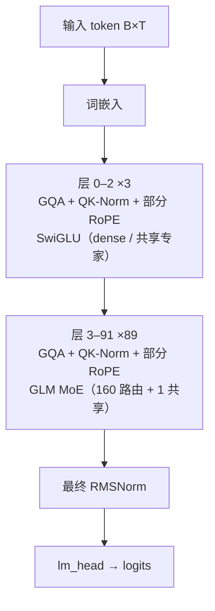

# GLM-4.5 · 架构说明（逐层）

> Zhipu AI / Z.ai (THUDM) · 发布 2025-07 · THUDM/GLM-4.5 `README.md` / `README_zh.md` + 技术报告 arXiv:2508.06471 + HF config `zai-org/GLM-4.5` 与 `zai-org/GLM-4.5-Air` + HF transformers `modeling_glm4_moe.py`

**技术定位**：面向 Agent 的 MoE 基础模型：355B 总参 / 32B 激活，92 层，前三层 dense、其后每层 160 路由专家 + 1 共享专家（每 token 激活 8 个），GQA 96/8 + QK-Norm + 部分 RoPE，sigmoid 无辅助损失（loss-free）路由，并带 1 层 MTP。

## 1. 参数与配置

| 项 | 值 |
|---|---|
| 总参数 | 355B（另 GLM-4.5-Air 106B） |
| 激活参数 | 32B（每 token 8 路由专家 + 1 共享专家；Air 12B） |
| 层数 | 92 |
| hidden | 5120 |
| Q 头 | 96 |
| KV 头 | 8 |
| head_dim | 128 |
| FFN/MoE 中间维 | dense 12288 / MoE 1536×160 + 共享 |
| 词表 | 151552 |
| 上下文 | 131072（128K，GLM-4.6 起 200K） |
| 权重共享 | false |

**完整配置**：

| 字段 | 值 |
|---|---|
| model_type | glm4_moe（Glm4MoeForCausalLM） |
| 模型 | GLM-4.5 355B-A32B / GLM-4.5-Air 106B-A12B |
| num_hidden_layers | 92（GLM-4.5）/ 46（Air） |
| hidden_size | 5120（GLM-4.5）/ 4096（Air） |
| num_attention_heads | 96 |
| num_key_value_heads | 8（GQA，12:1） |
| head_dim | 128 |
| partial_rotary_factor | 0.5（rotary_dim=64） |
| rope_theta | 1000000 |
| intermediate_size（dense） | 12288（GLM-4.5）/ 10944（Air） |
| moe_intermediate_size | 1536（GLM-4.5）/ 1408（Air） |
| n_routed_experts | 160（GLM-4.5）/ 128（Air） |
| n_shared_experts | 1 |
| num_experts_per_tok | 8 |
| first_k_dense_replace | 3（GLM-4.5）/ 1（Air） |
| n_group / topk_group | 1 / 1（等价于不分组） |
| scoring_func / topk_method | sigmoid / noaux_tc（无辅助损失） |
| routed_scaling_factor | 2.5（GLM-4.5）/ 1.0（Air） |
| norm_topk_prob | true |
| use_qk_norm | true（GLM-4.5）/ false（Air） |
| num_nextn_predict_layers | 1（MTP） |
| rms_norm_eps | 1e-5 |
| vocab_size | 151552 |
| max_position_embeddings | 131072 |
| tie_word_embeddings | false |
| attention_bias | true |

## 2. 技术方案与关键创新

**1. MoE：355B-A32B**　前 `first_k_dense_replace=3` 层是 dense FFN（intermediate 12288），第 3 层起把 FFN 换成 MoE：160 个路由专家（每个中间维 1536）+ 1 个共享专家，每 token 选 8 个路由专家，共享专家对所有 token 恒开。激活参数因此只有 32B。

**2. 无辅助损失的 loss-free 路由**　路由用 sigmoid 打分，并给每个专家一个可学习（实为零初始化的 buffer）偏置 `e_score_correction_bias`，只用于**选专家**、不参与加权，从而在不加 auxiliary-loss 的情况下均衡负载（DeepSeek-V3 的 noaux_tc 思路）。权重再按 top-k 归一化并乘 `routed_scaling_factor=2.5`。

**3. GQA + QK-Norm + 部分 RoPE**　注意力是 96 Q 头 / 8 KV 头（12:1）的 GQA，`head_dim=128`、`partial_rotary_factor=0.5`（rotary 64 维）；GLM-4.5 主干在 q/k 进 RoPE 前各做一次 head_dim 的 RMSNorm（`use_qk_norm=true`），Air 版没有这一步。`rope_theta` 拉到 1e6 便于长上下文。

**4. MTP 与混合推理**　`num_nextn_predict_layers=1`：在主干后挂一层多 token 预测头，供 EAGLE/MTP 投机解码使用（README 的部署示例用 `--speculative-num-steps 3`）。模型本身是混合推理模型，同一权重支持 thinking / non-thinking 两种模式。

**5. GLM-4.6 / 4.7 演进**　GLM-4.6（2025-09）把上下文从 128K 扩到 200K；GLM-4.7 进一步增强交错/保留思考与编程能力；另有 30B-A3B 的 GLM-4.7-Flash（`glm4_moe_lite`）。主干与 GLM-4.5 同构。

## 3. 层级结构（可视化）



## 4. 逐层清单（共 92 层）

| 层 | Attention | FFN/MoE | 说明 |
|---|---|---|---|
| 0 | GQA + QK-Norm + 部分 RoPE | SwiGLU（dense / 共享专家） | 前 3 层 dense（first_k_dense_replace=3） |
| 1 | GQA + QK-Norm + 部分 RoPE | SwiGLU（dense / 共享专家） | 前 3 层 dense（first_k_dense_replace=3） |
| 2 | GQA + QK-Norm + 部分 RoPE | SwiGLU（dense / 共享专家） | 前 3 层 dense（first_k_dense_replace=3） |
| 3 | GQA + QK-Norm + 部分 RoPE | GLM MoE（160 路由 + 1 共享） | MoE：160 路由 + 1 共享，top-8 |
| 4 | GQA + QK-Norm + 部分 RoPE | GLM MoE（160 路由 + 1 共享） | MoE：160 路由 + 1 共享，top-8 |
| 5 | GQA + QK-Norm + 部分 RoPE | GLM MoE（160 路由 + 1 共享） | MoE：160 路由 + 1 共享，top-8 |
| 6 | GQA + QK-Norm + 部分 RoPE | GLM MoE（160 路由 + 1 共享） | MoE：160 路由 + 1 共享，top-8 |
| 7 | GQA + QK-Norm + 部分 RoPE | GLM MoE（160 路由 + 1 共享） | MoE：160 路由 + 1 共享，top-8 |
| 8 | GQA + QK-Norm + 部分 RoPE | GLM MoE（160 路由 + 1 共享） | MoE：160 路由 + 1 共享，top-8 |
| 9 | GQA + QK-Norm + 部分 RoPE | GLM MoE（160 路由 + 1 共享） | MoE：160 路由 + 1 共享，top-8 |
| 10 | GQA + QK-Norm + 部分 RoPE | GLM MoE（160 路由 + 1 共享） | MoE：160 路由 + 1 共享，top-8 |
| 11 | GQA + QK-Norm + 部分 RoPE | GLM MoE（160 路由 + 1 共享） | MoE：160 路由 + 1 共享，top-8 |
| 12 | GQA + QK-Norm + 部分 RoPE | GLM MoE（160 路由 + 1 共享） | MoE：160 路由 + 1 共享，top-8 |
| 13 | GQA + QK-Norm + 部分 RoPE | GLM MoE（160 路由 + 1 共享） | MoE：160 路由 + 1 共享，top-8 |
| 14 | GQA + QK-Norm + 部分 RoPE | GLM MoE（160 路由 + 1 共享） | MoE：160 路由 + 1 共享，top-8 |
| 15 | GQA + QK-Norm + 部分 RoPE | GLM MoE（160 路由 + 1 共享） | MoE：160 路由 + 1 共享，top-8 |
| 16 | GQA + QK-Norm + 部分 RoPE | GLM MoE（160 路由 + 1 共享） | MoE：160 路由 + 1 共享，top-8 |
| 17 | GQA + QK-Norm + 部分 RoPE | GLM MoE（160 路由 + 1 共享） | MoE：160 路由 + 1 共享，top-8 |
| 18 | GQA + QK-Norm + 部分 RoPE | GLM MoE（160 路由 + 1 共享） | MoE：160 路由 + 1 共享，top-8 |
| 19 | GQA + QK-Norm + 部分 RoPE | GLM MoE（160 路由 + 1 共享） | MoE：160 路由 + 1 共享，top-8 |
| 20 | GQA + QK-Norm + 部分 RoPE | GLM MoE（160 路由 + 1 共享） | MoE：160 路由 + 1 共享，top-8 |
| 21 | GQA + QK-Norm + 部分 RoPE | GLM MoE（160 路由 + 1 共享） | MoE：160 路由 + 1 共享，top-8 |
| 22 | GQA + QK-Norm + 部分 RoPE | GLM MoE（160 路由 + 1 共享） | MoE：160 路由 + 1 共享，top-8 |
| 23 | GQA + QK-Norm + 部分 RoPE | GLM MoE（160 路由 + 1 共享） | MoE：160 路由 + 1 共享，top-8 |
| 24 | GQA + QK-Norm + 部分 RoPE | GLM MoE（160 路由 + 1 共享） | MoE：160 路由 + 1 共享，top-8 |
| 25 | GQA + QK-Norm + 部分 RoPE | GLM MoE（160 路由 + 1 共享） | MoE：160 路由 + 1 共享，top-8 |
| 26 | GQA + QK-Norm + 部分 RoPE | GLM MoE（160 路由 + 1 共享） | MoE：160 路由 + 1 共享，top-8 |
| 27 | GQA + QK-Norm + 部分 RoPE | GLM MoE（160 路由 + 1 共享） | MoE：160 路由 + 1 共享，top-8 |
| 28 | GQA + QK-Norm + 部分 RoPE | GLM MoE（160 路由 + 1 共享） | MoE：160 路由 + 1 共享，top-8 |
| 29 | GQA + QK-Norm + 部分 RoPE | GLM MoE（160 路由 + 1 共享） | MoE：160 路由 + 1 共享，top-8 |
| 30 | GQA + QK-Norm + 部分 RoPE | GLM MoE（160 路由 + 1 共享） | MoE：160 路由 + 1 共享，top-8 |
| 31 | GQA + QK-Norm + 部分 RoPE | GLM MoE（160 路由 + 1 共享） | MoE：160 路由 + 1 共享，top-8 |
| 32 | GQA + QK-Norm + 部分 RoPE | GLM MoE（160 路由 + 1 共享） | MoE：160 路由 + 1 共享，top-8 |
| 33 | GQA + QK-Norm + 部分 RoPE | GLM MoE（160 路由 + 1 共享） | MoE：160 路由 + 1 共享，top-8 |
| 34 | GQA + QK-Norm + 部分 RoPE | GLM MoE（160 路由 + 1 共享） | MoE：160 路由 + 1 共享，top-8 |
| 35 | GQA + QK-Norm + 部分 RoPE | GLM MoE（160 路由 + 1 共享） | MoE：160 路由 + 1 共享，top-8 |
| 36 | GQA + QK-Norm + 部分 RoPE | GLM MoE（160 路由 + 1 共享） | MoE：160 路由 + 1 共享，top-8 |
| 37 | GQA + QK-Norm + 部分 RoPE | GLM MoE（160 路由 + 1 共享） | MoE：160 路由 + 1 共享，top-8 |
| 38 | GQA + QK-Norm + 部分 RoPE | GLM MoE（160 路由 + 1 共享） | MoE：160 路由 + 1 共享，top-8 |
| 39 | GQA + QK-Norm + 部分 RoPE | GLM MoE（160 路由 + 1 共享） | MoE：160 路由 + 1 共享，top-8 |
| 40 | GQA + QK-Norm + 部分 RoPE | GLM MoE（160 路由 + 1 共享） | MoE：160 路由 + 1 共享，top-8 |
| 41 | GQA + QK-Norm + 部分 RoPE | GLM MoE（160 路由 + 1 共享） | MoE：160 路由 + 1 共享，top-8 |
| 42 | GQA + QK-Norm + 部分 RoPE | GLM MoE（160 路由 + 1 共享） | MoE：160 路由 + 1 共享，top-8 |
| 43 | GQA + QK-Norm + 部分 RoPE | GLM MoE（160 路由 + 1 共享） | MoE：160 路由 + 1 共享，top-8 |
| 44 | GQA + QK-Norm + 部分 RoPE | GLM MoE（160 路由 + 1 共享） | MoE：160 路由 + 1 共享，top-8 |
| 45 | GQA + QK-Norm + 部分 RoPE | GLM MoE（160 路由 + 1 共享） | MoE：160 路由 + 1 共享，top-8 |
| 46 | GQA + QK-Norm + 部分 RoPE | GLM MoE（160 路由 + 1 共享） | MoE：160 路由 + 1 共享，top-8 |
| 47 | GQA + QK-Norm + 部分 RoPE | GLM MoE（160 路由 + 1 共享） | MoE：160 路由 + 1 共享，top-8 |
| 48 | GQA + QK-Norm + 部分 RoPE | GLM MoE（160 路由 + 1 共享） | MoE：160 路由 + 1 共享，top-8 |
| 49 | GQA + QK-Norm + 部分 RoPE | GLM MoE（160 路由 + 1 共享） | MoE：160 路由 + 1 共享，top-8 |
| 50 | GQA + QK-Norm + 部分 RoPE | GLM MoE（160 路由 + 1 共享） | MoE：160 路由 + 1 共享，top-8 |
| 51 | GQA + QK-Norm + 部分 RoPE | GLM MoE（160 路由 + 1 共享） | MoE：160 路由 + 1 共享，top-8 |
| 52 | GQA + QK-Norm + 部分 RoPE | GLM MoE（160 路由 + 1 共享） | MoE：160 路由 + 1 共享，top-8 |
| 53 | GQA + QK-Norm + 部分 RoPE | GLM MoE（160 路由 + 1 共享） | MoE：160 路由 + 1 共享，top-8 |
| 54 | GQA + QK-Norm + 部分 RoPE | GLM MoE（160 路由 + 1 共享） | MoE：160 路由 + 1 共享，top-8 |
| 55 | GQA + QK-Norm + 部分 RoPE | GLM MoE（160 路由 + 1 共享） | MoE：160 路由 + 1 共享，top-8 |
| 56 | GQA + QK-Norm + 部分 RoPE | GLM MoE（160 路由 + 1 共享） | MoE：160 路由 + 1 共享，top-8 |
| 57 | GQA + QK-Norm + 部分 RoPE | GLM MoE（160 路由 + 1 共享） | MoE：160 路由 + 1 共享，top-8 |
| 58 | GQA + QK-Norm + 部分 RoPE | GLM MoE（160 路由 + 1 共享） | MoE：160 路由 + 1 共享，top-8 |
| 59 | GQA + QK-Norm + 部分 RoPE | GLM MoE（160 路由 + 1 共享） | MoE：160 路由 + 1 共享，top-8 |
| 60 | GQA + QK-Norm + 部分 RoPE | GLM MoE（160 路由 + 1 共享） | MoE：160 路由 + 1 共享，top-8 |
| 61 | GQA + QK-Norm + 部分 RoPE | GLM MoE（160 路由 + 1 共享） | MoE：160 路由 + 1 共享，top-8 |
| 62 | GQA + QK-Norm + 部分 RoPE | GLM MoE（160 路由 + 1 共享） | MoE：160 路由 + 1 共享，top-8 |
| 63 | GQA + QK-Norm + 部分 RoPE | GLM MoE（160 路由 + 1 共享） | MoE：160 路由 + 1 共享，top-8 |
| 64 | GQA + QK-Norm + 部分 RoPE | GLM MoE（160 路由 + 1 共享） | MoE：160 路由 + 1 共享，top-8 |
| 65 | GQA + QK-Norm + 部分 RoPE | GLM MoE（160 路由 + 1 共享） | MoE：160 路由 + 1 共享，top-8 |
| 66 | GQA + QK-Norm + 部分 RoPE | GLM MoE（160 路由 + 1 共享） | MoE：160 路由 + 1 共享，top-8 |
| 67 | GQA + QK-Norm + 部分 RoPE | GLM MoE（160 路由 + 1 共享） | MoE：160 路由 + 1 共享，top-8 |
| 68 | GQA + QK-Norm + 部分 RoPE | GLM MoE（160 路由 + 1 共享） | MoE：160 路由 + 1 共享，top-8 |
| 69 | GQA + QK-Norm + 部分 RoPE | GLM MoE（160 路由 + 1 共享） | MoE：160 路由 + 1 共享，top-8 |
| 70 | GQA + QK-Norm + 部分 RoPE | GLM MoE（160 路由 + 1 共享） | MoE：160 路由 + 1 共享，top-8 |
| 71 | GQA + QK-Norm + 部分 RoPE | GLM MoE（160 路由 + 1 共享） | MoE：160 路由 + 1 共享，top-8 |
| 72 | GQA + QK-Norm + 部分 RoPE | GLM MoE（160 路由 + 1 共享） | MoE：160 路由 + 1 共享，top-8 |
| 73 | GQA + QK-Norm + 部分 RoPE | GLM MoE（160 路由 + 1 共享） | MoE：160 路由 + 1 共享，top-8 |
| 74 | GQA + QK-Norm + 部分 RoPE | GLM MoE（160 路由 + 1 共享） | MoE：160 路由 + 1 共享，top-8 |
| 75 | GQA + QK-Norm + 部分 RoPE | GLM MoE（160 路由 + 1 共享） | MoE：160 路由 + 1 共享，top-8 |
| 76 | GQA + QK-Norm + 部分 RoPE | GLM MoE（160 路由 + 1 共享） | MoE：160 路由 + 1 共享，top-8 |
| 77 | GQA + QK-Norm + 部分 RoPE | GLM MoE（160 路由 + 1 共享） | MoE：160 路由 + 1 共享，top-8 |
| 78 | GQA + QK-Norm + 部分 RoPE | GLM MoE（160 路由 + 1 共享） | MoE：160 路由 + 1 共享，top-8 |
| 79 | GQA + QK-Norm + 部分 RoPE | GLM MoE（160 路由 + 1 共享） | MoE：160 路由 + 1 共享，top-8 |
| 80 | GQA + QK-Norm + 部分 RoPE | GLM MoE（160 路由 + 1 共享） | MoE：160 路由 + 1 共享，top-8 |
| 81 | GQA + QK-Norm + 部分 RoPE | GLM MoE（160 路由 + 1 共享） | MoE：160 路由 + 1 共享，top-8 |
| 82 | GQA + QK-Norm + 部分 RoPE | GLM MoE（160 路由 + 1 共享） | MoE：160 路由 + 1 共享，top-8 |
| 83 | GQA + QK-Norm + 部分 RoPE | GLM MoE（160 路由 + 1 共享） | MoE：160 路由 + 1 共享，top-8 |
| 84 | GQA + QK-Norm + 部分 RoPE | GLM MoE（160 路由 + 1 共享） | MoE：160 路由 + 1 共享，top-8 |
| 85 | GQA + QK-Norm + 部分 RoPE | GLM MoE（160 路由 + 1 共享） | MoE：160 路由 + 1 共享，top-8 |
| 86 | GQA + QK-Norm + 部分 RoPE | GLM MoE（160 路由 + 1 共享） | MoE：160 路由 + 1 共享，top-8 |
| 87 | GQA + QK-Norm + 部分 RoPE | GLM MoE（160 路由 + 1 共享） | MoE：160 路由 + 1 共享，top-8 |
| 88 | GQA + QK-Norm + 部分 RoPE | GLM MoE（160 路由 + 1 共享） | MoE：160 路由 + 1 共享，top-8 |
| 89 | GQA + QK-Norm + 部分 RoPE | GLM MoE（160 路由 + 1 共享） | MoE：160 路由 + 1 共享，top-8 |
| 90 | GQA + QK-Norm + 部分 RoPE | GLM MoE（160 路由 + 1 共享） | MoE：160 路由 + 1 共享，top-8 |
| 91 | GQA + QK-Norm + 部分 RoPE | GLM MoE（160 路由 + 1 共享） | MoE：160 路由 + 1 共享，top-8 |

## 5. 关键模块：数学公式与代码

### 注意力 · GQA + QK-Norm + 部分 RoPE

Q/K/V 投影后对 q、k 各做一次 head_dim=128 的 RMSNorm（GLM-4.5；Air 无），再对前 64 维施加 RoPE；KV 头复制 12 倍到 96 个 Q 头后做缩放点积注意力。

$$
H=96,\; H_{kv}=8,\; G=12,\; d_h=128,\; d_{rot}=64
$$

$$
q=\mathrm{RMSNorm}_{h}(W_q x),\quad k=\mathrm{RMSNorm}_{h}(W_k x)
$$

$$
\mathrm{Attn}(Q,K,V)=\mathrm{softmax}\!\left(\frac{QK^{\top}}{\sqrt{d_h}}+M\right)V
$$

```python
# HF transformers modeling_glm4_moe.py — Glm4MoeAttention
# https://github.com/huggingface/transformers/blob/main/src/transformers/models/glm4_moe/modeling_glm4_moe.py
self.use_qk_norm = config.use_qk_norm          # GLM-4.5: True, GLM-4.5-Air: False
if self.use_qk_norm:
    self.q_norm = Glm4MoeRMSNorm(self.head_dim, eps=config.rms_norm_eps)
    self.k_norm = Glm4MoeRMSNorm(self.head_dim, eps=config.rms_norm_eps)
query_states = self.q_proj(hidden_states).view(hidden_shape)
key_states   = self.k_proj(hidden_states).view(hidden_shape)
value_states = self.v_proj(hidden_states).view(hidden_shape)
if self.use_qk_norm:                            # main diff from Llama
    query_states = self.q_norm(query_states)
    key_states   = self.k_norm(key_states)
query_states, key_states = apply_rotary_pos_emb(query_states, key_states, cos, sin)
# partial RoPE: rotary_dim = int(128 * 0.5) = 64
```

### 前馈/MoE · SwiGLU（dense / 共享专家）

前三层 dense FFN，以及 MoE 里那个恒开的共享专家，都是标准 SwiGLU。

$$
\mathrm{SwiGLU}(x)=W_{down}\big(\mathrm{SiLU}(W_{gate}x)\odot W_{up}x\big)
$$

```python
# HF transformers modeling_glm4_moe.py — Glm4MoeMLP
def forward(self, x):
    return self.down_proj(self.act_fn(self.gate_proj(x)) * self.up_proj(x))
```

### 前馈/MoE · GLM MoE（160 路由 + 1 共享）

sigmoid 打分 → 加 `e_score_correction_bias` 选 top-8 → 权重归一化后乘 2.5 → 8 个专家的 SwiGLU 输出加权求和，再叠加一个对所有 token 恒开的共享专家。

$$
s=\sigma\!\left(W_g x\right),\quad \tilde{s}=s+b_{corr}
$$

$$
\mathcal{T}=\mathrm{top8}\big(\tilde{s}\big),\quad w_i=\frac{s_i}{\sum_{j\in\mathcal{T}}s_j}\cdot 2.5
$$

$$
y=\sum_{i\in\mathcal{T}}w_i\,\mathrm{Expert}_i(x)+\mathrm{Shared}(x)
$$

```python
# HF transformers modeling_glm4_moe.py — Glm4MoeTopkRouter + Glm4MoeMoE
router_logits = F.linear(hidden_states.type(torch.float32), self.weight.type(torch.float32))
scores = router_logits.sigmoid()
scores_for_choice = scores + self.e_score_correction_bias     # loss-free 偏置
# n_group=1, topk_group=1 -> 分组选择退化为全局
scores_for_choice = scores_for_choice.masked_fill(~score_mask.bool(), float('-inf'))
topk_indices = torch.topk(scores_for_choice, k=self.top_k, dim=-1, sorted=False)[1]
topk_weights = scores.gather(1, topk_indices)
topk_weights = topk_weights / (topk_weights.sum(dim=-1, keepdim=True) + 1e-20)
topk_weights = topk_weights * self.routed_scaling_factor     # 2.5
# MoE 前向
_, topk_weights, topk_indices = self.gate(hidden_states)
hidden_states = self.experts(hidden_states, topk_indices, topk_weights)
hidden_states = hidden_states + self.shared_experts(residuals)  # 1 个共享专家
```

### RMSNorm

$$
\mathrm{RMSNorm}(x)=\frac{x}{\sqrt{\frac{1}{d}\sum_{i=1}^{d}x_i^{2}+\epsilon}}\odot\gamma
$$

```python
# HF transformers modeling_glm4_moe.py — Glm4MoeRMSNorm
variance = hidden_states.pow(2).mean(-1, keepdim=True)
hidden_states = hidden_states * torch.rsqrt(variance + self.variance_epsilon)
return self.weight * hidden_states.to(input_dtype)
```

### 部分 RoPE（θ=1e6, partial_rotary_factor=0.5）

只在 64/128 维上旋转；底数升到 1e6 以支持 128K 上下文。

$$
\theta_i=\theta_0^{-2i/d_{rot}},\quad \theta_0=10^{6},\; d_{rot}=64
$$

$$
\mathrm{RoPE}(x,m)=\big[x_{rot}\cos(m\theta)-x_{rot}^{\perp}\sin(m\theta);\;x_{pass}\big]
$$

### loss-free 路由偏置的作用面

`e_score_correction_bias` 只影响“选哪些专家”（scores_for_choice），最终加权仍用原始 sigmoid 分数 `s`，因此不引入额外损失项也能均衡专家。

$$
\mathcal{T}=\mathrm{topk}\!\left(s+b_{corr}\right)
$$

$$
w_i=\frac{s_i}{\sum_{j\in\mathcal{T}}s_j}\,r,\qquad r=\mathrm{routed\_scaling\_factor}
$$

### MTP（多 token 预测）

`num_nextn_predict_layers=1`：主干后接 1 个共享的 MTP 层（embedding+hnorm+enorm+eh_proj），用于投机解码时预测下一个位置。

$$
p(x_{t+1},x_{t+2}\mid x_{\le t})\;\approx\;p_{head}\!\left(\mathrm{MTP}(h_t)\right)
$$

## 6. 张量形状流

| 阶段 | 形状 | 说明 |
|---|---|---|
| 输入 token id | `[B, T]` |  |
| 词嵌入 | `[B, T, 5120]` |  |
| 层 0–2（dense） | `[B, T, 5120]` | GQA+QK-Norm + SwiGLU |
| 层 3–91（MoE） | `[B, T, 5120]` | 8/160 路由 + 1 共享 |
| 最终 RMSNorm | `[B, T, 5120]` |  |
| lm_head（不共享） | `[B, T, 151552]` |  |
| MTP 头（1 层） | `[B, T, 151552]` | 投机解码用，不计入主干层 |

## 7. 关键源码（引自 reference/）

**MoE 路由（sigmoid + loss-free 偏置）**　`https://github.com/huggingface/transformers/blob/main/src/transformers/models/glm4_moe/modeling_glm4_moe.py`

```python
router_logits = F.linear(hidden_states.type(torch.float32), self.weight.type(torch.float32))
scores = router_logits.sigmoid()
scores_for_choice = scores + self.e_score_correction_bias
topk_indices = torch.topk(scores_for_choice, k=self.top_k, dim=-1, sorted=False)[1]
topk_weights = scores.gather(1, topk_indices)
if self.norm_topk_prob:
    topk_weights /= topk_weights.sum(dim=-1, keepdim=True) + 1e-20
topk_weights = topk_weights * self.routed_scaling_factor
```

**MoE 层：路由专家 + 共享专家**　`https://github.com/huggingface/transformers/blob/main/src/transformers/models/glm4_moe/modeling_glm4_moe.py`

```python
residuals = hidden_states
_, topk_weights, topk_indices = self.gate(hidden_states)
hidden_states = hidden_states.view(-1, hidden_states.shape[-1])
hidden_states = self.experts(hidden_states, topk_indices, topk_weights).view(*orig_shape)
hidden_states = hidden_states + self.shared_experts(residuals)
```

## 8. 与 mini-llm-lab 的差异

GLM-4.5 相对 mini-llm-lab（~192M GPT 骨架）在**注意力**上只多了 QK-Norm 与部分 RoPE，最大的差别在 **FFN 换成了 MoE**：

- **每层 FFN**：我们是一个 SwiGLU；GLM-4.5 是 160 个 SwiGLU 专家 + 1 个共享专家，每 token 走 8 个路由专家（前三层仍是普通 SwiGLU）；
- **路由**：sigmoid 打分 + 可学习偏置选 top-8 + 权重归一化 ×2.5，属于无辅助损失的负载均衡，我们的 mini 完全没有；
- **注意力**：96Q/8KV 的 GQA（12:1）+ q/k RMSNorm（QK-Norm）+ rotary 只作用于 1/2 head_dim + θ=1e6；
- **额外头**：1 层 MTP 用于投机解码。

如果要在 mini 里复现，最小改动是：给注意力加 QK-Norm 和 `partial_rotary_factor`，再把某一层的 FFN 替换成 top-k MoE + 共享专家即可。

## 9. 3D 可视化

启动可视化网页后，在「架构浏览器」视图选择本模型（id：`glm-4.5`），可三维查看每一层并点开公式/代码：

```powershell
& ".venv\Scripts\python.exe" viz/server.py   # 打开 http://127.0.0.1:7861 → 架构浏览器
```

## 10. 参考资料

- [GLM-4.5: Agentic, Reasoning, and Coding (ARC) Foundation Models (arXiv:2508.06471)](https://arxiv.org/abs/2508.06471)
- [THUDM/GLM-4.5](https://github.com/zai-org/GLM-4.5)
- [HF transformers modeling_glm4_moe.py](https://github.com/huggingface/transformers/blob/main/src/transformers/models/glm4_moe/modeling_glm4_moe.py)
