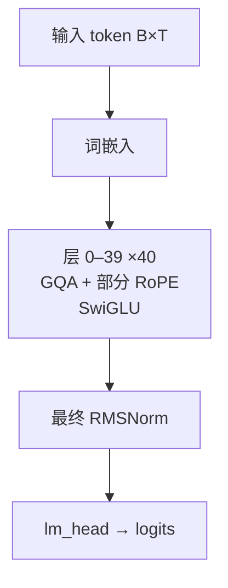

# GLM-4 · 架构说明（逐层）

> Zhipu AI / Z.ai (THUDM) · 发布 2024-06 · THUDM/GLM-4 `README_20240605.md` / `README.md`（GLM-4-0414 系列）+ HF config `zai-org/glm-4-9b-chat-hf`（model_type=glm）与 `zai-org/GLM-4-32B-Base-0414`（model_type=glm4）+ HF transformers `modeling_glm.py` / `modeling_glm4.py`

**技术定位**：ChatGLM 系 dense decoder-only：RMSNorm + SwiGLU + GQA，关键点是**部分旋转位置编码**（rotary 只作用于 head_dim 的一半），GLM-4-9B 用 32 个 Q 头对 2 个 KV 头（16:1）；GLM-4-32B-0414 换成 4 个 RMSNorm 的 sandwich 结构。

## 1. 参数与配置

| 项 | 值 |
|---|---|
| 总参数 | 9B（另有 GLM-4-32B-0414 / Z1 32B / 9B 等） |
| 激活参数 | dense 全激活 |
| 层数 | 40 |
| hidden | 4096 |
| Q 头 | 32 |
| KV 头 | 2 |
| head_dim | 128 |
| FFN/MoE 中间维 | 13696 |
| 词表 | 151552 |
| 上下文 | 8K（Base）→ 128K（Chat，YaRN）→ 1M（Chat-1M） |
| 权重共享 | false（输入/输出嵌入不共享） |

**完整配置**：

| 字段 | 值 |
|---|---|
| 模型 | GLM-4-9B-Chat-HF（旗舰 9B）/ GLM-4-32B-Base-0414（32B） |
| num_hidden_layers | 40（9B）/ 61（32B） |
| hidden_size | 4096（9B）/ 6144（32B） |
| num_attention_heads | 32（9B）/ 48（32B） |
| num_key_value_heads | 2（GQA，16:1（9B）/ 24:1（32B）） |
| head_dim | 128 |
| intermediate_size | 13696（9B）/ 23040（32B） |
| hidden_act | silu（SwiGLU 门控） |
| partial_rotary_factor | 0.5（rotary_dim = 64） |
| rope_theta | 10000 |
| rms_norm_eps | 1.5625e-7（9B）/ 1e-5（32B） |
| vocab_size | 151552 |
| max_position_embeddings | 131072（-HF，YaRN）/ 32768（32B-0414） |
| tie_word_embeddings | false |
| attention_bias | true（9B 的 q/k/v）/ false（32B） |
| 归一化布局 | 9B：pre-norm 2×RMSNorm；32B：sandwich 4×RMSNorm |
| YaRN（长文） | factor 4.0, original_max 32768, type yarn |

## 2. 技术方案与关键创新

**1. ChatGLM 系 dense 主干**　标准 decoder-only：每层 pre-norm 残差 + GQA 自注意力 + SwiGLU FFN，末层后一次 RMSNorm 再接 lm_head。结构上与我们手写 mini-llm-lab 同源，差别在下面几点。

**2. 部分 RoPE（最关键差异）**　GLM-4 只对 head_dim 的**前一半**做旋转位置编码：transformers `GlmConfig` 直接 `partial_rotary_factor=0.5`，原始 ChatGLM 代码写 `RotaryEmbedding(rotary_dim // 2)`（=64）。剩下 64 维不编码位置，直接在 `dim=-1` 上拼接。

**3. 极致的 GQA 比例**　9B 用 32 个 Q 头对 **2 个 KV 头**（16:1），KV 缓存只有 MHA 的 1/16；32B 用 48/2（24:1）。`repeat_kv` 把 KV 复制到 Q 头数后再做缩放点积注意力。

**4. GLM-4-32B-0414 的 sandwich norm**　2025-04 的 GLM-4-32B-0414（`Glm4ForCausalLM`）把每个子层改成 4 个 RMSNorm：`input_layernorm → attn → post_self_attn_layernorm → +residual`，`post_attention_layernorm → mlp → post_mlp_layernorm → +residual`，用额外 norm 稳定大模型训练；同时 `attention_bias=false`、`rope_theta=10000`、`partial_rotary_factor=0.5`。

## 3. 层级结构（可视化）



## 4. 逐层清单（共 40 层）

| 层 | Attention | FFN/MoE | 说明 |
|---|---|---|---|
| 0 | GQA + 部分 RoPE | SwiGLU | 全层同构（GLM-4-9B） |
| 1 | GQA + 部分 RoPE | SwiGLU | 全层同构（GLM-4-9B） |
| 2 | GQA + 部分 RoPE | SwiGLU | 全层同构（GLM-4-9B） |
| 3 | GQA + 部分 RoPE | SwiGLU | 全层同构（GLM-4-9B） |
| 4 | GQA + 部分 RoPE | SwiGLU | 全层同构（GLM-4-9B） |
| 5 | GQA + 部分 RoPE | SwiGLU | 全层同构（GLM-4-9B） |
| 6 | GQA + 部分 RoPE | SwiGLU | 全层同构（GLM-4-9B） |
| 7 | GQA + 部分 RoPE | SwiGLU | 全层同构（GLM-4-9B） |
| 8 | GQA + 部分 RoPE | SwiGLU | 全层同构（GLM-4-9B） |
| 9 | GQA + 部分 RoPE | SwiGLU | 全层同构（GLM-4-9B） |
| 10 | GQA + 部分 RoPE | SwiGLU | 全层同构（GLM-4-9B） |
| 11 | GQA + 部分 RoPE | SwiGLU | 全层同构（GLM-4-9B） |
| 12 | GQA + 部分 RoPE | SwiGLU | 全层同构（GLM-4-9B） |
| 13 | GQA + 部分 RoPE | SwiGLU | 全层同构（GLM-4-9B） |
| 14 | GQA + 部分 RoPE | SwiGLU | 全层同构（GLM-4-9B） |
| 15 | GQA + 部分 RoPE | SwiGLU | 全层同构（GLM-4-9B） |
| 16 | GQA + 部分 RoPE | SwiGLU | 全层同构（GLM-4-9B） |
| 17 | GQA + 部分 RoPE | SwiGLU | 全层同构（GLM-4-9B） |
| 18 | GQA + 部分 RoPE | SwiGLU | 全层同构（GLM-4-9B） |
| 19 | GQA + 部分 RoPE | SwiGLU | 全层同构（GLM-4-9B） |
| 20 | GQA + 部分 RoPE | SwiGLU | 全层同构（GLM-4-9B） |
| 21 | GQA + 部分 RoPE | SwiGLU | 全层同构（GLM-4-9B） |
| 22 | GQA + 部分 RoPE | SwiGLU | 全层同构（GLM-4-9B） |
| 23 | GQA + 部分 RoPE | SwiGLU | 全层同构（GLM-4-9B） |
| 24 | GQA + 部分 RoPE | SwiGLU | 全层同构（GLM-4-9B） |
| 25 | GQA + 部分 RoPE | SwiGLU | 全层同构（GLM-4-9B） |
| 26 | GQA + 部分 RoPE | SwiGLU | 全层同构（GLM-4-9B） |
| 27 | GQA + 部分 RoPE | SwiGLU | 全层同构（GLM-4-9B） |
| 28 | GQA + 部分 RoPE | SwiGLU | 全层同构（GLM-4-9B） |
| 29 | GQA + 部分 RoPE | SwiGLU | 全层同构（GLM-4-9B） |
| 30 | GQA + 部分 RoPE | SwiGLU | 全层同构（GLM-4-9B） |
| 31 | GQA + 部分 RoPE | SwiGLU | 全层同构（GLM-4-9B） |
| 32 | GQA + 部分 RoPE | SwiGLU | 全层同构（GLM-4-9B） |
| 33 | GQA + 部分 RoPE | SwiGLU | 全层同构（GLM-4-9B） |
| 34 | GQA + 部分 RoPE | SwiGLU | 全层同构（GLM-4-9B） |
| 35 | GQA + 部分 RoPE | SwiGLU | 全层同构（GLM-4-9B） |
| 36 | GQA + 部分 RoPE | SwiGLU | 全层同构（GLM-4-9B） |
| 37 | GQA + 部分 RoPE | SwiGLU | 全层同构（GLM-4-9B） |
| 38 | GQA + 部分 RoPE | SwiGLU | 全层同构（GLM-4-9B） |
| 39 | GQA + 部分 RoPE | SwiGLU | 全层同构（GLM-4-9B） |

## 5. 关键模块：数学公式与代码

### 注意力 · GQA + 部分 RoPE

Q/K/V 投影（9B 带 bias）后，只对 head_dim 的前 64 维施加 RoPE，后 64 维原样透传；KV 头用 repeat 复制成 Q 头数（32/2=16）后做缩放点积注意力。

$$
H=32,\; H_{kv}=2,\; G=H/H_{kv}=16,\; d_h=128,\; d_{rot}=64
$$

$$
q=W_q x+b_q,\quad k=W_k x+b_k,\quad v=W_v x+b_v
$$

$$
(q_{rot},k_{rot})=\mathrm{RoPE}\!\left(q_{[:64]},k_{[:64]},m\right),\quad q=[q_{rot};q_{[64:]}],\;k=[k_{rot};k_{[64:]}]
$$

$$
\mathrm{Attn}(Q,K,V)=\mathrm{softmax}\!\left(\frac{QK^{\top}}{\sqrt{d_h}}+M\right)V
$$

```python
# HF transformers modeling_glm.py — GlmAttention / apply_rotary_pos_emb
# https://github.com/huggingface/transformers/blob/main/src/transformers/models/glm/modeling_glm.py
self.num_key_value_groups = config.num_attention_heads // config.num_key_value_heads  # 32 // 2 = 16
query_states = self.q_proj(hidden_states).view(hidden_shape).transpose(1, 2)
key_states   = self.k_proj(hidden_states).view(hidden_shape).transpose(1, 2)
value_states = self.v_proj(hidden_states).view(hidden_shape).transpose(1, 2)
query_states, key_states = apply_rotary_pos_emb(query_states, key_states, cos, sin)
# 部分 RoPE：cos/sin 末维 = int(head_dim * partial_rotary_factor) = 64
rotary_dim = cos.shape[-1]                       # 64 of 128
q_rot, q_pass = q[..., :rotary_dim], q[..., rotary_dim:]
q_embed = (q_rot * cos) + (rotate_half(q_rot) * sin)
q_embed = torch.cat([q_embed, q_pass], dim=-1)   # 后 64 维原样拼接
# GQA：repeat_kv(key, self.num_key_value_groups) 然后把 2 个 KV 头铺成 32 个
```

### 前馈/MoE · SwiGLU

门控前馈：down( silu(gate(x)) ⊙ up(x) )。GLM-4 把 gate 和 up 合并成一个 `gate_up_proj` 再 chunk。

$$
\mathrm{SwiGLU}(x)=W_{down}\big(\mathrm{SiLU}(W_{gate}x)\odot W_{up}x\big)
$$

```python
# HF transformers modeling_glm.py — GlmMLP
self.gate_up_proj = nn.Linear(config.hidden_size, 2 * config.intermediate_size, bias=False)
self.down_proj    = nn.Linear(config.intermediate_size, config.hidden_size, bias=False)
up_states = self.gate_up_proj(hidden_states)
gate, up_states = up_states.chunk(2, dim=-1)
up_states = up_states * self.activation_fn(gate)   # silu
return self.down_proj(up_states)
```

### RMSNorm

$$
\mathrm{RMSNorm}(x)=\frac{x}{\sqrt{\frac{1}{d}\sum_{i=1}^{d}x_i^{2}+\epsilon}}\odot\gamma
$$

```python
# HF transformers modeling_glm.py — GlmRMSNorm
hidden_states = hidden_states.to(torch.float32)
variance = hidden_states.pow(2).mean(-1, keepdim=True)
hidden_states = hidden_states * torch.rsqrt(variance + self.variance_epsilon)
return self.weight * hidden_states.to(input_dtype)
```

### 部分 RoPE（partial_rotary_factor = 0.5）

逆频率只在 rotary_dim=64 维上计算，其余 64 维不参与位置编码。LaTeX 中 `x_{[:64]}` 表示取前 64 维。

$$
\theta_i=\theta_0^{-2i/d_{rot}},\quad i=0,\dots,d_{rot}/2-1,\quad d_{rot}=0.5\,d_h=64
$$

$$
\mathrm{RoPE}(x,m)=\big[x_{rot}\cos(m\theta)-x_{rot}^{\perp}\sin(m\theta);\;x_{pass}\big]
$$

### GLM-4-32B-0414：sandwich（4×RMSNorm）

32B-0414（`Glm4ForCausalLM`）在 attention 与 MLP 之后各多一次 RMSNorm，形成 pre+post 双重归一化。9B/ChatGLM 块只有 2 个 RMSNorm。

$$
h'=\mathrm{post}_{attn}\!\big(\mathrm{Attn}(\mathrm{in}_{attn}(h))\big)+h
$$

$$
y=\mathrm{post}_{mlp}\!\big(\mathrm{MLP}(\mathrm{post}_{attn2}(h'))\big)+h'
$$

```python
# HF transformers modeling_glm4.py — Glm4DecoderLayer（GLM-4-32B-0414）
hidden_states = self.post_self_attn_layernorm(hidden_states)
hidden_states = residual + hidden_states
residual = hidden_states
hidden_states = self.post_attention_layernorm(hidden_states)
hidden_states = self.mlp(hidden_states)
hidden_states = self.post_mlp_layernorm(hidden_states)
hidden_states = residual + hidden_states
```

## 6. 张量形状流

| 阶段 | 形状 | 说明 |
|---|---|---|
| 输入 token id | `[B, T]` | B=batch, T=序列长 |
| 词嵌入 tok_emb | `[B, T, 4096]` | 不乘 sqrt(d) |
| 40 × Block(GQA+partial RoPE + SwiGLU) | `[B, T, 4096]` | 残差流形状不变 |
| 最终 RMSNorm | `[B, T, 4096]` |  |
| lm_head（不共享） | `[B, T, 151552]` | 输出 logits |

## 7. 关键源码（引自 reference/）

**注意力主干（GQA + 部分 RoPE）**　`https://github.com/huggingface/transformers/blob/main/src/transformers/models/glm/modeling_glm.py`

```python
query_states = self.q_proj(hidden_states).view(hidden_shape).transpose(1, 2)
key_states   = self.k_proj(hidden_states).view(hidden_shape).transpose(1, 2)
value_states = self.v_proj(hidden_states).view(hidden_shape).transpose(1, 2)
cos, sin = position_embeddings
query_states, key_states = apply_rotary_pos_emb(query_states, key_states, cos, sin)
# 部分 RoPE：cos 末维 64，对前 64 维旋转，后 64 维直接 cat 回
rotary_dim = cos.shape[-1]
q_rot, q_pass = query_states[..., :rotary_dim], query_states[..., rotary_dim:]
q_embed = (q_rot * cos) + (rotate_half(q_rot) * sin)
q_embed = torch.cat([q_embed, q_pass], dim=-1)
# GQA
key_states   = repeat_kv(key_states, self.num_key_value_groups)
value_states = repeat_kv(value_states, self.num_key_value_groups)
attn_weights = torch.matmul(query_states, key_states.transpose(2, 3)) * self.scaling
attn_weights = nn.functional.softmax(attn_weights, dim=-1, dtype=torch.float32)
attn_output  = torch.matmul(attn_weights, value_states)
```

**原始 ChatGLM 建模：rotary_dim = kv_channels // 2**　`https://huggingface.co/zai-org/glm-4-9b-chat/blob/main/modeling_chatglm.py`

```python
self.kv_channels = config.kv_channels                      # 128
rotary_dim = (config.hidden_size // config.num_attention_heads
              if config.kv_channels is None else config.kv_channels)
self.rotary_pos_emb = RotaryEmbedding(rotary_dim // 2,       # 64 -> partial RoPE
                                      rope_ratio=config.rope_ratio, ...)
```

## 8. 与 mini-llm-lab 的差异

GLM-4-9B 与 mini-llm-lab 的骨架几乎同构（decoder-only、RMSNorm、SwiGLU、GQA、pre-norm 残差、RoPE），真正的差异有三处：

- **部分 RoPE**：我们默认对全部 head_dim 旋转，GLM-4 只旋转前 64/128 维（`partial_rotary_factor=0.5`），这是最直接需要改的一行；
- **GQA 更激进**：它是 32Q/2KV（16:1），我们默认 8W/1KV 或 MHA，KV 头数少得多；
- **规模与长文**：4096 维 × 40 层、词表 151552，Base 8K；Chat 版靠 YaRN（factor 4, original 32768）扩到 128K，1M 版再扩。

另外 GLM-4-32B-0414 比我们多了 post-attn / post-mlp 两次 RMSNorm（sandwich），可在层里选做。**结论：加一个 `partial_rotary_factor` 开关，我们的 mini 就能基本复现 GLM-4-9B。**

## 9. 3D 可视化

启动可视化网页后，在「架构浏览器」视图选择本模型（id：`glm-4`），可三维查看每一层并点开公式/代码：

```powershell
& ".venv\Scripts\python.exe" viz/server.py   # 打开 http://127.0.0.1:7861 → 架构浏览器
```

## 10. 参考资料

- [ChatGLM: A Family of Large Language Models from GLM-130B to GLM-4 All Tools (arXiv:2406.12793)](https://arxiv.org/abs/2406.12793)
- [THUDM/GLM-4](https://github.com/zai-org/GLM-4)
- [HF transformers modeling_glm.py](https://github.com/huggingface/transformers/blob/main/src/transformers/models/glm/modeling_glm.py)
