# GLM-5.3-Flash · 架构说明（逐层）

> Zhipu AI / Z.ai (THUDM) · 发布 2026 · HF config `zai-org/GLM-5.3-Flash`（model_type `glm5_next`，arch `Glm5NextForConditionalGeneration`，text_config.model_type=`glm5_next_text`，vision_config.model_type=`glm5_next_vision`）+ THUDM/GLM-5 `README.md:28`（稀疏 + 线性注意力混搭、mHC、30T 多模态预训练）+ HF transformers `modeling_glm5_next.py`（transformers 5.16+）

> ⚠️ GLM 系列首个原生多模态 + 稀疏/线性混合注意力基座；官方未开源独立建模代码

**技术定位**：GLM 系列首个全新基座的多模态 Flash 模型（320B-A18B、45 层）：文本侧用**稀疏 + 线性注意力混搭**——34 层 KDA 门控线性注意力（O(1) 递归状态）与 11 层 deepseek_sparse_attention（MLA + DSA，每 query top-2048）按 3:1 交织；并用 Manifold-Constrained Hyper-Connections（mHC，hc_mult=4）提升缩放效率；MoE 288 路由 + 1 共享（top-8），原生 1M 上下文，30T token 多模态语料预训练。

## 1. 参数与配置

| 项 | 值 |
|---|---|
| 总参数 | 320B-A18B |
| 激活参数 | 18B（每 token 8 路由专家 + 1 共享专家） |
| 层数 | 45 |
| hidden | 4096 |
| Q 头 | 64 |
| KV 头 | 64（MLA 稀疏层；线性层 64 头） |
| head_dim | 128（KDA 线性）/ 256（MLA qk_nope） |
| FFN/MoE 中间维 | dense 12288 / MoE 2048×288 + 共享 |
| 词表 | 154880 |
| 上下文 | 1048576（1M） |
| 权重共享 | false |

**完整配置**：

| 字段 | 值 |
|---|---|
| arch / model_type | Glm5NextForConditionalGeneration / glm5_next（text=glm5_next_text, vision=glm5_next_vision） |
| num_hidden_layers | 45（text_config） |
| hidden_size | 4096 |
| layer_types | 45 项：linear_attention（KDA）×34 / deepseek_sparse_attention ×11 |
| full_attn_layers | [3,7,11,15,19,23,27,31,35,39,43]（11 层 MLA+DSA） |
| kda_layers | 34 层（除上述 11 层外的全部层） |
| num_attention_heads / num_key_value_heads | 64 / 64 |
| linear_attn_config | {num_heads: 64, head_dim: 128, short_conv_kernel_size: 4, gate_lower_bound: -5.0} |
| q_lora_rank / kv_lora_rank | 1536 / 512 |
| qk_nope_head_dim / qk_rope_head_dim | 256 / 0（mla_use_nope=true） |
| qk_head_dim / v_head_dim | 256 / 256 |
| index_n_heads / index_head_dim | 32 / 128 |
| index_topk | 2048 |
| indexer_types | 45 项全为 full（此 Flash 未用 IndexShare 的 shared 标记） |
| index_kpool / index_kpool_compress / index_kpool_always_select_tail | 4 / true / true |
| indexer_rope_interleave | true |
| rope_parameters | ?：text_config 未显式给出；qk_rope_head_dim=0 且 mla_use_nope=true，稀疏 MLA 路径无 RoPE；线性/KDA 与 indexer 的位置处理见 indexer_rope_interleave |
| intermediate_size（dense） | 12288 |
| moe_intermediate_size | 2048 |
| n_routed_experts / n_shared_experts | 288 / 1 |
| num_experts_per_tok | 8 |
| first_k_dense_replace | 3 |
| mlp_layer_types | 45 项：0–2 dense，3–44 sparse |
| n_group / topk_group | 1 / 1 |
| scoring_func / topk_method | sigmoid / noaux_tc |
| norm_topk_prob / moe_router_dtype | true / float32 |
| router_aux_loss_coef | 0.001 |
| routed_scaling_factor / swiglu_limit | 2.5 / 10.0 |
| num_nextn_predict_layers | 1（MTP） |
| mhc / hc_mult / hc_sinkhorn_iters / hc_eps | true / 4 / 20 / 1e-06 |
| rms_norm_eps | 1e-05 |
| vocab_size | 154880 |
| max_position_embeddings | 1048576 |
| attention_bias | false（text）/ true（vision） |
| hidden_act | silu |
| tie_word_embeddings | false |
| dtype / quantization_config | bfloat16 / fp8（e4m3, activation dynamic, weight_block_size [128,128]） |
| image_token_id / video_token_id | 154854 / 154855 |
| vision_config | {depth: 24, hidden_size: 1024, num_heads: 16, patch_size: 14, image_size: 448, spatial_merge_size: 2, out_hidden_size: 4096, temporal_patch_size: 2, projection_intermediate_size: 10240} |
| eos_token_id / pad_token_id | [154820, 154827, 154829] / 154820 |
| transformers_version | 5.16.0 |

**视觉 / 多模态方案**：

原生多模态：GLM5-Next ViT（24 层 / hidden 1024 / 16 头 / patch 14 / 图像 448），spatial_merge=2 + MLP 投影到 4096；image token 154854

## 2. 技术方案与关键创新

**1. 稀疏 + 线性注意力混搭（GLM 系列首次）**　45 层按 full_attn_layers=[3,7,11,…,43] 划分：每 4 层里的最后一层是 deepseek_sparse_attention（MLA + DSA，全局长程），其余 34 层是 KDA 门控线性注意力（固定大小递归状态，缓存与序列长度无关）。这种 3:1 交织在长上下文下大幅降低服务成本，同时保留精确长程能力。

**2. KDA（门控线性注意力）**　线性层用 depthwise 短卷积（short_conv_kernel_size=4）、数据相关的衰减门（gate_lower_bound=-5.0）与 delta 规则更新递归状态 S；复杂度 O(T)。num_heads=64、head_dim=128。

**3. MLA + DSA（稀疏全注意力层）**　11 个全注意力层沿用 MLA 低秩压缩（q_lora=1536、kv_lora=512、v=256），且 mla_use_nope=true、qk_rope_head_dim=0：这条路径不做 RoPE（NoPE），位置信息由线性层/短卷积与 indexer 承担；DSA indexer（32 头 ×128）每 query 选 top-2048 token。

**4. mHC（Manifold-Constrained Hyper-Connections）**　把残差流扩成 hc_mult=4 条超连接，用 20 步 Sinkhorn（hc_sinkhorn_iters=20，hc_eps=1e-6）把连接矩阵约束到近似双随机的流形上，提升优化与缩放效率。README 明确为首个采用 mHC 的 GLM 模型。

**5. 原生多模态 + 30T 语料**　GLM-5.3-Flash 是 GLM-5 系列首个原生多模态模型：text_config + vision 塔（24 层 ViT，patch 14，image 448，spatial_merge 2，投影到 4096），配合 30T token 多模态预训练语料。

**6. 288 专家 MoE + MTP**　前 3 层 dense，其后 288 个路由专家 + 1 共享专家，每 token 激活 top-8；sigmoid 无辅助损失路由、权重乘 2.5；num_nextn_predict_layers=1 提供 MTP 投机解码。

## 3. 层级结构（可视化）

```mermaid
flowchart TD
  IN["输入 token B×T"] --> EMB["词嵌入"]
  EMB --> L0_2["层 0–2 ×3<br/>KDA 门控线性注意力（gated delta-net）<br/>SwiGLU（dense / 共享专家）"]
  L0_2 --> L3_3["层 3–3 ×1<br/>MLA + DSA（稀疏全注意力层，NoPE）<br/>SwiGLU（dense / 共享专家）"]
  L3_3 --> L4_6["层 4–6 ×3<br/>KDA 门控线性注意力（gated delta-net）<br/>GLM DeepSeek-MoE（288 路由 + 1 共享，top-8）"]
  L4_6 --> L7_7["层 7–7 ×1<br/>MLA + DSA（稀疏全注意力层，NoPE）<br/>GLM DeepSeek-MoE（288 路由 + 1 共享，top-8）"]
  L7_7 --> L8_10["层 8–10 ×3<br/>KDA 门控线性注意力（gated delta-net）<br/>GLM DeepSeek-MoE（288 路由 + 1 共享，top-8）"]
  L8_10 --> L11_11["层 11–11 ×1<br/>MLA + DSA（稀疏全注意力层，NoPE）<br/>GLM DeepSeek-MoE（288 路由 + 1 共享，top-8）"]
  L11_11 --> L12_14["层 12–14 ×3<br/>KDA 门控线性注意力（gated delta-net）<br/>GLM DeepSeek-MoE（288 路由 + 1 共享，top-8）"]
  L12_14 --> L15_15["层 15–15 ×1<br/>MLA + DSA（稀疏全注意力层，NoPE）<br/>GLM DeepSeek-MoE（288 路由 + 1 共享，top-8）"]
  L15_15 --> L16_18["层 16–18 ×3<br/>KDA 门控线性注意力（gated delta-net）<br/>GLM DeepSeek-MoE（288 路由 + 1 共享，top-8）"]
  L16_18 --> L19_19["层 19–19 ×1<br/>MLA + DSA（稀疏全注意力层，NoPE）<br/>GLM DeepSeek-MoE（288 路由 + 1 共享，top-8）"]
  L19_19 --> L20_22["层 20–22 ×3<br/>KDA 门控线性注意力（gated delta-net）<br/>GLM DeepSeek-MoE（288 路由 + 1 共享，top-8）"]
  L20_22 --> L23_23["层 23–23 ×1<br/>MLA + DSA（稀疏全注意力层，NoPE）<br/>GLM DeepSeek-MoE（288 路由 + 1 共享，top-8）"]
  L23_23 --> L24_26["层 24–26 ×3<br/>KDA 门控线性注意力（gated delta-net）<br/>GLM DeepSeek-MoE（288 路由 + 1 共享，top-8）"]
  L24_26 --> L27_27["层 27–27 ×1<br/>MLA + DSA（稀疏全注意力层，NoPE）<br/>GLM DeepSeek-MoE（288 路由 + 1 共享，top-8）"]
  L27_27 --> L28_30["层 28–30 ×3<br/>KDA 门控线性注意力（gated delta-net）<br/>GLM DeepSeek-MoE（288 路由 + 1 共享，top-8）"]
  L28_30 --> L31_31["层 31–31 ×1<br/>MLA + DSA（稀疏全注意力层，NoPE）<br/>GLM DeepSeek-MoE（288 路由 + 1 共享，top-8）"]
  L31_31 --> L32_34["层 32–34 ×3<br/>KDA 门控线性注意力（gated delta-net）<br/>GLM DeepSeek-MoE（288 路由 + 1 共享，top-8）"]
  L32_34 --> L35_35["层 35–35 ×1<br/>MLA + DSA（稀疏全注意力层，NoPE）<br/>GLM DeepSeek-MoE（288 路由 + 1 共享，top-8）"]
  L35_35 --> L36_38["层 36–38 ×3<br/>KDA 门控线性注意力（gated delta-net）<br/>GLM DeepSeek-MoE（288 路由 + 1 共享，top-8）"]
  L36_38 --> L39_39["层 39–39 ×1<br/>MLA + DSA（稀疏全注意力层，NoPE）<br/>GLM DeepSeek-MoE（288 路由 + 1 共享，top-8）"]
  L39_39 --> L40_42["层 40–42 ×3<br/>KDA 门控线性注意力（gated delta-net）<br/>GLM DeepSeek-MoE（288 路由 + 1 共享，top-8）"]
  L40_42 --> L43_43["层 43–43 ×1<br/>MLA + DSA（稀疏全注意力层，NoPE）<br/>GLM DeepSeek-MoE（288 路由 + 1 共享，top-8）"]
  L43_43 --> L44_44["层 44–44 ×1<br/>KDA 门控线性注意力（gated delta-net）<br/>GLM DeepSeek-MoE（288 路由 + 1 共享，top-8）"]
  L44_44 --> NORM["最终 RMSNorm"] --> HEAD["lm_head → logits"]
```



## 4. 逐层清单（共 45 层）

| 层 | Attention | FFN/MoE | 说明 |
|---|---|---|---|
| 0 | KDA 门控线性注意力（gated delta-net） | SwiGLU（dense / 共享专家） | 线性注意力 + dense（first_k_dense_replace=3） |
| 1 | KDA 门控线性注意力（gated delta-net） | SwiGLU（dense / 共享专家） | 线性注意力 + dense（first_k_dense_replace=3） |
| 2 | KDA 门控线性注意力（gated delta-net） | SwiGLU（dense / 共享专家） | 线性注意力 + dense（first_k_dense_replace=3） |
| 3 | MLA + DSA（稀疏全注意力层，NoPE） | SwiGLU（dense / 共享专家） | 稀疏全注意力（第 1 个周期末，仍 dense） |
| 4 | KDA 门控线性注意力（gated delta-net） | GLM DeepSeek-MoE（288 路由 + 1 共享，top-8） | KDA 线性注意力 + MoE |
| 5 | KDA 门控线性注意力（gated delta-net） | GLM DeepSeek-MoE（288 路由 + 1 共享，top-8） | KDA 线性注意力 + MoE |
| 6 | KDA 门控线性注意力（gated delta-net） | GLM DeepSeek-MoE（288 路由 + 1 共享，top-8） | KDA 线性注意力 + MoE |
| 7 | MLA + DSA（稀疏全注意力层，NoPE） | GLM DeepSeek-MoE（288 路由 + 1 共享，top-8） | 稀疏全注意力 |
| 8 | KDA 门控线性注意力（gated delta-net） | GLM DeepSeek-MoE（288 路由 + 1 共享，top-8） | KDA 线性注意力 |
| 9 | KDA 门控线性注意力（gated delta-net） | GLM DeepSeek-MoE（288 路由 + 1 共享，top-8） | KDA 线性注意力 |
| 10 | KDA 门控线性注意力（gated delta-net） | GLM DeepSeek-MoE（288 路由 + 1 共享，top-8） | KDA 线性注意力 |
| 11 | MLA + DSA（稀疏全注意力层，NoPE） | GLM DeepSeek-MoE（288 路由 + 1 共享，top-8） | 稀疏全注意力 |
| 12 | KDA 门控线性注意力（gated delta-net） | GLM DeepSeek-MoE（288 路由 + 1 共享，top-8） | KDA 线性注意力 |
| 13 | KDA 门控线性注意力（gated delta-net） | GLM DeepSeek-MoE（288 路由 + 1 共享，top-8） | KDA 线性注意力 |
| 14 | KDA 门控线性注意力（gated delta-net） | GLM DeepSeek-MoE（288 路由 + 1 共享，top-8） | KDA 线性注意力 |
| 15 | MLA + DSA（稀疏全注意力层，NoPE） | GLM DeepSeek-MoE（288 路由 + 1 共享，top-8） | 稀疏全注意力 |
| 16 | KDA 门控线性注意力（gated delta-net） | GLM DeepSeek-MoE（288 路由 + 1 共享，top-8） | KDA 线性注意力 |
| 17 | KDA 门控线性注意力（gated delta-net） | GLM DeepSeek-MoE（288 路由 + 1 共享，top-8） | KDA 线性注意力 |
| 18 | KDA 门控线性注意力（gated delta-net） | GLM DeepSeek-MoE（288 路由 + 1 共享，top-8） | KDA 线性注意力 |
| 19 | MLA + DSA（稀疏全注意力层，NoPE） | GLM DeepSeek-MoE（288 路由 + 1 共享，top-8） | 稀疏全注意力 |
| 20 | KDA 门控线性注意力（gated delta-net） | GLM DeepSeek-MoE（288 路由 + 1 共享，top-8） | KDA 线性注意力 |
| 21 | KDA 门控线性注意力（gated delta-net） | GLM DeepSeek-MoE（288 路由 + 1 共享，top-8） | KDA 线性注意力 |
| 22 | KDA 门控线性注意力（gated delta-net） | GLM DeepSeek-MoE（288 路由 + 1 共享，top-8） | KDA 线性注意力 |
| 23 | MLA + DSA（稀疏全注意力层，NoPE） | GLM DeepSeek-MoE（288 路由 + 1 共享，top-8） | 稀疏全注意力 |
| 24 | KDA 门控线性注意力（gated delta-net） | GLM DeepSeek-MoE（288 路由 + 1 共享，top-8） | KDA 线性注意力 |
| 25 | KDA 门控线性注意力（gated delta-net） | GLM DeepSeek-MoE（288 路由 + 1 共享，top-8） | KDA 线性注意力 |
| 26 | KDA 门控线性注意力（gated delta-net） | GLM DeepSeek-MoE（288 路由 + 1 共享，top-8） | KDA 线性注意力 |
| 27 | MLA + DSA（稀疏全注意力层，NoPE） | GLM DeepSeek-MoE（288 路由 + 1 共享，top-8） | 稀疏全注意力 |
| 28 | KDA 门控线性注意力（gated delta-net） | GLM DeepSeek-MoE（288 路由 + 1 共享，top-8） | KDA 线性注意力 |
| 29 | KDA 门控线性注意力（gated delta-net） | GLM DeepSeek-MoE（288 路由 + 1 共享，top-8） | KDA 线性注意力 |
| 30 | KDA 门控线性注意力（gated delta-net） | GLM DeepSeek-MoE（288 路由 + 1 共享，top-8） | KDA 线性注意力 |
| 31 | MLA + DSA（稀疏全注意力层，NoPE） | GLM DeepSeek-MoE（288 路由 + 1 共享，top-8） | 稀疏全注意力 |
| 32 | KDA 门控线性注意力（gated delta-net） | GLM DeepSeek-MoE（288 路由 + 1 共享，top-8） | KDA 线性注意力 |
| 33 | KDA 门控线性注意力（gated delta-net） | GLM DeepSeek-MoE（288 路由 + 1 共享，top-8） | KDA 线性注意力 |
| 34 | KDA 门控线性注意力（gated delta-net） | GLM DeepSeek-MoE（288 路由 + 1 共享，top-8） | KDA 线性注意力 |
| 35 | MLA + DSA（稀疏全注意力层，NoPE） | GLM DeepSeek-MoE（288 路由 + 1 共享，top-8） | 稀疏全注意力 |
| 36 | KDA 门控线性注意力（gated delta-net） | GLM DeepSeek-MoE（288 路由 + 1 共享，top-8） | KDA 线性注意力 |
| 37 | KDA 门控线性注意力（gated delta-net） | GLM DeepSeek-MoE（288 路由 + 1 共享，top-8） | KDA 线性注意力 |
| 38 | KDA 门控线性注意力（gated delta-net） | GLM DeepSeek-MoE（288 路由 + 1 共享，top-8） | KDA 线性注意力 |
| 39 | MLA + DSA（稀疏全注意力层，NoPE） | GLM DeepSeek-MoE（288 路由 + 1 共享，top-8） | 稀疏全注意力 |
| 40 | KDA 门控线性注意力（gated delta-net） | GLM DeepSeek-MoE（288 路由 + 1 共享，top-8） | KDA 线性注意力 |
| 41 | KDA 门控线性注意力（gated delta-net） | GLM DeepSeek-MoE（288 路由 + 1 共享，top-8） | KDA 线性注意力 |
| 42 | KDA 门控线性注意力（gated delta-net） | GLM DeepSeek-MoE（288 路由 + 1 共享，top-8） | KDA 线性注意力 |
| 43 | MLA + DSA（稀疏全注意力层，NoPE） | GLM DeepSeek-MoE（288 路由 + 1 共享，top-8） | 稀疏全注意力 |
| 44 | KDA 门控线性注意力（gated delta-net） | GLM DeepSeek-MoE（288 路由 + 1 共享，top-8） | KDA 线性注意力（末层） |

## 5. 关键模块：数学公式与代码

### 注意力 · KDA 门控线性注意力（gated delta-net）

线性层把 K/V 先过一层 depthwise 因果短卷积（short_conv_kernel_size=4，SiLU），再按 64 头 ×128 维拆开；数据相关的衰减门（gate_lower_bound=-5.0 下界）缩放递归状态 S，delta 规则只写入当前状态预测不到的新信息。状态大小固定，复杂度 O(T)、缓存与序列长度无关。

$$
\alpha_{t,i}=e^{g_{t,i}},\quad g_{t,i}=\max\!\left(g^{raw}_{t,i},\,-5.0\right),\quad \beta_t=\sigma(b_t)
$$

$$
S_t=\left(\mathbf{I}-\beta_t\,\bar{k}_t\bar{k}_t^{\top}\right)\mathrm{diag}(\alpha_t)\,S_{t-1}+\beta_t\,\bar{k}_t v_t^{\top}
$$

$$
o_t=S_t^{\top}q_t,\qquad \bar{k}=\mathrm{L2Norm}(k),\ \ (Q,K,V)=\mathrm{DepthwiseConv1d}_{k=4}(\cdot)
$$

```python
# HF transformers modeling_glm5_next.py — 线性注意力（KDA / Gated DeltaNet 结构示意）
# https://github.com/huggingface/transformers/blob/main/src/transformers/models/glm5_next/modeling_glm5_next.py
qkv = self.in_proj_qkvz(hidden_states)
qkv = causal_conv1d_fn(qkv, self.conv1d.weight.squeeze(1), self.conv1d.bias,
                       activation="silu")                      # short_conv_kernel_size = 4
q, k, v = split_heads(qkv, num_heads=64, head_dim=128)
beta = self.in_proj_b(hidden_states).sigmoid()
g = self.gate(hidden_states).clamp(min=self.gate_lower_bound)   # gate_lower_bound = -5.0
o, last_state = gated_delta_rule(q, k, v, g=g, beta=beta, use_qk_l2norm_in_kernel=True)
o = self.norm(o)                                              # 递归状态固定，O(T)
```

### 注意力 · MLA + DSA（稀疏全注意力层，NoPE）

11 个 deepseek_sparse_attention 层用 MLA 低秩压缩：q_lora=1536、kv_lora=512、v_head_dim=256；qk_nope_head_dim=256 且 qk_rope_head_dim=0、mla_use_nope=true，因此这条路径不做 RoPE（NoPE）。DSA indexer（32 头 ×128）为每个 query 选 index_topk=2048 个 token，仅在这些位置计算注意力。

$$
c_t^{KV}=W^{DKV}h_t\in\mathbb{R}^{512},\quad k_t^{C}=\mathrm{RMSNorm}\!\left(W^{UK}c_t^{KV}\right)
$$

$$
q_t=\mathrm{expand}\!\left(\mathrm{RMSNorm}(W^{DQ}h_t)\right)\in\mathbb{R}^{256},\qquad k_t=k_t^{C}\ \ (\text{NoPE})
$$

$$
s_{t,s}=\sum_{h}w_{t,h}\,\mathrm{ReLU}\!\left(q_{t,h}\!\cdot\!k_s\right)\cdot 128^{-1/2}
$$

$$
\mathcal{I}_t=\mathrm{topk}_{s}\,s_{t,s}\;(k=2048),\quad \mathrm{Attn}_t=\mathrm{softmax}_{s\in\mathcal{I}_t}\!\left(\frac{q_tk_s^{\top}}{\sqrt{256}}+M\right)v_s
$$

```python
# HF transformers modeling_glm5_next.py — 稀疏全注意力（MLA + DSA，结构示意）
q_resid = self.q_a_layernorm(self.q_a_proj(hidden_states))     # q_lora_rank = 1536
q_states = self.q_b_proj(q_resid).view(query_shape).transpose(1, 2)  # 256 = qk_nope_head_dim
compressed_kv = self.kv_a_proj_with_mqa(hidden_states)         # 512 lora, qk_rope_head_dim = 0
k_pass = self.kv_a_layernorm(compressed_kv).view(batch_size, 1, seq_length, self.kv_lora_rank)
# mla_use_nope = true -> 此路径不施加 RoPE
topk_indices = self.indexer(hidden_states, q_resid, ...)       # DSA top-2048
```

### 前馈/MoE · SwiGLU（dense / 共享专家）

前 3 层 dense FFN 与 MoE 的共享专家均为 SwiGLU，dense 中间维 12288、共享专家 2048，含 swiglu_limit=10.0 的钳制。

$$
\mathrm{SwiGLU}(x)=W_{down}\big(\mathrm{SiLU}(\mathrm{clip}(W_{gate}x))\odot \mathrm{clip}(W_{up}x)\big),\quad |\cdot|\le 10.0
$$

```python
# HF transformers modeling_glm5_next.py — Glm5NextMLP
return self.down_proj(self.act_fn(self.gate_proj(x)) * self.up_proj(x))
```

### 前馈/MoE · GLM DeepSeek-MoE（288 路由 + 1 共享，top-8）

sigmoid 打分 + e_score_correction_bias（noaux_tc 无辅助损失）选 top-8，权重归一化后乘 routed_scaling_factor=2.5；8 个 SwiGLU 专家输出加权求和，再叠加恒开的共享专家。

$$
s=\sigma(W_g x),\quad \tilde{s}=s+b_{corr},\quad \mathcal{T}=\mathrm{top8}(\tilde{s})
$$

$$
y=\sum_{i\in\mathcal{T}}\frac{s_i}{\sum_{j\in\mathcal{T}}s_j}\cdot 2.5\,\cdot\,\mathrm{Expert}_i(x)+\mathrm{Shared}(x)
$$

```python
# HF transformers modeling_glm5_next.py — Glm5NextTopkRouter + Glm5NextMoE
scores = router_logits.sigmoid()
scores_for_choice = scores + self.e_score_correction_bias
topk_indices = torch.topk(scores_for_choice, k=self.top_k, dim=-1, sorted=False)[1]
topk_weights = scores.gather(1, topk_indices) / (scores.gather(1, topk_indices).sum(-1, keepdim=True) + 1e-20)
hidden_states = self.experts(hidden_states, topk_indices, topk_weights).view(*orig_shape)
hidden_states = hidden_states + self.shared_experts(residuals)
```

### RMSNorm

$$
\mathrm{RMSNorm}(x)=\frac{x}{\sqrt{\frac{1}{d}\sum_{i=1}^{d}x_i^{2}+\epsilon}}\odot\gamma
$$

### mHC（Manifold-Constrained Hyper-Connections）

残差流扩成 hc_mult=4 条超连接；连接矩阵用 20 步 Sinkhorn 迭代（hc_sinkhorn_iters=20，hc_eps=1e-6）投影到近似双随机（manifold）约束，提升优化与缩放效率。config：mhc=true、hc_mult=4。

$$
H=\mathrm{Sinkhorn}_{20}\!\left(H^{raw}\right)\ \Rightarrow\ H\mathbf{1}=\mathbf{1},\ H^{\top}\mathbf{1}=\mathbf{1}\ (\text{双随机})
$$

$$
h^{(l+1)}=H\,h^{(l)}+\mathcal{F}\!\left(h^{(l)}\right)
$$

### KDA 短卷积与门控下界

线性层前接 depthwise 因果卷积（kernel=4、SiLU），衰减门 g 带下界 gate_lower_bound=-5.0，避免门控过小导致状态遗忘。

$$
g_{t}=\max\!\left(g^{raw}_{t},\,-5.0\right),\qquad (Q,K,V)=\mathrm{SiLU}\!\left(\mathrm{Conv1d}_{k=4}(W_{qkv}x)\right)
$$

### 视觉塔（vision_config）

24 层 ViT（hidden 1024、16 头、patch 14、输入 448）、spatial_merge_size=2、temporal_patch_size=2，经 projection_intermediate_size=10240 投到 out_hidden_size=4096 后与文本 token 拼接；图像 token id=154854。

$$
z_0=\mathrm{PatchEmbed}_{p=14}(x),\quad z_{24}=\mathrm{ViT}_{24}(z_0)\in\mathbb{R}^{N_p\times1024}
$$

$$
v=\mathrm{Proj}\!\left(\mathrm{Merge}_{2}\!\left(z_{24}\right)\right)\in\mathbb{R}^{N_p/4\times4096}
$$

### MTP（多 token 预测）

num_nextn_predict_layers=1：主干后接 1 个 MTP 层用于投机解码。

$$
p(x_{t+1},x_{t+2}\mid x_{\le t})\;\approx\;p_{head}\!\left(\mathrm{MTP}(h_t)\right)
$$

### RoPE / NoPE 说明（待核实）

text_config 未显式给出 rope_parameters；稀疏 MLA 层 qk_rope_head_dim=0 且 mla_use_nope=true，故该路径为 NoPE。线性/KDA 与 indexer 的位置处理以 indexer_rope_interleave=true 为准，具体实现待核实。

$$
\text{sparse MLA: } d_{rope}=0\ \Rightarrow\ \text{NoPE}
$$

## 6. 张量形状流

| 阶段 | 形状 | 说明 |
|---|---|---|
| 文本 token id | `[B, T]` |  |
| 图像/视频 → vision 塔 | `[B, Np, 4096]` | 24 层 ViT + spatial_merge，并入 token 流（image_token=154854） |
| 词嵌入 | `[B, T, 4096]` |  |
| 34 × KDA 线性注意力块 | `[B, T, 4096]` | 固定递归状态，O(T) |
| 11 × 稀疏全注意力块（3,7,…,43） | `[B, T, 4096]` | MLA(NoPE) + DSA top-2048 |
| 层 0–2 dense / 3–44 MoE FFN | `[B, T, 4096]` | 288 路由 + 1 共享，top-8 |
| 最终 RMSNorm | `[B, T, 4096]` | mHC 贯穿各块 |
| lm_head（不共享） | `[B, T, 154880]` |  |
| MTP 头（1 层） | `[B, T, 154880]` | 投机解码用 |

## 7. 关键源码（引自 reference/）

**按 layer_types 选择线性 / 稀疏全注意力（结构示意）**　`https://github.com/huggingface/transformers/blob/main/src/transformers/models/glm5_next/modeling_glm5_next.py`

```python
self.layer_type = config.layer_types[layer_idx]
if self.layer_type == "linear_attention":
    self.token_mixer = Glm5NextKDA(config, layer_idx)      # KDA 门控线性注意力
elif self.layer_type == "deepseek_sparse_attention":
    self.token_mixer = Glm5NextSparseAttention(config, layer_idx)  # MLA + DSA
self.mlp = Glm5NextMLP(config, config.intermediate_size) if layer_idx < config.first_k_dense_replace else Glm5NextMoE(config)
```

**线性注意力：短卷积 + 门控 delta 规则（结构示意）**　`https://github.com/huggingface/transformers/blob/main/src/transformers/models/glm5_next/modeling_glm5_next.py`

```python
beta = self.in_proj_b(hidden_states).sigmoid()
g = self.gate(hidden_states).clamp(min=self.gate_lower_bound)   # -5.0
o, state = gated_delta_rule(q, k, v, g=g, beta=beta, use_qk_l2norm_in_kernel=True)
o = self.norm(o, z)
```

**GLM-5.3-Flash：稀疏 + 线性注意力混搭与 mHC（README）**　`reference/GLM-5/README.md:28`

```text
For the first time in the GLM series, we introduce a hybrid architecture combining sparse and linear attention ... The model also adopts Manifold-Constrained Hyper-Connections (mHC) ... Together with our latest 30T-token multimodal pre-training corpus.
```

## 8. 与 mini-llm-lab 的差异

GLM-5.3-Flash 与 mini-llm-lab（~192M，RoPE + RMSNorm + SwiGLU + GQA）的差异集中在“把每层都换掉”与规模：

- **注意力**：mini 每层都是 GQA 全注意力；Flash 34/45 层是 **KDA 门控线性注意力**（固定大小递归状态，O(T)），仅 11 层（3,7,…,43）是 **MLA + DSA** 稀疏全注意力（每 query 只看 top-2048），且该路径 **NoPE**；
- **连接**：mini 是单条残差；Flash 用 **mHC**（4 条超连接 + Sinkhorn 约束）；
- **FFN**：mini 单 SwiGLU；Flash 前 3 层 SwiGLU，其余 288 路由专家 + 1 共享、每 token 8 个；
- **多模态**：mini 纯文本；Flash 带 24 层 ViT 视觉塔（原生多模态）；
- **规模**：hidden 4096 × 45 层、320B-A18B、1M 上下文、1 层 MTP。

体会路径：先在 mini 里加线性注意力递归，再补稀疏注意力与 mHC。

## 9. 3D 可视化

启动可视化网页后，在「架构浏览器」视图选择本模型（id：`glm-5.3-flash`），可三维查看每一层并点开公式/代码：

```powershell
& ".venv\Scripts\python.exe" viz/server.py   # 打开 http://127.0.0.1:7861 → 架构浏览器
```

## 10. 参考资料

- [GLM-5.3-Flash（z.ai blog）](https://z.ai/blog/glm-5.3-flash)
- [GLM-5 技术报告（arXiv:2602.15763）](https://arxiv.org/abs/2602.15763)
- [IndexShare（arXiv:2603.12201）](https://arxiv.org/abs/2603.12201)
- [zai-org/GLM-5.3-Flash（HF）](https://huggingface.co/zai-org/GLM-5.3-Flash)
- [HF transformers modeling_glm5_next.py](https://github.com/huggingface/transformers/blob/main/src/transformers/models/glm5_next/modeling_glm5_next.py)
