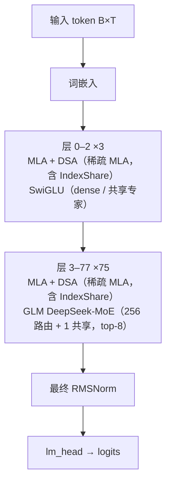

# GLM-5.3 · 架构说明（逐层）

> Zhipu AI / Z.ai (THUDM) · 发布 2026 · HF config `zai-org/GLM-5.3`（model_type `glm_moe_dsa`，arch `GlmMoeDsaForCausalLM`）+ THUDM/GLM-5 `README.md:20`（GLM-5.3 与 GLM-5.2 同基座，全部增益来自后训练）+ HF transformers `modeling_glm_moe_dsa.py`（transformers 5.15+）

> ⚠️ 文本模型；与 GLM-5.2 同基座，官方未开源独立建模代码

**技术定位**：GLM-5 系列的文本旗舰：与 GLM-5.2 同基座（744B-A40B、78 层），全部增益来自后训练。延续 MLA + DeepSeek Sparse Attention（DSA，每 query 只看 top-2048 token）与 IndexShare（每 4 个稀疏层共享一个 indexer），前 3 层 dense、其余 256 路由专家 + 1 共享专家（top-8），sigmoid 无辅助损失路由 + 1 层 MTP，原生 1M 上下文；支持 reasoning_effort = low / high / max。

## 1. 参数与配置

| 项 | 值 |
|---|---|
| 总参数 | 744B-A40B |
| 激活参数 | 40B（每 token 8 路由专家 + 1 共享专家） |
| 层数 | 78 |
| hidden | 6144 |
| Q 头 | 64 |
| KV 头 | 64（MLA 压缩 KV，非 GQA） |
| head_dim | 192（qk_nope）/ 64（qk_rope）/ 256（qk_head_dim）/ 256（v_head_dim） |
| FFN/MoE 中间维 | dense 12288 / MoE 2048×256 + 共享 |
| 词表 | 154880 |
| 上下文 | 1048576（1M） |
| 权重共享 | false |

**完整配置**：

| 字段 | 值 |
|---|---|
| model_type / arch | glm_moe_dsa（GlmMoeDsaForCausalLM） |
| num_hidden_layers | 78 |
| hidden_size | 6144 |
| num_attention_heads | 64 |
| num_key_value_heads | 64（MLA，非 GQA） |
| q_lora_rank / kv_lora_rank | 2048 / 512 |
| qk_nope_head_dim / qk_rope_head_dim | 192 / 64（qk_head_dim=256） |
| v_head_dim | 256 |
| head_dim | 192（= qk_nope_head_dim；RoPE 另 64） |
| index_n_heads / index_head_dim | 32 / 128 |
| index_topk | 2048 |
| index_topk_freq | 4（IndexShare：每 4 层共享 indexer） |
| indexer_types（full/shared） | 78 项；0–2 为 full，之后 6,10,…,74 为 full，其余 57 项为 shared |
| index_share_for_mtp_iteration | true |
| index_skip_topk_offset | 3 |
| indexer_rope_interleave | true |
| rope_theta / rope_type / rope_interleave | 8000000 / default / true |
| intermediate_size（dense） | 12288 |
| moe_intermediate_size | 2048 |
| n_routed_experts / n_shared_experts | 256 / 1 |
| num_experts_per_tok | 8 |
| first_k_dense_replace | 3 |
| mlp_layer_types | 78 项；0–2 dense，3–77 sparse |
| n_group / topk_group | 1 / 1 |
| scoring_func / topk_method | sigmoid / noaux_tc |
| norm_topk_prob / moe_router_dtype | true / float32 |
| routed_scaling_factor | 2.5 |
| num_nextn_predict_layers | 1（MTP） |
| rms_norm_eps | 1e-05 |
| vocab_size | 154880 |
| max_position_embeddings | 1048576 |
| attention_bias / attention_dropout | false / 0.0 |
| hidden_act | silu |
| tie_word_embeddings | false |
| dtype / quantization_config | bfloat16 / fp8（e4m3, activation dynamic, weight_block_size [128,128]） |
| eos_token_id / pad_token_id | [154820, 154827, 154829] / 154820 |
| transformers_version | 5.15.0 |

## 2. 技术方案与关键创新

**1. 同基座、纯后训练提升**　GLM-5.3 与 GLM-5.2 **使用同一 base model**，架构参数完全一致（78 层、744B-A40B），README 明确“every gain comes from post-training”。因此其编码/长程 agent 能力提升（Z.ai Code Bench +50%、Terminal Bench 3.0）来自更强的后训练与 RL，而非结构改动。

**2. MLA + DSA 稀疏注意力 + IndexShare**　注意力仍是 DeepSeek 式 MLA（KV 压成 512 维潜向量 + 64 维带位置分量），再叠加 DSA：小 indexer 为每个 query 选 `index_topk=2048` 个 token，只在这 2048 个位置做注意力。GLM-5.2 起引入 IndexShare，`indexer_types` 显示每 4 个稀疏层只保留 1 个 full indexer（其余 shared），1M 上下文下每 token FLOPs 降 2.9×。

**3. 256 专家 MoE + 无辅助损失路由**　前 3 层 dense（`first_k_dense_replace=3`），其后 256 个路由专家 + 1 个共享专家，每 token 激活 top-8；sigmoid 打分后加 `e_score_correction_bias`（noaux_tc）选专家，权重归一化后乘 2.5。与 GLM-5/5.2 同一套范式。

**4. 1M 上下文与 MTP**　`max_position_embeddings=1048576`，`rope_theta=8e6`、`rope_interleave=true`（非交织式），仅对 qk_rope 的 64 维旋转。`num_nextn_predict_layers=1` 提供 MTP 投机解码；部署经 SGLang / vLLM 的 GLM-5.2 路径。

**5. reasoning_effort 三档**　GLM-5.3 支持 `reasoning_effort` = `low` / `high` / `max`（缺省 max），chat template 中 `clear_thinking` 默认 false；相比 GLM-5.2 仅支持 high/max 更灵活。

**6. 家族演进（5.1 → 5.2 → 5.3）**　5.1 强化长程 agent；5.2 提出 IndexShare 并把上下文做到 1M；5.3 基座不变靠后训练提升；同系列的 5.3-Flash 才是新基座，首次引入稀疏 + 线性注意力混搭与 mHC。

## 3. 层级结构（可视化）



## 4. 逐层清单（共 78 层）

| 层 | Attention | FFN/MoE | 说明 |
|---|---|---|---|
| 0 | MLA + DSA（稀疏 MLA，含 IndexShare） | SwiGLU（dense / 共享专家） | 前 3 层 dense（first_k_dense_replace=3） |
| 1 | MLA + DSA（稀疏 MLA，含 IndexShare） | SwiGLU（dense / 共享专家） | 前 3 层 dense（first_k_dense_replace=3） |
| 2 | MLA + DSA（稀疏 MLA，含 IndexShare） | SwiGLU（dense / 共享专家） | 前 3 层 dense（first_k_dense_replace=3） |
| 3 | MLA + DSA（稀疏 MLA，含 IndexShare） | GLM DeepSeek-MoE（256 路由 + 1 共享，top-8） | MoE：256 路由 + 1 共享，top-8；IndexShare 每 4 层复用一个 indexer |
| 4 | MLA + DSA（稀疏 MLA，含 IndexShare） | GLM DeepSeek-MoE（256 路由 + 1 共享，top-8） | MoE：256 路由 + 1 共享，top-8；IndexShare 每 4 层复用一个 indexer |
| 5 | MLA + DSA（稀疏 MLA，含 IndexShare） | GLM DeepSeek-MoE（256 路由 + 1 共享，top-8） | MoE：256 路由 + 1 共享，top-8；IndexShare 每 4 层复用一个 indexer |
| 6 | MLA + DSA（稀疏 MLA，含 IndexShare） | GLM DeepSeek-MoE（256 路由 + 1 共享，top-8） | MoE：256 路由 + 1 共享，top-8；IndexShare 每 4 层复用一个 indexer |
| 7 | MLA + DSA（稀疏 MLA，含 IndexShare） | GLM DeepSeek-MoE（256 路由 + 1 共享，top-8） | MoE：256 路由 + 1 共享，top-8；IndexShare 每 4 层复用一个 indexer |
| 8 | MLA + DSA（稀疏 MLA，含 IndexShare） | GLM DeepSeek-MoE（256 路由 + 1 共享，top-8） | MoE：256 路由 + 1 共享，top-8；IndexShare 每 4 层复用一个 indexer |
| 9 | MLA + DSA（稀疏 MLA，含 IndexShare） | GLM DeepSeek-MoE（256 路由 + 1 共享，top-8） | MoE：256 路由 + 1 共享，top-8；IndexShare 每 4 层复用一个 indexer |
| 10 | MLA + DSA（稀疏 MLA，含 IndexShare） | GLM DeepSeek-MoE（256 路由 + 1 共享，top-8） | MoE：256 路由 + 1 共享，top-8；IndexShare 每 4 层复用一个 indexer |
| 11 | MLA + DSA（稀疏 MLA，含 IndexShare） | GLM DeepSeek-MoE（256 路由 + 1 共享，top-8） | MoE：256 路由 + 1 共享，top-8；IndexShare 每 4 层复用一个 indexer |
| 12 | MLA + DSA（稀疏 MLA，含 IndexShare） | GLM DeepSeek-MoE（256 路由 + 1 共享，top-8） | MoE：256 路由 + 1 共享，top-8；IndexShare 每 4 层复用一个 indexer |
| 13 | MLA + DSA（稀疏 MLA，含 IndexShare） | GLM DeepSeek-MoE（256 路由 + 1 共享，top-8） | MoE：256 路由 + 1 共享，top-8；IndexShare 每 4 层复用一个 indexer |
| 14 | MLA + DSA（稀疏 MLA，含 IndexShare） | GLM DeepSeek-MoE（256 路由 + 1 共享，top-8） | MoE：256 路由 + 1 共享，top-8；IndexShare 每 4 层复用一个 indexer |
| 15 | MLA + DSA（稀疏 MLA，含 IndexShare） | GLM DeepSeek-MoE（256 路由 + 1 共享，top-8） | MoE：256 路由 + 1 共享，top-8；IndexShare 每 4 层复用一个 indexer |
| 16 | MLA + DSA（稀疏 MLA，含 IndexShare） | GLM DeepSeek-MoE（256 路由 + 1 共享，top-8） | MoE：256 路由 + 1 共享，top-8；IndexShare 每 4 层复用一个 indexer |
| 17 | MLA + DSA（稀疏 MLA，含 IndexShare） | GLM DeepSeek-MoE（256 路由 + 1 共享，top-8） | MoE：256 路由 + 1 共享，top-8；IndexShare 每 4 层复用一个 indexer |
| 18 | MLA + DSA（稀疏 MLA，含 IndexShare） | GLM DeepSeek-MoE（256 路由 + 1 共享，top-8） | MoE：256 路由 + 1 共享，top-8；IndexShare 每 4 层复用一个 indexer |
| 19 | MLA + DSA（稀疏 MLA，含 IndexShare） | GLM DeepSeek-MoE（256 路由 + 1 共享，top-8） | MoE：256 路由 + 1 共享，top-8；IndexShare 每 4 层复用一个 indexer |
| 20 | MLA + DSA（稀疏 MLA，含 IndexShare） | GLM DeepSeek-MoE（256 路由 + 1 共享，top-8） | MoE：256 路由 + 1 共享，top-8；IndexShare 每 4 层复用一个 indexer |
| 21 | MLA + DSA（稀疏 MLA，含 IndexShare） | GLM DeepSeek-MoE（256 路由 + 1 共享，top-8） | MoE：256 路由 + 1 共享，top-8；IndexShare 每 4 层复用一个 indexer |
| 22 | MLA + DSA（稀疏 MLA，含 IndexShare） | GLM DeepSeek-MoE（256 路由 + 1 共享，top-8） | MoE：256 路由 + 1 共享，top-8；IndexShare 每 4 层复用一个 indexer |
| 23 | MLA + DSA（稀疏 MLA，含 IndexShare） | GLM DeepSeek-MoE（256 路由 + 1 共享，top-8） | MoE：256 路由 + 1 共享，top-8；IndexShare 每 4 层复用一个 indexer |
| 24 | MLA + DSA（稀疏 MLA，含 IndexShare） | GLM DeepSeek-MoE（256 路由 + 1 共享，top-8） | MoE：256 路由 + 1 共享，top-8；IndexShare 每 4 层复用一个 indexer |
| 25 | MLA + DSA（稀疏 MLA，含 IndexShare） | GLM DeepSeek-MoE（256 路由 + 1 共享，top-8） | MoE：256 路由 + 1 共享，top-8；IndexShare 每 4 层复用一个 indexer |
| 26 | MLA + DSA（稀疏 MLA，含 IndexShare） | GLM DeepSeek-MoE（256 路由 + 1 共享，top-8） | MoE：256 路由 + 1 共享，top-8；IndexShare 每 4 层复用一个 indexer |
| 27 | MLA + DSA（稀疏 MLA，含 IndexShare） | GLM DeepSeek-MoE（256 路由 + 1 共享，top-8） | MoE：256 路由 + 1 共享，top-8；IndexShare 每 4 层复用一个 indexer |
| 28 | MLA + DSA（稀疏 MLA，含 IndexShare） | GLM DeepSeek-MoE（256 路由 + 1 共享，top-8） | MoE：256 路由 + 1 共享，top-8；IndexShare 每 4 层复用一个 indexer |
| 29 | MLA + DSA（稀疏 MLA，含 IndexShare） | GLM DeepSeek-MoE（256 路由 + 1 共享，top-8） | MoE：256 路由 + 1 共享，top-8；IndexShare 每 4 层复用一个 indexer |
| 30 | MLA + DSA（稀疏 MLA，含 IndexShare） | GLM DeepSeek-MoE（256 路由 + 1 共享，top-8） | MoE：256 路由 + 1 共享，top-8；IndexShare 每 4 层复用一个 indexer |
| 31 | MLA + DSA（稀疏 MLA，含 IndexShare） | GLM DeepSeek-MoE（256 路由 + 1 共享，top-8） | MoE：256 路由 + 1 共享，top-8；IndexShare 每 4 层复用一个 indexer |
| 32 | MLA + DSA（稀疏 MLA，含 IndexShare） | GLM DeepSeek-MoE（256 路由 + 1 共享，top-8） | MoE：256 路由 + 1 共享，top-8；IndexShare 每 4 层复用一个 indexer |
| 33 | MLA + DSA（稀疏 MLA，含 IndexShare） | GLM DeepSeek-MoE（256 路由 + 1 共享，top-8） | MoE：256 路由 + 1 共享，top-8；IndexShare 每 4 层复用一个 indexer |
| 34 | MLA + DSA（稀疏 MLA，含 IndexShare） | GLM DeepSeek-MoE（256 路由 + 1 共享，top-8） | MoE：256 路由 + 1 共享，top-8；IndexShare 每 4 层复用一个 indexer |
| 35 | MLA + DSA（稀疏 MLA，含 IndexShare） | GLM DeepSeek-MoE（256 路由 + 1 共享，top-8） | MoE：256 路由 + 1 共享，top-8；IndexShare 每 4 层复用一个 indexer |
| 36 | MLA + DSA（稀疏 MLA，含 IndexShare） | GLM DeepSeek-MoE（256 路由 + 1 共享，top-8） | MoE：256 路由 + 1 共享，top-8；IndexShare 每 4 层复用一个 indexer |
| 37 | MLA + DSA（稀疏 MLA，含 IndexShare） | GLM DeepSeek-MoE（256 路由 + 1 共享，top-8） | MoE：256 路由 + 1 共享，top-8；IndexShare 每 4 层复用一个 indexer |
| 38 | MLA + DSA（稀疏 MLA，含 IndexShare） | GLM DeepSeek-MoE（256 路由 + 1 共享，top-8） | MoE：256 路由 + 1 共享，top-8；IndexShare 每 4 层复用一个 indexer |
| 39 | MLA + DSA（稀疏 MLA，含 IndexShare） | GLM DeepSeek-MoE（256 路由 + 1 共享，top-8） | MoE：256 路由 + 1 共享，top-8；IndexShare 每 4 层复用一个 indexer |
| 40 | MLA + DSA（稀疏 MLA，含 IndexShare） | GLM DeepSeek-MoE（256 路由 + 1 共享，top-8） | MoE：256 路由 + 1 共享，top-8；IndexShare 每 4 层复用一个 indexer |
| 41 | MLA + DSA（稀疏 MLA，含 IndexShare） | GLM DeepSeek-MoE（256 路由 + 1 共享，top-8） | MoE：256 路由 + 1 共享，top-8；IndexShare 每 4 层复用一个 indexer |
| 42 | MLA + DSA（稀疏 MLA，含 IndexShare） | GLM DeepSeek-MoE（256 路由 + 1 共享，top-8） | MoE：256 路由 + 1 共享，top-8；IndexShare 每 4 层复用一个 indexer |
| 43 | MLA + DSA（稀疏 MLA，含 IndexShare） | GLM DeepSeek-MoE（256 路由 + 1 共享，top-8） | MoE：256 路由 + 1 共享，top-8；IndexShare 每 4 层复用一个 indexer |
| 44 | MLA + DSA（稀疏 MLA，含 IndexShare） | GLM DeepSeek-MoE（256 路由 + 1 共享，top-8） | MoE：256 路由 + 1 共享，top-8；IndexShare 每 4 层复用一个 indexer |
| 45 | MLA + DSA（稀疏 MLA，含 IndexShare） | GLM DeepSeek-MoE（256 路由 + 1 共享，top-8） | MoE：256 路由 + 1 共享，top-8；IndexShare 每 4 层复用一个 indexer |
| 46 | MLA + DSA（稀疏 MLA，含 IndexShare） | GLM DeepSeek-MoE（256 路由 + 1 共享，top-8） | MoE：256 路由 + 1 共享，top-8；IndexShare 每 4 层复用一个 indexer |
| 47 | MLA + DSA（稀疏 MLA，含 IndexShare） | GLM DeepSeek-MoE（256 路由 + 1 共享，top-8） | MoE：256 路由 + 1 共享，top-8；IndexShare 每 4 层复用一个 indexer |
| 48 | MLA + DSA（稀疏 MLA，含 IndexShare） | GLM DeepSeek-MoE（256 路由 + 1 共享，top-8） | MoE：256 路由 + 1 共享，top-8；IndexShare 每 4 层复用一个 indexer |
| 49 | MLA + DSA（稀疏 MLA，含 IndexShare） | GLM DeepSeek-MoE（256 路由 + 1 共享，top-8） | MoE：256 路由 + 1 共享，top-8；IndexShare 每 4 层复用一个 indexer |
| 50 | MLA + DSA（稀疏 MLA，含 IndexShare） | GLM DeepSeek-MoE（256 路由 + 1 共享，top-8） | MoE：256 路由 + 1 共享，top-8；IndexShare 每 4 层复用一个 indexer |
| 51 | MLA + DSA（稀疏 MLA，含 IndexShare） | GLM DeepSeek-MoE（256 路由 + 1 共享，top-8） | MoE：256 路由 + 1 共享，top-8；IndexShare 每 4 层复用一个 indexer |
| 52 | MLA + DSA（稀疏 MLA，含 IndexShare） | GLM DeepSeek-MoE（256 路由 + 1 共享，top-8） | MoE：256 路由 + 1 共享，top-8；IndexShare 每 4 层复用一个 indexer |
| 53 | MLA + DSA（稀疏 MLA，含 IndexShare） | GLM DeepSeek-MoE（256 路由 + 1 共享，top-8） | MoE：256 路由 + 1 共享，top-8；IndexShare 每 4 层复用一个 indexer |
| 54 | MLA + DSA（稀疏 MLA，含 IndexShare） | GLM DeepSeek-MoE（256 路由 + 1 共享，top-8） | MoE：256 路由 + 1 共享，top-8；IndexShare 每 4 层复用一个 indexer |
| 55 | MLA + DSA（稀疏 MLA，含 IndexShare） | GLM DeepSeek-MoE（256 路由 + 1 共享，top-8） | MoE：256 路由 + 1 共享，top-8；IndexShare 每 4 层复用一个 indexer |
| 56 | MLA + DSA（稀疏 MLA，含 IndexShare） | GLM DeepSeek-MoE（256 路由 + 1 共享，top-8） | MoE：256 路由 + 1 共享，top-8；IndexShare 每 4 层复用一个 indexer |
| 57 | MLA + DSA（稀疏 MLA，含 IndexShare） | GLM DeepSeek-MoE（256 路由 + 1 共享，top-8） | MoE：256 路由 + 1 共享，top-8；IndexShare 每 4 层复用一个 indexer |
| 58 | MLA + DSA（稀疏 MLA，含 IndexShare） | GLM DeepSeek-MoE（256 路由 + 1 共享，top-8） | MoE：256 路由 + 1 共享，top-8；IndexShare 每 4 层复用一个 indexer |
| 59 | MLA + DSA（稀疏 MLA，含 IndexShare） | GLM DeepSeek-MoE（256 路由 + 1 共享，top-8） | MoE：256 路由 + 1 共享，top-8；IndexShare 每 4 层复用一个 indexer |
| 60 | MLA + DSA（稀疏 MLA，含 IndexShare） | GLM DeepSeek-MoE（256 路由 + 1 共享，top-8） | MoE：256 路由 + 1 共享，top-8；IndexShare 每 4 层复用一个 indexer |
| 61 | MLA + DSA（稀疏 MLA，含 IndexShare） | GLM DeepSeek-MoE（256 路由 + 1 共享，top-8） | MoE：256 路由 + 1 共享，top-8；IndexShare 每 4 层复用一个 indexer |
| 62 | MLA + DSA（稀疏 MLA，含 IndexShare） | GLM DeepSeek-MoE（256 路由 + 1 共享，top-8） | MoE：256 路由 + 1 共享，top-8；IndexShare 每 4 层复用一个 indexer |
| 63 | MLA + DSA（稀疏 MLA，含 IndexShare） | GLM DeepSeek-MoE（256 路由 + 1 共享，top-8） | MoE：256 路由 + 1 共享，top-8；IndexShare 每 4 层复用一个 indexer |
| 64 | MLA + DSA（稀疏 MLA，含 IndexShare） | GLM DeepSeek-MoE（256 路由 + 1 共享，top-8） | MoE：256 路由 + 1 共享，top-8；IndexShare 每 4 层复用一个 indexer |
| 65 | MLA + DSA（稀疏 MLA，含 IndexShare） | GLM DeepSeek-MoE（256 路由 + 1 共享，top-8） | MoE：256 路由 + 1 共享，top-8；IndexShare 每 4 层复用一个 indexer |
| 66 | MLA + DSA（稀疏 MLA，含 IndexShare） | GLM DeepSeek-MoE（256 路由 + 1 共享，top-8） | MoE：256 路由 + 1 共享，top-8；IndexShare 每 4 层复用一个 indexer |
| 67 | MLA + DSA（稀疏 MLA，含 IndexShare） | GLM DeepSeek-MoE（256 路由 + 1 共享，top-8） | MoE：256 路由 + 1 共享，top-8；IndexShare 每 4 层复用一个 indexer |
| 68 | MLA + DSA（稀疏 MLA，含 IndexShare） | GLM DeepSeek-MoE（256 路由 + 1 共享，top-8） | MoE：256 路由 + 1 共享，top-8；IndexShare 每 4 层复用一个 indexer |
| 69 | MLA + DSA（稀疏 MLA，含 IndexShare） | GLM DeepSeek-MoE（256 路由 + 1 共享，top-8） | MoE：256 路由 + 1 共享，top-8；IndexShare 每 4 层复用一个 indexer |
| 70 | MLA + DSA（稀疏 MLA，含 IndexShare） | GLM DeepSeek-MoE（256 路由 + 1 共享，top-8） | MoE：256 路由 + 1 共享，top-8；IndexShare 每 4 层复用一个 indexer |
| 71 | MLA + DSA（稀疏 MLA，含 IndexShare） | GLM DeepSeek-MoE（256 路由 + 1 共享，top-8） | MoE：256 路由 + 1 共享，top-8；IndexShare 每 4 层复用一个 indexer |
| 72 | MLA + DSA（稀疏 MLA，含 IndexShare） | GLM DeepSeek-MoE（256 路由 + 1 共享，top-8） | MoE：256 路由 + 1 共享，top-8；IndexShare 每 4 层复用一个 indexer |
| 73 | MLA + DSA（稀疏 MLA，含 IndexShare） | GLM DeepSeek-MoE（256 路由 + 1 共享，top-8） | MoE：256 路由 + 1 共享，top-8；IndexShare 每 4 层复用一个 indexer |
| 74 | MLA + DSA（稀疏 MLA，含 IndexShare） | GLM DeepSeek-MoE（256 路由 + 1 共享，top-8） | MoE：256 路由 + 1 共享，top-8；IndexShare 每 4 层复用一个 indexer |
| 75 | MLA + DSA（稀疏 MLA，含 IndexShare） | GLM DeepSeek-MoE（256 路由 + 1 共享，top-8） | MoE：256 路由 + 1 共享，top-8；IndexShare 每 4 层复用一个 indexer |
| 76 | MLA + DSA（稀疏 MLA，含 IndexShare） | GLM DeepSeek-MoE（256 路由 + 1 共享，top-8） | MoE：256 路由 + 1 共享，top-8；IndexShare 每 4 层复用一个 indexer |
| 77 | MLA + DSA（稀疏 MLA，含 IndexShare） | GLM DeepSeek-MoE（256 路由 + 1 共享，top-8） | MoE：256 路由 + 1 共享，top-8；IndexShare 每 4 层复用一个 indexer |

## 5. 关键模块：数学公式与代码

### 注意力 · MLA + DSA（稀疏 MLA，含 IndexShare）

每层都用 MLA 低秩压缩构造 Q/K/V：query 先降到 q_lora_rank=2048 再展开，KV 压成 kv_lora_rank=512 的潜向量 + 64 维带位置分量；qk 头维 192(nope)+64(rope)=256，v 头维 256。DSA indexer（32 头、头维 128、ReLU 打分、per-head 权重）为每个 query 选 index_topk=2048 个 token，只在这些位置做注意力。GLM-5.2 起 IndexShare：每 4 个稀疏层只用 1 个 full indexer，其余层复用。

$$
c_t^{KV}=W^{DKV}h_t\in\mathbb{R}^{512},\quad k_t^{C}=\mathrm{RMSNorm}\!\left(W^{UK}c_t^{KV}\right)
$$

$$
q_t=\mathrm{expand}\!\left(\mathrm{RMSNorm}(W^{DQ}h_t)\right),\quad k_t=[k_t^{C};\,k_t^{R}],\;k_t^{R}=\mathrm{RoPE}(W^{KR}h_t)
$$

$$
s_{t,s}=\sum_{h}w_{t,h}\,\mathrm{ReLU}\!\left(q_{t,h}\!\cdot\!k_s\right)\cdot d^{-1/2}
$$

$$
\mathcal{I}_t=\mathrm{topk}_{s}\,s_{t,s}\;\;(k=2048),\qquad \mathrm{Attn}_t=\mathrm{softmax}_{s\in\mathcal{I}_t}\!\left(\frac{q_tk_s^{\top}}{\sqrt{256}}+M\right)v_s
$$

```python
# HF transformers modeling_glm_moe_dsa.py — GlmMoeDsaAttention + GlmMoeDsaIndexer
# https://github.com/huggingface/transformers/blob/main/src/transformers/models/glm_moe_dsa/modeling_glm_moe_dsa.py
q_resid = self.q_a_layernorm(self.q_a_proj(hidden_states))          # q_lora_rank = 2048
q_states = self.q_b_proj(q_resid).view(query_shape).transpose(1, 2)
q_pass, q_rot = torch.split(q_states, [self.qk_nope_head_dim, self.qk_rope_head_dim], dim=-1)
compressed_kv = self.kv_a_proj_with_mqa(hidden_states)
kv_pass, k_rot = torch.split(compressed_kv, [self.kv_lora_rank, self.qk_rope_head_dim], dim=-1)
k_pass = self.kv_a_layernorm(kv_pass).view(batch_size, 1, seq_length, self.kv_lora_rank)
q_rot, k_rot = apply_rotary_pos_emb_interleave(q_rot, k_rot, cos, sin)
key_states, value_states = self.expand_kv(k_pass, k_rot)
# IndexShare: indexer_types[layer_idx] == "shared" 时复用最近的 full indexer
topk_indices = self.indexer(hidden_states, q_resid, position_embeddings, ...)  # DSA top-2048
# 仅保留 topk 位置的 key/value 参与注意力
```

### 前馈/MoE · SwiGLU（dense / 共享专家）

前 3 层 dense FFN 与 MoE 的共享专家均为标准 SwiGLU，dense 中间维 12288、共享专家 2048。

$$
\mathrm{SwiGLU}(x)=W_{down}\big(\mathrm{SiLU}(W_{gate}x)\odot W_{up}x\big)
$$

```python
# HF transformers modeling_glm_moe_dsa.py — GlmMoeDsaMLP
return self.down_proj(self.act_fn(self.gate_proj(x)) * self.up_proj(x))
```

### 前馈/MoE · GLM DeepSeek-MoE（256 路由 + 1 共享，top-8）

sigmoid 打分 + e_score_correction_bias（noaux_tc 无辅助损失）选 top-8，权重按 norm_topk_prob 归一化后乘 routed_scaling_factor=2.5；8 个专家的 SwiGLU 输出加权求和，再叠加恒开的共享专家。

$$
s=\sigma(W_g x),\quad \tilde{s}=s+b_{corr},\quad \mathcal{T}=\mathrm{top8}(\tilde{s})
$$

$$
y=\sum_{i\in\mathcal{T}}\frac{s_i}{\sum_{j\in\mathcal{T}}s_j}\cdot 2.5\,\cdot\,\mathrm{Expert}_i(x)+\mathrm{Shared}(x)
$$

```python
# HF transformers modeling_glm_moe_dsa.py — GlmMoeDsaTopkRouter + GlmMoeDsaMoE
scores = router_logits.sigmoid()
scores_for_choice = scores + self.e_score_correction_bias
topk_indices = torch.topk(scores_for_choice, k=self.top_k, dim=-1, sorted=False)[1]
topk_weights = scores.gather(1, topk_indices) / (scores.gather(1, topk_indices).sum(-1, keepdim=True) + 1e-20)
hidden_states = self.experts(hidden_states, topk_indices, topk_weights).view(*orig_shape)
hidden_states = hidden_states + self.shared_experts(residuals)
```

### RMSNorm

$$
\mathrm{RMSNorm}(x)=\frac{x}{\sqrt{\frac{1}{d}\sum_{i=1}^{d}x_i^{2}+\epsilon}}\odot\gamma
$$

### MLA 低秩 KV 压缩

KV 只缓存 512 维潜向量 c^{KV} 与 64 维带位置分量 k^R（每 token 576 维），而非完整 K/V。

$$
\#\,\text{cached per token}=512+64=576\ \ (\text{vs. GQA 的 } H_{kv}\cdot 2d_h)
$$

$$
v_t=W^{UV}c_t^{KV},\qquad k_t^{C}=W^{UK}c_t^{KV}
$$

### DSA indexer 打分

indexer 有独立的 wq_b（q_lora_rank→32×128）与 wk（hidden→128），weights_proj 给出每头权重；对全序列打分后取 top-2048。

$$
q^{\,idx}=\mathrm{RoPE}\!\left(W_{q}^{idx}\,q_{resid}\right),\quad k^{\,idx}=\mathrm{RMSNorm}\!\left(W_{k}^{idx}h\right)
$$

$$
s_{t,s}=\sum_{h=1}^{32}w_{t,h}\cdot\mathrm{ReLU}\!\left(q^{\,idx}_{t,h}\cdot k^{\,idx}_{s}\right)\cdot 128^{-1/2}
$$

### 部分 RoPE（interleaved，θ=8e6）

只对 qk_rope 的 64 维（共 256 头维的 1/4）做旋转；rope_interleave=true 表示相邻维成对旋转。

$$
\theta_i=\theta_0^{-2i/64},\quad \theta_0=8\times10^{6}
$$

$$
\mathrm{RoPE}_{int}(x_{2i},x_{2i+1})=\begin{bmatrix}x_{2i}\cos m\theta_i-x_{2i+1}\sin m\theta_i\\ x_{2i}\sin m\theta_i+x_{2i+1}\cos m\theta_i\end{bmatrix}
$$

### IndexShare

index_topk_freq=4：每 4 个稀疏注意力层共享同一个 indexer，indexer_types 中标记为 shared 的层复用最近一个 full 层的 indexer，1M 上下文下显著降低 per-token FLOPs。

$$
\mathrm{indexer}(l)=\mathrm{shared}\ \text{时复用}\ \mathrm{indexer}(l_{full}),\quad l_{full}=\lfloor l/4\rfloor\cdot 4
$$

### MTP（多 token 预测）

num_nextn_predict_layers=1：主干后接 1 个 MTP 层用于投机解码。

$$
p(x_{t+1},x_{t+2}\mid x_{\le t})\;\approx\;p_{head}\!\left(\mathrm{MTP}(h_t)\right)
$$

## 6. 张量形状流

| 阶段 | 形状 | 说明 |
|---|---|---|
| 输入 token id | `[B, T]` | 文本模态 |
| 词嵌入 | `[B, T, 6144]` |  |
| 层 0–2（dense） | `[B, T, 6144]` | MLA+DSA + SwiGLU |
| 层 3–77（MoE） | `[B, T, 6144]` | MLA+DSA + 8/256 路由 + 1 共享 |
| 最终 RMSNorm | `[B, T, 6144]` |  |
| lm_head（不共享） | `[B, T, 154880]` |  |
| MTP 头（1 层） | `[B, T, 154880]` | 投机解码用 |

## 7. 关键源码（引自 reference/）

**MLA 主注意力（低秩 Q/KV）**　`https://github.com/huggingface/transformers/blob/main/src/transformers/models/glm_moe_dsa/modeling_glm_moe_dsa.py`

```python
q_resid = self.q_a_layernorm(self.q_a_proj(hidden_states))
q_states = self.q_b_proj(q_resid).view(query_shape).transpose(1, 2)
q_pass, q_rot = torch.split(q_states, [self.qk_nope_head_dim, self.qk_rope_head_dim], dim=-1)
compressed_kv = self.kv_a_proj_with_mqa(hidden_states)
kv_pass, k_rot = torch.split(compressed_kv, [self.kv_lora_rank, self.qk_rope_head_dim], dim=-1)
k_pass = self.kv_a_layernorm(kv_pass).view(batch_size, 1, seq_length, self.kv_lora_rank)
q_rot, k_rot = apply_rotary_pos_emb_interleave(q_rot, k_rot, cos, sin)
key_states, value_states = self.expand_kv(k_pass, k_rot)
```

**DSA indexer：为每个 query 选 top-2048 token**　`https://github.com/huggingface/transformers/blob/main/src/transformers/models/glm_moe_dsa/modeling_glm_moe_dsa.py`

```python
q = self.wq_b(q_resid).view(batch_size, seq_len, self.n_heads, self.head_dim)
k = self.k_norm(self.wk(hidden_states)).unsqueeze(2)
q_rot, k_rot = apply_rotary_pos_emb_interleave(q_rot, k_rot, cos, sin)
scores = F.relu(torch.matmul(q.float(), k.transpose(-1, -2).float()) * self.softmax_scale)
weights = self.weights_proj(hidden_states).float() * (self.n_heads ** -0.5)
index_scores = torch.matmul(weights.unsqueeze(-2), scores).squeeze(-2)
return index_scores.topk(min(self.index_topk, index_scores.shape[-1]), dim=-1).indices.to(torch.int32)
```

**GLM-5.3 与 GLM-5.2 同基座（README）**　`reference/GLM-5/README.md:20`

```text
GLM-5.3 uses the same base model as GLM-5.2 - every gain comes from post-training.
```

**IndexShare：每 4 个稀疏层复用一个 indexer（README）**　`reference/GLM-5/README.md:39`

```text
We propose IndexShare, which reuses the same indexer across every four sparse attention layers, reducing per-token FLOPs by 2.9x at a 1M context length.
```

## 8. 与 mini-llm-lab 的差异

GLM-5.3 相对我们手写 mini-llm-lab（~192M，RoPE + RMSNorm + SwiGLU + GQA）是数量级与结构双重差异：

- **注意力**：mini 是 GQA + 全量 RoPE；GLM-5.3 是 **MLA**（KV 压成 512+64 维/token）再加 **DSA**（每 query 只看 top-2048 token），复杂度从 O(T²) 降到近似 O(T·2048)，并用 IndexShare 每 4 层复用一个 indexer；
- **FFN**：mini 单 SwiGLU；GLM-5.3 前 3 层 SwiGLU，其余 256 路由专家 + 1 共享、每 token 8 个；
- **规模**：hidden 6144 × 78 层、744B 总参，是 mini 的数千倍；上下文 1M；
- **位置/路由**：sigmoid 无辅助损失 routing、interleaved RoPE θ=8e6、1 层 MTP。

要在 mini 里体会，可先加 MoE（对齐 GLM-4.5），再单独实现 MLA+DSA 与 IndexShare。

## 9. 3D 可视化

启动可视化网页后，在「架构浏览器」视图选择本模型（id：`glm-5.3`），可三维查看每一层并点开公式/代码：

```powershell
& ".venv\Scripts\python.exe" viz/server.py   # 打开 http://127.0.0.1:7861 → 架构浏览器
```

## 10. 参考资料

- [GLM-5.3（z.ai blog）](https://z.ai/blog/glm-5.3)
- [GLM-5 技术报告（arXiv:2602.15763）](https://arxiv.org/abs/2602.15763)
- [zai-org/GLM-5.3（HF）](https://huggingface.co/zai-org/GLM-5.3)
- [HF transformers modeling_glm_moe_dsa.py](https://github.com/huggingface/transformers/blob/main/src/transformers/models/glm_moe_dsa/modeling_glm_moe_dsa.py)
