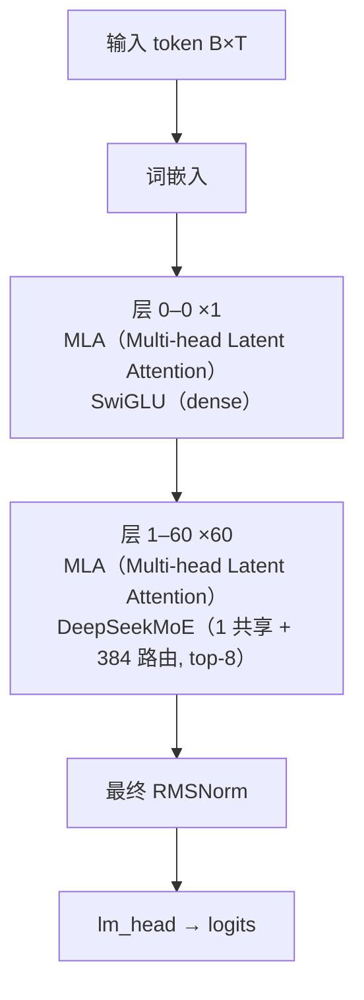

# Kimi-K2.5 · 架构说明（逐层）

> Moonshot AI · 发布 2026-01 · moonshotai/Kimi-K2.5（README + docs/deploy_guidance.md）+ HF `moonshotai/Kimi-K2.5` config.json；文本主干沿用 K2 的 MLA / DeepSeekMoE（MLA 参考实现见 `reference/DeepSeek-V3/inference/model.py`）

**技术定位**：在 Kimi-K2-Base 之上继续预训练约 15T 图文混合 token 得到的原生多模态 agentic 模型：文本主干与 K2 同构（61 层、MLA + DeepSeekMoE 384+1/top-8、1T 总参 / 32B 激活），外加 400M MoonViT 视觉编码器，上下文 128K→256K，支持 instant/thinking 双模式与 Agent Swarm。

## 1. 参数与配置

| 项 | 值 |
|---|---|
| 总参数 | 1T（+0.4B 视觉编码器） |
| 激活参数 | 32B |
| 层数 | 61 |
| hidden | 7168 |
| Q 头 | 64 |
| KV 头 | 64（MLA：KV 压成 512 维 latent + 64 维 rope） |
| head_dim | 192（qk = 128 nope + 64 rope）/ v = 128 |
| FFN/MoE 中间维 | dense 18432；MoE 每专家 2048 |
| 词表 | 163840（160K） |
| 上下文 | 262144（256K） |
| 权重共享 | False |

**完整配置**：

| 字段 | 值 |
|---|---|
| architectures | KimiK25ForConditionalGeneration |
| num_hidden_layers | 61 |
| hidden_size | 7168 |
| num_attention_heads | 64 |
| num_key_value_heads | 64（MLA） |
| q_lora_rank | 1536 |
| kv_lora_rank | 512 |
| qk_nope_head_dim | 128 |
| qk_rope_head_dim | 64 |
| v_head_dim | 128 |
| intermediate_size | 18432（dense 层） |
| moe_intermediate_size | 2048（每专家） |
| n_routed_experts | 384 |
| n_shared_experts | 1 |
| num_experts_per_tok | 8 |
| first_k_dense_replace | 1（仅第 0 层为 dense FFN） |
| scoring_func / topk_method | sigmoid / noaux_tc |
| routed_scaling_factor | 2.827 |
| hidden_act | silu（SwiGLU） |
| rms_norm_eps | 1e-5 |
| rope_theta | 50000 |
| rope_scaling | YaRN，factor 64，beta_fast 32，原长 4096 |
| max_position_embeddings | 262144 |
| num_nextn_predict_layers | 0（未启用 MTP） |
| tie_word_embeddings | false |
| vocab_size | 163840 |
| quantization | 原生 INT4（compressed-tensors，group_size 32，attn/shared-expert/lm_head 除外） |
| vision_config | MoonViT：27 层、hidden 1152、16 头、patch 14、sd2_tpool 2×2 merge、patchmerger 投影；约 400M |
| use_unified_vision_chunk | true |

**视觉 / 多模态方案**：

MoonViT（约 400M / 27 层 / 1152 维 / patch 14 / sd2_tpool）；约 15T 图文继续预训练；原生 INT4

## 2. 技术方案与关键创新

**1. 原生多模态（continual pretraining）**　从 Kimi-K2-Base 出发，用约 15T 图文混合 token 继续预训练，把视觉编码器直接接进 token 流，而非外挂式适配器。文本/视觉共享同一个 1T MoE 主干。

**2. MoonViT 视觉编码器**　27 层、1152 维、16 头的 ViT，patch 14、3D（图/视频）位置编码 sd2_tpool 2×2 合并，经 patchmerger 投到 7168 维文本空间。K2.5 的视觉塔约 400M 参数。

**3. Coding with Vision / Agent Swarm**　能按视觉规格（UI 设计、视频工作流）生成代码，并把复杂任务拆成并行子任务、动态实例化领域子 agent（Agent Swarm），从单 agent 扩展到群体执行。

**4. 128K → 256K 上下文**　位置编码仍是 partial RoPE θ=50000，但 YaRN factor 从 K2 的 32 提到 64，max_position_embeddings 从 131072 翻倍到 262144。

**5. 原生 INT4 量化**　沿用 K2-Thinking 的原生 int4 方案（compressed-tensors，group_size 32，权重 int4），对自注意力、共享专家、路由专家与 lm_head 选择性忽略以保精度。

## 3. 层级结构（可视化）



## 4. 逐层清单（共 61 层）

| 层 | Attention | FFN/MoE | 说明 |
|---|---|---|---|
| 0 | MLA（Multi-head Latent Attention） | SwiGLU（dense） | 第 0 层：dense FFN（first_k_dense_replace=1） |
| 1 | MLA（Multi-head Latent Attention） | DeepSeekMoE（1 共享 + 384 路由, top-8） | 第 1–60 层：MLA + MoE（1 共享 + 384 路由，top-8） |
| 2 | MLA（Multi-head Latent Attention） | DeepSeekMoE（1 共享 + 384 路由, top-8） | 第 1–60 层：MLA + MoE（1 共享 + 384 路由，top-8） |
| 3 | MLA（Multi-head Latent Attention） | DeepSeekMoE（1 共享 + 384 路由, top-8） | 第 1–60 层：MLA + MoE（1 共享 + 384 路由，top-8） |
| 4 | MLA（Multi-head Latent Attention） | DeepSeekMoE（1 共享 + 384 路由, top-8） | 第 1–60 层：MLA + MoE（1 共享 + 384 路由，top-8） |
| 5 | MLA（Multi-head Latent Attention） | DeepSeekMoE（1 共享 + 384 路由, top-8） | 第 1–60 层：MLA + MoE（1 共享 + 384 路由，top-8） |
| 6 | MLA（Multi-head Latent Attention） | DeepSeekMoE（1 共享 + 384 路由, top-8） | 第 1–60 层：MLA + MoE（1 共享 + 384 路由，top-8） |
| 7 | MLA（Multi-head Latent Attention） | DeepSeekMoE（1 共享 + 384 路由, top-8） | 第 1–60 层：MLA + MoE（1 共享 + 384 路由，top-8） |
| 8 | MLA（Multi-head Latent Attention） | DeepSeekMoE（1 共享 + 384 路由, top-8） | 第 1–60 层：MLA + MoE（1 共享 + 384 路由，top-8） |
| 9 | MLA（Multi-head Latent Attention） | DeepSeekMoE（1 共享 + 384 路由, top-8） | 第 1–60 层：MLA + MoE（1 共享 + 384 路由，top-8） |
| 10 | MLA（Multi-head Latent Attention） | DeepSeekMoE（1 共享 + 384 路由, top-8） | 第 1–60 层：MLA + MoE（1 共享 + 384 路由，top-8） |
| 11 | MLA（Multi-head Latent Attention） | DeepSeekMoE（1 共享 + 384 路由, top-8） | 第 1–60 层：MLA + MoE（1 共享 + 384 路由，top-8） |
| 12 | MLA（Multi-head Latent Attention） | DeepSeekMoE（1 共享 + 384 路由, top-8） | 第 1–60 层：MLA + MoE（1 共享 + 384 路由，top-8） |
| 13 | MLA（Multi-head Latent Attention） | DeepSeekMoE（1 共享 + 384 路由, top-8） | 第 1–60 层：MLA + MoE（1 共享 + 384 路由，top-8） |
| 14 | MLA（Multi-head Latent Attention） | DeepSeekMoE（1 共享 + 384 路由, top-8） | 第 1–60 层：MLA + MoE（1 共享 + 384 路由，top-8） |
| 15 | MLA（Multi-head Latent Attention） | DeepSeekMoE（1 共享 + 384 路由, top-8） | 第 1–60 层：MLA + MoE（1 共享 + 384 路由，top-8） |
| 16 | MLA（Multi-head Latent Attention） | DeepSeekMoE（1 共享 + 384 路由, top-8） | 第 1–60 层：MLA + MoE（1 共享 + 384 路由，top-8） |
| 17 | MLA（Multi-head Latent Attention） | DeepSeekMoE（1 共享 + 384 路由, top-8） | 第 1–60 层：MLA + MoE（1 共享 + 384 路由，top-8） |
| 18 | MLA（Multi-head Latent Attention） | DeepSeekMoE（1 共享 + 384 路由, top-8） | 第 1–60 层：MLA + MoE（1 共享 + 384 路由，top-8） |
| 19 | MLA（Multi-head Latent Attention） | DeepSeekMoE（1 共享 + 384 路由, top-8） | 第 1–60 层：MLA + MoE（1 共享 + 384 路由，top-8） |
| 20 | MLA（Multi-head Latent Attention） | DeepSeekMoE（1 共享 + 384 路由, top-8） | 第 1–60 层：MLA + MoE（1 共享 + 384 路由，top-8） |
| 21 | MLA（Multi-head Latent Attention） | DeepSeekMoE（1 共享 + 384 路由, top-8） | 第 1–60 层：MLA + MoE（1 共享 + 384 路由，top-8） |
| 22 | MLA（Multi-head Latent Attention） | DeepSeekMoE（1 共享 + 384 路由, top-8） | 第 1–60 层：MLA + MoE（1 共享 + 384 路由，top-8） |
| 23 | MLA（Multi-head Latent Attention） | DeepSeekMoE（1 共享 + 384 路由, top-8） | 第 1–60 层：MLA + MoE（1 共享 + 384 路由，top-8） |
| 24 | MLA（Multi-head Latent Attention） | DeepSeekMoE（1 共享 + 384 路由, top-8） | 第 1–60 层：MLA + MoE（1 共享 + 384 路由，top-8） |
| 25 | MLA（Multi-head Latent Attention） | DeepSeekMoE（1 共享 + 384 路由, top-8） | 第 1–60 层：MLA + MoE（1 共享 + 384 路由，top-8） |
| 26 | MLA（Multi-head Latent Attention） | DeepSeekMoE（1 共享 + 384 路由, top-8） | 第 1–60 层：MLA + MoE（1 共享 + 384 路由，top-8） |
| 27 | MLA（Multi-head Latent Attention） | DeepSeekMoE（1 共享 + 384 路由, top-8） | 第 1–60 层：MLA + MoE（1 共享 + 384 路由，top-8） |
| 28 | MLA（Multi-head Latent Attention） | DeepSeekMoE（1 共享 + 384 路由, top-8） | 第 1–60 层：MLA + MoE（1 共享 + 384 路由，top-8） |
| 29 | MLA（Multi-head Latent Attention） | DeepSeekMoE（1 共享 + 384 路由, top-8） | 第 1–60 层：MLA + MoE（1 共享 + 384 路由，top-8） |
| 30 | MLA（Multi-head Latent Attention） | DeepSeekMoE（1 共享 + 384 路由, top-8） | 第 1–60 层：MLA + MoE（1 共享 + 384 路由，top-8） |
| 31 | MLA（Multi-head Latent Attention） | DeepSeekMoE（1 共享 + 384 路由, top-8） | 第 1–60 层：MLA + MoE（1 共享 + 384 路由，top-8） |
| 32 | MLA（Multi-head Latent Attention） | DeepSeekMoE（1 共享 + 384 路由, top-8） | 第 1–60 层：MLA + MoE（1 共享 + 384 路由，top-8） |
| 33 | MLA（Multi-head Latent Attention） | DeepSeekMoE（1 共享 + 384 路由, top-8） | 第 1–60 层：MLA + MoE（1 共享 + 384 路由，top-8） |
| 34 | MLA（Multi-head Latent Attention） | DeepSeekMoE（1 共享 + 384 路由, top-8） | 第 1–60 层：MLA + MoE（1 共享 + 384 路由，top-8） |
| 35 | MLA（Multi-head Latent Attention） | DeepSeekMoE（1 共享 + 384 路由, top-8） | 第 1–60 层：MLA + MoE（1 共享 + 384 路由，top-8） |
| 36 | MLA（Multi-head Latent Attention） | DeepSeekMoE（1 共享 + 384 路由, top-8） | 第 1–60 层：MLA + MoE（1 共享 + 384 路由，top-8） |
| 37 | MLA（Multi-head Latent Attention） | DeepSeekMoE（1 共享 + 384 路由, top-8） | 第 1–60 层：MLA + MoE（1 共享 + 384 路由，top-8） |
| 38 | MLA（Multi-head Latent Attention） | DeepSeekMoE（1 共享 + 384 路由, top-8） | 第 1–60 层：MLA + MoE（1 共享 + 384 路由，top-8） |
| 39 | MLA（Multi-head Latent Attention） | DeepSeekMoE（1 共享 + 384 路由, top-8） | 第 1–60 层：MLA + MoE（1 共享 + 384 路由，top-8） |
| 40 | MLA（Multi-head Latent Attention） | DeepSeekMoE（1 共享 + 384 路由, top-8） | 第 1–60 层：MLA + MoE（1 共享 + 384 路由，top-8） |
| 41 | MLA（Multi-head Latent Attention） | DeepSeekMoE（1 共享 + 384 路由, top-8） | 第 1–60 层：MLA + MoE（1 共享 + 384 路由，top-8） |
| 42 | MLA（Multi-head Latent Attention） | DeepSeekMoE（1 共享 + 384 路由, top-8） | 第 1–60 层：MLA + MoE（1 共享 + 384 路由，top-8） |
| 43 | MLA（Multi-head Latent Attention） | DeepSeekMoE（1 共享 + 384 路由, top-8） | 第 1–60 层：MLA + MoE（1 共享 + 384 路由，top-8） |
| 44 | MLA（Multi-head Latent Attention） | DeepSeekMoE（1 共享 + 384 路由, top-8） | 第 1–60 层：MLA + MoE（1 共享 + 384 路由，top-8） |
| 45 | MLA（Multi-head Latent Attention） | DeepSeekMoE（1 共享 + 384 路由, top-8） | 第 1–60 层：MLA + MoE（1 共享 + 384 路由，top-8） |
| 46 | MLA（Multi-head Latent Attention） | DeepSeekMoE（1 共享 + 384 路由, top-8） | 第 1–60 层：MLA + MoE（1 共享 + 384 路由，top-8） |
| 47 | MLA（Multi-head Latent Attention） | DeepSeekMoE（1 共享 + 384 路由, top-8） | 第 1–60 层：MLA + MoE（1 共享 + 384 路由，top-8） |
| 48 | MLA（Multi-head Latent Attention） | DeepSeekMoE（1 共享 + 384 路由, top-8） | 第 1–60 层：MLA + MoE（1 共享 + 384 路由，top-8） |
| 49 | MLA（Multi-head Latent Attention） | DeepSeekMoE（1 共享 + 384 路由, top-8） | 第 1–60 层：MLA + MoE（1 共享 + 384 路由，top-8） |
| 50 | MLA（Multi-head Latent Attention） | DeepSeekMoE（1 共享 + 384 路由, top-8） | 第 1–60 层：MLA + MoE（1 共享 + 384 路由，top-8） |
| 51 | MLA（Multi-head Latent Attention） | DeepSeekMoE（1 共享 + 384 路由, top-8） | 第 1–60 层：MLA + MoE（1 共享 + 384 路由，top-8） |
| 52 | MLA（Multi-head Latent Attention） | DeepSeekMoE（1 共享 + 384 路由, top-8） | 第 1–60 层：MLA + MoE（1 共享 + 384 路由，top-8） |
| 53 | MLA（Multi-head Latent Attention） | DeepSeekMoE（1 共享 + 384 路由, top-8） | 第 1–60 层：MLA + MoE（1 共享 + 384 路由，top-8） |
| 54 | MLA（Multi-head Latent Attention） | DeepSeekMoE（1 共享 + 384 路由, top-8） | 第 1–60 层：MLA + MoE（1 共享 + 384 路由，top-8） |
| 55 | MLA（Multi-head Latent Attention） | DeepSeekMoE（1 共享 + 384 路由, top-8） | 第 1–60 层：MLA + MoE（1 共享 + 384 路由，top-8） |
| 56 | MLA（Multi-head Latent Attention） | DeepSeekMoE（1 共享 + 384 路由, top-8） | 第 1–60 层：MLA + MoE（1 共享 + 384 路由，top-8） |
| 57 | MLA（Multi-head Latent Attention） | DeepSeekMoE（1 共享 + 384 路由, top-8） | 第 1–60 层：MLA + MoE（1 共享 + 384 路由，top-8） |
| 58 | MLA（Multi-head Latent Attention） | DeepSeekMoE（1 共享 + 384 路由, top-8） | 第 1–60 层：MLA + MoE（1 共享 + 384 路由，top-8） |
| 59 | MLA（Multi-head Latent Attention） | DeepSeekMoE（1 共享 + 384 路由, top-8） | 第 1–60 层：MLA + MoE（1 共享 + 384 路由，top-8） |
| 60 | MLA（Multi-head Latent Attention） | DeepSeekMoE（1 共享 + 384 路由, top-8） | 第 1–60 层：MLA + MoE（1 共享 + 384 路由，top-8） |

## 5. 关键模块：数学公式与代码

### 注意力 · MLA（Multi-head Latent Attention）

与 Kimi-K2 完全一致的 MLA：低秩 Q（1536）+ KV 联合低秩压缩（512 latent + 64 rope），partial/decoupled RoPE。K2.5 的 text_config 与 K2 同名同参，复用 DeepSeek-V3 风格实现。

$$
\mathbf{c}_q=\mathrm{RMSNorm}\!\big(W_{qa}\mathbf{x}\big),\quad \mathbf{q}=W_{qb}\,\mathbf{c}_q
$$

$$
\mathbf{c}_{kv}=\mathrm{RMSNorm}\!\big(W_{kva}\mathbf{x}\big)\in\mathbb{R}^{512},\quad \mathbf{k}_{pe}=W_{kr}\mathbf{x}\in\mathbb{R}^{64}
$$

$$
\mathbf{k}_{nope}=W_{kvb}\,\mathbf{c}_{kv},\quad \mathbf{v}=W_{kvb}\,\mathbf{c}_{kv}
$$

$$
\mathrm{MLA}(\mathbf{x})=\mathrm{softmax}\!\Big(\frac{[\mathbf{q}_{nope};\mathbf{q}_{pe}]\,[\mathbf{k}_{nope};\mathbf{k}_{pe}]^{\top}}{\sqrt{192}}+M\Big)\,\mathbf{v}
$$

```python
# reference/DeepSeek-V3/inference/model.py:427-432（K2.5 text_config 同参数：q_lora=1536, kv_lora=512）
self.wq_a = Linear(self.dim, self.q_lora_rank)
self.q_norm = RMSNorm(self.q_lora_rank)
self.wq_b = ColumnParallelLinear(self.q_lora_rank, self.n_heads * self.qk_head_dim)
self.wkv_a = Linear(self.dim, self.kv_lora_rank + self.qk_rope_head_dim)
self.kv_norm = RMSNorm(self.kv_lora_rank)
self.wkv_b = ColumnParallelLinear(self.kv_lora_rank, self.n_heads * (self.qk_nope_head_dim + self.v_head_dim))
```

### 前馈/MoE · SwiGLU（dense）

仅第 0 层的普通门控前馈。

$$
\mathrm{SwiGLU}(\mathbf{x})=W_{down}\big(\mathrm{SiLU}(W_{gate}\mathbf{x})\odot W_{up}\mathbf{x}\big)
$$

### 前馈/MoE · DeepSeekMoE（1 共享 + 384 路由, top-8）

与 K2 相同的 MoE：sigmoid 打分选 top-8，权重归一化后乘 routed_scaling_factor=2.827，另加 1 个共享专家；noaux_tc 选择偏置只影响选谁。

$$
\{e_1,\dots,e_8\}=\mathrm{TopK}\big(\mathrm{sigmoid}(W_g\mathbf{x})+\mathbf{b}\big)
$$

$$
\mathrm{MoE}(\mathbf{x})=\sum_{i=1}^{8}\frac{\tilde{s}_i}{\sum_j\tilde{s}_j}\,\mathrm{Expert}_{e_i}(\mathbf{x})\cdot 2.827\;+\;\mathrm{SharedMLP}(\mathbf{x})
$$

### MoonViT 视觉编码器

27 层 ViT（hidden 1152、16 头、FFN 4304），patch 14、3D 位置编码 sd2_tpool、2×2 patch merge，再用 patchmerger（projector）投到 7168 维文本 hidden。img/video 共用。

$$
\mathbf{z}_{v}=\mathrm{PatchMerger}\!\big(\mathrm{MoonViT}(\mathbf{I})\big)\in\mathbb{R}^{N_v\times 7168},\quad \mathbf{z}_{v}\!\to\!\text{占位 token}
$$

### RMSNorm

$$
\mathrm{RMSNorm}(\mathbf{x})=\frac{\mathbf{x}}{\sqrt{\frac{1}{d}\sum_{i=1}^{d}x_i^{2}+\epsilon}}\odot\boldsymbol{\gamma}
$$

### Partial / Decoupled RoPE

只旋转 64 维 rope 切片；θ=50000，K2.5 用 YaRN factor 64（beta_fast=32）扩到 256K。

$$
\mathbf{q}_{pe}=\mathrm{RoPE}(\mathbf{q}_{pe};\theta),\quad \mathbf{k}_{pe}=\mathrm{RoPE}(\mathbf{k}_{pe};\theta),\quad \theta=50000
$$

### MTP（多 token 预测）— 本版未启用

text_config.num_nextn_predict_layers=0，发布的权重不带 MTP 头。

$$
n_{\text{nextn}}=0\;(\text{未启用})
$$

## 6. 张量形状流

| 阶段 | 形状 | 说明 |
|---|---|---|
| 输入（文本 token / 图像 token） | `[B, T]` | 图像经 MoonViT + patchmerger 变成占位 token |
| 词嵌入 tok_emb | `[B, T, 7168]` | 视觉特征投到同一 7168 维空间 |
| 层 0：MLA + dense SwiGLU | `[B, T, 7168]` |  |
| 层 1–60：MLA + DeepSeekMoE(1+384, top-8) | `[B, T, 7168]` |  |
| 最终 RMSNorm | `[B, T, 7168]` |  |
| lm_head（不共享） | `[B, T, 163840]` | instant/thinking 由 chat template 控制 |

## 7. 关键源码（引自 reference/）

**MLA 定义（K2.5 文本主干同参）**　`reference/DeepSeek-V3/inference/model.py:412-433`

```python
self.q_lora_rank = args.q_lora_rank            # 1536
self.kv_lora_rank = args.kv_lora_rank          # 512
self.qk_nope_head_dim = args.qk_nope_head_dim  # 128
self.qk_rope_head_dim = args.qk_rope_head_dim  # 64
self.v_head_dim = args.v_head_dim              # 128
self.wq_a = Linear(self.dim, self.q_lora_rank)
self.wq_b = ColumnParallelLinear(self.q_lora_rank, self.n_heads * self.qk_head_dim)
self.wkv_a = Linear(self.dim, self.kv_lora_rank + self.qk_rope_head_dim)
self.wkv_b = ColumnParallelLinear(self.kv_lora_rank, self.n_heads * (self.qk_nope_head_dim + self.v_head_dim))
```

**MoE：共享专家 + 路由专家**　`reference/DeepSeek-V3/inference/model.py:664-693`

```python
self.gate = Gate(args)
self.experts = nn.ModuleList([Expert(args.dim, args.moe_inter_dim) ...])
self.shared_experts = MLP(args.dim, args.n_shared_experts * args.moe_inter_dim)
weights, indices = self.gate(x)
# ... scatter each expert's output with its weight
y[idx] += expert(x[idx]) * weights[idx, top, None]
return (y + self.shared_experts(x)).view(shape)
```

## 8. 与 mini-llm-lab 的差异

Kimi-K2.5 的**文本主干与 K2 完全同构**，所以在骨架层面对 mini-llm-lab 的差异与 K2 一致：注意力从 GQA 换成 MLA（KV 存 512 维 latent + 64 维 rope key），FFN 从 dense SwiGLU 换成 1 共享 + 384 路由/top-8 的 DeepSeekMoE，规模 7168×61、1T/32B。相对 K2 的增量是**多模态与新能力**：

- 增加约 400M 的 **MoonViT**，图像/视频经 patchmerger 投到 7168 维后作为 token 输入（与我们的手写 ViT + 投影层定位相同，但规模/训练数据大得多）；
- 上下文 **128K→256K**（YaRN factor 32→64）；
- 原生 **INT4** 量化；
- 支持 **instant / thinking** 双模式与 **Agent Swarm**。

一句话：**K2.5 = K2 的 MLA+MoE 主干 + MoonViT 视觉 + 256K + 双模式/群体 agent。**

## 9. 3D 可视化

启动可视化网页后，在「架构浏览器」视图选择本模型（id：`kimi-k2.5`），可三维查看每一层并点开公式/代码：

```powershell
& ".venv\Scripts\python.exe" viz/server.py   # 打开 http://127.0.0.1:7861 → 架构浏览器
```

## 10. 参考资料

- [Kimi K2.5 Tech Blog](https://www.kimi.com/blog/kimi-k2-5.html)
- [moonshotai/Kimi-K2.5 (HF)](https://huggingface.co/moonshotai/Kimi-K2.5)
