# Kimi-K3 · 架构说明（逐层）

> Moonshot AI · 发布 2026-06 · moonshotai/Kimi-K3（README + HF `moonshotai/Kimi-K3` config.json）+ HF 远程代码 `modeling_kimi_linear.py` / `configuration_kimi_k3.py`；视觉部分 `modeling_kimi_k3.py`

**技术定位**：2.8T 总参 / 104B 激活的原生多模态 agentic 模型：93 层，注意力是 KDA 线性注意力（69 层）与 Gated MLA（24 层）的混合，残差用 Attention Residuals（块大小 12），FFN 用 Stable LatentMoE（latent 3584、2 共享 + 896 路由、每 token 激活 16），上下文 1M，激活函数 SiTU-GLU。

## 1. 参数与配置

| 项 | 值 |
|---|---|
| 总参数 | 2.8T（+0.4B 视觉编码器） |
| 激活参数 | 104B |
| 层数 | 93 |
| hidden | 7168 |
| Q 头 | 96 |
| KV 头 | 96（KDA 每层一个 recurrent state；Gated MLA 用 latent KV） |
| head_dim | 128（KDA head_dim；MLA qk = 128 nope + 64 rope / v = 128） |
| FFN/MoE 中间维 | dense 33792；LatentMoE latent 3584、每专家 3072 |
| 词表 | 163840（160K） |
| 上下文 | 1048576（1M） |
| 权重共享 | False |

**完整配置**：

| 字段 | 值 |
|---|---|
| architectures | KimiK3ForConditionalGeneration / KimiLinearForCausalLM |
| num_hidden_layers | 93 |
| attention_layer_composition | 69 KDA + 24 Gated MLA |
| hidden_size | 7168 |
| num_attention_heads | 96 |
| num_key_value_heads | 96 |
| q_lora_rank | 1536（Gated MLA） |
| kv_lora_rank | 512（Gated MLA） |
| qk_nope_head_dim / qk_rope_head_dim / v_head_dim | 128 / 64 / 128 |
| mla_use_nope / mla_use_output_gate | true / true |
| linear_attn_config.head_dim / num_heads | 128 / 96 |
| linear_attn_config.short_conv_kernel_size | 4 |
| linear_attn_config.gate_lower_bound | -5.0 |
| linear_attn_config.use_full_rank_gate | true |
| kda_layers / full_attn_layers | 69 层 / 24 层（配置为 1-based：`is_kda_layer` 判定 `layer_idx+1`） |
| attn_res_block_size | 12（启用 Attention Residuals） |
| intermediate_size | 33792（dense 层） |
| routed_expert_hidden_size | 3584（LatentMoE latent 维） |
| latent_moe_use_norm | true |
| moe_intermediate_size | 3072（每专家） |
| num_experts | 896 |
| num_shared_experts | 2 |
| num_experts_per_token | 16 |
| first_k_dense_replace | 1 |
| moe_layer_freq | 1 |
| moe_router_activation_func | sigmoid |
| topk_method / use_grouped_topk | noaux_tc / true |
| routed_scaling_factor | 1.0 |
| hidden_act | situ（SiTU-GLU） |
| activation_situ_beta / activation_situ_linear_beta | 4.0 / 25.0 |
| rms_norm_eps | 1e-5 |
| max_position_embeddings | 1048576 |
| num_nextn_predict_layers | 0（未启用 MTP） |
| tie_word_embeddings | false |
| vocab_size | 163840 |
| quantization | MXFP4 权重 / MXFP8 激活（quantization-aware training，group_size 32） |
| vision_config | MoonViT-V2：27 层、hidden 1024、12 头、patch 14、patchmergerv2 投影；约 401M |

**视觉 / 多模态方案**：

MoonViT-V2（约 401M / 27 层 / hidden 1024 / 12 头 / patch 14）+ patchmergerv2 投影到 7168

## 2. 技术方案与关键创新

**1. KDA（Kimi Delta Attention）线性注意力**　93 层里 69 层用 KDA：带门控的 delta-rule 线性注意力，维护一个固定大小 recurrent state，序列复杂度 O(n)（而非 O(n²)）。细节：q/k/v 各过 kernel=4 的短卷积 + SiLU，q/k 做 L2 norm，per-channel 衰减门 g 与逐头标量 β 控制状态更新，输出经 gated RMSNorm 再乘一个 full-rank 输出门（gate_lower_bound=-5.0）。

**2. Attention Residuals（AttnRes）**　把普通残差 x+f(x) 改成对『块残差』做注意力再加权：每 attn_res_block_size=12 层把当前前缀和存为一个 block residual，读写时把 [历史块残差; 当前前缀] 堆叠，用一个 1 维投影打分并 softmax，对各块做加权求和。让深层能显式回看更早的表示。

**3. Stable LatentMoE：896 专家 / top-16**　专家 FFN 不在 7168 维上跑，而是先降到 latent 3584 维、专家算完再升回 7168（LatentMoE），并加 RMSNorm 稳定。2 个共享专家 + 896 个路由专家、每 token 激活 16 个；sigmoid 打分 + noaux_tc 选择偏置。相比 K2（384/8）约 2.5× 整体扩展效率。

**4. KDA + Gated MLA 混合注意力**　每 4 层插入 1 层 Gated MLA（末层固定 MLA），其余为 KDA 线性层，共 24 层 MLA / 69 层 KDA。Gated MLA 在 MLA 输出上再乘 sigmoid 输出门，兼顾全局精确检索与长文效率。

**5. 1M 上下文 + 原生多模态**　max_position_embeddings=1048576；MoonViT-V2（约 401M）理解图像与视频，经 patchmergerv2 投到 7168 维后进入同一主干。支持 preserved thinking history。

**6. SiTU-GLU + MXFP4/MXFP8**　激活函数换成 SiTU-GLU：门控分支 β·tanh(g/β)·sigmoid(g)，up 分支 β_lin·tanh(u/β_lin)（β=4、β_lin=25）。从 SFT 起做 MXFP4 权重 / MXFP8 激活的量化感知训练。

## 3. 层级结构（可视化）

```mermaid
flowchart TD
  IN["输入 token B×T"] --> EMB["词嵌入"]
  EMB --> L0_0["层 0–0 ×1<br/>KDA（Kimi Delta Attention）<br/>dense FFN（SiTU-GLU）"]
  L0_0 --> L1_2["层 1–2 ×2<br/>KDA（Kimi Delta Attention）<br/>Stable LatentMoE（2 共享 + 896 路由, top-16）"]
  L1_2 --> L3_3["层 3–3 ×1<br/>Gated MLA（Kimi MLA + 输出门）<br/>Stable LatentMoE（2 共享 + 896 路由, top-16）"]
  L3_3 --> L4_6["层 4–6 ×3<br/>KDA（Kimi Delta Attention）<br/>Stable LatentMoE（2 共享 + 896 路由, top-16）"]
  L4_6 --> L7_7["层 7–7 ×1<br/>Gated MLA（Kimi MLA + 输出门）<br/>Stable LatentMoE（2 共享 + 896 路由, top-16）"]
  L7_7 --> L8_10["层 8–10 ×3<br/>KDA（Kimi Delta Attention）<br/>Stable LatentMoE（2 共享 + 896 路由, top-16）"]
  L8_10 --> L11_11["层 11–11 ×1<br/>Gated MLA（Kimi MLA + 输出门）<br/>Stable LatentMoE（2 共享 + 896 路由, top-16）"]
  L11_11 --> L12_14["层 12–14 ×3<br/>KDA（Kimi Delta Attention）<br/>Stable LatentMoE（2 共享 + 896 路由, top-16）"]
  L12_14 --> L15_15["层 15–15 ×1<br/>Gated MLA（Kimi MLA + 输出门）<br/>Stable LatentMoE（2 共享 + 896 路由, top-16）"]
  L15_15 --> L16_18["层 16–18 ×3<br/>KDA（Kimi Delta Attention）<br/>Stable LatentMoE（2 共享 + 896 路由, top-16）"]
  L16_18 --> L19_19["层 19–19 ×1<br/>Gated MLA（Kimi MLA + 输出门）<br/>Stable LatentMoE（2 共享 + 896 路由, top-16）"]
  L19_19 --> L20_22["层 20–22 ×3<br/>KDA（Kimi Delta Attention）<br/>Stable LatentMoE（2 共享 + 896 路由, top-16）"]
  L20_22 --> L23_23["层 23–23 ×1<br/>Gated MLA（Kimi MLA + 输出门）<br/>Stable LatentMoE（2 共享 + 896 路由, top-16）"]
  L23_23 --> L24_26["层 24–26 ×3<br/>KDA（Kimi Delta Attention）<br/>Stable LatentMoE（2 共享 + 896 路由, top-16）"]
  L24_26 --> L27_27["层 27–27 ×1<br/>Gated MLA（Kimi MLA + 输出门）<br/>Stable LatentMoE（2 共享 + 896 路由, top-16）"]
  L27_27 --> L28_30["层 28–30 ×3<br/>KDA（Kimi Delta Attention）<br/>Stable LatentMoE（2 共享 + 896 路由, top-16）"]
  L28_30 --> L31_31["层 31–31 ×1<br/>Gated MLA（Kimi MLA + 输出门）<br/>Stable LatentMoE（2 共享 + 896 路由, top-16）"]
  L31_31 --> L32_34["层 32–34 ×3<br/>KDA（Kimi Delta Attention）<br/>Stable LatentMoE（2 共享 + 896 路由, top-16）"]
  L32_34 --> L35_35["层 35–35 ×1<br/>Gated MLA（Kimi MLA + 输出门）<br/>Stable LatentMoE（2 共享 + 896 路由, top-16）"]
  L35_35 --> L36_38["层 36–38 ×3<br/>KDA（Kimi Delta Attention）<br/>Stable LatentMoE（2 共享 + 896 路由, top-16）"]
  L36_38 --> L39_39["层 39–39 ×1<br/>Gated MLA（Kimi MLA + 输出门）<br/>Stable LatentMoE（2 共享 + 896 路由, top-16）"]
  L39_39 --> L40_42["层 40–42 ×3<br/>KDA（Kimi Delta Attention）<br/>Stable LatentMoE（2 共享 + 896 路由, top-16）"]
  L40_42 --> L43_43["层 43–43 ×1<br/>Gated MLA（Kimi MLA + 输出门）<br/>Stable LatentMoE（2 共享 + 896 路由, top-16）"]
  L43_43 --> L44_46["层 44–46 ×3<br/>KDA（Kimi Delta Attention）<br/>Stable LatentMoE（2 共享 + 896 路由, top-16）"]
  L44_46 --> L47_47["层 47–47 ×1<br/>Gated MLA（Kimi MLA + 输出门）<br/>Stable LatentMoE（2 共享 + 896 路由, top-16）"]
  L47_47 --> L48_50["层 48–50 ×3<br/>KDA（Kimi Delta Attention）<br/>Stable LatentMoE（2 共享 + 896 路由, top-16）"]
  L48_50 --> L51_51["层 51–51 ×1<br/>Gated MLA（Kimi MLA + 输出门）<br/>Stable LatentMoE（2 共享 + 896 路由, top-16）"]
  L51_51 --> L52_54["层 52–54 ×3<br/>KDA（Kimi Delta Attention）<br/>Stable LatentMoE（2 共享 + 896 路由, top-16）"]
  L52_54 --> L55_55["层 55–55 ×1<br/>Gated MLA（Kimi MLA + 输出门）<br/>Stable LatentMoE（2 共享 + 896 路由, top-16）"]
  L55_55 --> L56_58["层 56–58 ×3<br/>KDA（Kimi Delta Attention）<br/>Stable LatentMoE（2 共享 + 896 路由, top-16）"]
  L56_58 --> L59_59["层 59–59 ×1<br/>Gated MLA（Kimi MLA + 输出门）<br/>Stable LatentMoE（2 共享 + 896 路由, top-16）"]
  L59_59 --> L60_62["层 60–62 ×3<br/>KDA（Kimi Delta Attention）<br/>Stable LatentMoE（2 共享 + 896 路由, top-16）"]
  L60_62 --> L63_63["层 63–63 ×1<br/>Gated MLA（Kimi MLA + 输出门）<br/>Stable LatentMoE（2 共享 + 896 路由, top-16）"]
  L63_63 --> L64_66["层 64–66 ×3<br/>KDA（Kimi Delta Attention）<br/>Stable LatentMoE（2 共享 + 896 路由, top-16）"]
  L64_66 --> L67_67["层 67–67 ×1<br/>Gated MLA（Kimi MLA + 输出门）<br/>Stable LatentMoE（2 共享 + 896 路由, top-16）"]
  L67_67 --> L68_70["层 68–70 ×3<br/>KDA（Kimi Delta Attention）<br/>Stable LatentMoE（2 共享 + 896 路由, top-16）"]
  L68_70 --> L71_71["层 71–71 ×1<br/>Gated MLA（Kimi MLA + 输出门）<br/>Stable LatentMoE（2 共享 + 896 路由, top-16）"]
  L71_71 --> L72_74["层 72–74 ×3<br/>KDA（Kimi Delta Attention）<br/>Stable LatentMoE（2 共享 + 896 路由, top-16）"]
  L72_74 --> L75_75["层 75–75 ×1<br/>Gated MLA（Kimi MLA + 输出门）<br/>Stable LatentMoE（2 共享 + 896 路由, top-16）"]
  L75_75 --> L76_78["层 76–78 ×3<br/>KDA（Kimi Delta Attention）<br/>Stable LatentMoE（2 共享 + 896 路由, top-16）"]
  L76_78 --> L79_79["层 79–79 ×1<br/>Gated MLA（Kimi MLA + 输出门）<br/>Stable LatentMoE（2 共享 + 896 路由, top-16）"]
  L79_79 --> L80_82["层 80–82 ×3<br/>KDA（Kimi Delta Attention）<br/>Stable LatentMoE（2 共享 + 896 路由, top-16）"]
  L80_82 --> L83_83["层 83–83 ×1<br/>Gated MLA（Kimi MLA + 输出门）<br/>Stable LatentMoE（2 共享 + 896 路由, top-16）"]
  L83_83 --> L84_86["层 84–86 ×3<br/>KDA（Kimi Delta Attention）<br/>Stable LatentMoE（2 共享 + 896 路由, top-16）"]
  L84_86 --> L87_87["层 87–87 ×1<br/>Gated MLA（Kimi MLA + 输出门）<br/>Stable LatentMoE（2 共享 + 896 路由, top-16）"]
  L87_87 --> L88_90["层 88–90 ×3<br/>KDA（Kimi Delta Attention）<br/>Stable LatentMoE（2 共享 + 896 路由, top-16）"]
  L88_90 --> L91_92["层 91–92 ×2<br/>Gated MLA（Kimi MLA + 输出门）<br/>Stable LatentMoE（2 共享 + 896 路由, top-16）"]
  L91_92 --> NORM["最终 RMSNorm"] --> HEAD["lm_head → logits"]
```



## 4. 逐层清单（共 93 层）

| 层 | Attention | FFN/MoE | 说明 |
|---|---|---|---|
| 0 | KDA（Kimi Delta Attention） | dense FFN（SiTU-GLU） | 第 0 层：dense FFN（first_k_dense_replace=1） |
| 1 | KDA（Kimi Delta Attention） | Stable LatentMoE（2 共享 + 896 路由, top-16） | KDA 线性注意力 + LatentMoE；下方按配置覆盖出 24 层 Gated MLA |
| 2 | KDA（Kimi Delta Attention） | Stable LatentMoE（2 共享 + 896 路由, top-16） | KDA 线性注意力 + LatentMoE；下方按配置覆盖出 24 层 Gated MLA |
| 3 | Gated MLA（Kimi MLA + 输出门） | Stable LatentMoE（2 共享 + 896 路由, top-16） | 每 4 层插入 1 层 Gated MLA（配置 1-based 4 → 0-based 3） |
| 4 | KDA（Kimi Delta Attention） | Stable LatentMoE（2 共享 + 896 路由, top-16） | KDA 线性注意力 + LatentMoE；下方按配置覆盖出 24 层 Gated MLA |
| 5 | KDA（Kimi Delta Attention） | Stable LatentMoE（2 共享 + 896 路由, top-16） | KDA 线性注意力 + LatentMoE；下方按配置覆盖出 24 层 Gated MLA |
| 6 | KDA（Kimi Delta Attention） | Stable LatentMoE（2 共享 + 896 路由, top-16） | KDA 线性注意力 + LatentMoE；下方按配置覆盖出 24 层 Gated MLA |
| 7 | Gated MLA（Kimi MLA + 输出门） | Stable LatentMoE（2 共享 + 896 路由, top-16） | Gated MLA |
| 8 | KDA（Kimi Delta Attention） | Stable LatentMoE（2 共享 + 896 路由, top-16） | KDA 线性注意力 + LatentMoE；下方按配置覆盖出 24 层 Gated MLA |
| 9 | KDA（Kimi Delta Attention） | Stable LatentMoE（2 共享 + 896 路由, top-16） | KDA 线性注意力 + LatentMoE；下方按配置覆盖出 24 层 Gated MLA |
| 10 | KDA（Kimi Delta Attention） | Stable LatentMoE（2 共享 + 896 路由, top-16） | KDA 线性注意力 + LatentMoE；下方按配置覆盖出 24 层 Gated MLA |
| 11 | Gated MLA（Kimi MLA + 输出门） | Stable LatentMoE（2 共享 + 896 路由, top-16） | Gated MLA |
| 12 | KDA（Kimi Delta Attention） | Stable LatentMoE（2 共享 + 896 路由, top-16） | KDA 线性注意力 + LatentMoE；下方按配置覆盖出 24 层 Gated MLA |
| 13 | KDA（Kimi Delta Attention） | Stable LatentMoE（2 共享 + 896 路由, top-16） | KDA 线性注意力 + LatentMoE；下方按配置覆盖出 24 层 Gated MLA |
| 14 | KDA（Kimi Delta Attention） | Stable LatentMoE（2 共享 + 896 路由, top-16） | KDA 线性注意力 + LatentMoE；下方按配置覆盖出 24 层 Gated MLA |
| 15 | Gated MLA（Kimi MLA + 输出门） | Stable LatentMoE（2 共享 + 896 路由, top-16） | Gated MLA |
| 16 | KDA（Kimi Delta Attention） | Stable LatentMoE（2 共享 + 896 路由, top-16） | KDA 线性注意力 + LatentMoE；下方按配置覆盖出 24 层 Gated MLA |
| 17 | KDA（Kimi Delta Attention） | Stable LatentMoE（2 共享 + 896 路由, top-16） | KDA 线性注意力 + LatentMoE；下方按配置覆盖出 24 层 Gated MLA |
| 18 | KDA（Kimi Delta Attention） | Stable LatentMoE（2 共享 + 896 路由, top-16） | KDA 线性注意力 + LatentMoE；下方按配置覆盖出 24 层 Gated MLA |
| 19 | Gated MLA（Kimi MLA + 输出门） | Stable LatentMoE（2 共享 + 896 路由, top-16） | Gated MLA |
| 20 | KDA（Kimi Delta Attention） | Stable LatentMoE（2 共享 + 896 路由, top-16） | KDA 线性注意力 + LatentMoE；下方按配置覆盖出 24 层 Gated MLA |
| 21 | KDA（Kimi Delta Attention） | Stable LatentMoE（2 共享 + 896 路由, top-16） | KDA 线性注意力 + LatentMoE；下方按配置覆盖出 24 层 Gated MLA |
| 22 | KDA（Kimi Delta Attention） | Stable LatentMoE（2 共享 + 896 路由, top-16） | KDA 线性注意力 + LatentMoE；下方按配置覆盖出 24 层 Gated MLA |
| 23 | Gated MLA（Kimi MLA + 输出门） | Stable LatentMoE（2 共享 + 896 路由, top-16） | Gated MLA |
| 24 | KDA（Kimi Delta Attention） | Stable LatentMoE（2 共享 + 896 路由, top-16） | KDA 线性注意力 + LatentMoE；下方按配置覆盖出 24 层 Gated MLA |
| 25 | KDA（Kimi Delta Attention） | Stable LatentMoE（2 共享 + 896 路由, top-16） | KDA 线性注意力 + LatentMoE；下方按配置覆盖出 24 层 Gated MLA |
| 26 | KDA（Kimi Delta Attention） | Stable LatentMoE（2 共享 + 896 路由, top-16） | KDA 线性注意力 + LatentMoE；下方按配置覆盖出 24 层 Gated MLA |
| 27 | Gated MLA（Kimi MLA + 输出门） | Stable LatentMoE（2 共享 + 896 路由, top-16） | Gated MLA |
| 28 | KDA（Kimi Delta Attention） | Stable LatentMoE（2 共享 + 896 路由, top-16） | KDA 线性注意力 + LatentMoE；下方按配置覆盖出 24 层 Gated MLA |
| 29 | KDA（Kimi Delta Attention） | Stable LatentMoE（2 共享 + 896 路由, top-16） | KDA 线性注意力 + LatentMoE；下方按配置覆盖出 24 层 Gated MLA |
| 30 | KDA（Kimi Delta Attention） | Stable LatentMoE（2 共享 + 896 路由, top-16） | KDA 线性注意力 + LatentMoE；下方按配置覆盖出 24 层 Gated MLA |
| 31 | Gated MLA（Kimi MLA + 输出门） | Stable LatentMoE（2 共享 + 896 路由, top-16） | Gated MLA |
| 32 | KDA（Kimi Delta Attention） | Stable LatentMoE（2 共享 + 896 路由, top-16） | KDA 线性注意力 + LatentMoE；下方按配置覆盖出 24 层 Gated MLA |
| 33 | KDA（Kimi Delta Attention） | Stable LatentMoE（2 共享 + 896 路由, top-16） | KDA 线性注意力 + LatentMoE；下方按配置覆盖出 24 层 Gated MLA |
| 34 | KDA（Kimi Delta Attention） | Stable LatentMoE（2 共享 + 896 路由, top-16） | KDA 线性注意力 + LatentMoE；下方按配置覆盖出 24 层 Gated MLA |
| 35 | Gated MLA（Kimi MLA + 输出门） | Stable LatentMoE（2 共享 + 896 路由, top-16） | Gated MLA |
| 36 | KDA（Kimi Delta Attention） | Stable LatentMoE（2 共享 + 896 路由, top-16） | KDA 线性注意力 + LatentMoE；下方按配置覆盖出 24 层 Gated MLA |
| 37 | KDA（Kimi Delta Attention） | Stable LatentMoE（2 共享 + 896 路由, top-16） | KDA 线性注意力 + LatentMoE；下方按配置覆盖出 24 层 Gated MLA |
| 38 | KDA（Kimi Delta Attention） | Stable LatentMoE（2 共享 + 896 路由, top-16） | KDA 线性注意力 + LatentMoE；下方按配置覆盖出 24 层 Gated MLA |
| 39 | Gated MLA（Kimi MLA + 输出门） | Stable LatentMoE（2 共享 + 896 路由, top-16） | Gated MLA |
| 40 | KDA（Kimi Delta Attention） | Stable LatentMoE（2 共享 + 896 路由, top-16） | KDA 线性注意力 + LatentMoE；下方按配置覆盖出 24 层 Gated MLA |
| 41 | KDA（Kimi Delta Attention） | Stable LatentMoE（2 共享 + 896 路由, top-16） | KDA 线性注意力 + LatentMoE；下方按配置覆盖出 24 层 Gated MLA |
| 42 | KDA（Kimi Delta Attention） | Stable LatentMoE（2 共享 + 896 路由, top-16） | KDA 线性注意力 + LatentMoE；下方按配置覆盖出 24 层 Gated MLA |
| 43 | Gated MLA（Kimi MLA + 输出门） | Stable LatentMoE（2 共享 + 896 路由, top-16） | Gated MLA |
| 44 | KDA（Kimi Delta Attention） | Stable LatentMoE（2 共享 + 896 路由, top-16） | KDA 线性注意力 + LatentMoE；下方按配置覆盖出 24 层 Gated MLA |
| 45 | KDA（Kimi Delta Attention） | Stable LatentMoE（2 共享 + 896 路由, top-16） | KDA 线性注意力 + LatentMoE；下方按配置覆盖出 24 层 Gated MLA |
| 46 | KDA（Kimi Delta Attention） | Stable LatentMoE（2 共享 + 896 路由, top-16） | KDA 线性注意力 + LatentMoE；下方按配置覆盖出 24 层 Gated MLA |
| 47 | Gated MLA（Kimi MLA + 输出门） | Stable LatentMoE（2 共享 + 896 路由, top-16） | Gated MLA |
| 48 | KDA（Kimi Delta Attention） | Stable LatentMoE（2 共享 + 896 路由, top-16） | KDA 线性注意力 + LatentMoE；下方按配置覆盖出 24 层 Gated MLA |
| 49 | KDA（Kimi Delta Attention） | Stable LatentMoE（2 共享 + 896 路由, top-16） | KDA 线性注意力 + LatentMoE；下方按配置覆盖出 24 层 Gated MLA |
| 50 | KDA（Kimi Delta Attention） | Stable LatentMoE（2 共享 + 896 路由, top-16） | KDA 线性注意力 + LatentMoE；下方按配置覆盖出 24 层 Gated MLA |
| 51 | Gated MLA（Kimi MLA + 输出门） | Stable LatentMoE（2 共享 + 896 路由, top-16） | Gated MLA |
| 52 | KDA（Kimi Delta Attention） | Stable LatentMoE（2 共享 + 896 路由, top-16） | KDA 线性注意力 + LatentMoE；下方按配置覆盖出 24 层 Gated MLA |
| 53 | KDA（Kimi Delta Attention） | Stable LatentMoE（2 共享 + 896 路由, top-16） | KDA 线性注意力 + LatentMoE；下方按配置覆盖出 24 层 Gated MLA |
| 54 | KDA（Kimi Delta Attention） | Stable LatentMoE（2 共享 + 896 路由, top-16） | KDA 线性注意力 + LatentMoE；下方按配置覆盖出 24 层 Gated MLA |
| 55 | Gated MLA（Kimi MLA + 输出门） | Stable LatentMoE（2 共享 + 896 路由, top-16） | Gated MLA |
| 56 | KDA（Kimi Delta Attention） | Stable LatentMoE（2 共享 + 896 路由, top-16） | KDA 线性注意力 + LatentMoE；下方按配置覆盖出 24 层 Gated MLA |
| 57 | KDA（Kimi Delta Attention） | Stable LatentMoE（2 共享 + 896 路由, top-16） | KDA 线性注意力 + LatentMoE；下方按配置覆盖出 24 层 Gated MLA |
| 58 | KDA（Kimi Delta Attention） | Stable LatentMoE（2 共享 + 896 路由, top-16） | KDA 线性注意力 + LatentMoE；下方按配置覆盖出 24 层 Gated MLA |
| 59 | Gated MLA（Kimi MLA + 输出门） | Stable LatentMoE（2 共享 + 896 路由, top-16） | Gated MLA |
| 60 | KDA（Kimi Delta Attention） | Stable LatentMoE（2 共享 + 896 路由, top-16） | KDA 线性注意力 + LatentMoE；下方按配置覆盖出 24 层 Gated MLA |
| 61 | KDA（Kimi Delta Attention） | Stable LatentMoE（2 共享 + 896 路由, top-16） | KDA 线性注意力 + LatentMoE；下方按配置覆盖出 24 层 Gated MLA |
| 62 | KDA（Kimi Delta Attention） | Stable LatentMoE（2 共享 + 896 路由, top-16） | KDA 线性注意力 + LatentMoE；下方按配置覆盖出 24 层 Gated MLA |
| 63 | Gated MLA（Kimi MLA + 输出门） | Stable LatentMoE（2 共享 + 896 路由, top-16） | Gated MLA |
| 64 | KDA（Kimi Delta Attention） | Stable LatentMoE（2 共享 + 896 路由, top-16） | KDA 线性注意力 + LatentMoE；下方按配置覆盖出 24 层 Gated MLA |
| 65 | KDA（Kimi Delta Attention） | Stable LatentMoE（2 共享 + 896 路由, top-16） | KDA 线性注意力 + LatentMoE；下方按配置覆盖出 24 层 Gated MLA |
| 66 | KDA（Kimi Delta Attention） | Stable LatentMoE（2 共享 + 896 路由, top-16） | KDA 线性注意力 + LatentMoE；下方按配置覆盖出 24 层 Gated MLA |
| 67 | Gated MLA（Kimi MLA + 输出门） | Stable LatentMoE（2 共享 + 896 路由, top-16） | Gated MLA |
| 68 | KDA（Kimi Delta Attention） | Stable LatentMoE（2 共享 + 896 路由, top-16） | KDA 线性注意力 + LatentMoE；下方按配置覆盖出 24 层 Gated MLA |
| 69 | KDA（Kimi Delta Attention） | Stable LatentMoE（2 共享 + 896 路由, top-16） | KDA 线性注意力 + LatentMoE；下方按配置覆盖出 24 层 Gated MLA |
| 70 | KDA（Kimi Delta Attention） | Stable LatentMoE（2 共享 + 896 路由, top-16） | KDA 线性注意力 + LatentMoE；下方按配置覆盖出 24 层 Gated MLA |
| 71 | Gated MLA（Kimi MLA + 输出门） | Stable LatentMoE（2 共享 + 896 路由, top-16） | Gated MLA |
| 72 | KDA（Kimi Delta Attention） | Stable LatentMoE（2 共享 + 896 路由, top-16） | KDA 线性注意力 + LatentMoE；下方按配置覆盖出 24 层 Gated MLA |
| 73 | KDA（Kimi Delta Attention） | Stable LatentMoE（2 共享 + 896 路由, top-16） | KDA 线性注意力 + LatentMoE；下方按配置覆盖出 24 层 Gated MLA |
| 74 | KDA（Kimi Delta Attention） | Stable LatentMoE（2 共享 + 896 路由, top-16） | KDA 线性注意力 + LatentMoE；下方按配置覆盖出 24 层 Gated MLA |
| 75 | Gated MLA（Kimi MLA + 输出门） | Stable LatentMoE（2 共享 + 896 路由, top-16） | Gated MLA |
| 76 | KDA（Kimi Delta Attention） | Stable LatentMoE（2 共享 + 896 路由, top-16） | KDA 线性注意力 + LatentMoE；下方按配置覆盖出 24 层 Gated MLA |
| 77 | KDA（Kimi Delta Attention） | Stable LatentMoE（2 共享 + 896 路由, top-16） | KDA 线性注意力 + LatentMoE；下方按配置覆盖出 24 层 Gated MLA |
| 78 | KDA（Kimi Delta Attention） | Stable LatentMoE（2 共享 + 896 路由, top-16） | KDA 线性注意力 + LatentMoE；下方按配置覆盖出 24 层 Gated MLA |
| 79 | Gated MLA（Kimi MLA + 输出门） | Stable LatentMoE（2 共享 + 896 路由, top-16） | Gated MLA |
| 80 | KDA（Kimi Delta Attention） | Stable LatentMoE（2 共享 + 896 路由, top-16） | KDA 线性注意力 + LatentMoE；下方按配置覆盖出 24 层 Gated MLA |
| 81 | KDA（Kimi Delta Attention） | Stable LatentMoE（2 共享 + 896 路由, top-16） | KDA 线性注意力 + LatentMoE；下方按配置覆盖出 24 层 Gated MLA |
| 82 | KDA（Kimi Delta Attention） | Stable LatentMoE（2 共享 + 896 路由, top-16） | KDA 线性注意力 + LatentMoE；下方按配置覆盖出 24 层 Gated MLA |
| 83 | Gated MLA（Kimi MLA + 输出门） | Stable LatentMoE（2 共享 + 896 路由, top-16） | Gated MLA |
| 84 | KDA（Kimi Delta Attention） | Stable LatentMoE（2 共享 + 896 路由, top-16） | KDA 线性注意力 + LatentMoE；下方按配置覆盖出 24 层 Gated MLA |
| 85 | KDA（Kimi Delta Attention） | Stable LatentMoE（2 共享 + 896 路由, top-16） | KDA 线性注意力 + LatentMoE；下方按配置覆盖出 24 层 Gated MLA |
| 86 | KDA（Kimi Delta Attention） | Stable LatentMoE（2 共享 + 896 路由, top-16） | KDA 线性注意力 + LatentMoE；下方按配置覆盖出 24 层 Gated MLA |
| 87 | Gated MLA（Kimi MLA + 输出门） | Stable LatentMoE（2 共享 + 896 路由, top-16） | Gated MLA |
| 88 | KDA（Kimi Delta Attention） | Stable LatentMoE（2 共享 + 896 路由, top-16） | KDA 线性注意力 + LatentMoE；下方按配置覆盖出 24 层 Gated MLA |
| 89 | KDA（Kimi Delta Attention） | Stable LatentMoE（2 共享 + 896 路由, top-16） | KDA 线性注意力 + LatentMoE；下方按配置覆盖出 24 层 Gated MLA |
| 90 | KDA（Kimi Delta Attention） | Stable LatentMoE（2 共享 + 896 路由, top-16） | KDA 线性注意力 + LatentMoE；下方按配置覆盖出 24 层 Gated MLA |
| 91 | Gated MLA（Kimi MLA + 输出门） | Stable LatentMoE（2 共享 + 896 路由, top-16） | Gated MLA |
| 92 | Gated MLA（Kimi MLA + 输出门） | Stable LatentMoE（2 共享 + 896 路由, top-16） | 末层固定为 Gated MLA（配置 full_attn_layers 含 93） |

## 5. 关键模块：数学公式与代码

### 注意力 · KDA（Kimi Delta Attention）

带门控的 delta-rule 线性注意力，替代 softmax 注意力。状态 S 是固定大小矩阵，随 token 递推，故序列复杂度 O(n)、显存不随长度增长。q/k/v 先各过 kernel=4 的短卷积 + SiLU；q/k 做 L2 norm；g 为 per-channel 对数衰减门（由 f_a_proj/f_b_proj 生成，含 A_log 与 dt_bias），β 为逐头 sigmoid 门；输出经 gated RMSNorm 与 full-rank 输出门。公式为 gated delta rule 的一般形式，具体参数化以 Kimi Linear 与 HF 实现为准。

$$
\mathbf{S}_t=\big(\mathbf{I}-\beta_t\,\mathbf{k}_t\mathbf{k}_t^{\top}\big)\,\mathrm{diag}\!\big(e^{-\mathrm{softplus}(A)\odot g_t}\big)\,\mathbf{S}_{t-1}+\beta_t\,\mathbf{k}_t\mathbf{v}_t^{\top}
$$

$$
\mathbf{o}_t=\mathbf{S}_t^{\top}\mathbf{q}_t,\qquad \mathbf{y}=\mathrm{RMSNorm}_{gated}(\mathbf{o})\odot\sigma(W_{g}\mathbf{x})
$$

```python
# https://huggingface.co/moonshotai/Kimi-K3/blob/main/modeling_kimi_linear.py#L477-L663
self.q_conv1d = ShortConvolution(projection_k_size, kernel_size=self.conv_size, activation='silu')
self.k_conv1d = ShortConvolution(projection_k_size, kernel_size=self.conv_size, activation='silu')
self.v_conv1d = ShortConvolution(projection_size,  kernel_size=self.conv_size, activation='silu')
self.b_proj = nn.Linear(self.hidden_size, self.num_heads, bias=False)   # beta
self.f_a_proj = nn.Linear(self.hidden_size, self.head_dim, bias=False)  # gate
self.f_b_proj = nn.Linear(self.head_dim, projection_size, bias=False)
o, recurrent_state = chunk_kda(q=q, k=k, v=v, g=g, beta=beta, A_log=self.A_log, dt_bias=self.dt_bias,
    use_qk_l2norm_in_kernel=True, use_gate_in_kernel=True, lower_bound=self.gate_lower_bound, ...)
o = self.o_norm(o, g)   # FusedRMSNormGated
```

### 注意力 · Gated MLA（Kimi MLA + 输出门）

与 K2 相同的 MLA（低秩 Q + KV latent 压缩 + decoupled RoPE，mla_use_nope=true），额外在注意力输出后乘一个 sigmoid 输出门 g=sigmoid(W_g x)（mla_use_output_gate=true）。位于每 4 层一个及末层。

$$
\mathbf{c}_{kv}=\mathrm{RMSNorm}\!\big(W_{kva}\mathbf{x}\big)\in\mathbb{R}^{512},\quad \mathbf{k}_{pe}=W_{kr}\mathbf{x}\in\mathbb{R}^{64}
$$

$$
\mathbf{o}=\mathrm{softmax}\!\Big(\frac{[\mathbf{q}_{nope};\mathbf{q}_{pe}]\,[\mathbf{k}_{nope};\mathbf{k}_{pe}]^{\top}}{\sqrt{192}}+M\Big)\mathbf{v}
$$

$$
\mathrm{MLA}(\mathbf{x})=W_{o}\big(\mathbf{o}\odot\sigma(W_{g}\mathbf{x})\big)
$$

```python
# https://huggingface.co/moonshotai/Kimi-K3/blob/main/modeling_kimi_linear.py#L378-L474
self.kv_a_proj_with_mqa = nn.Linear(self.hidden_size, self.kv_lora_rank + self.qk_rope_head_dim, bias=False)
self.kv_b_proj = nn.Linear(self.kv_lora_rank, self.num_heads * (self.q_head_dim - self.qk_rope_head_dim + self.v_head_dim), bias=False)
# ...
if self.use_output_gate:
    self.g_proj = nn.Linear(self.hidden_size, self.num_heads * self.v_head_dim, bias=False)
# forward:
if self.use_output_gate:
    g = self.g_proj(hidden_states).sigmoid()
    attn_output = attn_output * g
```

### 前馈/MoE · dense FFN（SiTU-GLU）

仅第 0 层的 dense 前馈，激活为 SiTU：门控分支 β·tanh(g/β)·sigmoid(g)，up 分支 β_lin·tanh(u/β_lin)，β=4、β_lin=25。

$$
\mathrm{SiTU}(g,u)=\Big(\beta\tanh\!\big(\tfrac{g}{\beta}\big)\sigma(g)\Big)\odot\Big(\beta_{lin}\tanh\!\big(\tfrac{u}{\beta_{lin}}\big)\Big)
$$

$$
\mathrm{FFN}(\mathbf{x})=W_{down}\,\mathrm{SiTU}(W_{gate}\mathbf{x},\,W_{up}\mathbf{x})
$$

```python
# https://huggingface.co/moonshotai/Kimi-K3/blob/main/modeling_kimi_linear.py#L64-L82
class SituAndMul(nn.Module):
    def forward(self, x):
        d = x.shape[-1] // 2
        gate, up = x[..., :d].float(), x[..., d:].float()
        situ_a = self.beta * torch.tanh(gate / self.beta) * torch.sigmoid(gate)
        if self.linear_beta is not None:
            up = self.linear_beta * torch.tanh(up / self.linear_beta)
        return (situ_a * up).to(x.dtype)
```

### 前馈/MoE · Stable LatentMoE（2 共享 + 896 路由, top-16）

先 down-proj 到 latent 3584 维（可加 RMSNorm），在 latent 上跑 896 个路由专家（每专家 intermediate 3072、SiTU 激活），up-proj 回 7168；选 top-16，sigmoid 打分 + noaux_tc 选择偏置，权重归一化后乘 routed_scaling_factor=1.0；另有 2 个共享专家对所有 token 恒激活。

$$
\mathbf{h}=\mathrm{RMSNorm}(W_{down}\mathbf{x})\in\mathbb{R}^{3584}
$$

$$
\{e_1,\dots,e_{16}\}=\mathrm{TopK}_{16}\!\big(\mathrm{sigmoid}(W_g\mathbf{h})+\mathbf{b}\big)
$$

$$
\mathrm{MoE}(\mathbf{x})=W_{up}\!\Big(\sum_{i=1}^{16}\frac{\tilde{s}_i}{\sum_j\tilde{s}_j}\,\mathrm{Expert}_{e_i}(\mathbf{h})\Big)+\mathrm{SharedMLP}(\mathbf{x})
$$

```python
# https://huggingface.co/moonshotai/Kimi-K3/blob/main/modeling_kimi_linear.py#L762-L838
self.use_latent_moe = getattr(config, "routed_expert_hidden_size", None) is not None  # 3584
self.routed_expert_down_proj = nn.Linear(config.hidden_size, self.moe_hidden_size, bias=False)
self.routed_expert_up_proj = nn.Linear(self.moe_hidden_size, config.hidden_size, bias=False)
self.routed_expert_norm = KimiRMSNorm(self.moe_hidden_size, eps=config.rms_norm_eps)
# forward:
if self.use_latent_moe:
    hidden_states = self.routed_expert_down_proj(hidden_states)
y = self.moe_infer(hidden_states, topk_idx, topk_weight)
if self.use_latent_moe:
    if self.latent_moe_use_norm:
        y = self.routed_expert_norm(y)
    y = self.routed_expert_up_proj(y)
y = y + self.shared_experts(identity)
```

### Attention Residuals（AttnRes，块大小 12）

每 12 层把当前前缀和缓存为一个 block residual。读写时把 [历史 block 残差; 当前前缀] 沿新维堆叠成 v，先做 RMS 归一化，再用『norm.weight × proj.weight』投影成每个候选的标量分数，softmax 后在候选上加权求和。它取代了单一路径残差，让层能自适应回看早期表示。

$$
\mathbf{v}=[\mathbf{b}_1;\dots;\mathbf{b}_m;\mathbf{p}]\in\mathbb{R}^{(m+1)\times d}
$$

$$
\mathbf{k}=\mathbf{v}\oslash\sqrt{\mathrm{Var}(\mathbf{v})+\epsilon},\qquad \mathbf{s}=\mathbf{k}\,(\boldsymbol{\gamma}\odot\mathbf{w})
$$

$$
\mathrm{AttnRes}(\mathbf{v})=\sum_{i=1}^{m+1}\mathrm{softmax}(\mathbf{s})_i\,\mathbf{v}_i
$$

```python
# https://huggingface.co/moonshotai/Kimi-K3/blob/main/modeling_kimi_linear.py#L1075-L1088
def _apply_attn_res(prefix_sum, block_residual, proj, norm):
    v = torch.cat((block_residual, prefix_sum.unsqueeze(1)), dim=1)
    v_float = v.float()
    variance = v_float.pow(2).mean(-1, keepdim=True)
    k = v_float * torch.rsqrt(variance + norm.variance_epsilon)
    score_weight = norm.weight.float() * proj.weight.squeeze(0).float()
    scores = (k * score_weight).sum(-1)
    probs = scores.softmax(-1).unsqueeze(1)
    return torch.matmul(probs, v_float).squeeze(1).to(v.dtype)
```

### 层类型分派（KDA / Gated MLA）

配置里 kda_layers 与 full_attn_layers 是 1-based 列表，运行时用 layer_idx+1 判定；不在 kda_layers 的层用 Gated MLA（本模型共 24 层 MLA）。

$$
\mathrm{is\_kda}(i)=\big[(i+1)\in\texttt{kda\_layers}\big]
$$

### RMSNorm

$$
\mathrm{RMSNorm}(\mathbf{x})=\frac{\mathbf{x}}{\sqrt{\frac{1}{d}\sum_{i=1}^{d}x_i^{2}+\epsilon}}\odot\boldsymbol{\gamma}
$$

```python
# https://huggingface.co/moonshotai/Kimi-K3/blob/main/modeling_kimi_linear.py#L901-L904
self.input_layernorm = KimiRMSNorm(config.hidden_size, eps=config.rms_norm_eps)
self.post_attention_layernorm = KimiRMSNorm(config.hidden_size, eps=config.rms_norm_eps)
```

### MTP（多 token 预测）— 本版未启用

text_config.num_nextn_predict_layers=0，发布的权重不带 MTP 头。

$$
n_{\text{nextn}}=0\;(\text{未启用})
$$

### MoonViT-V2 视觉编码器

约 401M：27 层、hidden 1024、12 头、patch 14，3D 位置编码与 2×2 tpool patch merge，patchmergerv2 投到 7168 维文本空间；文本/图像共享同一个 KimiLinear 主干。

$$
\mathbf{z}_{v}=\mathrm{PatchMergerV2}\!\big(\mathrm{MoonViT\text{-}V2}(\mathbf{I})\big)\in\mathbb{R}^{N_v\times 7168}
$$

## 6. 张量形状流

| 阶段 | 形状 | 说明 |
|---|---|---|
| 输入（文本 / 图像 / 视频 token） | `[B, T]` | 视觉经 MoonViT-V2 + patchmergerv2 投到 7168 维 |
| 词嵌入 tok_emb | `[B, T, 7168]` |  |
| 层 0：KDA + dense SiTU-GLU | `[B, T, 7168]` | first_k_dense_replace=1 |
| 层 1–92：KDA / Gated MLA + LatentMoE | `[B, T, 7168]` | 每 4 层 1 层 MLA；AttnRes 每 12 层存 block residual |
| 最终 RMSNorm | `[B, T, 7168]` |  |
| lm_head（不共享） | `[B, T, 163840]` | 始终 thinking，可配 reasoning_effort |

## 7. 关键源码（引自 reference/）

**KDA 线性注意力**　`https://huggingface.co/moonshotai/Kimi-K3/blob/main/modeling_kimi_linear.py:477-663`

```python
self.q_proj = nn.Linear(self.hidden_size, projection_k_size, bias=False)
self.k_proj = nn.Linear(self.hidden_size, projection_k_size, bias=False)
self.v_proj = nn.Linear(self.hidden_size, projection_size, bias=False)
self.q_conv1d = ShortConvolution(projection_k_size, kernel_size=self.conv_size, activation='silu')
self.k_conv1d = ShortConvolution(projection_k_size, kernel_size=self.conv_size, activation='silu')
self.v_conv1d = ShortConvolution(projection_size,  kernel_size=self.conv_size, activation='silu')
self.f_a_proj = nn.Linear(self.hidden_size, self.head_dim, bias=False)
self.f_b_proj = nn.Linear(self.head_dim, projection_size, bias=False)
self.b_proj   = nn.Linear(self.hidden_size, self.num_heads, bias=False)
self.o_norm   = FusedRMSNormGated(self.head_dim, eps=config.rms_norm_eps, activation='sigmoid')
o, recurrent_state = chunk_kda(q=q, k=k, v=v, g=g, beta=beta, A_log=self.A_log, dt_bias=self.dt_bias,
    use_qk_l2norm_in_kernel=True, use_gate_in_kernel=True, lower_bound=self.gate_lower_bound)
```

**Gated MLA（含输出门）**　`https://huggingface.co/moonshotai/Kimi-K3/blob/main/modeling_kimi_linear.py:378-474`

```python
self.kv_a_proj_with_mqa = nn.Linear(self.hidden_size, self.kv_lora_rank + self.qk_rope_head_dim, bias=False)
self.kv_a_layernorm = KimiRMSNorm(self.kv_lora_rank)
self.kv_b_proj = nn.Linear(self.kv_lora_rank, self.num_heads * (self.q_head_dim - self.qk_rope_head_dim + self.v_head_dim), bias=False)
if self.use_output_gate:
    self.g_proj = nn.Linear(self.hidden_size, self.num_heads * self.v_head_dim, bias=False)
# forward:
q = self.q_b_proj(self.q_a_layernorm(self.q_a_proj(hidden_states)))
compressed_kv = self.kv_a_proj_with_mqa(hidden_states)
k_pass, k_rot = torch.split(compressed_kv, [self.kv_lora_rank, self.qk_rope_head_dim], dim=-1)
k_pass = self.kv_b_proj(self.kv_a_layernorm(k_pass)).view(key_shape).transpose(1, 2)
if self.use_output_gate:
    attn_output = attn_output * self.g_proj(hidden_states).sigmoid()
```

**Stable LatentMoE**　`https://huggingface.co/moonshotai/Kimi-K3/blob/main/modeling_kimi_linear.py:768-838`

```python
self.use_latent_moe = getattr(config, "routed_expert_hidden_size", None) is not None
self.moe_hidden_size = config.routed_expert_hidden_size if self.use_latent_moe else config.hidden_size
y = self.moe_infer(hidden_states, topk_idx, topk_weight)
if self.use_latent_moe:
    if self.latent_moe_use_norm:
        y = self.routed_expert_norm(y)
    y = self.routed_expert_up_proj(y)
y = y + self.shared_experts(identity)
```

**Attention Residuals**　`https://huggingface.co/moonshotai/Kimi-K3/blob/main/modeling_kimi_linear.py:1075-1088`

```python
def _apply_attn_res(prefix_sum, block_residual, proj, norm):
    v = torch.cat((block_residual, prefix_sum.unsqueeze(1)), dim=1)
    v_float = v.float()
    variance = v_float.pow(2).mean(-1, keepdim=True)
    k = v_float * torch.rsqrt(variance + norm.variance_epsilon)
    score_weight = norm.weight.float() * proj.weight.squeeze(0).float()
    scores = (k * score_weight).sum(-1)
    probs = scores.softmax(-1).unsqueeze(1)
    return torch.matmul(probs, v_float).squeeze(1).to(v.dtype)
```

## 8. 与 mini-llm-lab 的差异

Kimi-K3 对 mini-llm-lab 的骨架动了两处根本替换，外加残差与规模的全面升级：

- **注意力：GQA → KDA / Gated MLA 混合**。69 层是 KDA 线性注意力（固定 recurrent state，O(n) 复杂度、显存不随长度增长），每 4 层插 1 层 Gated MLA（K2 的 MLA + sigmoid 输出门）做全局检索。我们没有 linear attention，也没有低秩 KV 压缩。
- **残差：单路径 → Attention Residuals**。每 12 层缓存一个 block residual，读写时对『历史块 + 当前前缀』做 softmax 加权，取代我们的定式 `x = x + f(x)`。
- **FFN：dense SwiGLU → Stable LatentMoE**。先降到 3584 维 latent，在 latent 上跑 896 路由专家（top-16）+ 2 共享专家，再升回 7168；激活也从 SwiGLU 换成 SiTU-GLU。
- **规模**：7168 维 × 93 层、词表 163840、上下文 1M，2.8T 总参 / 104B 激活；原生多模态（MoonViT-V2）；MXFP4/MXFP8 量化感知训练。

一句话：**K3 已不只是『放大版 GQA Transformer』——它把注意力和残差都重写了（KDA + AttnRes），FFN 也升级为 LatentMoE。**

## 9. 3D 可视化

启动可视化网页后，在「架构浏览器」视图选择本模型（id：`kimi-k3`），可三维查看每一层并点开公式/代码：

```powershell
& ".venv\Scripts\python.exe" viz/server.py   # 打开 http://127.0.0.1:7861 → 架构浏览器
```

## 10. 参考资料

- [Kimi K3 Tech Blog](https://www.kimi.com/blog/kimi-k3)
- [moonshotai/Kimi-K3 (HF)](https://huggingface.co/moonshotai/Kimi-K3)
- [Kimi Linear（KDA 来源）](https://github.com/MoonshotAI/Kimi-Linear)
