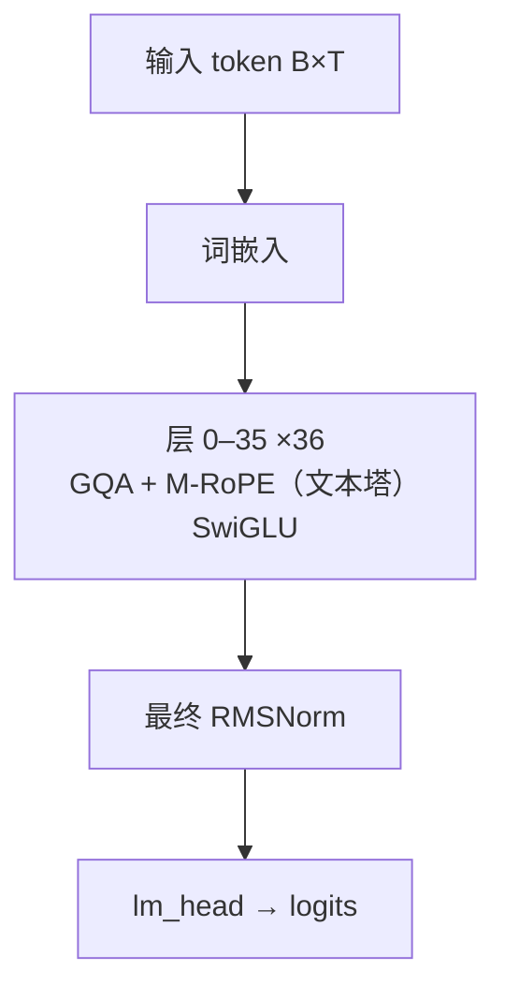

# MiMo-VL · 架构说明（逐层）

> Xiaomi（小米）LLM-Core-Team · 发布 2025-05 · reference/MiMo-VL/README.md + HF `config.json` / `preprocessor_config.json`（XiaomiMiMo/MiMo-VL-7B-RL）+ `reference/MiMo-VL/demo/`

**技术定位**：7B 视觉语言模型：MiMo-7B（Qwen2 式主干）作 LLM，前置原生分辨率 ViT（32 层、窗口注意力 + 2D-RoPE）与 2×2 空间合并的 MLP projector，用 <|image_pad|> 占位后替换为视觉 embedding；四阶段预训练 + MORL 混合在线 RL。

## 1. 参数与配置

| 项 | 值 |
|---|---|
| 总参数 | 7B（LLM）+ 约 0.6B（ViT + projector） |
| 激活参数 | dense，全激活 |
| 层数 | 36 |
| hidden | 4096 |
| Q 头 | 32 |
| KV 头 | 8 |
| head_dim | 128 |
| FFN/MoE 中间维 | 11008 |
| 词表 | 151680 |
| 上下文 | 128000 |
| 权重共享 | false（输入/输出嵌入不共享） |

**完整配置**：

| 字段 | 值 |
|---|---|
| architectures | Qwen2_5_VLForConditionalGeneration |
| LLM：num_hidden_layers | 36（MiMo-7B 主干） |
| LLM：hidden_size | 4096 |
| LLM：num_attention_heads / num_key_value_heads | 32 / 8（GQA，4:1） |
| LLM：intermediate_size | 11008 |
| LLM：rope_theta | 640000.0 |
| LLM：rope_scaling | mrope，mrope_section = [16, 24, 24] |
| LLM：rms_norm_eps / hidden_act | 1e-05 / silu（SwiGLU） |
| LLM：attention_bias | true |
| LLM：max_position_embeddings | 128000 |
| LLM：tie_word_embeddings | false |
| vocab_size | 151680 |
| vision：depth | 32 |
| vision：hidden_size | 1280 |
| vision：num_heads | 16（head_dim = 1280/16 = 80） |
| vision：intermediate_size | 3456 |
| vision：patch_size / spatial_patch_size | 14 / 14 |
| vision：temporal_patch_size | 2 |
| vision：spatial_merge_size | 2（2×2 合并） |
| vision：window_size | 112（= 8×8 patch 的窗口注意力） |
| vision：fullatt_block_indexes | [7, 15, 23, 31]（其余层用窗口注意力） |
| vision：out_hidden_size | 4096（projector 输出维度） |
| vision：tokens_per_second | 2 |
| image processor | Qwen2VLImageProcessor（min_pixels 3136，max_pixels 12845056） |
| 特殊 token：vision_start / vision_end | 151652 / 151653 |
| 特殊 token：vision_pad / image_pad / video_pad | 151654 / 151655 / 151656 |
| 模型类型 | qwen2_5_vl（与 Qwen2.5-VL 部署完全兼容） |

**视觉 / 多模态方案**：

ViT 32 层 / hidden 1280 / 16 头 / patch 14 / temporal 2 / 窗口 112；2×2 空间合并 + MLP 5120→4096；<|image_pad|>=151655；3D M-RoPE

## 2. 技术方案与关键创新

**1. 原生分辨率 ViT（窗口注意力）**　ViT 不做固定尺寸缩放，而是按原图宽高切成 14×14 patch（时间维 patch=2），token 数随分辨率自适应，从而保留细粒度视觉细节；除第 7/15/23/31 层用全注意力外，其余层用 112×112（8×8 patch）窗口注意力以控成本。

**2. 2×2 空间合并 + MLP projector**　ViT 输出按 2×2 空间合并，把 4 个相邻 patch 特征拼成 4×1280 再经 MLP 投影到 LLM 的 4096 维，实现高效跨模态对齐（README 明确为 MLP projector），使每张图占用的 LLM token 数降为原来的 1/4。

**3. 四阶段预训练**　projector warmup → 视觉-语言对齐 → 通用多模态预训练 → 长上下文 SFT；并把高质量、覆盖广的合成推理数据直接混入预训练后段（而非仅作微调），延长训练仍持续提升。

**4. MORL 混合在线强化学习**　Mixed On-policy RL 将感知准确率、视觉定位精度、逻辑推理与人类/AI 偏好等多类奖励信号统一到一次 RL 中，同时覆盖文本/图像/视频多模态能力，是 MiMo-VL-7B-RL 超越同级开源模型的关键。

**5. 思考控制（2508）**　2508 版本支持 /no_think：默认思考模式展示完整推理链，非思考模式直接作答，控制成功率分别约 100% 与 99.84%。

## 3. 层级结构（可视化）



## 4. 逐层清单（共 36 层）

| 层 | Attention | FFN/MoE | 说明 |
|---|---|---|---|
| 0 | GQA + M-RoPE（文本塔） | SwiGLU | 这里枚举的是 LLM（MiMo-7B）的 36 层解码层；视觉编码器 ViT 的 32 层深度单独在 config_table / extra_specs 报告，不混入此列表 |
| 1 | GQA + M-RoPE（文本塔） | SwiGLU | 这里枚举的是 LLM（MiMo-7B）的 36 层解码层；视觉编码器 ViT 的 32 层深度单独在 config_table / extra_specs 报告，不混入此列表 |
| 2 | GQA + M-RoPE（文本塔） | SwiGLU | 这里枚举的是 LLM（MiMo-7B）的 36 层解码层；视觉编码器 ViT 的 32 层深度单独在 config_table / extra_specs 报告，不混入此列表 |
| 3 | GQA + M-RoPE（文本塔） | SwiGLU | 这里枚举的是 LLM（MiMo-7B）的 36 层解码层；视觉编码器 ViT 的 32 层深度单独在 config_table / extra_specs 报告，不混入此列表 |
| 4 | GQA + M-RoPE（文本塔） | SwiGLU | 这里枚举的是 LLM（MiMo-7B）的 36 层解码层；视觉编码器 ViT 的 32 层深度单独在 config_table / extra_specs 报告，不混入此列表 |
| 5 | GQA + M-RoPE（文本塔） | SwiGLU | 这里枚举的是 LLM（MiMo-7B）的 36 层解码层；视觉编码器 ViT 的 32 层深度单独在 config_table / extra_specs 报告，不混入此列表 |
| 6 | GQA + M-RoPE（文本塔） | SwiGLU | 这里枚举的是 LLM（MiMo-7B）的 36 层解码层；视觉编码器 ViT 的 32 层深度单独在 config_table / extra_specs 报告，不混入此列表 |
| 7 | GQA + M-RoPE（文本塔） | SwiGLU | 这里枚举的是 LLM（MiMo-7B）的 36 层解码层；视觉编码器 ViT 的 32 层深度单独在 config_table / extra_specs 报告，不混入此列表 |
| 8 | GQA + M-RoPE（文本塔） | SwiGLU | 这里枚举的是 LLM（MiMo-7B）的 36 层解码层；视觉编码器 ViT 的 32 层深度单独在 config_table / extra_specs 报告，不混入此列表 |
| 9 | GQA + M-RoPE（文本塔） | SwiGLU | 这里枚举的是 LLM（MiMo-7B）的 36 层解码层；视觉编码器 ViT 的 32 层深度单独在 config_table / extra_specs 报告，不混入此列表 |
| 10 | GQA + M-RoPE（文本塔） | SwiGLU | 这里枚举的是 LLM（MiMo-7B）的 36 层解码层；视觉编码器 ViT 的 32 层深度单独在 config_table / extra_specs 报告，不混入此列表 |
| 11 | GQA + M-RoPE（文本塔） | SwiGLU | 这里枚举的是 LLM（MiMo-7B）的 36 层解码层；视觉编码器 ViT 的 32 层深度单独在 config_table / extra_specs 报告，不混入此列表 |
| 12 | GQA + M-RoPE（文本塔） | SwiGLU | 这里枚举的是 LLM（MiMo-7B）的 36 层解码层；视觉编码器 ViT 的 32 层深度单独在 config_table / extra_specs 报告，不混入此列表 |
| 13 | GQA + M-RoPE（文本塔） | SwiGLU | 这里枚举的是 LLM（MiMo-7B）的 36 层解码层；视觉编码器 ViT 的 32 层深度单独在 config_table / extra_specs 报告，不混入此列表 |
| 14 | GQA + M-RoPE（文本塔） | SwiGLU | 这里枚举的是 LLM（MiMo-7B）的 36 层解码层；视觉编码器 ViT 的 32 层深度单独在 config_table / extra_specs 报告，不混入此列表 |
| 15 | GQA + M-RoPE（文本塔） | SwiGLU | 这里枚举的是 LLM（MiMo-7B）的 36 层解码层；视觉编码器 ViT 的 32 层深度单独在 config_table / extra_specs 报告，不混入此列表 |
| 16 | GQA + M-RoPE（文本塔） | SwiGLU | 这里枚举的是 LLM（MiMo-7B）的 36 层解码层；视觉编码器 ViT 的 32 层深度单独在 config_table / extra_specs 报告，不混入此列表 |
| 17 | GQA + M-RoPE（文本塔） | SwiGLU | 这里枚举的是 LLM（MiMo-7B）的 36 层解码层；视觉编码器 ViT 的 32 层深度单独在 config_table / extra_specs 报告，不混入此列表 |
| 18 | GQA + M-RoPE（文本塔） | SwiGLU | 这里枚举的是 LLM（MiMo-7B）的 36 层解码层；视觉编码器 ViT 的 32 层深度单独在 config_table / extra_specs 报告，不混入此列表 |
| 19 | GQA + M-RoPE（文本塔） | SwiGLU | 这里枚举的是 LLM（MiMo-7B）的 36 层解码层；视觉编码器 ViT 的 32 层深度单独在 config_table / extra_specs 报告，不混入此列表 |
| 20 | GQA + M-RoPE（文本塔） | SwiGLU | 这里枚举的是 LLM（MiMo-7B）的 36 层解码层；视觉编码器 ViT 的 32 层深度单独在 config_table / extra_specs 报告，不混入此列表 |
| 21 | GQA + M-RoPE（文本塔） | SwiGLU | 这里枚举的是 LLM（MiMo-7B）的 36 层解码层；视觉编码器 ViT 的 32 层深度单独在 config_table / extra_specs 报告，不混入此列表 |
| 22 | GQA + M-RoPE（文本塔） | SwiGLU | 这里枚举的是 LLM（MiMo-7B）的 36 层解码层；视觉编码器 ViT 的 32 层深度单独在 config_table / extra_specs 报告，不混入此列表 |
| 23 | GQA + M-RoPE（文本塔） | SwiGLU | 这里枚举的是 LLM（MiMo-7B）的 36 层解码层；视觉编码器 ViT 的 32 层深度单独在 config_table / extra_specs 报告，不混入此列表 |
| 24 | GQA + M-RoPE（文本塔） | SwiGLU | 这里枚举的是 LLM（MiMo-7B）的 36 层解码层；视觉编码器 ViT 的 32 层深度单独在 config_table / extra_specs 报告，不混入此列表 |
| 25 | GQA + M-RoPE（文本塔） | SwiGLU | 这里枚举的是 LLM（MiMo-7B）的 36 层解码层；视觉编码器 ViT 的 32 层深度单独在 config_table / extra_specs 报告，不混入此列表 |
| 26 | GQA + M-RoPE（文本塔） | SwiGLU | 这里枚举的是 LLM（MiMo-7B）的 36 层解码层；视觉编码器 ViT 的 32 层深度单独在 config_table / extra_specs 报告，不混入此列表 |
| 27 | GQA + M-RoPE（文本塔） | SwiGLU | 这里枚举的是 LLM（MiMo-7B）的 36 层解码层；视觉编码器 ViT 的 32 层深度单独在 config_table / extra_specs 报告，不混入此列表 |
| 28 | GQA + M-RoPE（文本塔） | SwiGLU | 这里枚举的是 LLM（MiMo-7B）的 36 层解码层；视觉编码器 ViT 的 32 层深度单独在 config_table / extra_specs 报告，不混入此列表 |
| 29 | GQA + M-RoPE（文本塔） | SwiGLU | 这里枚举的是 LLM（MiMo-7B）的 36 层解码层；视觉编码器 ViT 的 32 层深度单独在 config_table / extra_specs 报告，不混入此列表 |
| 30 | GQA + M-RoPE（文本塔） | SwiGLU | 这里枚举的是 LLM（MiMo-7B）的 36 层解码层；视觉编码器 ViT 的 32 层深度单独在 config_table / extra_specs 报告，不混入此列表 |
| 31 | GQA + M-RoPE（文本塔） | SwiGLU | 这里枚举的是 LLM（MiMo-7B）的 36 层解码层；视觉编码器 ViT 的 32 层深度单独在 config_table / extra_specs 报告，不混入此列表 |
| 32 | GQA + M-RoPE（文本塔） | SwiGLU | 这里枚举的是 LLM（MiMo-7B）的 36 层解码层；视觉编码器 ViT 的 32 层深度单独在 config_table / extra_specs 报告，不混入此列表 |
| 33 | GQA + M-RoPE（文本塔） | SwiGLU | 这里枚举的是 LLM（MiMo-7B）的 36 层解码层；视觉编码器 ViT 的 32 层深度单独在 config_table / extra_specs 报告，不混入此列表 |
| 34 | GQA + M-RoPE（文本塔） | SwiGLU | 这里枚举的是 LLM（MiMo-7B）的 36 层解码层；视觉编码器 ViT 的 32 层深度单独在 config_table / extra_specs 报告，不混入此列表 |
| 35 | GQA + M-RoPE（文本塔） | SwiGLU | 这里枚举的是 LLM（MiMo-7B）的 36 层解码层；视觉编码器 ViT 的 32 层深度单独在 config_table / extra_specs 报告，不混入此列表 |

## 5. 关键模块：数学公式与代码

### 注意力 · GQA + M-RoPE（文本塔）

文本塔即 MiMo-7B：Q/K/V 带 bias 的 GQA，32 个 Q 头 / 8 个 KV 头、head_dim=128。整个模型以 Qwen2_5_VLForConditionalGeneration 承载，故位置编码用 3D M-RoPE，维度按 [16,24,24] 在 3 个轴上切分。

$$
\mathrm{Attn}(Q,K,V)=\mathrm{softmax}\!\left(\frac{QK^{\top}}{\sqrt{128}}+M\right)V
$$

$$
H_q=32,\quad H_{kv}=8,\quad d_h=128,\quad \theta=640000
$$

```python
# reference/MiMo-VL/demo/infer.py:10-13
self.model = Qwen2_5_VLForConditionalGeneration.from_pretrained(
    checkpoint_path, torch_dtype='auto', device_map=device,
    attn_implementation='flash_attention_2')
self.processor = AutoProcessor.from_pretrained(checkpoint_path)
```

### 前馈/MoE · SwiGLU

文本塔与 ViT 都用 SwiGLU 门控前馈（文本中间维 11008，ViT 中间维 3456）。

$$
\mathrm{FFN}(x)=W_{down}\big(\mathrm{SiLU}(W_{gate}x)\odot W_{up}x\big)
$$

```python
# 文本塔 MiMo-7B 的 MLP（Qwen2 式，带门控）
return self.down_proj(self.act_fn(self.gate_proj(x)) * self.up_proj(x))
```

### 原生分辨率 patch 切分

图像先经过 smart_resize，把宽高对齐到 28（=patch 14 × merge 2）的整数倍并限制在 min/max pixels 内，再按 14×14 patch（时间维 2）切开、线性投影到 d_v=1280。

$$
x_p=\mathrm{Linear}(\mathrm{flatten}(I_p))\in\mathbb{R}^{1280},\quad p=1,\dots,N,\; N=\left\lfloor H/14\right\rfloor\cdot\left\lfloor W/14\right\rfloor
$$

```python
# reference/MiMo-VL/demo/qwen_vl_utils/vision_process.py:27-29
IMAGE_FACTOR = 28          # = patch_size 14 * merge_size 2
MIN_PIXELS = 4 * 28 * 28
MAX_PIXELS = 4096 * 28 * 28
# :61-87  smart_resize(height, width, factor=28, min_pixels, max_pixels)
```

### ViT Block（窗口注意力 + 2D-RoPE）

32 层 ViT，hidden 1280、16 头（head_dim=80）、SwiGLU 中间维 3456，用 2D 旋转位置编码与双向注意力；窗口大小 112（8×8 patch），仅第 7/15/23/31 层做全注意力。

$$
z'=z+\mathrm{Attn}\!\big(\mathrm{RMSNorm}(z)\big)
$$

$$
z=z'+\mathrm{MLP}\!\big(\mathrm{RMSNorm}(z')\big)
$$

$$
\mathrm{Attn}=\mathrm{softmax}\!\left(\frac{QK^{\top}}{\sqrt{80}}+M_{\text{win}}\right)V
$$

```python
# HF config.json（MiMo-VL-7B-RL）vision_config
"depth": 32, "hidden_size": 1280, "num_heads": 16, "intermediate_size": 3456,
"patch_size": 14, "window_size": 112, "fullatt_block_indexes": [7, 15, 23, 31]
```

### 2×2 空间合并 + MLP Projector

把 2×2 相邻 patch 的 1280 维特征拼成 5120 维，经（RMSNorm + Linear + GELU + Linear）投影到 LLM 的 4096 维；每张图的 LLM token 数因此降为 patch 数的 1/4。README 称其为 MLP projector。

$$
\hat{x}=\mathrm{MLP}\!\big(\mathrm{concat}_{2\times2}(\mathrm{RMSNorm}(z))\big),\quad \mathbb{R}^{4\times1280}\to\mathbb{R}^{4096}
$$

```python
# Qwen2.5-VL 系 PatchMerger（MiMo-VL 复用同一实现）
self.norm = RMSNorm(hidden_size)
self.mlp = nn.Sequential(
    nn.Linear(hidden_size * merge_size**2, hidden_size * merge_size**2),
    nn.GELU(),
    nn.Linear(hidden_size * merge_size**2, out_hidden_size))
```

### 视觉 token 注入

文本序列在图像位置插入 image_pad 占位 token（id 151655，视频为 video_pad 151656），由 <|vision_start|> 151652 与 <|vision_end|> 151653 包裹；前向时把这些位置的 embedding 替换为投影后的视觉向量，其余位置用词嵌入。

$$
e_t=\begin{cases}\hat{x}_{j}, & t=\text{<|image\_pad|>}_{j}\\ E_{tok}(t), & \text{otherwise}\end{cases}
$$

```python
# reference/MiMo-VL/demo/infer.py:19-22 编码后的序列
image_inputs, video_inputs = process_vision_info(updated_history)
model_inputs = self.processor(text=[text], images=image_inputs,
                              videos=video_inputs, padding=True, return_tensors='pt')
```

### M-RoPE（多模态旋转位置编码）

文本/图像/视频共用 3D 位置：把 head_dim=128 的旋转维按 [16,24,24] 分配给时间/高/宽三个轴，图像 token 的 h、w 坐标不同从而获得二维空间位置感。

$$
\mathrm{MRoPE}(x;h,w,t)=\mathrm{concat}\!\big(\mathrm{RoPE}_{16}(x_h),\;\mathrm{RoPE}_{24}(x_w),\;\mathrm{RoPE}_{24}(x_t)\big)
$$

## 6. 张量形状流

| 阶段 | 形状 | 说明 |
|---|---|---|
| 输入图像（原生分辨率） | `[C, H, W]` | smart_resize 到 28 的整数倍，min/max pixels 见 preprocessor_config |
| Patch embed（14×14，temporal 2） | `[N_patch, 1280]` | N_patch = (H/14)·(W/14) |
| 32 × ViT Block（窗口/全注意力 + 2D-RoPE + SwiGLU） | `[N_patch, 1280]` | 第 7/15/23/31 层为全注意力，其余窗口 112 |
| 2×2 合并 + MLP projector | `[N_vis, 4096]` | N_vis = N_patch / 4 |
| 替换 <|image_pad|> 占位 embedding | `[B, T, 4096]` | 视觉向量替换文本序列中的占位 token |
| 36 × MiMo-7B Block（GQA + SwiGLU，M-RoPE） | `[B, T, 4096]` | LLM 解码层，残差流形状不变 |
| lm_head | `[B, T, 151680]` | 输出 logits |

## 7. 关键源码（引自 reference/）

**原生分辨率视觉预处理（smart_resize）**　`reference/MiMo-VL/demo/qwen_vl_utils/vision_process.py:27-87`

```python
IMAGE_FACTOR = 28
MIN_PIXELS = 4 * 28 * 28
MAX_PIXELS = 4096 * 28 * 28

def smart_resize(height, width, factor=IMAGE_FACTOR, min_pixels=MIN_PIXELS, max_pixels=MAX_PIXELS):
    h_bar = max(factor, round_by_factor(height, factor))
    w_bar = max(factor, round_by_factor(width, factor))
    if h_bar * w_bar > max_pixels:
        beta = math.sqrt((height * width) / max_pixels)
        h_bar = max(factor, floor_by_factor(height / beta, factor))
        w_bar = max(factor, floor_by_factor(width / beta, factor))
    elif h_bar * w_bar < min_pixels:
        beta = math.sqrt(min_pixels / (height * width))
        h_bar = ceil_by_factor(height * beta, factor)
        w_bar = ceil_by_factor(width * beta, factor)
    return h_bar, w_bar
```

**推理入口（与 Qwen2.5-VL 完全兼容）**　`reference/MiMo-VL/demo/infer.py:8-22`

```python
class MiMoVLInfer:
    def __init__(self, checkpoint_path, device='cuda', **kwargs):
        self.model = Qwen2_5_VLForConditionalGeneration.from_pretrained(
            checkpoint_path, torch_dtype='auto', device_map=device,
            attn_implementation='flash_attention_2')
        self.processor = AutoProcessor.from_pretrained(checkpoint_path)

    def __call__(self, inputs, history=[], temperature=1.0):
        messages = self.construct_messages(inputs)
        updated_history = history + messages
        text = self.processor.apply_chat_template(updated_history, tokenize=False,
                                                  add_generation_prompt=True)
        image_inputs, video_inputs = process_vision_info(updated_history)
```

## 8. 与 mini-llm-lab 的差异

把 MiMo-VL 拆成「眼睛 + 桥 + 大脑」和 mini-llm-lab 对照：

- **眼睛（ViT）**——我们都是手写/前置一个 ViT、都是双向注意力 + 把图片切成 patch。区别在：MiMo-VL 用**原生分辨率**（`smart_resize` 对齐 28 的倍数，token 数随图大小变化）+ **窗口注意力**（112 窗口，仅 4 层全注意力）+ **2D-RoPE**；我们的 ViT 固定 `128×128 / patch 16 = 64` 个 patch、用可学习位置编码、纯全注意力，约 19M。
- **桥（projector）**——MiMo-VL 是 **2×2 空间合并 + MLP**（5120→4096），我们是把 `d_vision=384` 直接 MLP 投影到 `d_model=768`，没有空间合并。
- **大脑（LLM）**——MiMo-VL 的 LLM 是 7B MiMo；我们复用同款 Qwen 分词器、768 维的中文 GPT。
- **融合 / 占位符**——两者都用 LLaVA 式「占位符 + 特征替换」：MiMo-VL 用 `<|image_pad|>`（151655）配 `<|vision_start|>`/`<|vision_end|>`，我们用手写 tokenizer 注册的 `<image>` 占位符（`MiniVLM.replace_image_embeds`）。**这正是我们 VLM 与 MiMo-VL 最直接对应的部分**，我们缺的是原生分辨率、空间合并与多模态 M-RoPE。

## 9. 3D 可视化

启动可视化网页后，在「架构浏览器」视图选择本模型（id：`mimo-vl`），可三维查看每一层并点开公式/代码：

```powershell
& ".venv\Scripts\python.exe" viz/server.py   # 打开 http://127.0.0.1:7861 → 架构浏览器
```

## 10. 参考资料

- [MiMo-VL Technical Report (arXiv:2506.03569)](https://arxiv.org/abs/2506.03569)
- [XiaomiMiMo/MiMo-VL (GitHub)](https://github.com/XiaomiMiMo/MiMo-VL)
- [XiaomiMiMo/MiMo-VL-7B-RL (HuggingFace)](https://huggingface.co/XiaomiMiMo/MiMo-VL-7B-RL)
