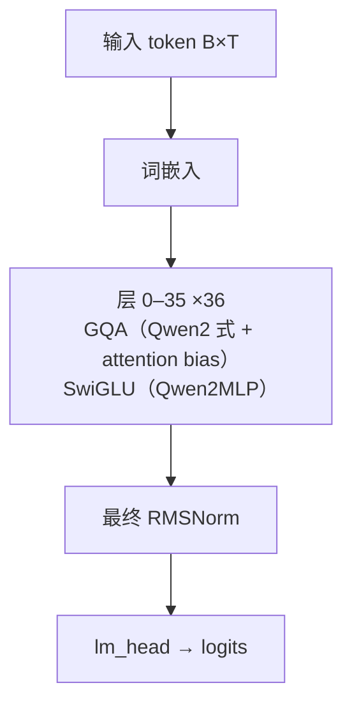

# MiMo · 架构说明（逐层）

> Xiaomi（小米）LLM-Core-Team · 发布 2025-04 · reference/MiMo/README.md + HF `config.json` / `configuration_mimo.py` / `modeling_mimo.py`（XiaomiMiMo/MiMo-7B-RL）

**技术定位**：面向推理的 7B decoder-only：主干与 Qwen2 同构（RoPE + RMSNorm + SwiGLU + GQA + Q/K/V bias，θ=640000），训练侧用三阶段数据配方、合成推理数据与 MTP 目标，从预训练到后训练全程为推理服务。

## 1. 参数与配置

| 项 | 值 |
|---|---|
| 总参数 | 7B |
| 激活参数 | dense ~7B 全激活（另含 1 层 MTP，约 0.2B） |
| 层数 | 36 |
| hidden | 4096 |
| Q 头 | 32 |
| KV 头 | 8 |
| head_dim | 128 |
| FFN/MoE 中间维 | 11008 |
| 词表 | 151680 |
| 上下文 | 32768 |
| 权重共享 | false（输入/输出嵌入不共享） |

**完整配置**：

| 字段 | 值 |
|---|---|
| num_hidden_layers | 36 |
| hidden_size | 4096 |
| num_attention_heads | 32 |
| num_key_value_heads | 8（GQA，32/8 = 4:1） |
| head_dim | 128 |
| intermediate_size | 11008 |
| vocab_size | 151680 |
| hidden_act | silu（SwiGLU） |
| rms_norm_eps | 1e-05 |
| rope_theta | 640000 |
| max_position_embeddings | 32768 |
| tie_word_embeddings | false |
| attention_bias | true（Q/K/V 线性层带 bias） |
| use_mrope | false |
| use_sliding_window | false（max_window_layers 为遗留字段：Base=32 / RL=36） |
| num_nextn_predict_layers | 1（MTP 多 token 预测层） |
| model_type | mimo（MiMoConfig 继承 Qwen2Config） |

## 2. 技术方案与关键创新

**1. 三阶段数据配方 + 大规模合成推理数据**　MiMo-7B-Base 在约 25T token 上预训练：优化文本抽取与多维数据过滤以提高「推理模式密度」，并用多种策略合成海量多样化推理数据；预训练采用三阶段数据混合。目标是让基座模型本身就「为推理而生」，而不只是靠后训练。

**2. MTP 多 token 预测作为额外训练目标**　在主干之上追加 1 层 MTP（Multi-Token Prediction）结构，作为额外训练目标提升性能并加速推理；该层在预训练与 SFT 阶段训练、RL 阶段冻结，用作投机解码时接受率约 90%。

**3. 可验证奖励驱动的后训练 RL**　精选 13 万道数学与代码题，全部可由规则验证；只用规则化 accuracy 奖励避免 reward hacking，并引入「测试难度驱动」的代码奖励给难样例更细粒度的密集信号，同时对简单题做数据重采样以稳定策略更新。

**4. Seamless Rollout Engine 强化学习基础设施**　连续 rollout、异步奖励计算与提前终止相结合，最小化 GPU 空转，训练提速 2.29×、验证提速 1.96×，并在 vLLM 中支持 MTP。

## 3. 层级结构（可视化）



## 4. 逐层清单（共 36 层）

| 层 | Attention | FFN/MoE | 说明 |
|---|---|---|---|
| 0 | GQA（Qwen2 式 + attention bias） | SwiGLU（Qwen2MLP） | 全层同构的 LLM 解码层；另含 1 层 MTP 预测层（num_nextn_predict_layers=1），不计入这 36 层，见「额外公式」 |
| 1 | GQA（Qwen2 式 + attention bias） | SwiGLU（Qwen2MLP） | 全层同构的 LLM 解码层；另含 1 层 MTP 预测层（num_nextn_predict_layers=1），不计入这 36 层，见「额外公式」 |
| 2 | GQA（Qwen2 式 + attention bias） | SwiGLU（Qwen2MLP） | 全层同构的 LLM 解码层；另含 1 层 MTP 预测层（num_nextn_predict_layers=1），不计入这 36 层，见「额外公式」 |
| 3 | GQA（Qwen2 式 + attention bias） | SwiGLU（Qwen2MLP） | 全层同构的 LLM 解码层；另含 1 层 MTP 预测层（num_nextn_predict_layers=1），不计入这 36 层，见「额外公式」 |
| 4 | GQA（Qwen2 式 + attention bias） | SwiGLU（Qwen2MLP） | 全层同构的 LLM 解码层；另含 1 层 MTP 预测层（num_nextn_predict_layers=1），不计入这 36 层，见「额外公式」 |
| 5 | GQA（Qwen2 式 + attention bias） | SwiGLU（Qwen2MLP） | 全层同构的 LLM 解码层；另含 1 层 MTP 预测层（num_nextn_predict_layers=1），不计入这 36 层，见「额外公式」 |
| 6 | GQA（Qwen2 式 + attention bias） | SwiGLU（Qwen2MLP） | 全层同构的 LLM 解码层；另含 1 层 MTP 预测层（num_nextn_predict_layers=1），不计入这 36 层，见「额外公式」 |
| 7 | GQA（Qwen2 式 + attention bias） | SwiGLU（Qwen2MLP） | 全层同构的 LLM 解码层；另含 1 层 MTP 预测层（num_nextn_predict_layers=1），不计入这 36 层，见「额外公式」 |
| 8 | GQA（Qwen2 式 + attention bias） | SwiGLU（Qwen2MLP） | 全层同构的 LLM 解码层；另含 1 层 MTP 预测层（num_nextn_predict_layers=1），不计入这 36 层，见「额外公式」 |
| 9 | GQA（Qwen2 式 + attention bias） | SwiGLU（Qwen2MLP） | 全层同构的 LLM 解码层；另含 1 层 MTP 预测层（num_nextn_predict_layers=1），不计入这 36 层，见「额外公式」 |
| 10 | GQA（Qwen2 式 + attention bias） | SwiGLU（Qwen2MLP） | 全层同构的 LLM 解码层；另含 1 层 MTP 预测层（num_nextn_predict_layers=1），不计入这 36 层，见「额外公式」 |
| 11 | GQA（Qwen2 式 + attention bias） | SwiGLU（Qwen2MLP） | 全层同构的 LLM 解码层；另含 1 层 MTP 预测层（num_nextn_predict_layers=1），不计入这 36 层，见「额外公式」 |
| 12 | GQA（Qwen2 式 + attention bias） | SwiGLU（Qwen2MLP） | 全层同构的 LLM 解码层；另含 1 层 MTP 预测层（num_nextn_predict_layers=1），不计入这 36 层，见「额外公式」 |
| 13 | GQA（Qwen2 式 + attention bias） | SwiGLU（Qwen2MLP） | 全层同构的 LLM 解码层；另含 1 层 MTP 预测层（num_nextn_predict_layers=1），不计入这 36 层，见「额外公式」 |
| 14 | GQA（Qwen2 式 + attention bias） | SwiGLU（Qwen2MLP） | 全层同构的 LLM 解码层；另含 1 层 MTP 预测层（num_nextn_predict_layers=1），不计入这 36 层，见「额外公式」 |
| 15 | GQA（Qwen2 式 + attention bias） | SwiGLU（Qwen2MLP） | 全层同构的 LLM 解码层；另含 1 层 MTP 预测层（num_nextn_predict_layers=1），不计入这 36 层，见「额外公式」 |
| 16 | GQA（Qwen2 式 + attention bias） | SwiGLU（Qwen2MLP） | 全层同构的 LLM 解码层；另含 1 层 MTP 预测层（num_nextn_predict_layers=1），不计入这 36 层，见「额外公式」 |
| 17 | GQA（Qwen2 式 + attention bias） | SwiGLU（Qwen2MLP） | 全层同构的 LLM 解码层；另含 1 层 MTP 预测层（num_nextn_predict_layers=1），不计入这 36 层，见「额外公式」 |
| 18 | GQA（Qwen2 式 + attention bias） | SwiGLU（Qwen2MLP） | 全层同构的 LLM 解码层；另含 1 层 MTP 预测层（num_nextn_predict_layers=1），不计入这 36 层，见「额外公式」 |
| 19 | GQA（Qwen2 式 + attention bias） | SwiGLU（Qwen2MLP） | 全层同构的 LLM 解码层；另含 1 层 MTP 预测层（num_nextn_predict_layers=1），不计入这 36 层，见「额外公式」 |
| 20 | GQA（Qwen2 式 + attention bias） | SwiGLU（Qwen2MLP） | 全层同构的 LLM 解码层；另含 1 层 MTP 预测层（num_nextn_predict_layers=1），不计入这 36 层，见「额外公式」 |
| 21 | GQA（Qwen2 式 + attention bias） | SwiGLU（Qwen2MLP） | 全层同构的 LLM 解码层；另含 1 层 MTP 预测层（num_nextn_predict_layers=1），不计入这 36 层，见「额外公式」 |
| 22 | GQA（Qwen2 式 + attention bias） | SwiGLU（Qwen2MLP） | 全层同构的 LLM 解码层；另含 1 层 MTP 预测层（num_nextn_predict_layers=1），不计入这 36 层，见「额外公式」 |
| 23 | GQA（Qwen2 式 + attention bias） | SwiGLU（Qwen2MLP） | 全层同构的 LLM 解码层；另含 1 层 MTP 预测层（num_nextn_predict_layers=1），不计入这 36 层，见「额外公式」 |
| 24 | GQA（Qwen2 式 + attention bias） | SwiGLU（Qwen2MLP） | 全层同构的 LLM 解码层；另含 1 层 MTP 预测层（num_nextn_predict_layers=1），不计入这 36 层，见「额外公式」 |
| 25 | GQA（Qwen2 式 + attention bias） | SwiGLU（Qwen2MLP） | 全层同构的 LLM 解码层；另含 1 层 MTP 预测层（num_nextn_predict_layers=1），不计入这 36 层，见「额外公式」 |
| 26 | GQA（Qwen2 式 + attention bias） | SwiGLU（Qwen2MLP） | 全层同构的 LLM 解码层；另含 1 层 MTP 预测层（num_nextn_predict_layers=1），不计入这 36 层，见「额外公式」 |
| 27 | GQA（Qwen2 式 + attention bias） | SwiGLU（Qwen2MLP） | 全层同构的 LLM 解码层；另含 1 层 MTP 预测层（num_nextn_predict_layers=1），不计入这 36 层，见「额外公式」 |
| 28 | GQA（Qwen2 式 + attention bias） | SwiGLU（Qwen2MLP） | 全层同构的 LLM 解码层；另含 1 层 MTP 预测层（num_nextn_predict_layers=1），不计入这 36 层，见「额外公式」 |
| 29 | GQA（Qwen2 式 + attention bias） | SwiGLU（Qwen2MLP） | 全层同构的 LLM 解码层；另含 1 层 MTP 预测层（num_nextn_predict_layers=1），不计入这 36 层，见「额外公式」 |
| 30 | GQA（Qwen2 式 + attention bias） | SwiGLU（Qwen2MLP） | 全层同构的 LLM 解码层；另含 1 层 MTP 预测层（num_nextn_predict_layers=1），不计入这 36 层，见「额外公式」 |
| 31 | GQA（Qwen2 式 + attention bias） | SwiGLU（Qwen2MLP） | 全层同构的 LLM 解码层；另含 1 层 MTP 预测层（num_nextn_predict_layers=1），不计入这 36 层，见「额外公式」 |
| 32 | GQA（Qwen2 式 + attention bias） | SwiGLU（Qwen2MLP） | 全层同构的 LLM 解码层；另含 1 层 MTP 预测层（num_nextn_predict_layers=1），不计入这 36 层，见「额外公式」 |
| 33 | GQA（Qwen2 式 + attention bias） | SwiGLU（Qwen2MLP） | 全层同构的 LLM 解码层；另含 1 层 MTP 预测层（num_nextn_predict_layers=1），不计入这 36 层，见「额外公式」 |
| 34 | GQA（Qwen2 式 + attention bias） | SwiGLU（Qwen2MLP） | 全层同构的 LLM 解码层；另含 1 层 MTP 预测层（num_nextn_predict_layers=1），不计入这 36 层，见「额外公式」 |
| 35 | GQA（Qwen2 式 + attention bias） | SwiGLU（Qwen2MLP） | 全层同构的 LLM 解码层；另含 1 层 MTP 预测层（num_nextn_predict_layers=1），不计入这 36 层，见「额外公式」 |

## 5. 关键模块：数学公式与代码

### 注意力 · GQA（Qwen2 式 + attention bias）

MiMo 直接复用 transformers 的 Qwen2Attention：Q/K/V 线性投影带 bias，32 个 Q 头 / 8 个 KV 头（4:1），head_dim=128，施加 RoPE（θ=640000）；推理时把 KV 头 repeat 到 Q 头数再算缩放点积注意力。与 Qwen3 不同，MiMo 没有 QK-Norm。

$$
\mathrm{Attn}(Q,K,V)=\mathrm{softmax}\!\left(\frac{QK^{\top}}{\sqrt{d_h}}+M\right)V
$$

$$
Q=\mathrm{RoPE}(W_q x),\; K=\mathrm{RoPE}(W_k x),\; V=W_v x
$$

$$
H_q=32,\quad H_{kv}=8,\quad d_h=128,\quad \theta=640000
$$

```python
# https://huggingface.co/XiaomiMiMo/MiMo-7B-RL/blob/main/modeling_mimo.py:6-9
from transformers.models.qwen2.modeling_qwen2 import (
    Qwen2Attention, Qwen2ForCausalLM, Qwen2MLP, Qwen2Model, Qwen2RMSNorm)
# 注意力 / MLP / RMSNorm / Model 全部直接复用 Qwen2 实现；
# MiMo 只新增 MiMoMTPLayers 与 MiMoConfig。
```

### 前馈/MoE · SwiGLU（Qwen2MLP）

门控前馈 down( silu(gate(x)) ⊙ up(x) )，中间维 11008。MiMo 直接复用 Qwen2MLP，没有任何改动。

$$
\mathrm{FFN}(x)=W_{down}\big(\mathrm{SiLU}(W_{gate}x)\odot W_{up}x\big)
$$

```python
# Qwen2MLP，MiMo 直接复用（modeling_mimo.py:8）
def forward(self, x):
    return self.down_proj(self.act_fn(self.gate_proj(x)) * self.up_proj(x))
```

### RMSNorm

$$
\mathrm{RMSNorm}(x)=\frac{x}{\sqrt{\frac{1}{d}\sum_{i=1}^{d}x_i^{2}+\epsilon}}\odot\gamma,\quad \epsilon=10^{-5}
$$

```python
# Qwen2RMSNorm，MiMo 直接复用（modeling_mimo.py:9）
class Qwen2RMSNorm(nn.Module):
    def forward(self, hidden_states):
        variance = hidden_states.pow(2).mean(-1, keepdim=True)
        hidden_states = hidden_states * torch.rsqrt(variance + self.variance_epsilon)
        return self.weight * hidden_states
```

### RoPE（旋转位置编码）

底数 640000，介于 Llama 的 1e4 与 Qwen3 的 1e6 之间；上下文 32768，未启用 mRoPE 与滑动窗口。

$$
\mathrm{RoPE}(x_m,m)=\begin{bmatrix}x^{(1)}\cos m\theta_1-x^{(2)}\sin m\theta_1\\ x^{(1)}\sin m\theta_1+x^{(2)}\cos m\theta_1\\ \vdots\end{bmatrix},\quad \theta_i=\theta^{-2i/d},\;\theta=640000
$$

### MTP 多 token 预测层

1 层额外 Transformer 块：把上一位置的隐状态与当前 token 嵌入经 RMSNorm 后拼接，线性投影回 hidden，再走一遍 self-attention + MLP；预训练/SFT 训练、RL 冻结，推理时作投机解码。

$$
h_0=\mathrm{proj}\!\big(\mathrm{concat}(\mathrm{RMSNorm}(h_{t-1}),\mathrm{RMSNorm}(E_{tok}(x_t)))\big)
$$

$$
h=h_0+\mathrm{Attn}(\mathrm{RMSNorm}(h_0))
$$

$$
h=h+\mathrm{MLP}(\mathrm{RMSNorm}(h))
$$

```python
# https://huggingface.co/XiaomiMiMo/MiMo-7B-RL/blob/main/modeling_mimo.py:36-56
input_embeds = self.token_layernorm(input_embeds)
previous_hidden_states = self.hidden_layernorm(hidden_states)
hidden_states = self.input_proj(torch.cat([previous_hidden_states, input_embeds], dim=-1))
residual = hidden_states
hidden_states = self.input_layernorm(hidden_states)
hidden_states, _ = self.self_attn(hidden_states, attention_mask=attention_mask, ...)
hidden_states = residual + hidden_states
hidden_states = hidden_states + self.mlp(self.post_attention_layernorm(hidden_states))
hidden_states = self.final_layernorm(hidden_states)
```

## 6. 张量形状流

| 阶段 | 形状 | 说明 |
|---|---|---|
| 输入 token id | `[B, T]` | B=batch, T=序列长 |
| 词嵌入 tok_emb | `[B, T, 4096]` | 不乘 sqrt(d) |
| 36 × Block(GQA + SwiGLU) | `[B, T, 4096]` | 残差流形状不变，全层同构 |
| 最终 RMSNorm | `[B, T, 4096]` |  |
| lm_head（不共享） | `[B, T, 151680]` | 输出 logits |
| MTP 头（训练/投机解码） | `[B, T, 4096] → logits` | num_nextn_predict_layers=1，独立于 36 层主干 |

## 7. 关键源码（引自 reference/）

**MiMo = Qwen2 主干 + 追加 MTP 层**　`https://huggingface.co/XiaomiMiMo/MiMo-7B-RL/blob/main/modeling_mimo.py:59-75`

```python
class MiMoModel(Qwen2Model):
    config_class = MiMoConfig

    def __init__(self, config: MiMoConfig):
        super().__init__(config)
        self.mtp_layers = nn.ModuleList(
            [MiMoMTPLayers(config) for _ in range(config.num_nextn_predict_layers)])


class MiMoForCausalLM(Qwen2ForCausalLM):
    config_class = MiMoConfig

    def __init__(self, config: MiMoConfig):
        super(Qwen2ForCausalLM, self).__init__(config)
        self.model = MiMoModel(config)
        self.vocab_size = config.vocab_size
        self.lm_head = nn.Linear(config.hidden_size, config.vocab_size, bias=False)
```

**vLLM 注册：复用 Qwen2Model，加载时跳过 mtp_layers**　`reference/MiMo/registry/register_mimo_in_vllm.py:44-59`

```python
class MiMoModel(Qwen2Model):
    def load_weights(self, weights):
        stacked_params_mapping = [
            ("qkv_proj", "q_proj", "q"), ("qkv_proj", "k_proj", "k"),
            ("qkv_proj", "v_proj", "v"), ("gate_up_proj", "gate_proj", 0),
            ("gate_up_proj", "up_proj", 1),
        ]
        for name, loaded_weight in weights:
            if "mtp_layers" in name:   # 不加载 MTP 参数
                continue
```

## 8. 与 mini-llm-lab 的差异

MiMo-7B 与 mini-llm-lab 的 GPT 主干同属 Llama/Qwen2 式（pre-norm 残差、RoPE、RMSNorm、SwiGLU、GQA），骨架几乎一致，差别集中在：

- **Q/K/V 线性层带 bias**（我们 `nn.Linear` 默认无 bias）；
- **RoPE θ=640000**（我们默认 1e4）；
- **多了 1 层 MTP 预测头**（`num_nextn_predict_layers=1`），训练时多预测一个 token 以加速推理——这是我们完全没做的模块；
- **输入/输出嵌入不共享**（词表 151680 很大，共享可省约 0.6B）；
- 训练侧才是 MiMo 的重点：三阶段数据混合、合成推理数据、规则可验证奖励的 RL。

换言之，**主干我们基本齐了，缺的是 MTP 头与「推理导向」的训练配方**。

## 9. 3D 可视化

启动可视化网页后，在「架构浏览器」视图选择本模型（id：`mimo`），可三维查看每一层并点开公式/代码：

```powershell
& ".venv\Scripts\python.exe" viz/server.py   # 打开 http://127.0.0.1:7861 → 架构浏览器
```

## 10. 参考资料

- [MiMo: Unlocking the Reasoning Potential of Language Model (arXiv:2505.07608)](https://arxiv.org/abs/2505.07608)
- [XiaomiMiMo/MiMo (GitHub)](https://github.com/XiaomiMiMo/MiMo)
- [XiaomiMiMo/MiMo-7B-RL (HuggingFace)](https://huggingface.co/XiaomiMiMo/MiMo-7B-RL)
