# Qwen3-Next · 架构说明（逐层）

> Alibaba Qwen · 发布 2025-09 · QwenLM/Qwen3-Next + HF `Qwen/Qwen3-Next-80B-A3B-Instruct` config.json + HF transformers `modeling_qwen3_next.py`

**技术定位**：超稀疏 MoE（80B 总 / 3B 激活，512 专家 top-10）叠加混合注意力：每 4 层里 3 层是 Gated DeltaNet（门控线性注意力、O(1) 递归状态），第 4 层回落到带 QK-Norm 的全注意力 GQA，兼顾长文吞吐与全局建模。

## 1. 参数与配置

| 项 | 值 |
|---|---|
| 总参数 | 80B（81.3B） |
| 激活参数 | ≈3B（每 token 路由 10/512 专家 + 1 个共享专家） |
| 层数 | 48 |
| hidden | 2048 |
| Q 头 | 16 |
| KV 头 | 2 |
| head_dim | 256 |
| FFN/MoE 中间维 | MoE：512 专家 top-10，专家中间维 512 + 共享专家 512 |
| 词表 | 151936 |
| 上下文 | 262144 |
| 权重共享 | 不共享 |

**完整配置**：

| 字段 | 值 |
|---|---|
| num_hidden_layers | 48 |
| hidden_size | 2048 |
| num_attention_heads | 16 |
| num_key_value_heads | 2（GQA，8:1） |
| head_dim | 256（全注意力层） |
| partial_rotary_factor | 0.25（只对 1/4 维度做 RoPE） |
| full_attention_interval | 4（每 4 层 1 层全注意力） |
| linear_num_key_heads | 16 |
| linear_num_value_heads | 32 |
| linear_key_head_dim / linear_value_head_dim | 128 / 128 |
| linear_conv_kernel_dim | 4（深度可分离因果卷积） |
| num_experts | 512 |
| num_experts_per_tok | 10 |
| moe_intermediate_size | 512 |
| shared_expert_intermediate_size | 512 |
| decoder_sparse_step | 1（48 层全部为 MoE 层） |
| mlp_only_layers | []（无 dense 层） |
| norm_topk_prob | true |
| router_aux_loss_coef | 0.001 |
| rope_theta | 10000000 |
| rms_norm_eps | 1e-6 |
| hidden_act | silu |
| vocab_size | 151936 |
| max_position_embeddings | 262144 |
| use_sliding_window | false |
| tie_word_embeddings | false |

## 2. 技术方案与关键创新

**1. 混合注意力：Gated DeltaNet + 全注意力**　48 层按 (i+1)%4==0 划分：序号 3、7、…、47 共 12 层是标准 GQA 全注意力，其余 36 层是 Gated DeltaNet 线性注意力。线性层用固定大小的递归状态把复杂度降到 O(T)，全注意力层周期性恢复全局 token 交互——3:1 的比例是长文吞吐与建模质量之间的折中（`full_attention_interval=4`）。

**2. Gated DeltaNet 递归**　在线性层里，状态 S 是一个 [d_k, d_v] 的矩阵：每步先按数据相关衰减 α_t 缩放旧状态，再用「delta 规则」只写入新值中当前状态预测不到的那部分（β_t 控制学习率），最后用状态读出输出。训练时按 chunk 并行（UT 变换 + 三角求解），推理时退化为逐 token 递推，缓存与序列长度无关。

**3. 超稀疏 MoE + 共享专家**　512 个细粒度专家、每 token 选 10 个（top-10），并恒选一个共享专家以承载通用知识；共享专家输出再经过一个 sigmoid 门控。5.12:1 以上的稀疏度让 80B 模型每 token 只激活约 3B 参数。

**4. 零中心 RMSNorm + 部分 RoPE**　RMSNorm 权重初始化为 0，实际乘的是 (1+γ)，等价于以恒等映射为起点、更稳定的训练。RoPE 只作用于 head_dim 的 25%（`partial_rotary_factor=0.25`，即 64 维），底座 θ=1e7，配合 256K 上下文。

## 3. 层级结构（可视化）

```mermaid
flowchart TD
  IN["输入 token B×T"] --> EMB["词嵌入"]
  EMB --> L0_2["层 0–2 ×3<br/>Gated DeltaNet（门控线性注意力）<br/>稀疏 MoE（512 专家 top-10 + 共享专家）"]
  L0_2 --> L3_3["层 3–3 ×1<br/>全注意力 GQA（QK-Norm + 输出门）<br/>稀疏 MoE（512 专家 top-10 + 共享专家）"]
  L3_3 --> L4_6["层 4–6 ×3<br/>Gated DeltaNet（门控线性注意力）<br/>稀疏 MoE（512 专家 top-10 + 共享专家）"]
  L4_6 --> L7_7["层 7–7 ×1<br/>全注意力 GQA（QK-Norm + 输出门）<br/>稀疏 MoE（512 专家 top-10 + 共享专家）"]
  L7_7 --> L8_10["层 8–10 ×3<br/>Gated DeltaNet（门控线性注意力）<br/>稀疏 MoE（512 专家 top-10 + 共享专家）"]
  L8_10 --> L11_11["层 11–11 ×1<br/>全注意力 GQA（QK-Norm + 输出门）<br/>稀疏 MoE（512 专家 top-10 + 共享专家）"]
  L11_11 --> L12_14["层 12–14 ×3<br/>Gated DeltaNet（门控线性注意力）<br/>稀疏 MoE（512 专家 top-10 + 共享专家）"]
  L12_14 --> L15_15["层 15–15 ×1<br/>全注意力 GQA（QK-Norm + 输出门）<br/>稀疏 MoE（512 专家 top-10 + 共享专家）"]
  L15_15 --> L16_18["层 16–18 ×3<br/>Gated DeltaNet（门控线性注意力）<br/>稀疏 MoE（512 专家 top-10 + 共享专家）"]
  L16_18 --> L19_19["层 19–19 ×1<br/>全注意力 GQA（QK-Norm + 输出门）<br/>稀疏 MoE（512 专家 top-10 + 共享专家）"]
  L19_19 --> L20_22["层 20–22 ×3<br/>Gated DeltaNet（门控线性注意力）<br/>稀疏 MoE（512 专家 top-10 + 共享专家）"]
  L20_22 --> L23_23["层 23–23 ×1<br/>全注意力 GQA（QK-Norm + 输出门）<br/>稀疏 MoE（512 专家 top-10 + 共享专家）"]
  L23_23 --> L24_26["层 24–26 ×3<br/>Gated DeltaNet（门控线性注意力）<br/>稀疏 MoE（512 专家 top-10 + 共享专家）"]
  L24_26 --> L27_27["层 27–27 ×1<br/>全注意力 GQA（QK-Norm + 输出门）<br/>稀疏 MoE（512 专家 top-10 + 共享专家）"]
  L27_27 --> L28_30["层 28–30 ×3<br/>Gated DeltaNet（门控线性注意力）<br/>稀疏 MoE（512 专家 top-10 + 共享专家）"]
  L28_30 --> L31_31["层 31–31 ×1<br/>全注意力 GQA（QK-Norm + 输出门）<br/>稀疏 MoE（512 专家 top-10 + 共享专家）"]
  L31_31 --> L32_34["层 32–34 ×3<br/>Gated DeltaNet（门控线性注意力）<br/>稀疏 MoE（512 专家 top-10 + 共享专家）"]
  L32_34 --> L35_35["层 35–35 ×1<br/>全注意力 GQA（QK-Norm + 输出门）<br/>稀疏 MoE（512 专家 top-10 + 共享专家）"]
  L35_35 --> L36_38["层 36–38 ×3<br/>Gated DeltaNet（门控线性注意力）<br/>稀疏 MoE（512 专家 top-10 + 共享专家）"]
  L36_38 --> L39_39["层 39–39 ×1<br/>全注意力 GQA（QK-Norm + 输出门）<br/>稀疏 MoE（512 专家 top-10 + 共享专家）"]
  L39_39 --> L40_42["层 40–42 ×3<br/>Gated DeltaNet（门控线性注意力）<br/>稀疏 MoE（512 专家 top-10 + 共享专家）"]
  L40_42 --> L43_43["层 43–43 ×1<br/>全注意力 GQA（QK-Norm + 输出门）<br/>稀疏 MoE（512 专家 top-10 + 共享专家）"]
  L43_43 --> L44_46["层 44–46 ×3<br/>Gated DeltaNet（门控线性注意力）<br/>稀疏 MoE（512 专家 top-10 + 共享专家）"]
  L44_46 --> L47_47["层 47–47 ×1<br/>全注意力 GQA（QK-Norm + 输出门）<br/>稀疏 MoE（512 专家 top-10 + 共享专家）"]
  L47_47 --> NORM["最终 RMSNorm"] --> HEAD["lm_head → logits"]
```



## 4. 逐层清单（共 48 层）

| 层 | Attention | FFN/MoE | 说明 |
|---|---|---|---|
| 0 | Gated DeltaNet（门控线性注意力） | 稀疏 MoE（512 专家 top-10 + 共享专家） | 线性注意力 |
| 1 | Gated DeltaNet（门控线性注意力） | 稀疏 MoE（512 专家 top-10 + 共享专家） | 线性注意力 |
| 2 | Gated DeltaNet（门控线性注意力） | 稀疏 MoE（512 专家 top-10 + 共享专家） | 线性注意力 |
| 3 | 全注意力 GQA（QK-Norm + 输出门） | 稀疏 MoE（512 专家 top-10 + 共享专家） | 全注意力（第 1 个周期末） |
| 4 | Gated DeltaNet（门控线性注意力） | 稀疏 MoE（512 专家 top-10 + 共享专家） | 线性注意力 |
| 5 | Gated DeltaNet（门控线性注意力） | 稀疏 MoE（512 专家 top-10 + 共享专家） | 线性注意力 |
| 6 | Gated DeltaNet（门控线性注意力） | 稀疏 MoE（512 专家 top-10 + 共享专家） | 线性注意力 |
| 7 | 全注意力 GQA（QK-Norm + 输出门） | 稀疏 MoE（512 专家 top-10 + 共享专家） | 全注意力 |
| 8 | Gated DeltaNet（门控线性注意力） | 稀疏 MoE（512 专家 top-10 + 共享专家） | 线性注意力 |
| 9 | Gated DeltaNet（门控线性注意力） | 稀疏 MoE（512 专家 top-10 + 共享专家） | 线性注意力 |
| 10 | Gated DeltaNet（门控线性注意力） | 稀疏 MoE（512 专家 top-10 + 共享专家） | 线性注意力 |
| 11 | 全注意力 GQA（QK-Norm + 输出门） | 稀疏 MoE（512 专家 top-10 + 共享专家） | 全注意力 |
| 12 | Gated DeltaNet（门控线性注意力） | 稀疏 MoE（512 专家 top-10 + 共享专家） | 线性注意力 |
| 13 | Gated DeltaNet（门控线性注意力） | 稀疏 MoE（512 专家 top-10 + 共享专家） | 线性注意力 |
| 14 | Gated DeltaNet（门控线性注意力） | 稀疏 MoE（512 专家 top-10 + 共享专家） | 线性注意力 |
| 15 | 全注意力 GQA（QK-Norm + 输出门） | 稀疏 MoE（512 专家 top-10 + 共享专家） | 全注意力 |
| 16 | Gated DeltaNet（门控线性注意力） | 稀疏 MoE（512 专家 top-10 + 共享专家） | 线性注意力 |
| 17 | Gated DeltaNet（门控线性注意力） | 稀疏 MoE（512 专家 top-10 + 共享专家） | 线性注意力 |
| 18 | Gated DeltaNet（门控线性注意力） | 稀疏 MoE（512 专家 top-10 + 共享专家） | 线性注意力 |
| 19 | 全注意力 GQA（QK-Norm + 输出门） | 稀疏 MoE（512 专家 top-10 + 共享专家） | 全注意力 |
| 20 | Gated DeltaNet（门控线性注意力） | 稀疏 MoE（512 专家 top-10 + 共享专家） | 线性注意力 |
| 21 | Gated DeltaNet（门控线性注意力） | 稀疏 MoE（512 专家 top-10 + 共享专家） | 线性注意力 |
| 22 | Gated DeltaNet（门控线性注意力） | 稀疏 MoE（512 专家 top-10 + 共享专家） | 线性注意力 |
| 23 | 全注意力 GQA（QK-Norm + 输出门） | 稀疏 MoE（512 专家 top-10 + 共享专家） | 全注意力 |
| 24 | Gated DeltaNet（门控线性注意力） | 稀疏 MoE（512 专家 top-10 + 共享专家） | 线性注意力 |
| 25 | Gated DeltaNet（门控线性注意力） | 稀疏 MoE（512 专家 top-10 + 共享专家） | 线性注意力 |
| 26 | Gated DeltaNet（门控线性注意力） | 稀疏 MoE（512 专家 top-10 + 共享专家） | 线性注意力 |
| 27 | 全注意力 GQA（QK-Norm + 输出门） | 稀疏 MoE（512 专家 top-10 + 共享专家） | 全注意力 |
| 28 | Gated DeltaNet（门控线性注意力） | 稀疏 MoE（512 专家 top-10 + 共享专家） | 线性注意力 |
| 29 | Gated DeltaNet（门控线性注意力） | 稀疏 MoE（512 专家 top-10 + 共享专家） | 线性注意力 |
| 30 | Gated DeltaNet（门控线性注意力） | 稀疏 MoE（512 专家 top-10 + 共享专家） | 线性注意力 |
| 31 | 全注意力 GQA（QK-Norm + 输出门） | 稀疏 MoE（512 专家 top-10 + 共享专家） | 全注意力 |
| 32 | Gated DeltaNet（门控线性注意力） | 稀疏 MoE（512 专家 top-10 + 共享专家） | 线性注意力 |
| 33 | Gated DeltaNet（门控线性注意力） | 稀疏 MoE（512 专家 top-10 + 共享专家） | 线性注意力 |
| 34 | Gated DeltaNet（门控线性注意力） | 稀疏 MoE（512 专家 top-10 + 共享专家） | 线性注意力 |
| 35 | 全注意力 GQA（QK-Norm + 输出门） | 稀疏 MoE（512 专家 top-10 + 共享专家） | 全注意力 |
| 36 | Gated DeltaNet（门控线性注意力） | 稀疏 MoE（512 专家 top-10 + 共享专家） | 线性注意力 |
| 37 | Gated DeltaNet（门控线性注意力） | 稀疏 MoE（512 专家 top-10 + 共享专家） | 线性注意力 |
| 38 | Gated DeltaNet（门控线性注意力） | 稀疏 MoE（512 专家 top-10 + 共享专家） | 线性注意力 |
| 39 | 全注意力 GQA（QK-Norm + 输出门） | 稀疏 MoE（512 专家 top-10 + 共享专家） | 全注意力 |
| 40 | Gated DeltaNet（门控线性注意力） | 稀疏 MoE（512 专家 top-10 + 共享专家） | 线性注意力 |
| 41 | Gated DeltaNet（门控线性注意力） | 稀疏 MoE（512 专家 top-10 + 共享专家） | 线性注意力 |
| 42 | Gated DeltaNet（门控线性注意力） | 稀疏 MoE（512 专家 top-10 + 共享专家） | 线性注意力 |
| 43 | 全注意力 GQA（QK-Norm + 输出门） | 稀疏 MoE（512 专家 top-10 + 共享专家） | 全注意力 |
| 44 | Gated DeltaNet（门控线性注意力） | 稀疏 MoE（512 专家 top-10 + 共享专家） | 线性注意力 |
| 45 | Gated DeltaNet（门控线性注意力） | 稀疏 MoE（512 专家 top-10 + 共享专家） | 线性注意力 |
| 46 | Gated DeltaNet（门控线性注意力） | 稀疏 MoE（512 专家 top-10 + 共享专家） | 线性注意力 |
| 47 | 全注意力 GQA（QK-Norm + 输出门） | 稀疏 MoE（512 专家 top-10 + 共享专家） | 全注意力（末层） |

## 5. 关键模块：数学公式与代码

### 注意力 · Gated DeltaNet（门控线性注意力）

Q/K/V 先拼接后过一层深度可分离因果卷积（kernel=4, SiLU），再按头拆开。a/b 两个标量头分别产生数据相关的衰减 α 与 delta 规则的学习率 β。状态 S∈R^{d_k×d_v} 每步只做「衰减 + delta 更新 + 读出」，显存/算力与序列长度解耦；输出先做 head 维 RMSNorm 再乘 SiLU(z) 门控。Q 头数为 V 头数的一半，按 repeat_interleave 对齐。

$$
\alpha_t=e^{-\exp(A)\odot\mathrm{softplus}(a_t+b)},\quad \beta_t=\sigma(b_t)
$$

$$
S_t=\alpha_t\,S_{t-1}+\beta_t\,k_t\,(v_t-S_{t-1}^{\top}k_t)^{\top}
$$

$$
o_t=S_t^{\top}q_t,\quad \hat{o}_t=\mathrm{RMSNorm}(o_t)\odot\mathrm{SiLU}(z_t)
$$

```python
# HF transformers modeling_qwen3_next.py:556-568（逐 token 递推形式）
for i in range(sequence_length):
    q_t, k_t, v_t = query[:, :, i], key[:, :, i], value[:, :, i]
    decay_t = decay[:, :, i].exp()[..., None, None]         # alpha_t
    last_recurrent_state = last_recurrent_state * decay_t
    beta_t = beta[:, :, i].unsqueeze(-1)
    kv_mem = (last_recurrent_state * k_t.unsqueeze(-1)).sum(dim=-2)
    delta = (v_t - kv_mem) * beta_t                        # delta rule
    last_recurrent_state = last_recurrent_state + k_t.unsqueeze(-1) * delta.unsqueeze(-2)
    core_attn_out[:, :, i] = (last_recurrent_state * q_t.unsqueeze(-1)).sum(dim=-2)
```

### 注意力 · 全注意力 GQA（QK-Norm + 输出门）

每 4 层出现一次的标准 GQA：Q/K 先各做一次 head_dim 的 RMSNorm 再施加部分 RoPE，KV 头复制到 16 个 Q 头。q_proj 额外输出一路门控，attention 结果与其 sigmoid 相乘后再 o_proj。

$$
q=\mathrm{RMSNorm}_{h}(W_q x),\quad k=\mathrm{RMSNorm}_{h}(W_k x)
$$

$$
\mathrm{Attn}(Q,K,V)=\mathrm{softmax}\!\left(\frac{QK^{\top}}{\sqrt{d_h}}+M\right)V
$$

$$
\mathrm{out}=W_o\big(\sigma(g)\odot\mathrm{Attn}(Q,K,V)\big),\quad g=W_g x
$$

```python
# HF transformers modeling_qwen3_next.py:277-310
query_states, gate = torch.chunk(
    self.q_proj(hidden_states).view(*input_shape, -1, self.head_dim * 2), 2, dim=-1)
query_states = self.q_norm(query_states.view(hidden_shape)).transpose(1, 2)
key_states = self.k_norm(self.k_proj(hidden_states).view(hidden_shape)).transpose(1, 2)
value_states = self.v_proj(hidden_states).view(hidden_shape).transpose(1, 2)
query_states, key_states = apply_rotary_pos_emb(query_states, key_states, cos, sin)
attn_output = attn_output.reshape(*input_shape, -1).contiguous()
attn_output = attn_output * torch.sigmoid(gate)
attn_output = self.o_proj(attn_output)
```

### 前馈/MoE · 稀疏 MoE（512 专家 top-10 + 共享专家）

48 层全部为 MoE 层（decoder_sparse_step=1、mlp_only_layers 为空）。router 对 softmax 概率取 top-10 并重新归一化；10 个专家输出按权重相加，再叠加一个 sigmoid 门控的共享专家以保留通用能力。每个专家的结构与普通 SwiGLU 相同（中间维仅 512）。

$$
p=\mathrm{softmax}(W_r x),\quad \mathcal{T}=\mathrm{TopK}(p,10),
$$

$$
\tilde p_i=\frac{p_i}{\sum_{j\in\mathcal{T}}p_j}
$$

$$
y=\sum_{i\in\mathcal{T}}\tilde p_i\,E_i(x)+\sigma(W_{sg}x)\odot E_{shared}(x)
$$

$$
E_i(x)=W_{down,i}\big(\mathrm{SiLU}(W_{gate,i}x)\odot W_{up,i}x\big)
$$

```python
# HF transformers modeling_qwen3_next.py:855-866（SparseMoeBlock.forward）
shared_expert_output = self.shared_expert(hidden_states_reshaped)
_, routing_weights, selected_experts = self.gate(hidden_states_reshaped)
expert_output = self.experts(hidden_states_reshaped, selected_experts, routing_weights)
shared_expert_output = F.sigmoid(self.shared_expert_gate(hidden_states_reshaped)) * shared_expert_output
expert_output = expert_output + shared_expert_output
```

### 零中心 RMSNorm

权重初始化为 0，前向实际乘 (1+γ)，使初始状态接近恒等映射；与 Qwen3 的普通 RMSNorm 写法不同。

$$
\mathrm{RMSNorm}(x)=\frac{x}{\sqrt{\frac{1}{d}\sum_{i=1}^{d}x_i^{2}+\epsilon}}\odot(1+\gamma)
$$

```python
# HF transformers modeling_qwen3_next.py:134-148
class Qwen3NextRMSNorm(nn.Module):
    def __init__(self, dim, eps=1e-6):
        super().__init__()
        self.eps = eps
        self.weight = nn.Parameter(torch.zeros(dim))
    def forward(self, x):
        output = self._norm(x.float())
        output = output * (1.0 + self.weight.float())
        return output.type_as(x)
```

### 部分 RoPE（θ=1e7）

只对 head_dim 的 25%（partial_rotary_factor=0.25）做旋转，base=10000000，配合 256K 上下文。

$$
\mathrm{RoPE}(x_m,m)=\begin{bmatrix}x^{(1)}\cos m\theta_1-x^{(2)}\sin m\theta_1\\ x^{(1)}\sin m\theta_1+x^{(2)}\cos m\theta_1\\ \vdots\end{bmatrix},\quad \theta_i=\theta^{-2i/d_r},\ d_r=\lfloor p\,d_h\rfloor
$$

```python
# HF transformers modeling_qwen3_next.py:108-116
base = config.rope_parameters["rope_theta"]                 # 1e7
partial_rotary_factor = config.rope_parameters.get("partial_rotary_factor", 1.0)  # 0.25
dim = int(head_dim * partial_rotary_factor)                 # 256 * 0.25 = 64
inv_freq = 1.0 / (base ** (torch.arange(0, dim, 2, dtype=torch.float) / dim))
```

### MoE 路由（top-k 重归一化）

router 权重初始化为 0；softmax 后取 top-10，norm_topk_prob=true 时对这 10 个概率重新归一化作为组合权重。

$$
p=\mathrm{softmax}(W_r x),\quad (\tilde p,\mathcal{T})=\mathrm{TopK}(p,k),\quad \tilde p_i=\frac{p_i}{\sum_{j\in\mathcal{T}}p_j}
$$

```python
# HF transformers modeling_qwen3_next.py:835-844
router_logits = F.linear(hidden_states, self.weight)
router_probs = torch.nn.functional.softmax(router_logits, dtype=torch.float, dim=-1)
router_top_value, router_indices = torch.topk(router_probs, self.top_k, dim=-1)
if self.norm_topk_prob:
    router_top_value /= router_top_value.sum(dim=-1, keepdim=True)
```

### Gated DeltaNet 门控与分头对齐

β 由 b 经 sigmoid 得到；衰减 g 由可学习 A_log、a 投影与 dt_bias 得到（保持为 ≤0 的对数空间）；当 V 头数是 K 头数的整数倍时把 Q/K 按 repeat_interleave 复制对齐。

$$
\beta=\sigma(b),\quad g=-\exp(A_{\log})\odot\mathrm{softplus}(a+\mathrm{dt\_bias})\le 0
$$

```python
# HF transformers modeling_qwen3_next.py:719-724
beta = b.sigmoid()
g = -self.A_log.float().exp() * F.softplus(a.float() + self.dt_bias)
if self.num_v_heads // self.num_k_heads > 1:
    query = query.repeat_interleave(self.num_v_heads // self.num_k_heads, dim=2)
    key = key.repeat_interleave(self.num_v_heads // self.num_k_heads, dim=2)
```

## 6. 张量形状流

| 阶段 | 形状 | 说明 |
|---|---|---|
| 输入 token id | `[B, T]` | B=batch, T=序列长 |
| 词嵌入 tok_emb | `[B, T, 2048]` | 不乘 sqrt(d) |
| 36 × Gated DeltaNet 块 | `[B, T, 2048]` | 线性注意力 + 门控输出 norm |
| 12 × 全注意力块（每 4 层末） | `[B, T, 2048]` | QK-Norm GQA + 输出门 |
| 48 × 稀疏 MoE（每层） | `[B, T, 2048]` | 512 专家 top-10 + 共享专家 |
| 最终 RMSNorm | `[B, T, 2048]` |  |
| lm_head（不共享） | `[B, T, 151936]` | 输出 logits |

## 7. 关键源码（引自 reference/）

**线性层：深度可分离因果卷积 + 门控 DeltaNet**　`https://github.com/huggingface/transformers/blob/main/src/transformers/models/qwen3_next/modeling_qwen3_next.py:580-767`

```python
self.conv1d = nn.Conv1d(self.conv_dim, self.conv_dim, bias=False,
                        kernel_size=4, groups=self.conv_dim, padding=3)
self.in_proj_qkvz = nn.Linear(hidden_size, 2*key_dim + 2*value_dim, bias=False)
self.in_proj_ba = nn.Linear(hidden_size, 2*num_v_heads, bias=False)
self.norm = Qwen3NextRMSNormGated(self.head_v_dim, eps=layer_norm_epsilon)
# ...
mixed_qkv = causal_conv1d_fn(mixed_qkv, self.conv1d.weight.squeeze(1), self.conv1d.bias, activation=self.activation)
core_attn_out, last_recurrent_state = torch_chunk_gated_delta_rule(query, key, value, g=g, beta=beta, use_qk_l2norm_in_kernel=True)
core_attn_out = self.norm(core_attn_out.reshape(-1, value_dim), z.reshape(-1, value_dim))
output = self.out_proj(core_attn_out)
```

**解码层：按 layer_types 选择 token mixer，FFN 恒为 MoE**　`https://github.com/huggingface/transformers/blob/main/src/transformers/models/qwen3_next/modeling_qwen3_next.py:869-934`

```python
self.block_type = config.layer_types[layer_idx]
if self.block_type == "linear_attention":
    self.linear_attn = Qwen3NextGatedDeltaNet(config, layer_idx)
elif self.block_type == "full_attention":
    self.self_attn = Qwen3NextAttention(config, layer_idx)
if (layer_idx not in config.mlp_only_layers) and (config.num_experts > 0 and (layer_idx + 1) % config.decoder_sparse_step == 0):
    self.mlp = Qwen3NextSparseMoeBlock(config)
else:
    self.mlp = Qwen3NextMLP(config, intermediate_size=config.intermediate_size)
```

## 8. 与 mini-llm-lab 的差异

Qwen3-Next 与 mini-llm-lab 的骨架差异是**注意力与 FFN 两处都被换掉**：

- **注意力不再是单一 GQA**：36/48 层用 Gated DeltaNet 线性注意力（固定大小递归状态，无 KV 增长），只有每 4 层的最后一层是带 QK-Norm 的 GQA；我们还停留在每层纯注意力。
- **FFN 全面 MoE 化**：没有 dense FFN，512 个细粒度专家 + 1 个共享专家，每 token 只激活 top-10，这解释了 80B 总参却只有约 3B 激活。
- **归一化是零中心 RMSNorm**（乘 1+γ），并且线性层用的是带 SiLU 门的 RMSNormGated。
- **RoPE 只旋转 1/4 维度**（θ=1e7）。

相对我们，**缺的是线性注意力递归、细粒度 MoE 路由与门控 norm**；RoPE/RMSNorm/SwiGLU 这些基础件仍一脉相承。

## 9. 3D 可视化

启动可视化网页后，在「架构浏览器」视图选择本模型（id：`qwen3-next`），可三维查看每一层并点开公式/代码：

```powershell
& ".venv\Scripts\python.exe" viz/server.py   # 打开 http://127.0.0.1:7861 → 架构浏览器
```

## 10. 参考资料

- [Qwen3-Next-80B-A3B（HF 模型卡）](https://huggingface.co/Qwen/Qwen3-Next-80B-A3B-Instruct)
- [Qwen3-Next 发布博客](https://qwen.ai/blog?id=qwen3-next)
- [HF transformers modeling_qwen3_next.py](https://github.com/huggingface/transformers/blob/main/src/transformers/models/qwen3_next/modeling_qwen3_next.py)
