# Qwen3.5 · 架构说明（逐层）

> Alibaba Qwen · 发布 2026-02 · QwenLM/Qwen3.5 README（reference/Qwen3.5/README.md）+ HF `Qwen/Qwen3.5-397B-A17B` config.json + HF transformers `modeling_qwen3_5_moe.py`

> ⚠️ 官方只放权重与 README，未单独发布 Qwen3.5 技术报告；尺寸参数以 HF config.json 为准。

**技术定位**：原生多模态（早期融合）旗舰 MoE：397B 总 / 17B 激活，沿用 Qwen3-Next 的混合注意力（Gated DeltaNet 线性层 + 每 4 层一次全注意力 GQA），并加入 MTP 与 mRoPE 支撑 256K 长文与视觉 token。

## 1. 参数与配置

| 项 | 值 |
|---|---|
| 总参数 | 397B（权重 403.4B） |
| 激活参数 | 17B（MoE 每 token 激活） |
| 层数 | 60 |
| hidden | 4096 |
| Q 头 | 32 |
| KV 头 | 2 |
| head_dim | 256 |
| FFN/MoE 中间维 | MoE：512 专家 top-10，专家中间维 1024 + 共享专家 1024 |
| 词表 | 248320 |
| 上下文 | 262144 |
| 权重共享 | 不共享 |

**完整配置**：

| 字段 | 值 |
|---|---|
| architectures | Qwen3_5MoeForConditionalGeneration（文本+视觉） |
| text_config.model_type | qwen3_5_moe_text |
| num_hidden_layers | 60 |
| hidden_size | 4096 |
| num_attention_heads | 32 |
| num_key_value_heads | 2（全注意力层 GQA，16:1） |
| head_dim | 256 |
| partial_rotary_factor | 0.25 |
| full_attention_interval | 4 |
| linear_num_key_heads | 16 |
| linear_num_value_heads | 64 |
| linear_key_head_dim / linear_value_head_dim | 128 / 128 |
| linear_conv_kernel_dim | 4 |
| attn_output_gate | true（Q 投影多出一路输出门） |
| num_experts | 512 |
| num_experts_per_tok | 10 |
| moe_intermediate_size | 1024 |
| shared_expert_intermediate_size | 1024 |
| mtp_num_hidden_layers | 1（Multi-Token Prediction 头） |
| rope_theta | 10000000 |
| rope_scaling / mRoPE | mrope_interleaved=true，section=[11,11,10] |
| rms_norm_eps | 1e-6 |
| vocab_size | 248320 |
| max_position_embeddings | 262144 |
| vision_config | depth 27 / hidden 1152 / patch 16 / out 4096 |
| tie_word_embeddings | false |

**视觉 / 多模态方案**：

原生多模态（早期融合）：视觉编码器 + 投影接入同一主干（与文本同期预训练；具体视觉维度见官方 config，暂标 ?）

## 2. 技术方案与关键创新

**1. 统一视觉-语言基座（早期融合）**　Qwen3.5 在数万亿多模态 token 上做早期融合训练，同一套解码器同时吃文本与视觉 token，视觉塔（27 层 ViT，patch 16，输出 4096 维）通过 mRoPE 的三维位置编码与文本对齐，目标是在推理/代码/agent/视觉理解上都对齐甚至超过 Qwen3-VL。

**2. 高效混合架构：Gated DeltaNet + MoE**　复用 Qwen3-Next 的 3:1 混合注意力（60 层中 45 层线性、15 层全注意力）与 512 专家 top-10 的稀疏 MoE，在高吞吐推理下把单 token 显存与算力压到很低；官方称在近 100% 多模态训练效率下支持海量 agent 环境。

**3. mRoPE + 256K 上下文 + MTP**　旋转位置编码按 [11,11,10] 在时间/高/宽三个维度交错（多模态位置），dense 文本下退化为普通 RoPE；θ=1e7、只旋转 1/4 维度，最长 262144。额外的 MTP 头（1 层）做多步预测以加速训练与投机解码。

**4. 规模化 RL 与全球语言覆盖**　在百万级 agent 环境上做渐进式复杂度的强化学习，覆盖 201 种语言/方言；配套异步 RL 框架支持大规模 agent scaffold 编排。

## 3. 层级结构（可视化）

```mermaid
flowchart TD
  IN["输入 token B×T"] --> EMB["词嵌入"]
  EMB --> L0_2["层 0–2 ×3<br/>Gated DeltaNet（门控线性注意力）<br/>稀疏 MoE（512 专家 top-10 + 共享专家）"]
  L0_2 --> L3_3["层 3–3 ×1<br/>全注意力 GQA（QK-Norm + 输出门）<br/>稀疏 MoE（512 专家 top-10 + 共享专家）"]
  L3_3 --> L4_6["层 4–6 ×3<br/>Gated DeltaNet（门控线性注意力）<br/>稀疏 MoE（512 专家 top-10 + 共享专家）"]
  L4_6 --> L7_7["层 7–7 ×1<br/>全注意力 GQA（QK-Norm + 输出门）<br/>稀疏 MoE（512 专家 top-10 + 共享专家）"]
  L7_7 --> L8_10["层 8–10 ×3<br/>Gated DeltaNet（门控线性注意力）<br/>稀疏 MoE（512 专家 top-10 + 共享专家）"]
  L8_10 --> L11_11["层 11–11 ×1<br/>全注意力 GQA（QK-Norm + 输出门）<br/>稀疏 MoE（512 专家 top-10 + 共享专家）"]
  L11_11 --> L12_14["层 12–14 ×3<br/>Gated DeltaNet（门控线性注意力）<br/>稀疏 MoE（512 专家 top-10 + 共享专家）"]
  L12_14 --> L15_15["层 15–15 ×1<br/>全注意力 GQA（QK-Norm + 输出门）<br/>稀疏 MoE（512 专家 top-10 + 共享专家）"]
  L15_15 --> L16_18["层 16–18 ×3<br/>Gated DeltaNet（门控线性注意力）<br/>稀疏 MoE（512 专家 top-10 + 共享专家）"]
  L16_18 --> L19_19["层 19–19 ×1<br/>全注意力 GQA（QK-Norm + 输出门）<br/>稀疏 MoE（512 专家 top-10 + 共享专家）"]
  L19_19 --> L20_22["层 20–22 ×3<br/>Gated DeltaNet（门控线性注意力）<br/>稀疏 MoE（512 专家 top-10 + 共享专家）"]
  L20_22 --> L23_23["层 23–23 ×1<br/>全注意力 GQA（QK-Norm + 输出门）<br/>稀疏 MoE（512 专家 top-10 + 共享专家）"]
  L23_23 --> L24_26["层 24–26 ×3<br/>Gated DeltaNet（门控线性注意力）<br/>稀疏 MoE（512 专家 top-10 + 共享专家）"]
  L24_26 --> L27_27["层 27–27 ×1<br/>全注意力 GQA（QK-Norm + 输出门）<br/>稀疏 MoE（512 专家 top-10 + 共享专家）"]
  L27_27 --> L28_30["层 28–30 ×3<br/>Gated DeltaNet（门控线性注意力）<br/>稀疏 MoE（512 专家 top-10 + 共享专家）"]
  L28_30 --> L31_31["层 31–31 ×1<br/>全注意力 GQA（QK-Norm + 输出门）<br/>稀疏 MoE（512 专家 top-10 + 共享专家）"]
  L31_31 --> L32_34["层 32–34 ×3<br/>Gated DeltaNet（门控线性注意力）<br/>稀疏 MoE（512 专家 top-10 + 共享专家）"]
  L32_34 --> L35_35["层 35–35 ×1<br/>全注意力 GQA（QK-Norm + 输出门）<br/>稀疏 MoE（512 专家 top-10 + 共享专家）"]
  L35_35 --> L36_38["层 36–38 ×3<br/>Gated DeltaNet（门控线性注意力）<br/>稀疏 MoE（512 专家 top-10 + 共享专家）"]
  L36_38 --> L39_39["层 39–39 ×1<br/>全注意力 GQA（QK-Norm + 输出门）<br/>稀疏 MoE（512 专家 top-10 + 共享专家）"]
  L39_39 --> L40_42["层 40–42 ×3<br/>Gated DeltaNet（门控线性注意力）<br/>稀疏 MoE（512 专家 top-10 + 共享专家）"]
  L40_42 --> L43_43["层 43–43 ×1<br/>全注意力 GQA（QK-Norm + 输出门）<br/>稀疏 MoE（512 专家 top-10 + 共享专家）"]
  L43_43 --> L44_46["层 44–46 ×3<br/>Gated DeltaNet（门控线性注意力）<br/>稀疏 MoE（512 专家 top-10 + 共享专家）"]
  L44_46 --> L47_47["层 47–47 ×1<br/>全注意力 GQA（QK-Norm + 输出门）<br/>稀疏 MoE（512 专家 top-10 + 共享专家）"]
  L47_47 --> L48_50["层 48–50 ×3<br/>Gated DeltaNet（门控线性注意力）<br/>稀疏 MoE（512 专家 top-10 + 共享专家）"]
  L48_50 --> L51_51["层 51–51 ×1<br/>全注意力 GQA（QK-Norm + 输出门）<br/>稀疏 MoE（512 专家 top-10 + 共享专家）"]
  L51_51 --> L52_54["层 52–54 ×3<br/>Gated DeltaNet（门控线性注意力）<br/>稀疏 MoE（512 专家 top-10 + 共享专家）"]
  L52_54 --> L55_55["层 55–55 ×1<br/>全注意力 GQA（QK-Norm + 输出门）<br/>稀疏 MoE（512 专家 top-10 + 共享专家）"]
  L55_55 --> L56_58["层 56–58 ×3<br/>Gated DeltaNet（门控线性注意力）<br/>稀疏 MoE（512 专家 top-10 + 共享专家）"]
  L56_58 --> L59_59["层 59–59 ×1<br/>全注意力 GQA（QK-Norm + 输出门）<br/>稀疏 MoE（512 专家 top-10 + 共享专家）"]
  L59_59 --> NORM["最终 RMSNorm"] --> HEAD["lm_head → logits"]
```



## 4. 逐层清单（共 60 层）

| 层 | Attention | FFN/MoE | 说明 |
|---|---|---|---|
| 0 | Gated DeltaNet（门控线性注意力） | 稀疏 MoE（512 专家 top-10 + 共享专家） | 线性注意力 |
| 1 | Gated DeltaNet（门控线性注意力） | 稀疏 MoE（512 专家 top-10 + 共享专家） | 线性注意力 |
| 2 | Gated DeltaNet（门控线性注意力） | 稀疏 MoE（512 专家 top-10 + 共享专家） | 线性注意力 |
| 3 | 全注意力 GQA（QK-Norm + 输出门） | 稀疏 MoE（512 专家 top-10 + 共享专家） | 全注意力 |
| 4 | Gated DeltaNet（门控线性注意力） | 稀疏 MoE（512 专家 top-10 + 共享专家） | 线性注意力 |
| 5 | Gated DeltaNet（门控线性注意力） | 稀疏 MoE（512 专家 top-10 + 共享专家） | 线性注意力 |
| 6 | Gated DeltaNet（门控线性注意力） | 稀疏 MoE（512 专家 top-10 + 共享专家） | 线性注意力 |
| 7 | 全注意力 GQA（QK-Norm + 输出门） | 稀疏 MoE（512 专家 top-10 + 共享专家） | 全注意力 |
| 8 | Gated DeltaNet（门控线性注意力） | 稀疏 MoE（512 专家 top-10 + 共享专家） | 线性注意力 |
| 9 | Gated DeltaNet（门控线性注意力） | 稀疏 MoE（512 专家 top-10 + 共享专家） | 线性注意力 |
| 10 | Gated DeltaNet（门控线性注意力） | 稀疏 MoE（512 专家 top-10 + 共享专家） | 线性注意力 |
| 11 | 全注意力 GQA（QK-Norm + 输出门） | 稀疏 MoE（512 专家 top-10 + 共享专家） | 全注意力 |
| 12 | Gated DeltaNet（门控线性注意力） | 稀疏 MoE（512 专家 top-10 + 共享专家） | 线性注意力 |
| 13 | Gated DeltaNet（门控线性注意力） | 稀疏 MoE（512 专家 top-10 + 共享专家） | 线性注意力 |
| 14 | Gated DeltaNet（门控线性注意力） | 稀疏 MoE（512 专家 top-10 + 共享专家） | 线性注意力 |
| 15 | 全注意力 GQA（QK-Norm + 输出门） | 稀疏 MoE（512 专家 top-10 + 共享专家） | 全注意力 |
| 16 | Gated DeltaNet（门控线性注意力） | 稀疏 MoE（512 专家 top-10 + 共享专家） | 线性注意力 |
| 17 | Gated DeltaNet（门控线性注意力） | 稀疏 MoE（512 专家 top-10 + 共享专家） | 线性注意力 |
| 18 | Gated DeltaNet（门控线性注意力） | 稀疏 MoE（512 专家 top-10 + 共享专家） | 线性注意力 |
| 19 | 全注意力 GQA（QK-Norm + 输出门） | 稀疏 MoE（512 专家 top-10 + 共享专家） | 全注意力 |
| 20 | Gated DeltaNet（门控线性注意力） | 稀疏 MoE（512 专家 top-10 + 共享专家） | 线性注意力 |
| 21 | Gated DeltaNet（门控线性注意力） | 稀疏 MoE（512 专家 top-10 + 共享专家） | 线性注意力 |
| 22 | Gated DeltaNet（门控线性注意力） | 稀疏 MoE（512 专家 top-10 + 共享专家） | 线性注意力 |
| 23 | 全注意力 GQA（QK-Norm + 输出门） | 稀疏 MoE（512 专家 top-10 + 共享专家） | 全注意力 |
| 24 | Gated DeltaNet（门控线性注意力） | 稀疏 MoE（512 专家 top-10 + 共享专家） | 线性注意力 |
| 25 | Gated DeltaNet（门控线性注意力） | 稀疏 MoE（512 专家 top-10 + 共享专家） | 线性注意力 |
| 26 | Gated DeltaNet（门控线性注意力） | 稀疏 MoE（512 专家 top-10 + 共享专家） | 线性注意力 |
| 27 | 全注意力 GQA（QK-Norm + 输出门） | 稀疏 MoE（512 专家 top-10 + 共享专家） | 全注意力 |
| 28 | Gated DeltaNet（门控线性注意力） | 稀疏 MoE（512 专家 top-10 + 共享专家） | 线性注意力 |
| 29 | Gated DeltaNet（门控线性注意力） | 稀疏 MoE（512 专家 top-10 + 共享专家） | 线性注意力 |
| 30 | Gated DeltaNet（门控线性注意力） | 稀疏 MoE（512 专家 top-10 + 共享专家） | 线性注意力 |
| 31 | 全注意力 GQA（QK-Norm + 输出门） | 稀疏 MoE（512 专家 top-10 + 共享专家） | 全注意力 |
| 32 | Gated DeltaNet（门控线性注意力） | 稀疏 MoE（512 专家 top-10 + 共享专家） | 线性注意力 |
| 33 | Gated DeltaNet（门控线性注意力） | 稀疏 MoE（512 专家 top-10 + 共享专家） | 线性注意力 |
| 34 | Gated DeltaNet（门控线性注意力） | 稀疏 MoE（512 专家 top-10 + 共享专家） | 线性注意力 |
| 35 | 全注意力 GQA（QK-Norm + 输出门） | 稀疏 MoE（512 专家 top-10 + 共享专家） | 全注意力 |
| 36 | Gated DeltaNet（门控线性注意力） | 稀疏 MoE（512 专家 top-10 + 共享专家） | 线性注意力 |
| 37 | Gated DeltaNet（门控线性注意力） | 稀疏 MoE（512 专家 top-10 + 共享专家） | 线性注意力 |
| 38 | Gated DeltaNet（门控线性注意力） | 稀疏 MoE（512 专家 top-10 + 共享专家） | 线性注意力 |
| 39 | 全注意力 GQA（QK-Norm + 输出门） | 稀疏 MoE（512 专家 top-10 + 共享专家） | 全注意力 |
| 40 | Gated DeltaNet（门控线性注意力） | 稀疏 MoE（512 专家 top-10 + 共享专家） | 线性注意力 |
| 41 | Gated DeltaNet（门控线性注意力） | 稀疏 MoE（512 专家 top-10 + 共享专家） | 线性注意力 |
| 42 | Gated DeltaNet（门控线性注意力） | 稀疏 MoE（512 专家 top-10 + 共享专家） | 线性注意力 |
| 43 | 全注意力 GQA（QK-Norm + 输出门） | 稀疏 MoE（512 专家 top-10 + 共享专家） | 全注意力 |
| 44 | Gated DeltaNet（门控线性注意力） | 稀疏 MoE（512 专家 top-10 + 共享专家） | 线性注意力 |
| 45 | Gated DeltaNet（门控线性注意力） | 稀疏 MoE（512 专家 top-10 + 共享专家） | 线性注意力 |
| 46 | Gated DeltaNet（门控线性注意力） | 稀疏 MoE（512 专家 top-10 + 共享专家） | 线性注意力 |
| 47 | 全注意力 GQA（QK-Norm + 输出门） | 稀疏 MoE（512 专家 top-10 + 共享专家） | 全注意力 |
| 48 | Gated DeltaNet（门控线性注意力） | 稀疏 MoE（512 专家 top-10 + 共享专家） | 线性注意力 |
| 49 | Gated DeltaNet（门控线性注意力） | 稀疏 MoE（512 专家 top-10 + 共享专家） | 线性注意力 |
| 50 | Gated DeltaNet（门控线性注意力） | 稀疏 MoE（512 专家 top-10 + 共享专家） | 线性注意力 |
| 51 | 全注意力 GQA（QK-Norm + 输出门） | 稀疏 MoE（512 专家 top-10 + 共享专家） | 全注意力 |
| 52 | Gated DeltaNet（门控线性注意力） | 稀疏 MoE（512 专家 top-10 + 共享专家） | 线性注意力 |
| 53 | Gated DeltaNet（门控线性注意力） | 稀疏 MoE（512 专家 top-10 + 共享专家） | 线性注意力 |
| 54 | Gated DeltaNet（门控线性注意力） | 稀疏 MoE（512 专家 top-10 + 共享专家） | 线性注意力 |
| 55 | 全注意力 GQA（QK-Norm + 输出门） | 稀疏 MoE（512 专家 top-10 + 共享专家） | 全注意力 |
| 56 | Gated DeltaNet（门控线性注意力） | 稀疏 MoE（512 专家 top-10 + 共享专家） | 线性注意力 |
| 57 | Gated DeltaNet（门控线性注意力） | 稀疏 MoE（512 专家 top-10 + 共享专家） | 线性注意力 |
| 58 | Gated DeltaNet（门控线性注意力） | 稀疏 MoE（512 专家 top-10 + 共享专家） | 线性注意力 |
| 59 | 全注意力 GQA（QK-Norm + 输出门） | 稀疏 MoE（512 专家 top-10 + 共享专家） | 全注意力（末层） |

## 5. 关键模块：数学公式与代码

### 注意力 · Gated DeltaNet（门控线性注意力）

与 Qwen3-Next 同源的线性注意力：Q/K/V 拼接后过深度可分离因果卷积（kernel=4, SiLU），头数 16/64（K/V），Q/K 复制对齐。状态 S∈R^{128×128} 每步衰减 + delta 更新 + 读出，输出做 head 维 RMSNormGated（SiLU(z) 门控）。推理缓存与序列长度无关。

$$
\alpha_t=e^{-\exp(A)\odot\mathrm{softplus}(a_t+b)},\quad \beta_t=\sigma(b_t)
$$

$$
S_t=\alpha_t\,S_{t-1}+\beta_t\,k_t\,(v_t-S_{t-1}^{\top}k_t)^{\top}
$$

$$
o_t=S_t^{\top}q_t,\quad \hat{o}_t=\mathrm{RMSNorm}(o_t)\odot\mathrm{SiLU}(z_t)
$$

```python
# HF transformers modeling_qwen3_5_moe.py:618-623
beta = b.sigmoid()
g = -self.A_log.float().exp() * F.softplus(a.float() + self.dt_bias)
if self.num_v_heads // self.num_k_heads > 1:
    query = query.repeat_interleave(self.num_v_heads // self.num_k_heads, dim=2)
    key = key.repeat_interleave(self.num_v_heads // self.num_k_heads, dim=2)
```

### 注意力 · 全注意力 GQA（QK-Norm + 输出门）

每 4 层一次。Q/K 先各做 head_dim 的 RMSNorm，再施加部分 mRoPE；2 个 KV 头复制到 32 个 Q 头。q_proj 多输出一路门控，attention 结果乘 sigmoid(gate) 后 o_proj。

$$
q=\mathrm{RMSNorm}_{h}(W_q x),\quad k=\mathrm{RMSNorm}_{h}(W_k x)
$$

$$
\mathrm{Attn}(Q,K,V)=\mathrm{softmax}\!\left(\frac{QK^{\top}}{\sqrt{d_h}}+M\right)V
$$

$$
\mathrm{out}=W_o\big(\sigma(g)\odot\mathrm{Attn}(Q,K,V)\big)
$$

```python
# HF transformers modeling_qwen3_5_moe.py:762-773, 816-819
self.q_proj = nn.Linear(hidden_size, num_attention_heads * head_dim * 2, bias=attention_bias)
self.q_norm = Qwen3_5MoeRMSNorm(self.head_dim, eps=config.rms_norm_eps)
self.k_norm = Qwen3_5MoeRMSNorm(self.head_dim, eps=config.rms_norm_eps)
query_states, gate = torch.chunk(self.q_proj(hidden_states).view(*input_shape, -1, head_dim*2), 2, dim=-1)
query_states = self.q_norm(query_states.view(hidden_shape)).transpose(1, 2)
key_states = self.k_norm(self.k_proj(hidden_states).view(hidden_shape)).transpose(1, 2)
attn_output = attn_output * torch.sigmoid(gate)
```

### 前馈/MoE · 稀疏 MoE（512 专家 top-10 + 共享专家）

60 层全部为 MoE 层。router 取 softmax top-10 并重新归一化；10 个专家（SwiGLU，中间维 1024）输出加权求和，再叠加 sigmoid 门控的共享专家（中间维 1024）。

$$
p=\mathrm{softmax}(W_r x),\quad \mathcal{T}=\mathrm{TopK}(p,10),
$$

$$
\tilde p_i=\frac{p_i}{\sum_{j\in\mathcal{T}}p_j}
$$

$$
y=\sum_{i\in\mathcal{T}}\tilde p_i\,E_i(x)+\sigma(W_{sg}x)\odot E_{shared}(x)
$$

$$
E_i(x)=W_{down,i}\big(\mathrm{SiLU}(W_{gate,i}x)\odot W_{up,i}x\big)
$$

```python
# HF transformers modeling_qwen3_5_moe.py:892-922
router_logits = F.linear(hidden_states, self.weight)
router_probs = torch.nn.functional.softmax(router_logits, dtype=torch.float, dim=-1)
router_top_value, router_indices = torch.topk(router_probs, self.top_k, dim=-1)
router_top_value /= router_top_value.sum(dim=-1, keepdim=True)
# ...
shared_expert_output = F.sigmoid(self.shared_expert_gate(hidden_states_reshaped)) * shared_expert_output
expert_output = expert_output + shared_expert_output
```

### 零中心 RMSNorm

Qwen3.5 沿用零中心写法：权重初始化为 0，前向乘 (1+γ)。

$$
\mathrm{RMSNorm}(x)=\frac{x}{\sqrt{\frac{1}{d}\sum_{i=1}^{d}x_i^{2}+\epsilon}}\odot(1+\gamma)
$$

```python
# HF transformers modeling_qwen3_5_moe.py:925-940
self.weight = nn.Parameter(torch.zeros(dim))
def forward(self, x):
    output = self._norm(x.float())
    output = output * (1.0 + self.weight.float())
    return output.type_as(x)
```

### 多模态 RoPE（mRoPE）

文本用 1 维位置；图像/视频用 (t, h, w) 三维位置，按 mrope_section=[11,11,10] 在旋转维度上交错重组。θ=1e7，仅旋转 1/4 维度。

$$
\mathrm{InvFreq}_i=\theta^{-2i/d_r},\quad \mathrm{pos}=(pos_t,pos_h,pos_w)
$$

$$
\mathrm{freq}_{\,3i+\delta}=pos_\delta\cdot\mathrm{InvFreq}_i,\quad \delta\in\{t,h,w\}
$$

```python
# HF transformers modeling_qwen3_5_moe.py:187-212
inv_freq_expanded = self.inv_freq[None, None, :, None].float().expand(3, position_ids.shape[1], -1, 1)
position_ids_expanded = position_ids[:, :, None, :].float()
freqs = (inv_freq_expanded.float() @ position_ids_expanded.float()).transpose(2, 3)
```

### RMSNormGated（线性层输出门控）

线性注意力输出先做 head 维 RMSNorm，再乘 SiLU(z)；注意是 norm-before-gate。

$$
\mathrm{GatedNorm}(o,z)=\Big(\frac{o}{\sqrt{\frac{1}{d_v}\sum_i o_i^2+\epsilon}}\odot\gamma\Big)\odot\mathrm{SiLU}(z)
$$

```python
# HF transformers modeling_qwen3_5_moe.py:219-233
variance = hidden_states.pow(2).mean(-1, keepdim=True)
hidden_states = hidden_states * torch.rsqrt(variance + self.variance_epsilon)
hidden_states = self.weight * hidden_states.to(input_dtype)
hidden_states = hidden_states * ACT2FN[self.activation](gate.to(torch.float32))
```

### MoE 路由（top-k 重归一化）

router 权重初始化为 0，softmax 后取 top-10 并重新归一化。

$$
p=\mathrm{softmax}(W_r x),\quad (\tilde p,\mathcal{T})=\mathrm{TopK}(p,10),\quad \tilde p_i=\frac{p_i}{\sum_{j\in\mathcal{T}}p_j}
$$

```python
# HF transformers modeling_qwen3_5_moe.py:892-900
router_probs = torch.nn.functional.softmax(router_logits, dtype=torch.float, dim=-1)
router_top_value, router_indices = torch.topk(router_probs, self.top_k, dim=-1)
router_top_value /= router_top_value.sum(dim=-1, keepdim=True)
```

## 6. 张量形状流

| 阶段 | 形状 | 说明 |
|---|---|---|
| 输入 token id（含图像/视频占位） | `[B, T]` | B=batch, T=序列长 |
| 词嵌入 tok_emb | `[B, T, 4096]` | 视觉 token 由 ViT 合并后对齐 |
| 45 × Gated DeltaNet 块 | `[B, T, 4096]` | 线性注意力 + 门控 norm |
| 15 × 全注意力块（每 4 层末） | `[B, T, 4096]` | QK-Norm GQA + 输出门 |
| 60 × 稀疏 MoE（每层） | `[B, T, 4096]` | 512 专家 top-10 + 共享专家 |
| 最终 RMSNorm | `[B, T, 4096]` |  |
| lm_head（不共享，配 MTP 头） | `[B, T, 248320]` | 输出 logits |

## 7. 关键源码（引自 reference/）

**混合解码层：Gated DeltaNet 或 GQA + 恒为 MoE 的 FFN**　`https://github.com/huggingface/transformers/blob/main/src/transformers/models/qwen3_5_moe/modeling_qwen3_5_moe.py:946-1000`

```python
self.block_type = config.layer_types[layer_idx]
if self.block_type == "linear_attention":
    self.linear_attn = Qwen3_5MoeGatedDeltaNet(config, layer_idx)
elif self.block_type == "full_attention":
    self.self_attn = Qwen3_5MoeAttention(config, layer_idx)
self.mlp = Qwen3_5MoeSparseMoeBlock(config)
self.input_layernorm = Qwen3_5MoeRMSNorm(config.hidden_size, eps=config.rms_norm_eps)
self.post_attention_layernorm = Qwen3_5MoeRMSNorm(config.hidden_size, eps=config.rms_norm_eps)
```

**线性层：卷积 + 门控 DeltaNet**　`https://github.com/huggingface/transformers/blob/main/src/transformers/models/qwen3_5_moe/modeling_qwen3_5_moe.py:505-660`

```python
self.in_proj_qkv = nn.Linear(hidden_size, key_dim * 2 + value_dim, bias=False)
self.in_proj_z = nn.Linear(hidden_size, value_dim, bias=False)
self.in_proj_b = nn.Linear(hidden_size, num_v_heads, bias=False)
self.in_proj_a = nn.Linear(hidden_size, num_v_heads, bias=False)
self.conv1d = nn.Conv1d(self.conv_dim, self.conv_dim, bias=False, kernel_size=4, groups=self.conv_dim, padding=3)
# ...
core_attn_out, last_recurrent_state = torch_chunk_gated_delta_rule(query, key, value, g=g, beta=beta, use_qk_l2norm_in_kernel=True)
core_attn_out = self.norm(core_attn_out.reshape(-1, value_dim), z.reshape(-1, value_dim))
output = self.out_proj(core_attn_out)
```

## 8. 与 mini-llm-lab 的差异

Qwen3.5 相对 mini-llm-lab 是一次**结构性换代**：

- **注意力**：60 层里 45 层是 Gated DeltaNet 线性注意力，只有每 4 层一次的全注意力 GQA；且 GQA 带 QK-Norm 与 sigmoid 输出门。我们仍是每层纯 RoPE-GQA。
- **FFN**：全 MoE（512 专家 top-10 + 共享专家），非 SwiGLU dense。
- **多模态**：原生视觉塔 + mRoPE 三维位置编码，输入不再只是文本 token。
- **长文**：θ=1e7 且只旋转 1/4 维度，配 256K 上下文与 MTP 头。
- **归一化**：零中心 RMSNorm（乘 1+γ），线性层额外用 RMSNormGated。

基础件的思路（pre-norm 残差、SwiGLU、RMSNorm）仍在，但 token mixer 与 FFN 都已不是我们熟悉的那一套。

## 9. 3D 可视化

启动可视化网页后，在「架构浏览器」视图选择本模型（id：`qwen3.5`），可三维查看每一层并点开公式/代码：

```powershell
& ".venv\Scripts\python.exe" viz/server.py   # 打开 http://127.0.0.1:7861 → 架构浏览器
```

## 10. 参考资料

- [Qwen3.5: Towards Native Multimodal Agents（发布博客）](https://qwen.ai/blog?id=qwen3.5)
- [Qwen/Qwen3.5-397B-A17B（HF 模型卡）](https://huggingface.co/Qwen/Qwen3.5-397B-A17B)
- [HF transformers modeling_qwen3_5_moe.py](https://github.com/huggingface/transformers/blob/main/src/transformers/models/qwen3_5_moe/modeling_qwen3_5_moe.py)
