# Qwen3.8 · 架构说明（逐层）

> Alibaba Qwen · 发布 2026-08 · QwenLM/Qwen3.8 README（reference/Qwen3.8/README.md）+ HF `Qwen/Qwen3.8-2.4T-A95B` / `Qwen/Qwen3.8-27B` config.json + HF transformers `modeling_qwen3_5_moe.py`

**技术定位**：Qwen-Max 级开源旗舰：2.4T 总 / 95B 激活的稀疏 MoE，沿用 Qwen3.5 的混合注意力（Gated DeltaNet + 周期全注意力）与 256K 上下文，主打长程 agent 任务的可靠完成与可调推理深度。

## 1. 参数与配置

| 项 | 值 |
|---|---|
| 总参数 | 2.4T（2.446T） |
| 激活参数 | 95B（MoE 每 token 激活） |
| 层数 | 92 |
| hidden | 8192 |
| Q 头 | 64 |
| KV 头 | 4 |
| head_dim | 256 |
| FFN/MoE 中间维 | MoE：512 专家 top-10，专家中间维 2048 + 共享专家 2048 |
| 词表 | 248320 |
| 上下文 | 262144 |
| 权重共享 | 不共享 |

**完整配置**：

| 字段 | 值 |
|---|---|
| architectures（旗舰） | Qwen3_5MoeForCausalLM（纯文本） |
| text_config.model_type | qwen3_5_moe_text |
| num_hidden_layers | 92（2.4T-A95B） |
| hidden_size | 8192 |
| num_attention_heads | 64 |
| num_key_value_heads | 4（全注意力层 GQA，16:1） |
| head_dim | 256 |
| partial_rotary_factor | 0.25 |
| full_attention_interval | 4 |
| linear_num_key_heads | 16 |
| linear_num_value_heads | 128 |
| linear_key_head_dim / linear_value_head_dim | 128 / 128 |
| linear_conv_kernel_dim | 4 |
| attn_output_gate | true；output_gate_type = swish |
| num_experts | 512 |
| num_experts_per_tok | 10 |
| moe_intermediate_size | 2048 |
| shared_expert_intermediate_size | 2048 |
| mtp_num_hidden_layers | 1 |
| rope_theta | 10000000 |
| rms_norm_eps | 1e-6 |
| vocab_size | 248320 |
| max_position_embeddings | 262144 |
| 另一尺寸：Qwen3.8-27B | dense VLM：64 层 / hidden 5120 / 24 Q 头 / 4 KV 头 / FFN 17408 |
| tie_word_embeddings | false |

## 2. 技术方案与关键创新

**1. Qwen-Max 级能力下放开源**　2.4T-A95B 是首次把 Qwen-Max 档模型开放权重：92 层、8192 宽、512 专家的稀疏 MoE，每 token 激活 95B，在编码、专业工作、研究与长程 agent 任务上全面增强。架构沿用 Qwen3.5，因此仍受益于线性注意力 + MoE 的高吞吐。

**2. Agent 执行可靠性**　强化自主规划与环境反馈处理，面向多步、长时程任务做到端到端完成；官方强调「不只是答对更难的问题，而是可靠地把复杂任务跑完」。

**3. 可调推理深度（reasoning_effort）**　推理深度可用 reasoning_effort 调节，并通过 preserve_thinking 在历史消息中保留思考上下文，减少迭代开发时的重复推理开销。

**4. 下游生态兼容**　扩大对主流 harness / 开发工具的支持，便于接入现有工程栈（SGLang、vLLM、TokenSpeed、llama.cpp、MLX、Unsloth 等）。

## 3. 层级结构（可视化）

```mermaid
flowchart TD
  IN["输入 token B×T"] --> EMB["词嵌入"]
  EMB --> L0_2["层 0–2 ×3<br/>Gated DeltaNet（门控线性注意力）<br/>稀疏 MoE（512 专家 top-10 + 共享专家）"]
  L0_2 --> L3_3["层 3–3 ×1<br/>全注意力 GQA（QK-Norm + 输出门）<br/>稀疏 MoE（512 专家 top-10 + 共享专家）"]
  L3_3 --> L4_6["层 4–6 ×3<br/>Gated DeltaNet（门控线性注意力）<br/>稀疏 MoE（512 专家 top-10 + 共享专家）"]
  L4_6 --> L7_7["层 7–7 ×1<br/>全注意力 GQA（QK-Norm + 输出门）<br/>稀疏 MoE（512 专家 top-10 + 共享专家）"]
  L7_7 --> L8_10["层 8–10 ×3<br/>Gated DeltaNet（门控线性注意力）<br/>稀疏 MoE（512 专家 top-10 + 共享专家）"]
  L8_10 --> L11_11["层 11–11 ×1<br/>全注意力 GQA（QK-Norm + 输出门）<br/>稀疏 MoE（512 专家 top-10 + 共享专家）"]
  L11_11 --> L12_14["层 12–14 ×3<br/>Gated DeltaNet（门控线性注意力）<br/>稀疏 MoE（512 专家 top-10 + 共享专家）"]
  L12_14 --> L15_15["层 15–15 ×1<br/>全注意力 GQA（QK-Norm + 输出门）<br/>稀疏 MoE（512 专家 top-10 + 共享专家）"]
  L15_15 --> L16_18["层 16–18 ×3<br/>Gated DeltaNet（门控线性注意力）<br/>稀疏 MoE（512 专家 top-10 + 共享专家）"]
  L16_18 --> L19_19["层 19–19 ×1<br/>全注意力 GQA（QK-Norm + 输出门）<br/>稀疏 MoE（512 专家 top-10 + 共享专家）"]
  L19_19 --> L20_22["层 20–22 ×3<br/>Gated DeltaNet（门控线性注意力）<br/>稀疏 MoE（512 专家 top-10 + 共享专家）"]
  L20_22 --> L23_23["层 23–23 ×1<br/>全注意力 GQA（QK-Norm + 输出门）<br/>稀疏 MoE（512 专家 top-10 + 共享专家）"]
  L23_23 --> L24_26["层 24–26 ×3<br/>Gated DeltaNet（门控线性注意力）<br/>稀疏 MoE（512 专家 top-10 + 共享专家）"]
  L24_26 --> L27_27["层 27–27 ×1<br/>全注意力 GQA（QK-Norm + 输出门）<br/>稀疏 MoE（512 专家 top-10 + 共享专家）"]
  L27_27 --> L28_30["层 28–30 ×3<br/>Gated DeltaNet（门控线性注意力）<br/>稀疏 MoE（512 专家 top-10 + 共享专家）"]
  L28_30 --> L31_31["层 31–31 ×1<br/>全注意力 GQA（QK-Norm + 输出门）<br/>稀疏 MoE（512 专家 top-10 + 共享专家）"]
  L31_31 --> L32_34["层 32–34 ×3<br/>Gated DeltaNet（门控线性注意力）<br/>稀疏 MoE（512 专家 top-10 + 共享专家）"]
  L32_34 --> L35_35["层 35–35 ×1<br/>全注意力 GQA（QK-Norm + 输出门）<br/>稀疏 MoE（512 专家 top-10 + 共享专家）"]
  L35_35 --> L36_38["层 36–38 ×3<br/>Gated DeltaNet（门控线性注意力）<br/>稀疏 MoE（512 专家 top-10 + 共享专家）"]
  L36_38 --> L39_39["层 39–39 ×1<br/>全注意力 GQA（QK-Norm + 输出门）<br/>稀疏 MoE（512 专家 top-10 + 共享专家）"]
  L39_39 --> L40_42["层 40–42 ×3<br/>Gated DeltaNet（门控线性注意力）<br/>稀疏 MoE（512 专家 top-10 + 共享专家）"]
  L40_42 --> L43_43["层 43–43 ×1<br/>全注意力 GQA（QK-Norm + 输出门）<br/>稀疏 MoE（512 专家 top-10 + 共享专家）"]
  L43_43 --> L44_46["层 44–46 ×3<br/>Gated DeltaNet（门控线性注意力）<br/>稀疏 MoE（512 专家 top-10 + 共享专家）"]
  L44_46 --> L47_47["层 47–47 ×1<br/>全注意力 GQA（QK-Norm + 输出门）<br/>稀疏 MoE（512 专家 top-10 + 共享专家）"]
  L47_47 --> L48_50["层 48–50 ×3<br/>Gated DeltaNet（门控线性注意力）<br/>稀疏 MoE（512 专家 top-10 + 共享专家）"]
  L48_50 --> L51_51["层 51–51 ×1<br/>全注意力 GQA（QK-Norm + 输出门）<br/>稀疏 MoE（512 专家 top-10 + 共享专家）"]
  L51_51 --> L52_54["层 52–54 ×3<br/>Gated DeltaNet（门控线性注意力）<br/>稀疏 MoE（512 专家 top-10 + 共享专家）"]
  L52_54 --> L55_55["层 55–55 ×1<br/>全注意力 GQA（QK-Norm + 输出门）<br/>稀疏 MoE（512 专家 top-10 + 共享专家）"]
  L55_55 --> L56_58["层 56–58 ×3<br/>Gated DeltaNet（门控线性注意力）<br/>稀疏 MoE（512 专家 top-10 + 共享专家）"]
  L56_58 --> L59_59["层 59–59 ×1<br/>全注意力 GQA（QK-Norm + 输出门）<br/>稀疏 MoE（512 专家 top-10 + 共享专家）"]
  L59_59 --> L60_62["层 60–62 ×3<br/>Gated DeltaNet（门控线性注意力）<br/>稀疏 MoE（512 专家 top-10 + 共享专家）"]
  L60_62 --> L63_63["层 63–63 ×1<br/>全注意力 GQA（QK-Norm + 输出门）<br/>稀疏 MoE（512 专家 top-10 + 共享专家）"]
  L63_63 --> L64_66["层 64–66 ×3<br/>Gated DeltaNet（门控线性注意力）<br/>稀疏 MoE（512 专家 top-10 + 共享专家）"]
  L64_66 --> L67_67["层 67–67 ×1<br/>全注意力 GQA（QK-Norm + 输出门）<br/>稀疏 MoE（512 专家 top-10 + 共享专家）"]
  L67_67 --> L68_70["层 68–70 ×3<br/>Gated DeltaNet（门控线性注意力）<br/>稀疏 MoE（512 专家 top-10 + 共享专家）"]
  L68_70 --> L71_71["层 71–71 ×1<br/>全注意力 GQA（QK-Norm + 输出门）<br/>稀疏 MoE（512 专家 top-10 + 共享专家）"]
  L71_71 --> L72_74["层 72–74 ×3<br/>Gated DeltaNet（门控线性注意力）<br/>稀疏 MoE（512 专家 top-10 + 共享专家）"]
  L72_74 --> L75_75["层 75–75 ×1<br/>全注意力 GQA（QK-Norm + 输出门）<br/>稀疏 MoE（512 专家 top-10 + 共享专家）"]
  L75_75 --> L76_78["层 76–78 ×3<br/>Gated DeltaNet（门控线性注意力）<br/>稀疏 MoE（512 专家 top-10 + 共享专家）"]
  L76_78 --> L79_79["层 79–79 ×1<br/>全注意力 GQA（QK-Norm + 输出门）<br/>稀疏 MoE（512 专家 top-10 + 共享专家）"]
  L79_79 --> L80_82["层 80–82 ×3<br/>Gated DeltaNet（门控线性注意力）<br/>稀疏 MoE（512 专家 top-10 + 共享专家）"]
  L80_82 --> L83_83["层 83–83 ×1<br/>全注意力 GQA（QK-Norm + 输出门）<br/>稀疏 MoE（512 专家 top-10 + 共享专家）"]
  L83_83 --> L84_86["层 84–86 ×3<br/>Gated DeltaNet（门控线性注意力）<br/>稀疏 MoE（512 专家 top-10 + 共享专家）"]
  L84_86 --> L87_87["层 87–87 ×1<br/>全注意力 GQA（QK-Norm + 输出门）<br/>稀疏 MoE（512 专家 top-10 + 共享专家）"]
  L87_87 --> L88_90["层 88–90 ×3<br/>Gated DeltaNet（门控线性注意力）<br/>稀疏 MoE（512 专家 top-10 + 共享专家）"]
  L88_90 --> L91_91["层 91–91 ×1<br/>全注意力 GQA（QK-Norm + 输出门）<br/>稀疏 MoE（512 专家 top-10 + 共享专家）"]
  L91_91 --> NORM["最终 RMSNorm"] --> HEAD["lm_head → logits"]
```



## 4. 逐层清单（共 92 层）

| 层 | Attention | FFN/MoE | 说明 |
|---|---|---|---|
| 0 | Gated DeltaNet（门控线性注意力） | 稀疏 MoE（512 专家 top-10 + 共享专家） | 线性注意力 |
| 1 | Gated DeltaNet（门控线性注意力） | 稀疏 MoE（512 专家 top-10 + 共享专家） | 线性注意力 |
| 2 | Gated DeltaNet（门控线性注意力） | 稀疏 MoE（512 专家 top-10 + 共享专家） | 线性注意力 |
| 3 | 全注意力 GQA（QK-Norm + 输出门） | 稀疏 MoE（512 专家 top-10 + 共享专家） | 全注意力 |
| 4 | Gated DeltaNet（门控线性注意力） | 稀疏 MoE（512 专家 top-10 + 共享专家） | 线性注意力 |
| 5 | Gated DeltaNet（门控线性注意力） | 稀疏 MoE（512 专家 top-10 + 共享专家） | 线性注意力 |
| 6 | Gated DeltaNet（门控线性注意力） | 稀疏 MoE（512 专家 top-10 + 共享专家） | 线性注意力 |
| 7 | 全注意力 GQA（QK-Norm + 输出门） | 稀疏 MoE（512 专家 top-10 + 共享专家） | 全注意力 |
| 8 | Gated DeltaNet（门控线性注意力） | 稀疏 MoE（512 专家 top-10 + 共享专家） | 线性注意力 |
| 9 | Gated DeltaNet（门控线性注意力） | 稀疏 MoE（512 专家 top-10 + 共享专家） | 线性注意力 |
| 10 | Gated DeltaNet（门控线性注意力） | 稀疏 MoE（512 专家 top-10 + 共享专家） | 线性注意力 |
| 11 | 全注意力 GQA（QK-Norm + 输出门） | 稀疏 MoE（512 专家 top-10 + 共享专家） | 全注意力 |
| 12 | Gated DeltaNet（门控线性注意力） | 稀疏 MoE（512 专家 top-10 + 共享专家） | 线性注意力 |
| 13 | Gated DeltaNet（门控线性注意力） | 稀疏 MoE（512 专家 top-10 + 共享专家） | 线性注意力 |
| 14 | Gated DeltaNet（门控线性注意力） | 稀疏 MoE（512 专家 top-10 + 共享专家） | 线性注意力 |
| 15 | 全注意力 GQA（QK-Norm + 输出门） | 稀疏 MoE（512 专家 top-10 + 共享专家） | 全注意力 |
| 16 | Gated DeltaNet（门控线性注意力） | 稀疏 MoE（512 专家 top-10 + 共享专家） | 线性注意力 |
| 17 | Gated DeltaNet（门控线性注意力） | 稀疏 MoE（512 专家 top-10 + 共享专家） | 线性注意力 |
| 18 | Gated DeltaNet（门控线性注意力） | 稀疏 MoE（512 专家 top-10 + 共享专家） | 线性注意力 |
| 19 | 全注意力 GQA（QK-Norm + 输出门） | 稀疏 MoE（512 专家 top-10 + 共享专家） | 全注意力 |
| 20 | Gated DeltaNet（门控线性注意力） | 稀疏 MoE（512 专家 top-10 + 共享专家） | 线性注意力 |
| 21 | Gated DeltaNet（门控线性注意力） | 稀疏 MoE（512 专家 top-10 + 共享专家） | 线性注意力 |
| 22 | Gated DeltaNet（门控线性注意力） | 稀疏 MoE（512 专家 top-10 + 共享专家） | 线性注意力 |
| 23 | 全注意力 GQA（QK-Norm + 输出门） | 稀疏 MoE（512 专家 top-10 + 共享专家） | 全注意力 |
| 24 | Gated DeltaNet（门控线性注意力） | 稀疏 MoE（512 专家 top-10 + 共享专家） | 线性注意力 |
| 25 | Gated DeltaNet（门控线性注意力） | 稀疏 MoE（512 专家 top-10 + 共享专家） | 线性注意力 |
| 26 | Gated DeltaNet（门控线性注意力） | 稀疏 MoE（512 专家 top-10 + 共享专家） | 线性注意力 |
| 27 | 全注意力 GQA（QK-Norm + 输出门） | 稀疏 MoE（512 专家 top-10 + 共享专家） | 全注意力 |
| 28 | Gated DeltaNet（门控线性注意力） | 稀疏 MoE（512 专家 top-10 + 共享专家） | 线性注意力 |
| 29 | Gated DeltaNet（门控线性注意力） | 稀疏 MoE（512 专家 top-10 + 共享专家） | 线性注意力 |
| 30 | Gated DeltaNet（门控线性注意力） | 稀疏 MoE（512 专家 top-10 + 共享专家） | 线性注意力 |
| 31 | 全注意力 GQA（QK-Norm + 输出门） | 稀疏 MoE（512 专家 top-10 + 共享专家） | 全注意力 |
| 32 | Gated DeltaNet（门控线性注意力） | 稀疏 MoE（512 专家 top-10 + 共享专家） | 线性注意力 |
| 33 | Gated DeltaNet（门控线性注意力） | 稀疏 MoE（512 专家 top-10 + 共享专家） | 线性注意力 |
| 34 | Gated DeltaNet（门控线性注意力） | 稀疏 MoE（512 专家 top-10 + 共享专家） | 线性注意力 |
| 35 | 全注意力 GQA（QK-Norm + 输出门） | 稀疏 MoE（512 专家 top-10 + 共享专家） | 全注意力 |
| 36 | Gated DeltaNet（门控线性注意力） | 稀疏 MoE（512 专家 top-10 + 共享专家） | 线性注意力 |
| 37 | Gated DeltaNet（门控线性注意力） | 稀疏 MoE（512 专家 top-10 + 共享专家） | 线性注意力 |
| 38 | Gated DeltaNet（门控线性注意力） | 稀疏 MoE（512 专家 top-10 + 共享专家） | 线性注意力 |
| 39 | 全注意力 GQA（QK-Norm + 输出门） | 稀疏 MoE（512 专家 top-10 + 共享专家） | 全注意力 |
| 40 | Gated DeltaNet（门控线性注意力） | 稀疏 MoE（512 专家 top-10 + 共享专家） | 线性注意力 |
| 41 | Gated DeltaNet（门控线性注意力） | 稀疏 MoE（512 专家 top-10 + 共享专家） | 线性注意力 |
| 42 | Gated DeltaNet（门控线性注意力） | 稀疏 MoE（512 专家 top-10 + 共享专家） | 线性注意力 |
| 43 | 全注意力 GQA（QK-Norm + 输出门） | 稀疏 MoE（512 专家 top-10 + 共享专家） | 全注意力 |
| 44 | Gated DeltaNet（门控线性注意力） | 稀疏 MoE（512 专家 top-10 + 共享专家） | 线性注意力 |
| 45 | Gated DeltaNet（门控线性注意力） | 稀疏 MoE（512 专家 top-10 + 共享专家） | 线性注意力 |
| 46 | Gated DeltaNet（门控线性注意力） | 稀疏 MoE（512 专家 top-10 + 共享专家） | 线性注意力 |
| 47 | 全注意力 GQA（QK-Norm + 输出门） | 稀疏 MoE（512 专家 top-10 + 共享专家） | 全注意力 |
| 48 | Gated DeltaNet（门控线性注意力） | 稀疏 MoE（512 专家 top-10 + 共享专家） | 线性注意力 |
| 49 | Gated DeltaNet（门控线性注意力） | 稀疏 MoE（512 专家 top-10 + 共享专家） | 线性注意力 |
| 50 | Gated DeltaNet（门控线性注意力） | 稀疏 MoE（512 专家 top-10 + 共享专家） | 线性注意力 |
| 51 | 全注意力 GQA（QK-Norm + 输出门） | 稀疏 MoE（512 专家 top-10 + 共享专家） | 全注意力 |
| 52 | Gated DeltaNet（门控线性注意力） | 稀疏 MoE（512 专家 top-10 + 共享专家） | 线性注意力 |
| 53 | Gated DeltaNet（门控线性注意力） | 稀疏 MoE（512 专家 top-10 + 共享专家） | 线性注意力 |
| 54 | Gated DeltaNet（门控线性注意力） | 稀疏 MoE（512 专家 top-10 + 共享专家） | 线性注意力 |
| 55 | 全注意力 GQA（QK-Norm + 输出门） | 稀疏 MoE（512 专家 top-10 + 共享专家） | 全注意力 |
| 56 | Gated DeltaNet（门控线性注意力） | 稀疏 MoE（512 专家 top-10 + 共享专家） | 线性注意力 |
| 57 | Gated DeltaNet（门控线性注意力） | 稀疏 MoE（512 专家 top-10 + 共享专家） | 线性注意力 |
| 58 | Gated DeltaNet（门控线性注意力） | 稀疏 MoE（512 专家 top-10 + 共享专家） | 线性注意力 |
| 59 | 全注意力 GQA（QK-Norm + 输出门） | 稀疏 MoE（512 专家 top-10 + 共享专家） | 全注意力 |
| 60 | Gated DeltaNet（门控线性注意力） | 稀疏 MoE（512 专家 top-10 + 共享专家） | 线性注意力 |
| 61 | Gated DeltaNet（门控线性注意力） | 稀疏 MoE（512 专家 top-10 + 共享专家） | 线性注意力 |
| 62 | Gated DeltaNet（门控线性注意力） | 稀疏 MoE（512 专家 top-10 + 共享专家） | 线性注意力 |
| 63 | 全注意力 GQA（QK-Norm + 输出门） | 稀疏 MoE（512 专家 top-10 + 共享专家） | 全注意力 |
| 64 | Gated DeltaNet（门控线性注意力） | 稀疏 MoE（512 专家 top-10 + 共享专家） | 线性注意力 |
| 65 | Gated DeltaNet（门控线性注意力） | 稀疏 MoE（512 专家 top-10 + 共享专家） | 线性注意力 |
| 66 | Gated DeltaNet（门控线性注意力） | 稀疏 MoE（512 专家 top-10 + 共享专家） | 线性注意力 |
| 67 | 全注意力 GQA（QK-Norm + 输出门） | 稀疏 MoE（512 专家 top-10 + 共享专家） | 全注意力 |
| 68 | Gated DeltaNet（门控线性注意力） | 稀疏 MoE（512 专家 top-10 + 共享专家） | 线性注意力 |
| 69 | Gated DeltaNet（门控线性注意力） | 稀疏 MoE（512 专家 top-10 + 共享专家） | 线性注意力 |
| 70 | Gated DeltaNet（门控线性注意力） | 稀疏 MoE（512 专家 top-10 + 共享专家） | 线性注意力 |
| 71 | 全注意力 GQA（QK-Norm + 输出门） | 稀疏 MoE（512 专家 top-10 + 共享专家） | 全注意力 |
| 72 | Gated DeltaNet（门控线性注意力） | 稀疏 MoE（512 专家 top-10 + 共享专家） | 线性注意力 |
| 73 | Gated DeltaNet（门控线性注意力） | 稀疏 MoE（512 专家 top-10 + 共享专家） | 线性注意力 |
| 74 | Gated DeltaNet（门控线性注意力） | 稀疏 MoE（512 专家 top-10 + 共享专家） | 线性注意力 |
| 75 | 全注意力 GQA（QK-Norm + 输出门） | 稀疏 MoE（512 专家 top-10 + 共享专家） | 全注意力 |
| 76 | Gated DeltaNet（门控线性注意力） | 稀疏 MoE（512 专家 top-10 + 共享专家） | 线性注意力 |
| 77 | Gated DeltaNet（门控线性注意力） | 稀疏 MoE（512 专家 top-10 + 共享专家） | 线性注意力 |
| 78 | Gated DeltaNet（门控线性注意力） | 稀疏 MoE（512 专家 top-10 + 共享专家） | 线性注意力 |
| 79 | 全注意力 GQA（QK-Norm + 输出门） | 稀疏 MoE（512 专家 top-10 + 共享专家） | 全注意力 |
| 80 | Gated DeltaNet（门控线性注意力） | 稀疏 MoE（512 专家 top-10 + 共享专家） | 线性注意力 |
| 81 | Gated DeltaNet（门控线性注意力） | 稀疏 MoE（512 专家 top-10 + 共享专家） | 线性注意力 |
| 82 | Gated DeltaNet（门控线性注意力） | 稀疏 MoE（512 专家 top-10 + 共享专家） | 线性注意力 |
| 83 | 全注意力 GQA（QK-Norm + 输出门） | 稀疏 MoE（512 专家 top-10 + 共享专家） | 全注意力 |
| 84 | Gated DeltaNet（门控线性注意力） | 稀疏 MoE（512 专家 top-10 + 共享专家） | 线性注意力 |
| 85 | Gated DeltaNet（门控线性注意力） | 稀疏 MoE（512 专家 top-10 + 共享专家） | 线性注意力 |
| 86 | Gated DeltaNet（门控线性注意力） | 稀疏 MoE（512 专家 top-10 + 共享专家） | 线性注意力 |
| 87 | 全注意力 GQA（QK-Norm + 输出门） | 稀疏 MoE（512 专家 top-10 + 共享专家） | 全注意力 |
| 88 | Gated DeltaNet（门控线性注意力） | 稀疏 MoE（512 专家 top-10 + 共享专家） | 线性注意力 |
| 89 | Gated DeltaNet（门控线性注意力） | 稀疏 MoE（512 专家 top-10 + 共享专家） | 线性注意力 |
| 90 | Gated DeltaNet（门控线性注意力） | 稀疏 MoE（512 专家 top-10 + 共享专家） | 线性注意力 |
| 91 | 全注意力 GQA（QK-Norm + 输出门） | 稀疏 MoE（512 专家 top-10 + 共享专家） | 全注意力（末层） |

## 5. 关键模块：数学公式与代码

### 注意力 · Gated DeltaNet（门控线性注意力）

继承 Qwen3.5/Qwen3-Next：深可分离因果卷积（kernel=4, SiLU）+ 门控 delta 规则。K/V 头 16/128，状态 S∈R^{128×128}，Q/K 复制对齐后逐 token 衰减、delta 更新、读出；输出 RMSNormGated。

$$
\alpha_t=e^{-\exp(A)\odot\mathrm{softplus}(a_t+b)},\quad \beta_t=\sigma(b_t)
$$

$$
S_t=\alpha_t\,S_{t-1}+\beta_t\,k_t\,(v_t-S_{t-1}^{\top}k_t)^{\top}
$$

$$
o_t=S_t^{\top}q_t,\quad \hat{o}_t=\mathrm{RMSNorm}(o_t)\odot\mathrm{SiLU}(z_t)
$$

```python
# HF transformers modeling_qwen3_5_moe.py:618-623
beta = b.sigmoid()
g = -self.A_log.float().exp() * F.softplus(a.float() + self.dt_bias)
if self.num_v_heads // self.num_k_heads > 1:
    query = query.repeat_interleave(self.num_v_heads // self.num_k_heads, dim=2)
    key = key.repeat_interleave(self.num_v_heads // self.num_k_heads, dim=2)
```

### 注意力 · 全注意力 GQA（QK-Norm + 输出门）

每 4 层一次：Q/K 各做 head_dim RMSNorm 后施加部分 RoPE，4 个 KV 头复制到 64 个 Q 头。q_proj 额外输出门控，配置声明 output_gate_type=swish（transformers 参考实现里按 sigmoid 计算）。

$$
q=\mathrm{RMSNorm}_{h}(W_q x),\quad k=\mathrm{RMSNorm}_{h}(W_k x)
$$

$$
\mathrm{Attn}(Q,K,V)=\mathrm{softmax}\!\left(\frac{QK^{\top}}{\sqrt{d_h}}+M\right)V
$$

$$
\mathrm{out}=W_o\big(\mathrm{gate}(g)\odot\mathrm{Attn}(Q,K,V)\big),\quad \mathrm{gate}\in\{\sigma,\ \mathrm{swish}\}
$$

```python
# HF transformers modeling_qwen3_5_moe.py:762-773, 816-819
self.q_proj = nn.Linear(hidden_size, num_attention_heads * head_dim * 2, bias=attention_bias)
self.q_norm = Qwen3_5MoeRMSNorm(self.head_dim, eps=config.rms_norm_eps)
self.k_norm = Qwen3_5MoeRMSNorm(self.head_dim, eps=config.rms_norm_eps)
query_states, gate = torch.chunk(self.q_proj(hidden_states).view(*input_shape, -1, head_dim*2), 2, dim=-1)
query_states = self.q_norm(query_states.view(hidden_shape)).transpose(1, 2)
key_states = self.k_norm(self.k_proj(hidden_states).view(hidden_shape)).transpose(1, 2)
attn_output = attn_output * torch.sigmoid(gate)
```

### 前馈/MoE · 稀疏 MoE（512 专家 top-10 + 共享专家）

92 层全部为 MoE。router 取 softmax top-10 重归一化；专家 SwiGLU 中间维 2048，另加 sigmoid 门控的共享专家（中间维 2048）。

$$
p=\mathrm{softmax}(W_r x),\quad \mathcal{T}=\mathrm{TopK}(p,10),
$$

$$
\tilde p_i=\frac{p_i}{\sum_{j\in\mathcal{T}}p_j}
$$

$$
y=\sum_{i\in\mathcal{T}}\tilde p_i\,E_i(x)+\sigma(W_{sg}x)\odot E_{shared}(x)
$$

$$
E_i(x)=W_{down,i}\big(\mathrm{SiLU}(W_{gate,i}x)\odot W_{up,i}x\big)
$$

```python
# HF transformers modeling_qwen3_5_moe.py:892-922
router_probs = torch.nn.functional.softmax(router_logits, dtype=torch.float, dim=-1)
router_top_value, router_indices = torch.topk(router_probs, self.top_k, dim=-1)
router_top_value /= router_top_value.sum(dim=-1, keepdim=True)
shared_expert_output = F.sigmoid(self.shared_expert_gate(hidden_states_reshaped)) * shared_expert_output
expert_output = expert_output + shared_expert_output
```

### 零中心 RMSNorm

权重初始化为 0，前向乘 (1+γ)。

$$
\mathrm{RMSNorm}(x)=\frac{x}{\sqrt{\frac{1}{d}\sum_{i=1}^{d}x_i^{2}+\epsilon}}\odot(1+\gamma)
$$

```python
# HF transformers modeling_qwen3_5_moe.py:925-940
self.weight = nn.Parameter(torch.zeros(dim))
def forward(self, x):
    output = self._norm(x.float())
    output = output * (1.0 + self.weight.float())
    return output.type_as(x)
```

### 部分 RoPE（θ=1e7）

只旋转 head_dim 的 25%（partial_rotary_factor=0.25），θ=1e7；27B 多模态版另用 mRoPE section=[11,11,10]。

$$
\mathrm{RoPE}(x_m,m)=\begin{bmatrix}x^{(1)}\cos m\theta_1-x^{(2)}\sin m\theta_1\\ x^{(1)}\sin m\theta_1+x^{(2)}\cos m\theta_1\\ \vdots\end{bmatrix},\quad \theta_i=\theta^{-2i/d_r},\ d_r=\lfloor p\,d_h\rfloor
$$

```python
# HF transformers modeling_qwen3_5_moe.py:175-182
base = config.rope_parameters["rope_theta"]                 # 1e7
partial_rotary_factor = config.rope_parameters.get("partial_rotary_factor", 1.0)  # 0.25
dim = int(head_dim * partial_rotary_factor)                 # 256 * 0.25 = 64
inv_freq = 1.0 / (base ** (torch.arange(0, dim, 2, dtype=torch.float) / dim))
```

### RMSNormGated（线性层输出门控）

线性注意力输出先 RMSNorm 再乘 SiLU(z) 门控（norm-before-gate）。

$$
\mathrm{GatedNorm}(o,z)=\Big(\frac{o}{\sqrt{\frac{1}{d_v}\sum_i o_i^2+\epsilon}}\odot\gamma\Big)\odot\mathrm{SiLU}(z)
$$

```python
# HF transformers modeling_qwen3_5_moe.py:219-233
variance = hidden_states.pow(2).mean(-1, keepdim=True)
hidden_states = hidden_states * torch.rsqrt(variance + self.variance_epsilon)
hidden_states = self.weight * hidden_states.to(input_dtype)
hidden_states = hidden_states * ACT2FN[self.activation](gate.to(torch.float32))
```

### MoE 路由（top-k 重归一化）

router 权重初始化为 0，softmax 后取 top-10 并重新归一化作为组合权重。

$$
p=\mathrm{softmax}(W_r x),\quad (\tilde p,\mathcal{T})=\mathrm{TopK}(p,10),\quad \tilde p_i=\frac{p_i}{\sum_{j\in\mathcal{T}}p_j}
$$

```python
# HF transformers modeling_qwen3_5_moe.py:892-900
router_probs = torch.nn.functional.softmax(router_logits, dtype=torch.float, dim=-1)
router_top_value, router_indices = torch.topk(router_probs, self.top_k, dim=-1)
router_top_value /= router_top_value.sum(dim=-1, keepdim=True)
```

## 6. 张量形状流

| 阶段 | 形状 | 说明 |
|---|---|---|
| 输入 token id | `[B, T]` | B=batch, T=序列长 |
| 词嵌入 tok_emb | `[B, T, 8192]` | 不乘 sqrt(d) |
| 69 × Gated DeltaNet 块 | `[B, T, 8192]` | 线性注意力 + 门控 norm |
| 23 × 全注意力块（每 4 层末） | `[B, T, 8192]` | QK-Norm GQA + 输出门 |
| 92 × 稀疏 MoE（每层） | `[B, T, 8192]` | 512 专家 top-10 + 共享专家 |
| 最终 RMSNorm | `[B, T, 8192]` |  |
| lm_head（不共享，配 MTP 头） | `[B, T, 248320]` | 输出 logits |

## 7. 关键源码（引自 reference/）

**混合解码层：Gated DeltaNet 或 GQA + 恒为 MoE 的 FFN**　`https://github.com/huggingface/transformers/blob/main/src/transformers/models/qwen3_5_moe/modeling_qwen3_5_moe.py:946-1000`

```python
self.block_type = config.layer_types[layer_idx]
if self.block_type == "linear_attention":
    self.linear_attn = Qwen3_5MoeGatedDeltaNet(config, layer_idx)
elif self.block_type == "full_attention":
    self.self_attn = Qwen3_5MoeAttention(config, layer_idx)
self.mlp = Qwen3_5MoeSparseMoeBlock(config)
self.input_layernorm = Qwen3_5MoeRMSNorm(config.hidden_size, eps=config.rms_norm_eps)
self.post_attention_layernorm = Qwen3_5MoeRMSNorm(config.hidden_size, eps=config.rms_norm_eps)
```

**线性层：卷积 + 门控 DeltaNet**　`https://github.com/huggingface/transformers/blob/main/src/transformers/models/qwen3_5_moe/modeling_qwen3_5_moe.py:505-660`

```python
self.in_proj_qkv = nn.Linear(hidden_size, key_dim * 2 + value_dim, bias=False)
self.in_proj_z = nn.Linear(hidden_size, value_dim, bias=False)
self.in_proj_b = nn.Linear(hidden_size, num_v_heads, bias=False)
self.in_proj_a = nn.Linear(hidden_size, num_v_heads, bias=False)
self.conv1d = nn.Conv1d(self.conv_dim, self.conv_dim, bias=False, kernel_size=4, groups=self.conv_dim, padding=3)
# ...
core_attn_out, last_recurrent_state = torch_chunk_gated_delta_rule(query, key, value, g=g, beta=beta, use_qk_l2norm_in_kernel=True)
core_attn_out = self.norm(core_attn_out.reshape(-1, value_dim), z.reshape(-1, value_dim))
output = self.out_proj(core_attn_out)
```

## 8. 与 mini-llm-lab 的差异

Qwen3.8 与 mini-llm-lab 的差距在**规模与范式**两个层面：

- **注意力**：92 层里 69 层是 Gated DeltaNet 线性注意力，23 层是带 QK-Norm、输出门（config: swish）的 GQA；我们每层都是普通 RoPE-GQA。
- **FFN**：512 专家 top-10 的稀疏 MoE + 共享专家，不是单一 SwiGLU dense。
- **规模**：8192 维 × 92 层、词表 248320、2.4T 总参 / 95B 激活，远超我们的量级。
- **长文与推理控制**：256K 上下文、θ=1e7 的部分 RoPE、MTP 头，以及 reasoning_effort / preserve_thinking 等推理深度控制。

基础件（pre-norm 残差、RMSNorm、SwiGLU 专家）思路一致，但 token mixer 与 FFN 已彻底换代。

## 9. 3D 可视化

启动可视化网页后，在「架构浏览器」视图选择本模型（id：`qwen3.8`），可三维查看每一层并点开公式/代码：

```powershell
& ".venv\Scripts\python.exe" viz/server.py   # 打开 http://127.0.0.1:7861 → 架构浏览器
```

## 10. 参考资料

- [Qwen3.8-Max: A New Bar for Coding and Cowork（发布博客）](https://qwen.ai/blog?id=qwen3.8)
- [Qwen/Qwen3.8-2.4T-A95B（HF 模型卡）](https://huggingface.co/Qwen/Qwen3.8-2.4T-A95B)
- [Qwen/Qwen3.8-27B（HF 模型卡）](https://huggingface.co/Qwen/Qwen3.8-27B)
- [HF transformers modeling_qwen3_5_moe.py](https://github.com/huggingface/transformers/blob/main/src/transformers/models/qwen3_5_moe/modeling_qwen3_5_moe.py)
