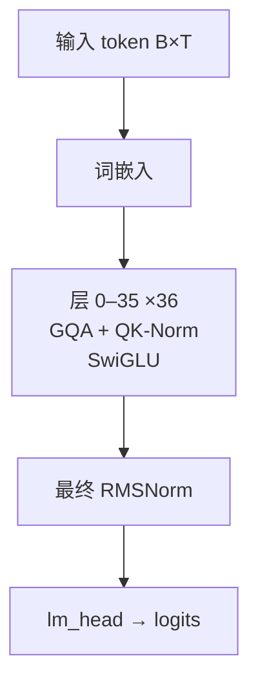

# Qwen3 · 架构说明（逐层）

> Alibaba Qwen · 发布 2025-04 · QwenLM/Qwen3（README/文档）+ HF transformers `modeling_qwen3.py`

**技术定位**：标准 Llama 式 decoder-only（RoPE + RMSNorm + SwiGLU + GQA），在主干上加了 QK-Norm，并把 RoPE 底数升到 1e6；dense 0.6B–32B 与 MoE 30B-A3B / 235B-A22B 共一套模板。

## 1. 参数与配置

| 项 | 值 |
|---|---|
| 总参数 | 0.6B–32B（另 MoE 30B-A3B / 235B-A22B） |
| 激活参数 | dense 全激活；MoE 每 token 激活 8 个专家 |
| 层数 | 36 |
| hidden | 4096 |
| Q 头 | 32 |
| KV 头 | 8 |
| head_dim | 128 |
| FFN/MoE 中间维 | 12288 |
| 词表 | 151936 |
| 上下文 | 40960（257 版 256K，扩至 1M） |
| 权重共享 | 0.6/1.7/4B 共享，8B 及以上不共享 |

**完整配置**：

| 字段 | 值 |
|---|---|
| num_hidden_layers | 36（8B） |
| hidden_size | 4096 |
| num_attention_heads | 32 |
| num_key_value_heads | 8（GQA，32/8） |
| head_dim | 128 |
| intermediate_size | 12288 |
| vocab_size | 151936 |
| hidden_act | silu（SwiGLU） |
| rms_norm_eps | 1e-6 |
| rope_theta | 1000000 |
| max_position_embeddings | 40960 |
| tie_word_embeddings | false |
| attention_bias | false |
| QK-Norm | 有（对 q/k 各做一次 RMSNorm） |

## 2. 技术方案与关键创新

**1. QK-Norm 稳定训练**　在 q/k 进 RoPE 前各加一个 head_dim 维 RMSNorm。相比 Llama 只对残差流做 norm，QK-Norm 直接把 logits 尺度钉住，允许更大学习率、更稳的收敛——这是 Qwen3 与我们手写模型最直接的一个差别。

**2. RoPE θ=1e6 + YaRN**　把旋转位置编码的底数从 1e4 拉到 1e6，低频更慢，天然更利于长上下文；再叠加 YaRN（factor 4，原长 32768）外推到 131072，2507 版进一步到 256K/1M。

**3. GQA 与词表解耦**　8B 用 32 个 Q 头 / 8 个 KV 头（4:1），KV 缓存只有 MHA 的 1/4；小模型（0.6/1.7/4B）共享输入输出嵌入，8B 以上取消共享。

**4. MoE 变体同模板**　Qwen3-MoE（30B-A3B / 235B-A22B）把 dense FFN 换成 128 专家、每 token 激活 8 个的 DeepSeekMoE 式路由（无共享专家），主干注意力仍是 GQA+QK-Norm。

## 3. 层级结构（可视化）



## 4. 逐层清单（共 36 层）

| 层 | Attention | FFN/MoE | 说明 |
|---|---|---|---|
| 0 | GQA + QK-Norm | SwiGLU | 全层同构 |
| 1 | GQA + QK-Norm | SwiGLU | 全层同构 |
| 2 | GQA + QK-Norm | SwiGLU | 全层同构 |
| 3 | GQA + QK-Norm | SwiGLU | 全层同构 |
| 4 | GQA + QK-Norm | SwiGLU | 全层同构 |
| 5 | GQA + QK-Norm | SwiGLU | 全层同构 |
| 6 | GQA + QK-Norm | SwiGLU | 全层同构 |
| 7 | GQA + QK-Norm | SwiGLU | 全层同构 |
| 8 | GQA + QK-Norm | SwiGLU | 全层同构 |
| 9 | GQA + QK-Norm | SwiGLU | 全层同构 |
| 10 | GQA + QK-Norm | SwiGLU | 全层同构 |
| 11 | GQA + QK-Norm | SwiGLU | 全层同构 |
| 12 | GQA + QK-Norm | SwiGLU | 全层同构 |
| 13 | GQA + QK-Norm | SwiGLU | 全层同构 |
| 14 | GQA + QK-Norm | SwiGLU | 全层同构 |
| 15 | GQA + QK-Norm | SwiGLU | 全层同构 |
| 16 | GQA + QK-Norm | SwiGLU | 全层同构 |
| 17 | GQA + QK-Norm | SwiGLU | 全层同构 |
| 18 | GQA + QK-Norm | SwiGLU | 全层同构 |
| 19 | GQA + QK-Norm | SwiGLU | 全层同构 |
| 20 | GQA + QK-Norm | SwiGLU | 全层同构 |
| 21 | GQA + QK-Norm | SwiGLU | 全层同构 |
| 22 | GQA + QK-Norm | SwiGLU | 全层同构 |
| 23 | GQA + QK-Norm | SwiGLU | 全层同构 |
| 24 | GQA + QK-Norm | SwiGLU | 全层同构 |
| 25 | GQA + QK-Norm | SwiGLU | 全层同构 |
| 26 | GQA + QK-Norm | SwiGLU | 全层同构 |
| 27 | GQA + QK-Norm | SwiGLU | 全层同构 |
| 28 | GQA + QK-Norm | SwiGLU | 全层同构 |
| 29 | GQA + QK-Norm | SwiGLU | 全层同构 |
| 30 | GQA + QK-Norm | SwiGLU | 全层同构 |
| 31 | GQA + QK-Norm | SwiGLU | 全层同构 |
| 32 | GQA + QK-Norm | SwiGLU | 全层同构 |
| 33 | GQA + QK-Norm | SwiGLU | 全层同构 |
| 34 | GQA + QK-Norm | SwiGLU | 全层同构 |
| 35 | GQA + QK-Norm | SwiGLU | 全层同构 |

## 5. 关键模块：数学公式与代码

### 注意力 · GQA + QK-Norm

Q/K/V 线性投影后，对 q、k 各做一次 head_dim 的 RMSNorm，再施加 RoPE；KV 头用 repeat 复制成与 Q 同头数后做缩放点积注意力。

$$
q=\mathrm{RMSNorm}_{h}(W_q x),\quad k=\mathrm{RMSNorm}_{h}(W_k x)
$$

$$
\mathrm{Attn}(Q,K,V)=\mathrm{softmax}\!\left(\frac{QK^{\top}}{\sqrt{d_h}}+M\right)V
$$

```python
# reference/Qwen3/hf_transformers/modeling_qwen3.py:237-253
self.q_norm = Qwen3RMSNorm(self.head_dim, eps=config.rms_norm_eps)
self.k_norm = Qwen3RMSNorm(self.head_dim, eps=config.rms_norm_eps)
# ...
query_states = self.q_norm(query_states)   # [B,T,H,hd]
key_states   = self.k_norm(key_states)
query_states, key_states = apply_rotary_pos_emb(query_states, key_states, cos, sin)
```

### 前馈/MoE · SwiGLU

门控前馈：down( silu(gate(x)) ⊙ up(x) )。与 mini-llm-lab 的 SwiGLU 完全一致。

$$
\mathrm{SwiGLU}(x)=W_{down}\big(\mathrm{SiLU}(W_{gate}x)\odot W_{up}x\big)
$$

```python
# reference/Qwen3/hf_transformers/modeling_qwen3.py:76-83
def forward(self, x):
    return self.down_proj(self.act_fn(self.gate_proj(x)) * self.up_proj(x))
```

### RMSNorm

$$
\mathrm{RMSNorm}(x)=\frac{x}{\sqrt{\frac{1}{d}\sum_{i=1}^{d}x_i^{2}+\epsilon}}\odot\gamma
$$

```python
# reference/Qwen3/hf_transformers/modeling_qwen3.py:49-64
class Qwen3RMSNorm(nn.Module):
    def forward(self, hidden_states):
        input_dtype = hidden_states.dtype
        hidden_states = hidden_states.to(torch.float32)
        variance = hidden_states.pow(2).mean(-1, keepdim=True)
        hidden_states = hidden_states * torch.rsqrt(variance + self.variance_epsilon)
        return self.weight * hidden_states.to(input_dtype)
```

### RoPE（旋转位置编码）

Qwen3 的 θ=1000000。

$$
\mathrm{RoPE}(x_m,m)=\begin{bmatrix}x^{(1)}\cos m\theta_1-x^{(2)}\sin m\theta_1\\ x^{(1)}\sin m\theta_1+x^{(2)}\cos m\theta_1\\ \vdots\end{bmatrix},\quad \theta_i=\theta^{-2i/d}
$$

## 6. 张量形状流

| 阶段 | 形状 | 说明 |
|---|---|---|
| 输入 token id | `[B, T]` | B=batch, T=序列长 |
| 词嵌入 tok_emb | `[B, T, 4096]` | 不乘 sqrt(d) |
| 36 × Block(qk-norm GQA + SwiGLU) | `[B, T, 4096]` | 残差流形状不变 |
| 最终 RMSNorm | `[B, T, 4096]` |  |
| lm_head（不共享） | `[B, T, 151936]` | 输出 logits |

## 7. 关键源码（引自 reference/）

**注意力主干（GQA + QK-Norm + RoPE）**　`reference/Qwen3/hf_transformers/modeling_qwen3.py:220-274`

```python
query_states = self.q_proj(hidden_states).view(hidden_shape).transpose(1, 2)
key_states   = self.k_proj(hidden_states).view(hidden_shape).transpose(1, 2)
value_states = self.v_proj(hidden_states).view(hidden_shape).transpose(1, 2)
query_states = self.q_norm(query_states)
key_states   = self.k_norm(key_states)
query_states, key_states = apply_rotary_pos_emb(query_states, key_states, cos, sin)
key_states   = repeat_kv(key_states, self.num_key_value_groups)
value_states = repeat_kv(value_states, self.num_key_value_groups)
attn_weights = torch.matmul(query_states, key_states.transpose(2, 3)) / math.sqrt(self.head_dim)
attn_weights = nn.functional.softmax(attn_weights, dim=-1)
attn_output   = torch.matmul(attn_weights, value_states)
```

**GQA：KV 头复制到 Q 头数**　`reference/Qwen3/hf_transformers/modeling_qwen3.py:173-182`

```python
def repeat_kv(hidden_states, n_rep):
    batch, num_key_value_heads, slen, head_dim = hidden_states.shape
    if n_rep == 1:
        return hidden_states
    hidden_states = hidden_states[:, :, None, :, :].expand(batch, num_key_value_heads, n_rep, slen, head_dim)
    return hidden_states.reshape(batch, num_key_value_heads * n_rep, slen, head_dim)
```

## 8. 与 mini-llm-lab 的差异

Qwen3-8B 与 mini-llm-lab 主干**几乎同构**（decoder-only、RoPE、RMSNorm、SwiGLU、GQA、pre-norm 残差），差别集中在：

- **多了 QK-Norm**（我们只有残差流上两次 RMSNorm + 末尾一次）；
- **RoPE θ=1e6**（我们默认 1e4）；
- **更大**：4096 维 × 36 层、词表 151936、上下文 40k+；
- **不共享** 8B 及以上的输入/输出嵌入（我们默认共享）。

换言之，**我们缺的只是 QK-Norm 与规模/长文配置**，骨架完全对得上。

## 9. 3D 可视化

启动可视化网页后，在「架构浏览器」视图选择本模型（id：`qwen3`），可三维查看每一层并点开公式/代码：

```powershell
& ".venv\Scripts\python.exe" viz/server.py   # 打开 http://127.0.0.1:7861 → 架构浏览器
```

## 10. 参考资料

- [Qwen3 Technical Report (arXiv:2505.09388)](https://arxiv.org/abs/2505.09388)
- [QwenLM/Qwen3](https://github.com/QwenLM/Qwen3)
