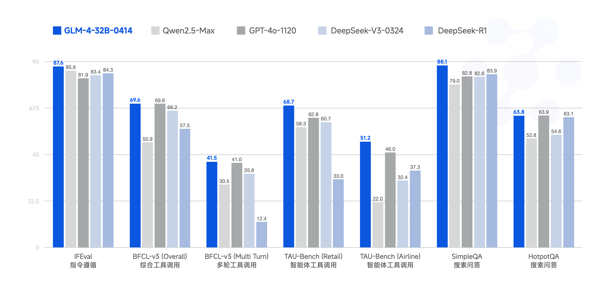
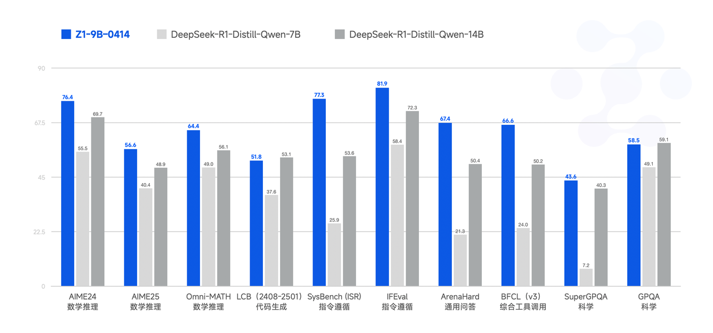
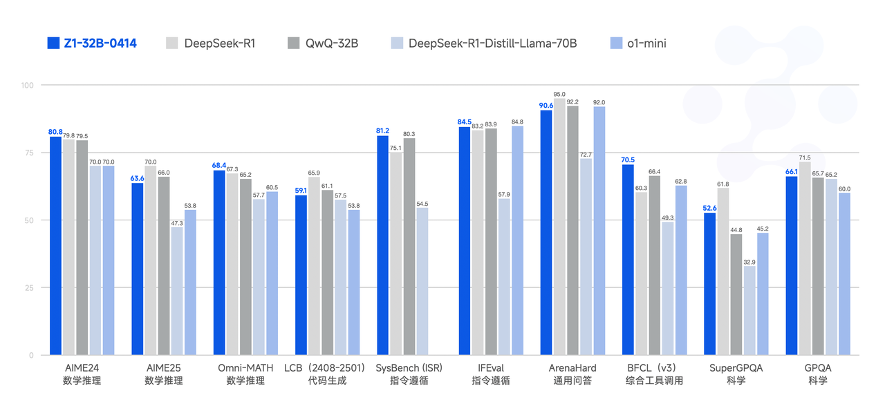

# GLM-4-0414 系列模型

<p align="center">
👋 加入我们的 <a href="https://discord.gg/Hc5z9bx5Xw" target="_blank">Discord</a>, <a href="https://x.com/Zai_org" target="_blank">X</a> 和 <a href="resources/WECHAT.md" target="_blank"> 微信 </a>
</p>
<p align="center">
📍本次开源模型可以在 <a href="https://chat.z.ai">Z.ai</a> 免费体验；使用 GLM 商业模型服务请到 <a href="https://bigmodel.cn">bigmodel.cn</a>。
</p>

Read this in [English](README)

## 项目更新

- 🔥 **News**：`2025/07/02`：我们正式发布 [GLM-4.1V-9B-Thinking](https://huggingface.co/collections/zai-org/glm-41v-thinking-6862bbfc44593a8601c2578d) 系列视觉理解模型，更多信息请查看 [GitHub 仓库](https://github.com/zai-org/GLM-4.1V-Thinking)。
- **News**: ```2025/04/14```: 我们发布 [GLM-4-32B-0414](https://huggingface.co/collections/zai-org/glm-4-0414-67f3cbcb34dd9d252707cb2e) 系列模型，规模提升至 32B，包含对话、推理、沉思多种能力的模型。
- **News**: ``2024/06/18``: 我们发布 [技术报告](https://arxiv.org/pdf/2406.12793), 欢迎查看。
- **News**: ``2024/06/05``: 我们发布 `GLM-4-9B` 系列开源模型，其内容可以在[这里](README_240605.md)查看。

## 模型介绍

GLM 家族迎来新一代开源模型 **GLM-4-32B-0414** 系列，320 亿参数，效果比肩 OpenAI 的 GPT 系列和 DeepSeek 的 V3/R1 系列，且支持非常友好的本地部署特性。GLM-4-32B-Base-0414 经过 15T 高质量数据的预训练，其中包含大量推理类的合成数据，这为后续的强化学习扩展打下了基础。在后训练阶段，除了针对对话场景进行了人类偏好对齐外，我们还通过拒绝采样和强化学习等技术强化了模型在指令遵循、工程代码、函数调用方面的效果，加强了智能体任务所需的原子能力。GLM-4-32B-0414 在工程代码、Artifacts 生成、函数调用、搜索问答及报告等方面都取得了不错的效果，部分 Benchmark 甚至可以媲美更大规模的 GPT-4o、DeepSeek-V3-0324（671B）等模型。

**GLM-Z1-32B-0414** 是具有**深度思考能力**的推理模型，这是在 GLM-4-32B-0414 的基础上，通过冷启动和扩展强化学习，以及在数学、代码和逻辑等任务上对模型的进一步训练得到的。相对于基础模型，GLM-Z1-32B-0414 显著提升了数理能力和解决复杂任务的能力。在训练的过程中，我们还引入了基于对战排序反馈的通用强化学习，进一步增强了模型的通用能力。

**GLM-Z1-Rumination-32B-0414** 是具有**沉思能力**的深度推理模型（对标 Open AI 的 Deep Research）。不同于一般的深度思考模型，沉思模型通过更长时间的深度思考来解决更开放和复杂的问题（例如：撰写两个城市AI发展对比情况，以及未来的发展规划），沉思模型在深度思考过程中结合搜索工具处理复杂任务，并经过利用多种规则型奖励来指导和扩展端到端强化学习训练得到。Z1-Rumination 在研究型写作和复杂检索任务上的能力得到了显著提升。

最后，**GLM-Z1-9B-0414** 是一个惊喜。我们沿用上述一系列技术，训练了一个保持开源传统的 9B 小尺寸模型。尽管规模更小，GLM-Z1-9B-0414 在数学推理和通用任务中依然展现出极为优秀的能力，其整体表现已处于同尺寸开源模型中的领先水平。特别是在资源受限的场景下，该模型在效率与效果之间实现了出色的平衡，为追求轻量化部署的用户提供了强有力的选择。

## 效果展示

### 动画绘制

<table>
  <tr>
    <td style="text-align: center; font-size: 16px; font-weight: bold; padding: 10px; width: 420px;">
      GLM-Z1-32B-0414
    </td>
    <td style="text-align: center; font-size: 16px; font-weight: bold; padding: 10px; width: 420px;">
      GLM-4-32B-0414
    </td>
  </tr>
  <tr>
    <td style="vertical-align: top; padding: 10px; width: 420px;">
      <video src="https://github.com/user-attachments/assets/849ff9fd-b54d-4c74-9ee5-3412e1a09e32"
             style="width: 400px; height: 300px; object-fit: contain;" autoplay loop muted playsinline></video>
      <div style="margin-top: 10px; font-size: 14px; color: #333; width: 400px;">
        write a Python program that shows a ball bouncing inside a spinning hexagon. The ball should be affected by gravity and friction, and it must bounce off the rotating walls realistically
      </div>
    </td>
    <td style="vertical-align: top; padding: 10px; width: 420px;">
      <video src="https://github.com/user-attachments/assets/8dccdb9d-cc44-4732-b438-74a4e3cb9dfb"
             style="width: 400px; height: 300px; object-fit: contain;" autoplay loop muted playsinline></video>
      <div style="margin-top: 10px; font-size: 14px; color: #333; width: 400px;">
         用 HTML 模拟一个小球在从一个旋转中的六边形中心释放后的场景。考虑小球和六边形边框的碰撞和小球受到的重力，并假设碰撞都是完全弹性碰撞
      </div>
    </td>
  </tr>
</table>

### 网页设计

<table>
  <tr>
    <td style="text-align: center; font-size: 16px; font-weight: bold; padding: 10px; width: 420px;">
      GLM-4-32B-0414
    </td>
    <td style="text-align: center; font-size: 16px; font-weight: bold; padding: 10px; width: 420px;">
      GLM-4-32B-0414
    </td>
  </tr>
  <tr>
    <td style="vertical-align: top; padding: 10px; width: 420px;">
      
      <div style="margin-top: 10px; font-size: 14px; color: #333; width: 400px;">
          设计一个支持自定义函数绘制的绘图板，可以添加和删除自定义函数，并为函数指定颜色
      </div>
    </td>
    <td style="vertical-align: top; padding: 10px; width: 420px;">
      
      <div style="margin-top: 10px; font-size: 14px; color: #333; width: 400px;"> 给我设计一个移动端机器学习平台的 UI，其中要包括训练任务，存储管理，和个人统计信息界面。个人信息统计界面要用图表展示用户过去一段时间的各类资源使用情况。使用 Tailwind CSS 来美化页面，把这 3 个手机界面平铺展示到一个 HTML 页面中 </div>
    </td>
  </tr>
</table>

### SVG 生成

<table>
  <tr>
    <td style="text-align: center; font-size: 16px; font-weight: bold; padding: 10px; width: 420px;">
      GLM-4-32B-0414
    </td>
    <td style="text-align: center; font-size: 16px; font-weight: bold; padding: 10px; width: 420px;">
      GLM-4-32B-0414
    </td>
  </tr>
  <tr>
    <td style="vertical-align: top; padding: 10px; width: 420px;">
      
      <div style="margin-top: 10px; font-size: 14px; color: #333; width: 400px;">
          用SVG创作一幅烟雨江南
      </div>
    </td>
    <td style="vertical-align: top; padding: 10px; width: 420px;">
      
      <div style="margin-top: 10px; font-size: 14px; color: #333; width: 400px;"> 用 SVG 展示一个 LLM 的训练流程 </div>
    </td>
  </tr>
</table>

### 分析调研撰写

<td style="vertical-align: top; padding: 10px; width: 420px;">
  <video src="https://github.com/user-attachments/assets/7939c8c5-0fcf-4bc4-be45-3964aad0e61c" style="width: 400px; height: 300px; object-fit: contain;" autoplay loop muted playsinline></video>
  <div style="margin-top: 10px; font-size: 14px; color: #333; width: 400px;">
    中国城市 AI 发展分析：北京与杭州的对比研究。同时调研国外城市用 AI 进行城市治理的案例。
  </div>
</td>


## 模型列表

### GLM-4-0414 系列模型

GLM-Z1-9B-0414 开源模型 [在线体验](https://modelscope.cn/studios/ZhipuAI/GLM-Z1-9B-0414/summary)

|           Model            |   Type    | Seq Length* |                                                                                                                                                              Download                                                                                                                                                              |
|:--------------------------:|:---------:|:-----------:|:----------------------------------------------------------------------------------------------------------------------------------------------------------------------------------------------------------------------------------------------------------------------------------------------------------------------------------:|
|       GLM-4-9B-0414        |   Chat    | 32K -> 128K |                           [🤗 Huggingface](https://huggingface.co/zai-org/GLM-4-9B-0414)<br> [🤖 ModelScope](https://modelscope.cn/models/ZhipuAI/GLM-4-9B-0414)<br> [🧩 Modelers](https://modelers.cn/models/zhipuai/GLM-4-9B-0414)<br> [🟣 WiseModel](https://wisemodel.cn/models/ZhipuAI/GLM-4-9B-0414)                           |
|       GLM-Z1-9B-0414       | Reasoning | 32K -> 128K |                        [🤗 Huggingface](https://huggingface.co/zai-org/GLM-4-Z1-9B-0414)<br> [🤖 ModelScope](https://modelscope.cn/models/ZhipuAI/GLM-Z1-9B-0414)<br> [🧩 Modelers](https://modelers.cn/models/zhipuai/GLM-Z1-9B-0414)<br> [🟣 WiseModel](https://wisemodel.cn/models/ZhipuAI/GLM-Z1-9B-0414)                        |
|    GLM-4-32B-Base-0414     |   Base    | 32K -> 128K |               [🤗 Huggingface](https://huggingface.co/zai-org/GLM-4-32B-Base-0414)<br> [🤖 ModelScope](https://modelscope.cn/models/ZhipuAI/GLM-4-32B-Base-0414)<br> [🧩 Modelers](https://modelers.cn/models/zhipuai/GLM-4-32B-Base-0414)<br> [🟣 WiseModel](https://wisemodel.cn/models/ZhipuAI/GLM-4-32B-Base-0414)               |
|       GLM-4-32B-0414       |   Chat    | 32K -> 128K |                      [🤗 Huggingface](https://huggingface.co/zai-org/GLM-4-32B-0414)<br> [🤖 ModelScope](https://modelscope.cn/models/ZhipuAI/GLM-4-32B-0414)<br> [🧩 Modelers](https://modelers.cn/models/zhipuai/GLM-4-32B-0414)<br> [🟣 WiseModel](https://wisemodel.cn/models/ZhipuAI/GLM-4-32B-Base-0414)                       |
|      GLM-Z1-32B-0414       | Reasoning | 32K -> 128K |                       [🤗 Huggingface](https://huggingface.co/zai-org/GLM-Z1-32B-0414)<br> [🤖 ModelScope](https://modelscope.cn/models/ZhipuAI/GLM-Z1-32B-0414)<br> [🧩 Modelers](https://modelers.cn/models/zhipuai/GLM-Z1-32B-0414)<br> [🟣 WiseModel](https://wisemodel.cn/models/ZhipuAI/GLM-Z1-32B-0414)                       |
| GLM-Z1-Rumination-32B-0414 | Reasoning |    128K     | [🤗 Huggingface](https://huggingface.co/zai-org/GLM-Z1-Rumination-32B-0414)<br> [🤖 ModelScope](https://modelscope.cn/models/ZhipuAI/GLM-Z1-Rumination-32B-0414)<br> [🧩 Modelers](https://modelers.cn/models/zhipuai/GLM-Z1-Rumination-32B-0414)<br> [🟣 WiseModel](https://wisemodel.cn/models/ZhipuAI/GLM-Z1-Rumination-32B-0414) |

GLM-4-9B-0414 由于其较小的模型容量，我们未对其智能体能力进行类似 GLM-4-32B-0414 的强化，主要针对翻译等需要大批量调用的场景进行优化。

\* 模型原生采用 32K 上下文进行训练，对于输入 + 输出长度可能超过 32K 的请求，我们建议激活 YaRN 来获得较好的外推性能，详情见[部署章节](#%E6%A8%A1%E5%9E%8B%E5%92%8C%E6%8F%90%E7%A4%BA%E8%AF%8D%E5%AE%9E%E7%8E%B0)。

以下为 2024 年 6 月 5 日发布的 GLM-4 系列模型，其详细内容可以在[这里](README_zh_240605.md)查看。

|             Model             |   Type    | Seq Length* |                                                                                                      Download                                                                                                       |
|:-----------------------------:|:---------:|:----------:|:-------------------------------------------------------------------------------------------------------------------------------------------------------------------------------------------------------------------:|
|      GLM-4-9B       | Base |     8K     |                                           [🤗 Huggingface](https://huggingface.co/zai-org/glm-4-9b)<br> [🤖 ModelScope](https://modelscope.cn/models/ZhipuAI/glm-4-9b)<br>                                            |
|    GLM-4-9B-Chat    | Chat |    128K    |     [🤗 Huggingface](https://huggingface.co/zai-org/glm-4-9b-chat)<br> [🤖 ModelScope](https://modelscope.cn/models/ZhipuAI/glm-4-9b-chat)<br> [🟣 WiseModel](https://wisemodel.cn/models/ZhipuAI/GLM-4-9B-Chat)      |
|  GLM-4-9B-Chat-HF   | Chat |    128K    |                                     [🤗 Huggingface](https://huggingface.co/zai-org/glm-4-9b-chat-hf)<br> [🤖 ModelScope](https://modelscope.cn/models/ZhipuAI/glm-4-9b-chat-hf)                                      |
|  GLM-4-9B-Chat-1M   | Chat |     1M     | [🤗 Huggingface](https://huggingface.co/zai-org/glm-4-9b-chat-1m)<br> [🤖 ModelScope](https://modelscope.cn/models/ZhipuAI/glm-4-9b-chat-1m)<br> [🟣 WiseModel](https://wisemodel.cn/models/ZhipuAI/GLM-4-9B-Chat-1M) |
| GLM-4-9B-Chat-1M-HF | Chat |     1M     |                                  [🤗 Huggingface](https://huggingface.co/zai-org/glm-4-9b-chat-1m-hf)<br> [🤖 ModelScope](https://modelscope.cn/models/ZhipuAI/glm-4-9b-chat-1m-hf)                                   |
|      GLM-4V-9B      | Chat |     8K     |        [🤗 Huggingface](https://huggingface.co/zai-org/glm-4v-9b)<br> [🤖 ModelScope](https://modelscope.cn/models/ZhipuAI/glm-4v-9b)<br> [🟣 WiseModel](https://wisemodel.cn/models/ZhipuAI/GLM-4V-9B)               |

## 评测结果

### GLM-4-0414 系列

<div style="text-align: center;">
  
</div>

| 模型             | IFEval | BFCL-v3 (Overall) | BFCL-v3 (MultiTurn) | TAU-Bench (Retail) | TAU-Bench (Airline) | SimpleQA | HotpotQA |
| ---------------- | ------ | ----------------- | ------------------- | ------------------ | ------------------- | -------- | -------- |
| Qwen2.5-Max      | 85.6   | 50.9              | 30.5                | 58.3               | 22.0                | 79.0     | 52.8     |
| GPT-4o-1120      | 81.9   | 69.6              | 41.0                | 62.8               | 46.0                | 82.8     | 63.9     |
| DeepSeek-V3-0324 | 83.4   | 66.2              | 35.8                | 60.7               | 32.4                | 82.6     | 54.6     |
| DeepSeek-R1      | 84.3   | 57.5              | 12.4                | 33.0               | 37.3                | 83.9     | 63.1     |
| GLM-4-32B-0414   | 87.6   | 69.6              | 41.5                | 68.7               | 51.2                | 88.1     | 63.8     |

> 对于 `SimpleQA` 和 `HotpotQA`，我们分别从测试集中采样了近500条测试样例，提供所有模型最基础的 `search` 和 `click` 工具，另外确保其余 Setting 保持一致后，3次评测取平均值

| 模型  | 框架                       | [SWE-bench Verified](https://openai.com/index/introducing-swe-bench-verified/)  | [SWE-bench Verified mini](https://github.com/mariushobbhahn/SWEBench-verified-mini) |
|---|--------------------------|---|-------------------------------------------------------------------------------------|
| GLM-4-32B-0414  | Moatless<sup>[1]</sup>   | 33.8 | 38.0                                                                                |
| GLM-4-32B-0414  | Agentless<sup>[2]</sup>  | 30.7 | 34.0                                                                                |
| GLM-4-32B-0414  | OpenHands<sup>[3]</sup>  | 27.2  | 28.0                                                                                |


[1] [Moatless v0.0.3](https://github.com/aorwall/moatless-tools) 使用如下参数 `response_format="react", thoughts_in_action=False, max_interations=30`，未对失败轨迹进行重试，其余为默认配置

[2] [Agentless v1.5.0](https://github.com/OpenAutoCoder/Agentless) 其中的 Embedding 模型使用了 [BGE](https://github.com/FlagOpen/FlagEmbedding/blob/master/README_zh.md)，基于[FAISS](https://github.com/facebookresearch/faiss)进行相似性检索，为加快patch验证的速度同时尽可能保证效果，将运行单个实例的超时时间从默认的300s修改为180s

[3] [OpenHands v0.29.1](https://github.com/All-Hands-AI/OpenHands/tree/main) 未采用 YaRN 上下文扩展，而是限制了最大 60 个 iterations，并对 history 进行 summarization 以防止超出 32K 上下文限制，summarization 配置为 `llm_config="condenser", keep_first=1, max_size=32`，同样未对失败轨迹进行重试


### GLM-Z1-0414 系列

<div style="text-align: center;">
  
  
</div>

## 模型和提示词实现

### 模型实现

如果你想查看我们的模型实现，欢迎查看在相关仓库的模型实现 Pull Request，他们已经被合并。

+ [vLLM 模型实现](https://github.com/vllm-project/vllm/blob/main/vllm/model_executor/models/glm4.py)
+ [transformers 模型实现](https://github.com/huggingface/transformers/blob/main/src/transformers/models/glm4/modeling_glm4.py)
+ [llama.cpp 模型实现](https://github.com/ggml-org/llama.cpp/pull/12867)

### 处理长上下文（YaRN）

如果模型的输出 + 输出 token 数可能超过模型的原生上下文长度（GLM-4-0414系列多数为32k），建议开启 YaRN 来获得更好的长上下文建模能力。对于支持的框架，你可以在对应的`config.json`中修改。具体地，对于 GLM-Z1 系列模型，当输入长度超过 **8,192 tokens** 时，考虑启用 YaRN（Rope Scaling）。

```json
"rope_scaling": {
    "factor": 4.0,
    "original_max_position_embeddings": 32768,
    "type": "yarn"
}
```
对于多数用户请求，如果输出 + 输出 token 数不会超过原生上下文长度，则无需任何修改。

### 模型微调

可以在`finetune/README.md`下找到模型的微调所需算力信息和案例的微调脚本。

可以通过以下命令开启一个简单的模型微调案例

```shell
cd finetune
pip install -r ../inference/requirements.txt
pip install -r requirements.txt
# Use single GPU for Chat Fine-tune
python finetune.py  data/AdvertiseGen/  zai-org/GLM-4-9B-0414  configs/lora.yaml
```
🎉 脚本也支持使用**SwanLab**进行微调可视化跟踪，可以访问[SwanLab可视化看板](https://swanlab.cn/@ShaohonChen/GLM4-Finetune/overview)获得案例微调脚本的训练日志。

### 提示词实现

如果你使用`transformers`库提供的`apply_chat_template`方法构建提示词。以下是对不同 GLM-4-0414 模型中 `系统提示词`的限制。

+ `GLM-4-32B-Base-0414`: 基座模型，无对话模板。
+ `GLM-4-*-0414` / `GLM-Z1-*-0414`: 如果传入`tools`，则由 `apply_chat_template` 填充工具到`chat_template`中的固定模板，单独作为一条带有`tools`绑定的 `system`字段信息并拼接于`messages[0]`。原本传入的所有 `messages` 自动往后移动一个位置。
+ `GLM-Z1-Rumination-32B-0414`:
    + 不支持自定义系统提示词，不支持自定义工具，你的所有 `tools` 和 `system` 字段会被 `apply_chat_template` 忽略。使用该模型需要外接搜索引擎或者自定义retrieval API。
    + 一共支持四个工具，分别是
        ```
        1. search
           描述: 执行搜索查询并返回搜索结果。当您需要查找有关特定主题的信息时使用此功能。
           参数: query (字符串) - 搜索查询字符串，除非是中文专有名词，否则使用英文单词

        2. click
           描述: 点击搜索结果中的链接并导航到相应页面。当您需要查看特定搜索结果的详细内容时使用此功能。
           参数: link_id (整数) - 要点击的链接ID（来自搜索结果中的序号）

        3. open
           描述: 打开特定网站。通过URL获取任何网站的内容。
           参数: url (字符串) - 目标网站URL或域名

        4. finish
           描述: 完成任务。当您已找到所需信息时使用此功能。
           参数: 无
        ```
    + `chat_template`中的固定模板使用英文思过程，如果要更换其他语言，需要修改以下部分（暂时支持中文和英文）
        ```
        <重要配置>
        - 采用语言
            * 搜索关键词：英文 -> 在这里换成“中文”或者其他语言
            * 思考：英文 -> 在这里换成“中文”或者其他语言
        ```

GLM-4-0414 系列模型的提示词构造可以前往对应的模型仓库中的 `chat_template.jinja` 查看具体的模型对话模板。


## 引用

如果你觉得我们的工作有帮助的话，请考虑引用下列论文。

```
@misc{glm2024chatglm,
      title={ChatGLM: A Family of Large Language Models from GLM-130B to GLM-4 All Tools},
      author={Team GLM and Aohan Zeng and Bin Xu and Bowen Wang and Chenhui Zhang and Da Yin and Diego Rojas and Guanyu Feng and Hanlin Zhao and Hanyu Lai and Hao Yu and Hongning Wang and Jiadai Sun and Jiajie Zhang and Jiale Cheng and Jiayi Gui and Jie Tang and Jing Zhang and Juanzi Li and Lei Zhao and Lindong Wu and Lucen Zhong and Mingdao Liu and Minlie Huang and Peng Zhang and Qinkai Zheng and Rui Lu and Shuaiqi Duan and Shudan Zhang and Shulin Cao and Shuxun Yang and Weng Lam Tam and Wenyi Zhao and Xiao Liu and Xiao Xia and Xiaohan Zhang and Xiaotao Gu and Xin Lv and Xinghan Liu and Xinyi Liu and Xinyue Yang and Xixuan Song and Xunkai Zhang and Yifan An and Yifan Xu and Yilin Niu and Yuantao Yang and Yueyan Li and Yushi Bai and Yuxiao Dong and Zehan Qi and Zhaoyu Wang and Zhen Yang and Zhengxiao Du and Zhenyu Hou and Zihan Wang},
      year={2024},
      eprint={2406.12793},
      archivePrefix={arXiv},
      primaryClass={id='cs.CL' full_name='Computation and Language' is_active=True alt_name='cmp-lg' in_archive='cs' is_general=False description='Covers natural language processing. Roughly includes material in ACM Subject Class I.2.7. Note that work on artificial languages (programming languages, logics, formal systems) that does not explicitly address natural-language issues broadly construed (natural-language processing, computational linguistics, speech, text retrieval, etc.) is not appropriate for this area.'}
}
```
